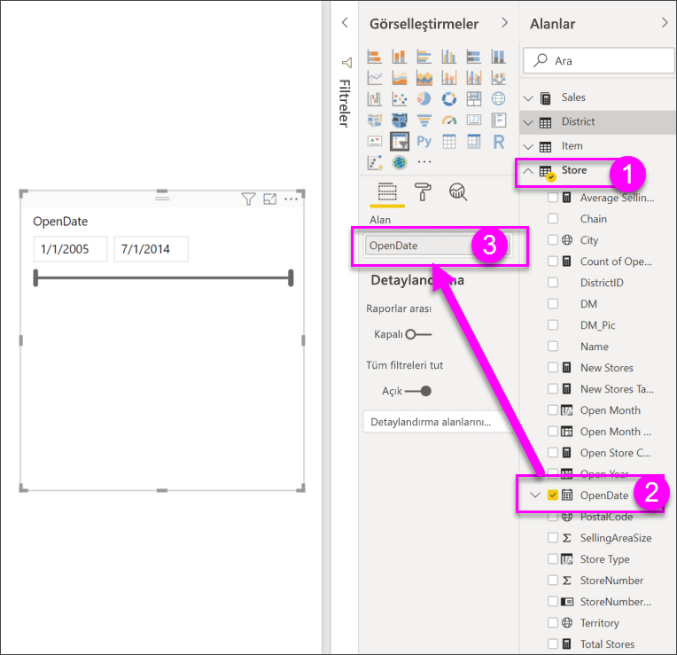

# Power BI'da dilimleyiciler
Rapor okuyucularınızın genel satış ölçümlerine bakabilmesini ancak aynı zamanda tek Bölge Yöneticileri ve farklı zaman aralıkları için performansı vurgulayabilmesini istiyorsunuz. Ayrı raporlar veya karşılaştırmalı grafikler oluşturabilir ya da dilimleyicileri kullanabilirsiniz. Dilimleyici, rapordaki diğer görselleştirmelerde gösterilen veri kümesi bölümünü daraltan alternatif bir filtreleme yöntemidir. 

Bu öğreticide, liste ve tarih aralığı dilimleyicilerini oluşturma, biçimlendirme ve kullanma işlemlerinde size yol göstermek üzere ücretsiz [Perakende Analizi Örneği](../sample-retail-analysis.md) kullanılır. Dilimleyicileri biçimlendirme ve kullanma yöntemlerini keşfetmekten keyif alacağınızı umuyoruz. 

## Dilimleyici ne zaman kullanılır?
Aşağıdakileri yapmak istediğinizde dilimleyicileri kullanmanız oldukça faydalı olacaktır:

* Daha kolay erişim sağlamak amacıyla, sık kullanılan veya önemli filtreleri rapor tuvalinde görüntülemek.
* Açılan bir listeyi açmak zorunda kalmadan, o sırada filtreli olan durumu daha kolay bir şekilde görüntülemek. 
* Veri tablolarında gereksiz ve gizli sütunlara göre filtreleme yapmak.
* Dilimleyicileri önemli görsellerin yanına koyarak daha odaklı raporlar oluşturmak.

Power BI dilimleyicileri aşağıdaki sınırlamalara sahiptir:

- Dilimleyiciler giriş alanlarını desteklemez.
- Dilimleyiciler panolara sabitlenemez.
- Detaya gitme özelliği, dilimleyiciler için desteklenmez.
- Dilimleyiciler, görsel düzeyi filtrelerini desteklemez.

## Dilimleyici oluşturma

Yeni bir Dilimleyici oluşturmak için dilimleyici simgesini seçin ve ardından filtre uygulamak için veri alanını seçebilir (veya sürükleyin **filtreleri** kutusunda **görselleştirmeler** bölmesi), ya da seçin veya veri alanı için ilk sürükleyin. bir görselleştirme oluşturun ve sonra görselleştirmeyi bir dilimleyiciye etkinleştirmek için dilimleyici simgesini seçin. Farklı veri türleri, farklı etki ve seçeneklere sahip farklı türlerde dilimleyiciler oluşturur. 

Bir raporu ilk kez değiştirdiğinizde **Varsayılana sıfırla** düğmesinin ışığı yanar. Bu, özgün rapor ayarlarında değişiklik yaptığınıza yönelik bir anımsatıcıdır. Rapordan çıkarsanız bu değişiklik kaydedilir (kalıcı hale gelir). Rapora geri döndüğünüzde raporu yeniden dilimlemeniz gerekmez.  Ancak, raporu yazarın varsayılan ayarlarına sıfırlamak isterseniz üst menü çubuğundan **Varsayılana sıfırla** düğmesini seçin.

> [!NOTE]
> **Varsayılana sıfırla** düğmeniz devre dışı kalırsa, rapor yazarının rapor için bu özelliği devre dışı bıraktığı veya raporun özel bir görsel içerdiği anlamına gelir. Bir açıklama için araç ipucunu okumak üzere düğmenin üzerine gelmeniz yeterlidir. 

**Filtre verileri bölge yöneticisine göre yeni bir Dilimleyici oluşturma**

1. Power BI Desktop veya Power BI hizmetinde açın [Retail Analysis Sample](../sample-retail-analysis.md). (Power BI hizmetinde sol üst köşedeki **Raporu Düzenle**’yi seçin.)
2. Genel bakış sayfasında, tuvalde seçili hiçbir şey seçin **Dilimleyici** simgesi  içinde **görselleştirmeler** bölmesinde yeni bir Dilimleyici oluşturmak için. 
3. Seçili alanlar bölmesinden yeni Dilimleyici seçin **bölge** > **DM** Dilimleyiciyi doldurmak için. Yeni dilimleyici, adların önünde seçim kutularının bulunduğu bir listedir. 
    
    
    
4. Dilimleyiciye yer açmak için dilimleyiciyi ve tuvalin üzerindeki diğer öğeleri yeniden boyutlandırıp sürükleyin. Dilimleyiciyi çok küçük boyutlandırırsanız dilimleyici öğelerinin kesileceğini unutmayın. 
5. Dilimleyici üzerindeki adları seçin ve sayfadaki diğer görselleştirmelere etkilerini not edin. Seçimlerini kaldırmak için adları tekrar seçin ve birden fazla ad seçmek için **Ctrl** tuşunu basılı tutun. Tüm adların seçilmesi, hiçbir adın seçilmemesiyle aynı etkiye sahiptir. \

6. Alternatif olarak, dilimleyicinizi biçimlendirmek için Boya rulosu simgesini seçin. Tüm burada açıklayın - böylece denemek ve sizin için çalışan bir Dilimleyici oluşturma için yalnızca çok seçenek vardır. Aşağıdaki örneklerde, ilk Dilimleyici alanından tasarruf etmek için bir açılan dönüştürülmüş ve "Tümünü Seç" seçeneği eklendi.  İkinci Dilimleyici renkleri, yazı tipi boyutlarını biçimlendirilmiş ve yalnızca tek bir seçim izin verir.

   
>[!TIP]
>Liste dilimleyici öğeleri, varsayılan olarak alfasayısal artan düzende sıralanır. Sıralamayı tersine çevirerek azalan düzene göre yapmak için dilimleyicinin sağ üst köşesindeki üç noktayı ( **...** ) seçin ve **Bölge Yöneticisine Göre Sırala** seçeneğini belirleyin. 

**Verileri tarih aralığına göre filtrelemek için yeni bir dilimleyici oluşturma**

1. Hiçbir şey ile tuvalde seçili, açılan menü **tarih** alanlar bölmesinde ve sürükleme **tarih** için **değerleri** yeni bir görselleştirme oluşturmak için görsel öğeler bölmesinde kutusu.
2. Yeni görselleştirme seçiliyken **Dilimleyici** simgesini seçerek yeni görselleştirmeyi bir dilimleyiciye dönüştürün. Bu dilimleyici, tarih aralığı doldurulmuş bir kaydırıcı denetimidir.
    
    

    
4. Dilimleyiciye yer açmak için dilimleyiciyi ve tuvalin üzerindeki diğer öğeleri yeniden boyutlandırıp sürükleyin. Dilimleyici boyutu ile birlikte kaydırıcının yeniden boyutlandırıldığını ancak dilimleyiciyi çok küçük boyutlandırmanız durumunda kaybolduğunu ve tarihlerin kesildiğini unutmayın. 
4. Kaydırıcı ile farklı tarih aralıkları seçin veya daha kesin bir seçim için bir değer yazın ya da takvimi açın. Sayfadaki diğer görselleştirmelere etkilerini not edin.
    
    >[!NOTE]
    >Sayısal ve/veya tarih/saat veri türleri varsayılan olarak aralık kaydırıcı dilimleyicileri üretir. Şubat 2018 Power BI güncelleştirmesinden itibaren, tamsayı veri türü aralık kaydırıcıları artık ondalık basamakları göstermek yerine tam sayı değerlerine uymaktadır. 

5. Şimdi alan değeriyle Değiştir **tarih** için **MonthIndex**.  Bu üreten bir **arasında** aralık kaydırıcısı Dilimleyici türü varsayılan olarak, ancak bunu diğer Dilimleyici türleri ve seçim seçenekleri değiştirebilirsiniz. Dilimleyici türünü değiştirmek için, dilimleyici seçiliyken fareyi dilimleyicinin sağ üst köşesine getirin, görüntülenen karatı açın ve **Liste** ya da **Önce** gibi diğer seçeneklerden birini belirleyin. Dilimleyici görünümünün ve seçim seçeneklerinin nasıl değiştiğine dikkat edin. 
 
    

Tarih ve sayısal aralık dilimleyicileri oluşturma hakkında daha fazla bilgi için aşağıdaki videoyu izleyin ve [Power BI Desktop uygulamasındaki sayısal aralık dilimleyiciyi kullanma](../desktop-slicer-numeric-range.md) makalesine bakın.
<iframe width="560" height="315" src="https://www.youtube.com/embed/zIZPA0UrJyA" frameborder="0" allowfullscreen></iframe> 

## Hangi sayfa görsellerinin dilimleyicilerden etkilendiğini denetleme
Varsayılan olarak, rapor sayfalarındaki dilimleyiciler, birbirleri de dahil olmak üzere o sayfadaki diğer tüm görselleştirmeleri etkiler. Yeni oluşturduğunuz liste ve tarih kaydırıcılarından değerleri seçerken diğer görselleştirmelere etkilerini not edin. Filtrelenen veriler her iki dilimleyicide seçilen değerlerin bir kesişimidir. 

Bazı sayfa görselleştirmelerini diğerlerinden etkilenmemesi için hariç tutmak üzere **Görsel etkileşimler**’i kullanabilirsiniz. **Genel Bakış** sayfasındaki "FiscalMonth ve Bölge Yöneticisine Göre Toplam Satış Değişimi" grafiği, her zaman görünür tutmak istediğiniz Aya Göre Bölge Yöneticileri için genel karşılaştırmalı verileri gösterir. Dilimleyici seçimlerinin bu grafikte filtrelenmesini önlemek için **Görsel etkileşimler**’i kullanabilirsiniz. 

1. Bölge Yöneticisi dilimleyicisi seçiliyken:
    - Power BI Desktop’ta **Görsel Araçlar** bölümündeki **Biçim** menüsünü seçin ve **Etkileşimleri düzenle** seçeneğini belirleyin.
    - Power BI hizmetinde, menü çubuğundan **Görsel etkileşimler**’i açın ve **Etkileşimleri düzenle** seçeneğini açın. 
   
   Sayfadaki diğer tüm görsellerin üzerinde filtre denetimleri  görünür. Başlangıçta, tüm **Filtre** simgeleri seçilidir.
   
2. Dilimleyicinin filtrelemesini durdurmak için **FiscalMonth ve Bölge Yöneticisine Göre Toplam Satış Değişimi** grafiğinin üzerindeki **Hiçbiri** simgesini seçin. 
3. Bu dilimleyicinin filtrelemesini durdurmak için **Ay** dilimleyicisini seçin ve yine **FiscalMonth ve Bölge Yöneticisine Göre Toplam Satış Değişimi** grafiğinin üzerindeki **Hiçbiri** simgesini seçin. Şimdi dilimleyicilerde ad ve tarih aralıklarını seçtiğinizde, FiscalMonth ve Bölge Yöneticisine Göre Toplam Satış Değişimi grafiği değişmez. 

Etkileşimleri düzenleme hakkında daha fazla bilgi için bkz. [Power BI raporlarındaki görsel etkileşimler](../service-reports-visual-interactions.md).

## Diğer sayfalardaki dilimleyicileri eşitleme ve kullanma
Şubat 2018 tarihinde yapılan Power BI güncelleştirmesinden itibaren bir dilimleyiciyi eşitleyebilir ve bir rapordaki tüm sayfalarda kullanabilirsiniz. 

Geçerli rapordaki **Bölge Aylık Satışları** sayfasında da bir **Bölge Yöneticisi** dilimleyicisi vardır ancak **Genel Bakış** sayfasında oluşturduğunuz dilimleyici ile eşitlenmemiştir (iki dilimleyicinin farklı öğe seçimleri olabilir). **Yeni Depolar** sayfasında yalnızca bir **Depo Adı** dilimleyicisi bulunur. Herhangi bir sayfada yapılan dilimleyici seçimlerinin üç sayfadaki tüm görselleştirmeleri etkilemesi için, yeni **Bölge Yöneticisi** dilimleyicinizi bu sayfalara eşitleyebilirsiniz. 

1. Power BI Desktop’ta **Görünüm** menüsünden **Dilimleyicileri eşitle** seçeneğini belirleyin (veya Power BI hizmetinde **Dilimleyicileri eşitle bölmesini** açık duruma getirin). **Dilimleyicileri Eşitle** bölmesi görünür. 
2. **Genel Bakış** sayfasında **Bölge Yöneticisi** dilimleyicisini seçin. **Bölge Aylık Satışları** sayfasında da bir Bölge Yöneticisi dilimleyicisi olduğundan bu sayfanın **Görünür** sütununda zaten seçili olduğunu ancak **Eşitle** sütununda seçili olmadığını unutmayın. 
    
    
    
3. **Eşitle** sütununda **Yeni Depolar** sayfasını ve **Bölge aylık Satışları** sayfasını seçerek **Genel Bakış** dilimleyicisini bu sayfalarla eşitleyin. 
    
3. **Görünür** sütununda **Yeni Depolar** sayfasını seçin ve **Bölge Aylık Satışları** sayfasını seçili durumda bırakın. 
4. Dilimleyiciyi eşitlemenin ve diğer sayfalarda görünür yapmanın etkilerini gözlemleyin. **Bölge Aylık Satışları** sayfasında **Bölge Yöneticisi** dilimleyicisi artık **Genel Bakış** sayfasındaki seçimlerin aynısını gösterir. **Yeni Depolar** sayfasında, **Bölge Yöneticisi** dilimleyicisindeki seçimler **Depo Adı** dilimleyicisindeki seçimleri etkiler. 
    
    >[!TIP]
    >Dilimleyici, eşitlenmiş sayfalarda ilk olarak özgün sayfa ile aynı boyut ve konumda görünse de, çeşitli sayfalardaki eşitlenmiş dilimleyicileri birbirinden bağımsız olarak taşıyabilir, yeniden boyutlandırabilir ve biçimlendirebilirsiniz. 

>[!NOTE]
>Bir dilimleyiciyi bir sayfa ile eşitlemenize karşın o sayfada görünür hale getirmezseniz, diğer sayfalarda yapılan dilimleyici seçimleri sayfadaki verileri filtrelemeye devam eder.
 
## Biçim dilimleyiciler
Dilimleyici türüne bağlı olarak farklı biçimlendirme seçenekleri mevcuttur. **Yatay** yönü, **Duyarlı** düzeni ve **Öğe** renklendirmeyi kullanarak standart liste öğeleri yerine düğme ya da kutucuklar oluşturabilir ve dilimleyici öğelerini farklı ekran boyutları ve düzenlerine göre yeniden boyutlandırabilirsiniz.  

1. Herhangi bir sayfada **Bölge Yöneticisi** dilimleyicisi seçiliyken, **Görselleştirmeler** bölgesinde **Biçim** simgesini  seçerek biçimlendirme denetimlerini görüntüleyin. 
    
    
    
2. Seçenekleri görüntülemek ve düzenlemek için her kategorinin yanındaki açılan okları seçin. 

### Genel seçenekler
1. **Anahat rengi**’nin altında kırmızıyı seçin ve **Anahat ağırlığı**’nı “2” olarak değiştirin. Etkinleştirildiğinde bu, üst bilgi ve öğe ana hatlarının veya alt çizgilerinin rengini ve kalınlığını ayarlar. 
2. **Yön** altında varsayılan ayar **Dikey**’dir. Yatay yönde düzenlenmiş kutucuk veya düğmelerle bir dilimleyici oluşturmak için **Yatay**’ı seçin ve dilimleyiciye sığmayan öğelere erişmek için okları kaydırın.
    
    
    
3. Dilimleyici öğelerinin boyut ve düzenini görünüm ekranına ve dilimleyici boyutuna göre değiştirmek için **Duyarlı** düzeni etkinleştirin. Liste dilimleyicileri için duyarlı düzen yalnızca yatay yönde kullanılabilir ve küçük ekranlarda öğelerin kesilmesini önler. Aralık kaydırıcı dilimleyiciler için duyarlı biçimlendirme, kaydırıcının stilini değiştirir ve daha esnek bir yeniden boyutlandırma sağlar. Her iki dilimleyici türü de çok küçük boyutlarda filtre simgeleri haline gelir. 
    
    
    
    >[!NOTE]
    >Esnek düzen değişiklikleri, ayarladığınız üst bilgi ve öğe biçimlendirmesini geçersiz kılabilir. 
    
4. **X Konumu**, **Y Konumu**, **Genişlik** ve **Yükseklik** bölümündeki sayısal duyarlıkla dilimleyici konumunu ve boyutunu ayarlayın dilimleyiciyi doğrudan tuval üzerinde taşıyıp yeniden boyutlandırın. Farklı öğe boyutları ve düzenlemelerle denemeler yapın ve duyarlı biçimlendirmenin uygun şekilde nasıl değiştiğine dikkat edin.  

    

Yatay yönlendirme ve duyarlı düzen hakkında daha fazla bilgi için bkz. [Power BI’da yeniden boyutlandırabileceğiniz duyarlı bir dilimleyici oluşturma](../power-bi-slicer-filter-responsive.md).

### Seçim Denetimi seçenekleri (yalnızca liste dilimleyiciler)
1. **Tümünü Seç’i Göster** seçeneği varsayılan olarak **Kapalı**’dır. Dilimleyiciye, açılıp kapatıldığında tüm öğeleri seçen veya tüm öğelerin seçimini kaldıran bir **Tümünü Seç** öğesi eklemek için bu seçeneği **Açık** duruma getirin. Tüm öğeler seçiliyken öğeye tıklandığında veya dokunulduğunda öğenin seçimi kaldırılır ve “is-not” türünde bir filtreye izin verilir. 
    
    
    
2. **Tek Seçim** varsayılan olarak **Açık**’tır. Öğeye tıklandığında veya dokunulduğunda bu öğe seçilir, tıklama veya dokunma sırasında **Ctrl** tuşu basılı tutulduğunda ise birden çok öğe seçilir. **Ctrl** tuşu basılı tutulmadan birden çok öğenin seçilmesini sağlamak için **Tek Seçim**’i **Kapalı** duruma getirin. Bir öğeye tıklandığında veya dokunulduğunda bu öğenin seçimi kaldırılır. 

### Üst bilgi seçenekleri
**Üst Bilgi** varsayılan olarak **Açık**’tır ve dilimleyicinin üst tarafında veri alanı adını gösterir. 
1. **Yazı tipi rengini** kırmızı **Metin boyutunu** 14 pt, **Yazı tipi ailesini** ise Arial Black olarak ayarlayacak şekilde üst bilgi metnini biçimlendirin. 
2. **Anahat** altındaki **Genel** seçeneklerde ayarladığınız boyuta ve renge sahip bir alt çizgi oluşturmak için **Yalnızca alt** seçeneğini belirleyin. 

### Öğe seçenekleri (yalnızca liste dilimleyiciler)
1. **Yazı tipi rengini** siyah, **Arka planı** açık kırmızı, **Metin boyutunu** 10 pt, **Yazı tipi ailesini** ise Arial olarak ayarlayacak şekilde öğe metnini ve arka planını biçimlendirin. 
2. **Anahat** altında, her bir öğenin çevresine **Genel** seçeneklerde ayarladığınız boyuta ve renge sahip bir kenarlık çizmek için **Çerçeve** seçeneğini belirleyin. 
    
    
    
    >[!TIP]
    >- **Yön > Yatay** kullanıldığında, seçimi kaldırılan öğeler seçilen metin ve arka plan renklerini gösterirken seçilen öğeler, genellikle beyaz metinli siyah arka plan olan sistem varsayılanını kullanır.
    >- **Yön > Dikey** kullanıldığında, öğeler her zaman ayarlanan renkleri gösterir ve seçim kutuları seçildiğinde her zaman siyah olur. 

### Tarih/sayısal girişler ve Kaydırıcı seçenekleri (yalnızca aralık kaydırıcı dilimleri)
- Tarih/sayısal giriş seçenekleri, liste dilimleyicilere yönelik **Öğe** seçenekleriyle aynıdır, ancak burada bir **Anahat** veya alt çizgi yoktur.
- Kaydırıcı seçenekleri, aralık kaydırıcının rengini ayarlamanıza veya kaydırıcıyı **Kapalı** duruma getirerek yalnızca sayısal girişleri bırakmanıza olanak tanır.

### Diğer biçimlendirme seçenekleri
Diğer biçimlendirme seçenekleri varsayılan olarak kapalıdır. **Açık** duruma getirildiğinde: 
- **Başlık:** Dilimleyicinin üst tarafına bir başlık ekler ve bu başlığı biçimlendirir (üst bilgiye ek olarak ve üst bilgiden bağımsız olarak). 
- **Arka plan:** Genel dilimleyiciye bir arka plan rengi ekler ve bunun saydamlığını ayarlar.
- **Görünüşü kilitle:** Dilimleyici yeniden boyutlandırıldıysa dilimleyicinin şeklini korur.
- **Kenarlık:** Dilimleyicinin çevresine 1 piksel kenarlık ekler ve bunun rengini ayarlar. (Bu dilimleyici kenarlığı Genel Anahat ayarlarından ayrıdır ve bunlardan etkilenmez.) 

## Sonraki adımlar
[Power BI'daki görselleştirme türleri](power-bi-visualization-types-for-reports-and-q-and-a.md)

[Power BI’da tablolar](power-bi-visualization-tables.md)

