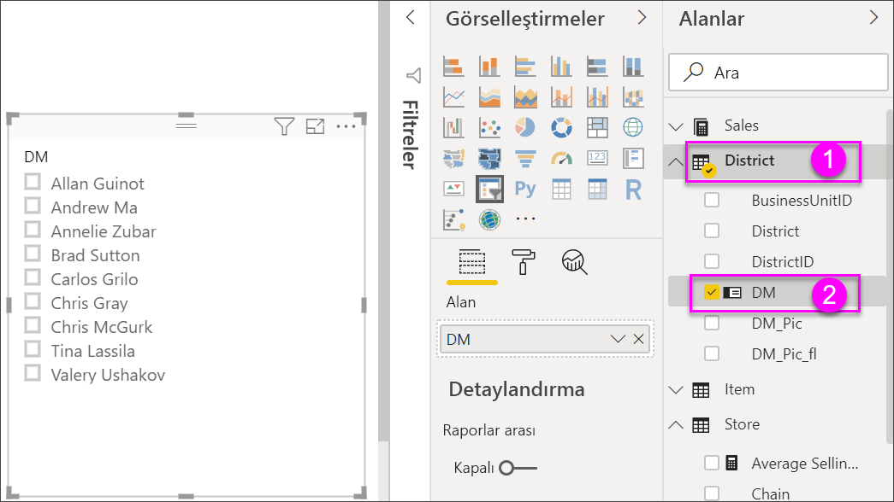
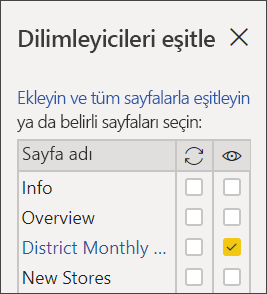
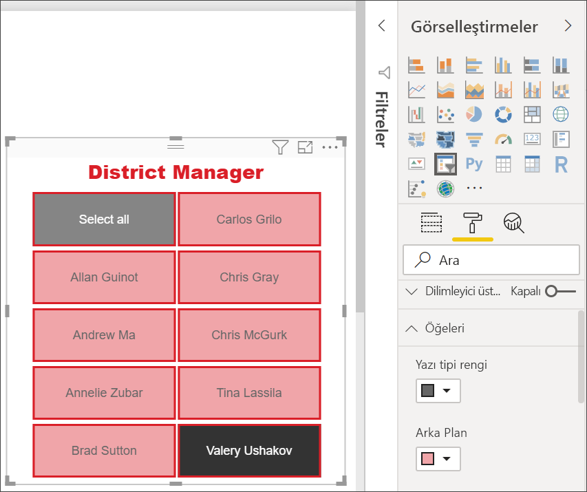

# Power BI'da dilimleyiciler

[!INCLUDE [applies-to](../includes/applies-to.md)] [!INCLUDE [yes-desktop](../includes/yes-desktop.md)] [!INCLUDE [yes-service](../includes/yes-service.md)]

Rapor okuyucularınızın genel satış ölçümlerine bakabilmesini, ancak aynı zamanda bölge yöneticilerinin her biri ve farklı zaman aralıkları için performansı vurgulayabilmesini istediğinizi varsayalım. Ayrı raporlar veya karşılaştırmalı grafikler oluşturabilirsiniz. Filtreler bölmesine filtre ekleyebilirsiniz. Bunun yerine *dilimleyicileri* de kullanabilirsiniz. Verileri filtrelemek için dilimleyicilerden de faydalanabilirsiniz. Dilimleyiciler, diğer rapor görselleştirmelerinde gösterilen veri kümesi bölümünü daraltır. 

Bu makalede ücretsiz [Perakende Analizi Örneği](../create-reports/sample-retail-analysis.md)’ni kullanarak temel dilimleyici oluşturma ve bunu biçimlendirme işleminde size yol gösterilir. Ayrıca bir dilimleyiciden etkilenen görselleri denetlemeyi, diğer sayfalardaki dilimleyicilerle eşitlemeyi ve dilimleyicileri filtreleyip biçimlendirmeyi kapsar.

Aşağıdaki diğer makalelerde belirli türlerdeki dilimleyicileri oluşturma adımları açıklanmaktadır:

- [Sayısal aralık dilimleyicileri](../create-reports/desktop-slicer-numeric-range.md).
- [Göreli tarih dilimleyicileri](desktop-slicer-filter-date-range.md).
- [Göreli saat dilimleyicileri](../create-reports/slicer-filter-relative-time.md).
- Yanıt veren, [yeniden boyutlandırılabilir dilimleyiciler](../create-reports/power-bi-slicer-filter-responsive.md).
- Birden çok alanı olan [hiyerarşi dilimleyicileri](../create-reports/power-bi-slicer-hierarchy-multiple-fields.md).

## Dilimleyici ne zaman kullanılır?
Aşağıdakileri yapmak istediğinizde dilimleyicileri kullanmanız oldukça faydalı olacaktır:

* Daha kolay erişim sağlamak amacıyla, sık kullanılan veya önemli filtreleri rapor tuvalinde görüntüleyin.
* Açılan bir listeyi açmak zorunda kalmadan, o sırada filtreli olan durumu daha kolay bir şekilde görüntülemek. 
* Veri tablolarında gereksiz veya gizli olan sütunlara göre filtreleme.
* Önemli görsellerin yanına dilimleyiciler yerleştirerek daha odaklı raporlar oluşturma.

Power BI dilimleyicileri şunları desteklemez:

- Giriş alanları
- Detaya gitme

## Dilimleyici oluşturma

Bu dilimleyici verileri bölge (District) yöneticisine göre filtreler. Bu yordamı izlemek istiyorsanız [Perakende Analizi Örneği PBIX dosyasını](https://download.microsoft.com/download/9/6/D/96DDC2FF-2568-491D-AAFA-AFDD6F763AE3/Retail%20Analysis%20Sample%20PBIX.pbix) indirin.

1. Power BI Desktop’ı açın ve menü çubuğundan **Dosya** > **Aç**’ı seçin.
   
1. **Perakende Analizi Örneği PBIX.pbix** dosyasına gidin ve **Aç**'ı seçin.

1. Soldaki bölmeden **Rapor** simgesini  seçin. Dosya, rapor görünümünde açılır.

1. **Genel Bakış** sayfasında, rapor tuvalinde hiçbir şey seçili değilken **Görselleştirmeler** bölmesindeki **Dilimleyici** simgesini  seçerek yeni bir dilimleyici oluşturun. 

1. Dilimleyiciyi doldurmak için, yeni dilimleyici seçiliyken **Alanlar** bölmesinden **Bölge** > **DM** seçeneğini belirleyin. 

    Yeni dilimleyici artık bölge yöneticisi adlarının ve bunların seçim kutularının bir listesi ile doldurulmuştur.
    
    
    
1. Dilimleyiciye yer açmak için tuvalin üzerindeki öğeleri yeniden boyutlandırıp sürükleyin. Dilimleyiciyi çok küçük boyutlandırırsanız dilimleyici öğelerinin kesileceğini unutmayın. 

1. Dilimleyici üzerindeki adları seçin ve sayfadaki diğer görselleştirmelere etkilerini not edin. Seçimlerini kaldırmak için adları tekrar seçin veya birden fazla ad seçmek için **Ctrl** tuşunu basılı tutun. Tüm adların seçilmesi, hiçbir adın seçilmemesiyle aynı etkiye sahiptir. 

1. Alternatif olarak, dilimleyicinizi biçimlendirmek için **Görselleştirmeler** bölmesindeki **Biçim** (boya rulosu simgesi) seçeneğini belirleyebilirsiniz. 

   Çok fazla seçenek olduğu için bunların hepsini burada açıklayamayız. Bu yüzden, farklı şeyler deneyerek kendinize uygun bir dilimleyiciyi oluşturun. Aşağıdaki görüntüdeki ilk dilimleyici, öğeler için yatay yönlendirme ve renkli arka planlar içeriyor. İkinci dilimleyici, daha standart bir görünüm için dikey yönlendirme ve renkli metin içeriyor.

   

   >[!TIP]
   >Dilimleyici listesi öğeleri varsayılan olarak artan düzende sıralanır. Sıralamayı tersine çevirerek öğeleri azalan düzene göre sıralamak için dilimleyicinin sağ üst köşesindeki üç noktayı ( **...** ) seçip **Azalan düzende sırala** seçeneğini belirleyin.

## Hangi sayfa görsellerinin dilimleyicilerden etkilendiğini denetleme
Varsayılan olarak, rapor sayfalarındaki dilimleyiciler, birbirleri de dahil olmak üzere o sayfadaki diğer tüm görselleştirmeleri etkiler. Yeni oluşturduğunuz liste ve tarih kaydırıcılarında değerleri seçerken diğer görselleştirmelere etkilerini not edin. Filtrelenen veriler her iki dilimleyicide seçilen değerlerin bir kesişimidir. 

Bazı sayfa görselleştirmelerini diğerlerinden etkilenmemesi amacıyla hariç tutmak için görsel etkileşimleri kullanın. **Genel Bakış** sayfasındaki **MaliAy ve Bölge Yöneticisine Göre Toplam Satış Varyansı** grafiği, her zaman görünür tutmak istediğiniz aya göre bölge yöneticileri için genel karşılaştırmalı verileri gösterir. Dilimleyici seçimlerinin bu grafiği filtrelemesini önlemek için görsel etkileşimleri kullanın. 

1. Raporun **Genel Bakış** sayfasına gidin ve ardından daha önce oluşturduğunuz **DM** dilimleyiciyi seçin.

1. Power BI Desktop menüsünde **Görsel Araçlar** bölümündeki **Biçim** menüsünü seçin ve **Etkileşimleri düzenle** seçeneğini belirleyin.
   
   Her biri **Filtre** ve **Hiçbiri** seçeneğine sahip filtre denetimleri , sayfadaki tüm görsellerin üzerinde görünür. Başlangıçta **Filtre** seçeneği tüm denetimlerde önceden seçilir.
   
1. **DM** dilimleyicisinin **MaliAy ve Bölge Yöneticisine Göre Toplam Satış Varyansı** grafiğini filtrelemesini durdurmak için grafiğin üzerindeki filtre denetiminde yer alan **Hiçbiri** seçeneğini belirleyin. 

1. **OpenDate** dilimleyicisini seçip ardından **MaliAy ve Bölge Yöneticisine Göre Toplam Satış Varyansı** grafiğinin üzerindeki **Hiçbiri** seçeneğini belirleyerek bu dilimleyicinin grafiği filtrelemesini durdurun. 

   Şimdi dilimleyicilerde ad ve tarih aralıklarını seçtiğinizde, **MaliAy ve Bölge Yöneticisine Göre Toplam Satış Varyansı** grafiği değişmez.

Etkileşimleri düzenleme hakkında daha fazla bilgi için bkz. [Bir Power BI raporundaki görsellerin etkileşim şekillerini değiştirme](../create-reports/service-reports-visual-interactions.md).

## Diğer sayfalardaki dilimleyicileri eşitleme ve kullanma
Bir Dilimleyiciyi eşitleyebilir ve rapordaki herhangi bir sayfada veya tüm sayfalarda kullanabilirsiniz. 

Geçerli raporun **Bölgenin Aylık Satışları** sayfasında **Bölge Yöneticisi** dilimleyicisi bulunuyor. Peki bu dilimleyicinin ayrıca **Yeni Mağazalar** sayfasında bulunmasını istiyorsak ne olacak? **Yeni Mağazalar** sayfasında da dilimleyici bulunur. Ancak, bu dilimleyici yalnızca **Mağaza Adı** bilgisini sağlar. **Dilimleyicileri eşitle** bölmesiyle herhangi bir sayfada yapılan dilimleyici seçimlerinin üç sayfanın tümünde bulunan görselleştirmeleri etkilemesi amacıyla **Bölge Yöneticisi** dilimleyicisini bu sayfalarla eşitleyebilirsiniz.

1. Power BI Desktop **Görünüm** menüsünde **Dilimleyicileri eşitle**’yi seçin.

    

    **Filtreler** ve **Görselleştirmeler** bölmelerinin arasında **Dilimleyicileri eşitle** bölmesi görüntülenir.

    

1. Raporun **Bölgenin Aylık Satışları** sayfasında **Bölge Yöneticisi** dilimleyicisini seçin. 

    **Genel Bakış** sayfasında zaten bir **Bölge Yöneticisi** (**DM**) dilimleyicisi oluşturmuş olduğunuzdan, **Dilimleyicileri eşitle** bölmesi şu şekilde görünür:
    
    
    
1. **Dilimleyicileri eşitle** bölmesinin **Eşitle** sütununda **Genel Bakış**, **Bölgenin Aylık Satışları** ve **Yeni Mağazalar** sayfalarını seçin. 

    Bu seçim, **Bölgenin Aylık Satışları** dilimleyicisinin bu üç sayfada eşitlenmesine neden olur. 
    
1. **Dilimleyicileri eşitle** bölmesinin **Görünen** sütununda **Yeni Mağazalar** sayfasını seçin. 

    Bu seçim, **Bölgenin Aylık Satışları** dilimleyicisinin bu üç sayfada görünür olmasına yol açar. **Dilimleyicileri eşitle** bölmesi artık şu şekilde görünür:

    

1. Dilimleyiciyi eşitlemenin ve diğer sayfalarda görünür yapmanın etkilerini gözlemleyin. **Bölgenin Aylık Satışları** sayfasında **Bölge Yöneticisi** dilimleyicisinin artık **Genel Bakış** sayfasındaki seçimlerin aynısını gösterdiğine dikkat edin. **Yeni Mağazalar** sayfasında, **Bölge Yöneticisi** dilimleyicisi artık görünür ve dilimleyicinin seçimleri **Mağaza Adı** dilimleyicisinde görünür olan seçimleri etkiler. 
    
    >[!TIP]
    >Dilimleyici, eşitlenmiş sayfalarda ilk olarak özgün sayfa ile aynı boyut ve konumda görünse de, çeşitli sayfalardaki eşitlenmiş dilimleyicileri birbirinden bağımsız olarak taşıyabilir, yeniden boyutlandırabilir ve biçimlendirebilirsiniz. 

    >[!NOTE]
    >Bir dilimleyiciyi bir sayfa ile eşitlemenize karşın o sayfada görünür hale getirmezseniz, diğer sayfalarda yapılan dilimleyici seçimleri sayfadaki verileri filtrelemeye devam eder.
 
## Dilimleyicileri filtreleme
Dilimleyicide görüntülenen değerlerin listesini azaltmak için dilimleyicilere görsel düzeyde filtreler uygulayabilirsiniz. Örneğin, bir liste dilimleyicisindeki boş değerleri veya bir aralık dilimleyicisindeki belirli tarihleri filtreleyebilirsiniz. Bunu yaptığınızda yalnızca *dilimleyicide gösterilen değerler* etkilenir, seçim yaptığınızda *dilimleyicinin diğer görsellere uyguladığı filtreler* etkilenmez. Örneğin, bir aralık dilimleyicisine yalnızca belirli tarihleri göstermesi için bir filtre uyguladığınızı varsayalım. Dilimleyicideki seçim, yalnızca bu aralıktaki ilk ve son tarihleri gösterir, ancak diğer görsellerinizde diğer tarihleri görmeye devam edersiniz. Dilimleyicideki seçili aralığı değiştirdiğinizde, diğer görsellerin güncelleştirildiğini görürsünüz. Dilimleyiciyi temizlediğinizde tüm tarihler yeniden gösterilir.

Görsel düzeyde filtreler hakkında daha fazla bilgi için bkz. [Filtre türleri](../create-reports/power-bi-report-filter-types.md).

## Biçim dilimleyiciler
Dilimleyici türüne bağlı olarak farklı biçimlendirme seçenekleri mevcuttur. **Yatay** yönü, **Duyarlı** düzeni ve **Öğe** renklendirmeyi kullanarak standart liste öğeleri yerine düğme ya da kutucuklar oluşturabilir ve dilimleyici öğelerini farklı ekran boyutları ve düzenlerine göre yeniden boyutlandırabilirsiniz.  

1. Herhangi bir sayfada **Bölge Yöneticisi** dilimleyicisi seçiliyken, **Görselleştirmeler** bölmesinde **Biçim** simgesini  seçerek biçimlendirme denetimlerini görüntüleyin. 
    
    
    
1. Seçenekleri görüntülemek ve düzenlemek için her kategorinin yanındaki açılan okları seçin. 

### Genel seçenekler
1. **Biçim** altında **Genel**'i ve **Ana hat rengi** altında kırmızı rengi seçip ardından **Ana hat ağırlığı**’nı *2* olarak değiştirin. 

    Bu ayar, üst bilgi ile öğe ana hatlarının ve alt çizgilerinin rengini ve kalınlığını değiştirir.

1. **Yönlendirme** için **Dikey** varsayılan olarak seçilir. Yatay yönde düzenlenmiş kutucuk veya düğmelerle bir dilimleyici oluşturmak için **Yatay**’ı seçin ve dilimleyiciye sığmayan öğelere erişmek için okları kaydırın.
    
    
    
1. Dilimleyici öğelerinin boyutunu ve düzenini görünüm ekranına ve dilimleyici boyutuna göre değiştirmek için **Duyarlı** düzeni **Açın**. 

    Liste dilimleyicileri için duyarlı düzen, küçük ekranlarda öğelerin kesilmesini önler. Yalnızca yatay yönlerde kullanılabilir. Aralık kaydırıcı dilimleyiciler için duyarlı biçimlendirme, kaydırıcının stilini değiştirir ve daha esnek bir yeniden boyutlandırma sağlar. Her iki dilimleyici türü de küçük boyutlarda filtre simgeleri haline gelir.
    
    
    
    >[!NOTE]
    >Duyarlı düzen değişiklikleri, ayarladığınız belirli üst bilgi ve öğe biçimlendirmesini geçersiz kılabilir. 
    
1. **X Konumu**, **Y Konumu**, **Genişlik** ve **Yükseklik** altında, sayısal duyarlıkla dilimleyici konumunu ve boyutunu ayarlayın ya da dilimleyiciyi doğrudan tuval üzerinde taşıyıp yeniden boyutlandırın. 

    Farklı öğe boyutları ve düzenlemelerle denemeler yapın ve duyarlı biçimlendirmenin uygun şekilde nasıl değiştiğine dikkat edin. Bu seçenekler yalnızca yatay yönlendirmeleri seçtiğinizde kullanılabilir. 

    

Yatay yönlendirmeler ve duyarlı düzenler hakkında daha fazla bilgi için bkz. [Power BI’da yeniden boyutlandırabileceğiniz duyarlı bir dilimleyici oluşturma](../create-reports/power-bi-slicer-filter-responsive.md).

### Seçim denetimi seçenekleri (yalnızca liste dilimleyiciler)
1. **Seçim denetimleri** altında, dilimleyiciye **Tümünü Seç** öğesi eklemek için **“Tümünü seç”i göster** seçeneğini **Açık** duruma getirin. 

    **“Tümünü seç”i göster** seçeneği varsayılan olarak **Kapalı**’dır. Bu seçenek etkinleştirildiğinde seçeneği açar/kapatırsanız, tüm öğeler seçilir veya öğelerin seçimleri kaldırılır. Tüm öğeleri seçerseniz, bir öğe belirlendiğinde seçim kaldırılarak bir *is-not* filtre türünün uygulanmasına olanak tanınır.
    
    
    
1. **Ctrl** tuşu basılı tutulmadan birden çok öğenin seçilmesini sağlamak için **Tek seçim**’i **Kapalı** duruma getirin. 

    **Tek seçim** varsayılan olarak **Açık**’tır. Öğe seçildiğinde bu öğe seçilir ve **Ctrl** tuşu basılı tutulduğunda ise birden çok öğe seçilir. Öğe yeniden seçildiğinde bu öğenin seçimi kaldırılır.

### Başlık seçenekleri
**Başlık** varsayılan olarak **Açık**’tır. Bu seçim, veri alanı adını dilimleyicinin üst kısmında gösterir. Başlığı, özellikle de hiyerarşi dilimleyicileri için yararlı olacak şekilde düzenleyebilirsiniz. Ayrıntılar için "Hiyerarşi dilimleyicisine birden çok alan ekleme" makalesinin [Başlığı değiştirme](../create-reports/power-bi-slicer-hierarchy-multiple-fields.md#change-the-title) bölümüne bakın.

- Bu makale için başlık metnini şu şekilde biçimlendirin: 
   - **Yazı tipi rengi**: kırmızı
   - **Metin boyutu**: **14 pt**
   - **Hizalama**: **Orta**
   - **Yazı tipi ailesi**: **Arial Black**

### Öğe seçenekleri

Öğe seçenekleri yalnızca liste dilimleyicileri için kullanılabilir.

1. Bu makale için **Öğeler** seçeneklerini şu şekilde biçimlendirin:
    - **Yazı tipi rengi**: siyah
    - **Arka plan**: açık kırmızı
    - **Metin boyutu**: **10 pt**
    - **Yazı tipi ailesi**: **Arial**
 
1. **Ana hat** için, her bir öğenin çevresine **Genel** seçenekleri altında ayarladığınız boyuta ve renge sahip bir kenarlık çizmek için **Çerçeve** seçeneğini belirleyin. 
    
    
    
    >[!TIP]
    >- **Genel** > **Yönlendirme** > **Yatay** seçili durumdayken seçimi kaldırılan öğeler, seçilen metin ve arka plan renklerini gösterir. Seçilen öğeler sistem varsayılan ayarını kullanır ve bu da genellikle siyah arka plan üzerinde beyaz metindir.
    >- **Genel** > **Yönlendirme > Dikey** seçiliyken, öğeler her zaman seçili renkleri gösterir ve onay kutuları seçildiğinde her zaman siyah olur. 

### Tarih/sayısal girişler ve kaydırıcı seçenekleri

Tarih/sayısal girişler ve kaydırıcı seçenekleri yalnızca aralık kaydırıcı dilimleri için kullanılabilir.

- Liste dilimleyicileri için tarih/sayısal giriş seçenekleri **Öğeler** seçenekleriyle aynıdır, ancak bir ana hat veya alt çizgi yoktur.
- **Kaydırıcı** seçenekleri, aralık kaydırıcının rengini ayarlamanıza veya kaydırıcıyı **Kapalı** duruma getirerek yalnızca sayısal girişleri bırakmanıza olanak tanır.

### Diğer biçimlendirme seçenekleri
Diğer biçimlendirme seçenekleri varsayılan olarak **Kapalı**’dır. Bunları denetlemek için bu seçenekleri **Açık** duruma getirin: 

- **Arka plan**: Dilimleyiciye bir arka plan rengi ekler ve bunun saydamlığını ayarlar.
- **Görünüşü kilitle**: Yeniden boyutlandırılırsa dilimleyicinin göreli yüksekliğini ve genişliğini korur.
- **Kenarlık**: Dilimleyicinin çevresine bir kenarlık ekler ve bunun rengini ayarlar. Bu dilimleyici kenarlığı **Genel** ayarlarından ayrıdır ve bunlardan etkilenmez.
- **Gölge**: Kaydırıcıya gölge ekler.

## Sonraki adımlar
Kaydırıcılar hakkında daha fazla bilgi için aşağıdaki makaleleri inceleyin:

- [Sayısal aralık dilimleyicileri](../create-reports/desktop-slicer-numeric-range.md)
- [Göreli tarih dilimleyicileri](desktop-slicer-filter-date-range.md)
- [Göreli zaman dilimleyicileri](../create-reports/slicer-filter-relative-time.md)
- Yanıt veren, [yeniden boyutlandırılabilir dilimleyiciler](../create-reports/power-bi-slicer-filter-responsive.md)
- Birden çok alanı olan [hiyerarşi dilimleyicileri](../create-reports/power-bi-slicer-hierarchy-multiple-fields.md)
