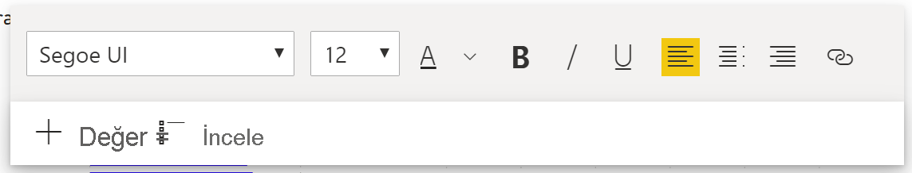
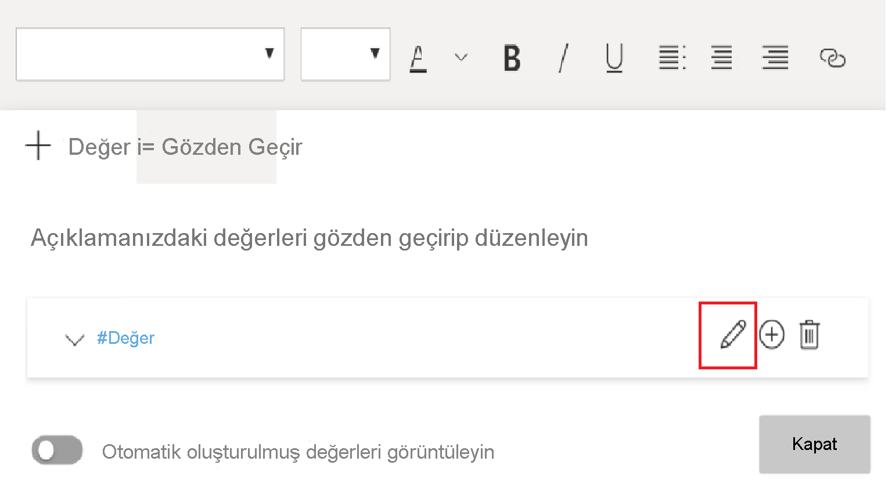

# Akıllı anlatı özetleri oluşturma (önizleme)

[!INCLUDE[consumer-appliesto-nyyn](../includes/consumer-appliesto-nyyn.md)]    

[!INCLUDE [power-bi-visuals-desktop-banner](../includes/power-bi-visuals-desktop-banner.md)]

Akıllı anlatı görselleştirmesi, görselleri ve raporları hızlıca özetlemenize yardımcı olur. Özelleştirebileceğiniz ilgili ve yenilikçi içgörüler sunar.

Raporlarınızda akıllı anlatı özetlerini kullanarak ana fikirlere dikkat çekebilir, eğilimleri belirleyebilir ve dil ile biçimi belirli bir hedef kitleye göre düzenleyebilirsiniz. PowerPoint'e raporunuzun ana fikirlerini içeren bir ekran görüntüsü yapıştırmak yerine her yenileme sonrasında güncelleştirilen anlatılar ekleyebilirsiniz. Hedef kitleniz verileri anlamak, ana fikirlere daha hızlı bir şekilde ulaşmak ve verileri başkalarına açıklamak için özetleri kullanabilir.

>[!NOTE]
> Akıllı anlatı özelliği önizleme aşamasında olduğundan kullanmak için etkinleştirmeniz gerekir. Power BI'da **Dosya** > **Seçenekler ve Ayarlar** > **Seçenekler** > **Önizleme Özellikleri**'ne gidin. Ardından **Akıllı anlatı görseli**'ni seçin.
>
>

## Kullanmaya başlayın 
Akıllı anlatıları nasıl kullanacağınızı gösteren Justyna'yı izleyin ve sonrasında videonun altında bulunan öğreticiyi kullanarak kendiniz deneyin.  Bu öğreticiyi takip etmek için çevrimiçi satış senaryosunu konu alan [örnek dosyayı](https://github.com/microsoft/powerbi-desktop-samples/blob/master/Monthly%20Desktop%20Blog%20Samples/2020/2020SU09%20Blog%20Demo%20-%20September.pbix) indirebilirsiniz.

> [!VIDEO https://youtu.be/01UrT-z37sw]

Otomatik özet oluşturmak için **Görselleştirmeler** bölmesinde **Akıllı anlatı** simgesini seçin.

Sayfadaki tüm görselleri temel alan bir anlatı görürsünüz. Örnek dosyada akıllı anlatılar rapordaki gelir, web sitesi ziyareti ve satış görsellerinin otomatik bir özetini oluşturabilir. Power BI, eğilimleri otomatik olarak analiz ederek gelirin ve ziyaret sayısının paralel olarak arttığını gösterir. Hatta büyüme oranını (bu örnekte yüzde 72) bile hesaplar.
 

 
Bir görselleştirmeden akıllı anlatı oluşturmak için üzerinde sağ tıkayıp **Özetle**'yi seçin. Örneğin buradaki dosyada farklı işlemleri gösteren dağılım grafiğini özetlemeyi deneyin. Power BI verileri analiz eder ve işlem başına en yüksek gelirle en yüksek işlem sayısına sahip şehri veya bölgeyi gösterir. Akıllı anlatı ayrıca bu ölçümler için beklenen değer aralığını da gösterir. Çoğu şehrin işlem başına 45 TL'nin altında kazandırdığını ve 10'dan az işleme sahip olduğunu görebilirsiniz.
 
  

 
## Özeti düzenleme
 
Akıllı anlatı özeti, yüksek oranda özelleştirilebilir niteliktedir. Metin kutusu komutlarını kullanarak yeni metin ekleyebilir veya var olan metni düzenleyebilirsiniz. Örneğin, metni kalın yapabilir veya rengini değiştirebilirsiniz.
 

  
Özeti özelleştirmek veya kendi içgörülerinizi eklemek için *dinamik değerleri* kullanın. Metni mevcut alanlarla ve ölçümlerle eşleyebilir veya metne eşlemek üzere yeni bir ölçüm tanımlamak için doğal dili kullanabilirsiniz. Örneğin bu dosyaya iade edilen ürün sayısı hakkında bilgi eklemek için bir değer ekleyin. 

Değer adı yazarken Soru-Cevap görselinde olduğu gibi öneriler arasından seçim yapabilirsiniz. Dolayısıyla Soru-Cevap görselinde verilerinizle ilgili soru sormaya ek olarak Veri Çözümleme İfadeleri (DAX) kullanmadan kendi hesaplamalarınızı oluşturabilirsiniz. 
  

  
İsterseniz dinamik değerleri biçimlendirebilirsiniz. Örneğin bu dosyada değerleri para birimi olarak gösterebilir, ondalık basamak sayısını belirtebilir ve binlik ayıracı seçebilirsiniz. 
   

   
Dinamik bir değeri biçimlendirmek için özetten istediğiniz değeri seçin. Kullanabileceğiniz düzenleme seçenekleri **Gözden Geçirme** sekmesinde görüntülenir. Alternatif olarak metin kutusunda düzenlemek istediğiniz değerin yanında bulunan Düzenle düğmesini seçin. 
   

   
Önceden tanımlanan değerleri gözden geçirmek, silmek veya yeniden kullanmak için **Gözden Geçirme** sekmesini de kullanabilirsiniz. Değeri özete eklemek için artı işaretini (+) kullanın. Ayrıca **Gözden Geçirme** sekmesinin en altında bulunan seçeneği etkinleştirerek otomatik oluşturulan değerleri de gösterebilirsiniz.

Bazen akıllı anlatılarda gizli özet simgesi görünür. Bu simge, geçerli verilerin ve filtrelerin bu değer için bir sonuç üretmediğini belirtir. İçgörü olmadığında özet boş olur. Örneğin bu dosyanın çizgi grafiğindeki çizgi düz olduğunda yüksek ve düşük değerlerin özeti boş olabilir. Ancak diğer koşullarda özet görünebilir. Gizli özet simgeleri yalnızca özeti düzenlemeye çalıştığınızda görünür.

   
## Görsel etkileşimler
Özetler dinamiktir. Çapraz filtreleme yaptığınızda otomatik olarak hem oluşturulmuş metni hem de dinamik değerleri güncelleştirir. Örneğin, bu dosyadaki halka grafikte elektronik ürünlerini seçerseniz raporun geri kalanı çapraz filtrelenir ve özet de elektronik ürünlerine odaklanmak amacıyla çapraz filtrelenmiş olur.  

Bu durumda, ziyaretler ve gelirlerin farklı eğilimleri vardır. Dolayısıyla özet metni, eğilimleri yansıtacak şekilde güncelleştirilir. Eklediğimiz iade sayısı değeri 4196 TL güncelleştirilir. Boş özetler de çapraz filtreleme yaptığınızda güncelleştirilebilir.
   

   
Daha gelişmiş filtreleme işlemleri de yapabilirsiniz. Örnek dosyada birden çok ürüne ait eğilimleri gösteren görseli inceleyin. Yalnızca belirli bir çeyrekteki eğilimi görmek istiyorsanız ilgili veri noktalarını seçerek özeti ilgili eğilime göre güncelleştirebilirsiniz.
   

   
## Sınırlamalar

Akıllı anlatı özelliği aşağıdaki işlevleri desteklemez:
- Panoya sabitleme 
- Dinamik değerlerin ve koşullu biçimlendirmenin (örneğin, veri bağlantılı başlık) kullanılması
- Azure Analysis Services, şirket içi AS
- KPI'ler, kartlar, çoklu satır kartları, haritalar, tablolar, matrisler, R görselleri veya Python görselleri, özel görseller 
- Diğer sütunlar tarafından gruplanmış sütunlar içeren ve veri grubu alanını temel alan görseller 
- Görselde çapraz filtreleme
- Dinamik değerleri yeniden adlandırma veya otomatik oluşturulmuş dinamik değerleri düzenleme
- Soru-Cevap aritmetiği ve genel toplam yüzdesi gibi anlık hesaplamalar içeren görsellerin özetleri 
- [Hesaplama grupları](/analysis-services/tabular-models/calculation-groups)
   

