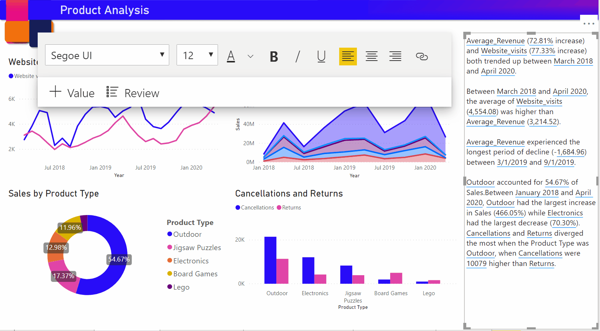

# Akıllı Anlatılar oluşturma (önizleme)

[!INCLUDE[consumer-appliesto-nyyn](../includes/consumer-appliesto-nyyn.md)]    

[!INCLUDE [power-bi-visuals-desktop-banner](../includes/power-bi-visuals-desktop-banner.md)]

Akıllı anlatılar görselleştirmesi, özelleştirilebilir ve alakalı olan kullanıma hazır içgörüler sağlayarak görselleri ve raporları hızla özetlemenize yardımcı olur.

İçerik oluşturucuları bu özelliği kullanarak önemli fikirleri ele almak, eğilimleri göstermek, dili düzenlemek ve belirli bir kitleye uyacak şekilde biçimlendirmek için raporlarına anlatılar ekleyebilir. Önemli ana fikirleri ekleyerek PowerPoint’teki raporunun ekran görüntüsünü yapıştırmak yerine şimdi rapora, her yenileme işleminde güncelleştirilen anlatılar ekleyebilirler. Son kullanıcılarınız verileri anlamak, ana fikirlere daha hızlı bir şekilde ulaşmak ve verileri başkalarına açıklamak için anlatıları kullanabilir.

>[!NOTE]
> Bu özellik önizleme aşamasında olduğundan ilk olarak Dosya > Seçenekler ve Ayarlar > Seçenekler > Önizleme özelliği’ni açmanız ve  **Akıllı anlatı görseli** ayarının açık olduğundan emin olmanız gerekir:

Çevrimiçi Satış senaryosu için kullanılan PBIX dosyasını [buradaki](https://github.com/microsoft/powerbi-desktop-samples/blob/master/Monthly%20Desktop%20Blog%20Samples/2020/2020SU09%20Blog%20Demo%20-%20September.pbix) belgelerde bulabilirsiniz.

## Başlarken 

Otomatik olarak bir özet oluşturmak için görselleştirme bölmesindeki yeni akıllı anlatılar simgesine tıklayın.

 Sayfadaki tüm görsellere göre oluşturulan bir anlatı görürsünüz. Örneğin, bu rapordaki gelir, web sitesi ziyareti ve satışlardan bahseden görsellerin otomatik olarak özetini oluşturmak için simgeye tıklayabilirsiniz. Power BI’ın Gelir ve Ziyaretlerin her ikisinin de arttığını göstermek için otomatik olarak eğilim analizi yaptığına ve gördüğü büyüme türünü de hesapladığına (bu durumda, %72 artış) dikkat edin.
 
 
 
 Ayrıca, görsele sağ tıklayıp **'özetle'** seçeneğini belirleyebilirsiniz. Bu, görselleştirmenin otomatik bir özetini oluşturur. Örneğin, çeşitli işlemleri gösteren dağılım grafiğinde Özetle seçeneğine sağ tıkladığınızda, Power BI verileri analiz edip işlem başına en yüksek gelire ve en yüksek işlem sayısına sahip olan ülkeyi/bölgeyi gösterir. Ayrıca, bu ölçümler için beklenen değer aralıklarını da gösterir. Böylece çoğu şirketin işlem başına gelir bakımından 45 ABD dolarının altında ve 10’dan az işleme sahip olduğunu anlayabilirsiniz.
 
  
 
 
 ## Özeti düzenleme
 
 Yeni metin ekleyebileceğiniz veya normal metin kutusundaki denetimlerin aynısını kullanarak mevcut metni düzenleyebileceğiniz özet oldukça **özelleştirilebilirdir**. Örneğin, metni kalın yapabilir veya metin rengini değiştirebilirsiniz.
 
  
  
  Ayrıca özeti özelleştirebilir ve **dinamik değerler** ekleyerek kendi içgörülerinizi de ekleyebilirsiniz. Metni mevcut alanlarla ve ölçümlerle eşleyebilir veya metne eşlemek üzere yeni bir ölçüm tanımlamak için doğal dili kullanabilirsiniz. Örneğin, döndürülen öğelerin sayısı hakkında bilgi eklemek isterseniz GIF’te gösterildiği şekilde, değer ekleme deneyiminden yararlanabilirsiniz. Dinamik değerler eklemek amacıyla Soru-Cevap deneyimini tümleştirdik. Siz yazdıkça, Soru-Cevap görselinde açılan menü olarak öneriler alırsınız ve bunları değer olarak kaydedebilirsiniz.  Bu nedenle, Soru-Cevap’ta verilerinizle ilgili sorular sorabilmenin yanı sıra bu kapsam, DAX işlemleri yapmadan kendi hesaplamalarınızı yapabileceğiniz şekilde genişletilmiştir. 
  
   
  
  Para birimi olarak gösterme, ondalık basamakları belirtme, binlik ayracı vb. dinamik değerleri biçimlendirebilirsiniz. 
   
   
   
   Biçimlendirmek için doğrudan özetteki değerin üzerine veya metin kutusu denetiminin gözden geçirme sekmesindeki karşılık gelen değerdeki düzenle düğmesine tıklayarak bunu yapabilirsiniz. 
   
   
   
   Önceden tanımlanan değerleri gözden geçirmek, silmek veya yeniden kullanmak için Gözden Geçirme sekmesini de kullanabilirsiniz.  Artı simgesine tıkladığınızda değer özete eklenir. Ayrıca, alt kısımdaki seçeneği açıp kapatarak otomatik olarak oluşturulan değerleri gösterebilirsiniz.

Bazen, “Geçerli veriler ve filtreler bu değer için sonuç üretmiyor” iletisinin görüntülendiği bir gizli özetler simgesi görebilirsiniz. Bunun nedeni, bahsedilecek ilginç bir şey olmadığında bazı özetlerin boş olabilmesidir. Örneğin, bir çizgi grafiğindeki yüksek ve düşük değerlerle ilgili özet, düz bir çizgiyse boş olabilir ancak başka koşullar altında dolu olabilir. Bu simgeler yalnızca özetleri düzenlemeye çalıştığınızda görünür hale gelir.

   
   
   ## Görsel etkileşimler
   Özet dinamiktir ve çapraz filtreleme yaptığınızda otomatik olarak hem oluşturulmuş metni hem de dinamik değerleri güncelleştirir. Örneğin, halka grafikte Elektronik ürünlerini seçerseniz raporun geri kalanı çapraz filtrelenir ve özet de Elektronik ürünlerine odaklanmak amacıyla çapraz filtrelenmiş olur.  Bu durumda, ziyaretler ve gelirlerin farklı eğilimleri vardır. Yani metin, bunu yansıtacak şekilde güncelleştirilir. Eklediğiniz iade değerinin sayısı 4196 ABD doları olarak güncelleştirilir. Bazı boş özetler de çapraz filtreleme yaptığınızda güncelleştirilebilir.
   
   
   
   Daha gelişmiş filtreleme işlemleri de yapabilirsiniz. Örneğin, birden çok farklı ürünün eğilimlerine bakan bu görseldeki belirli bir çeyrekte yer alan eğilimle ilgileniyorsanız yalnızca bu kısım için özeti güncelleştirmek üzere ilgili veri noktalarını seçebilirsiniz.
   
   
   
   ## Sınırlamalar
   - Panoya sabitleme desteklenmez.
   - Dinamik Değerlerin ve Koşullu Biçimlendirmenin (örneğin, veri bağlantılı başlık) kullanılması desteklenmez.
   - Azure Analysis Services, Şirket içi AS desteklenmez.
   - KPI, Kart, Çok satırlı kart, Haritalar, Tablo, Matrisler, R/Python görselleri ve özel görseller, özetlemeyi desteklemez. Bu görsellerin bazıları gelecekte eklenebilir.
   - Özetleme, diğer sütunlar tarafından gruplanmış sütunlar içeren ve Veri Grubu alanı üzerinde oluşturulmuş görsellerde desteklenmez. 
   - Görselden çapraz filtreleme yapılması desteklenmez.
   - Dinamik değerleri yeniden adlandırma veya otomatik oluşturulmuş dinamik değerleri düzenleme desteklenmez.
   - Soru-Cevap aritmetiği, Genel Toplamın Yüzdesi gibi anlık hesaplamalar içeren görsellerin özetlemesi desteklenmez.
   

