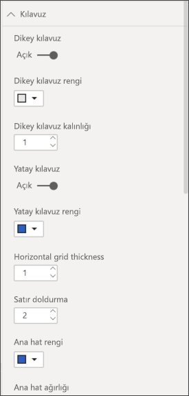
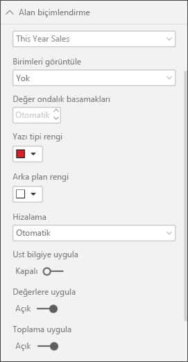
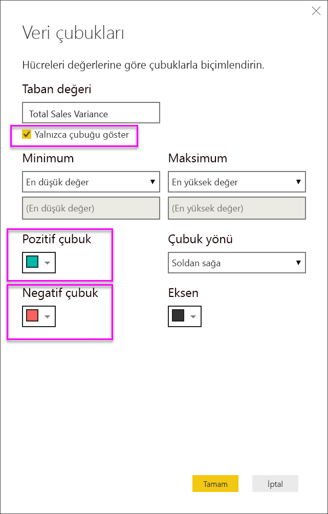

# Power BI rapor ve panolarındaki tablolar

[!INCLUDE [power-bi-visuals-desktop-banner](../includes/power-bi-visuals-desktop-banner.md)]

Tablo, mantıksal satır ve sütun dizilerinde ilgili verileri içeren bir kılavuzdur. Tabloda başlık ve toplam satırı da bulunabilir. Tablolar, tek bir kategoriye ait birden fazla değeri incelediğiniz nicelik karşılaştırmaları için idealdir. Örneğin bu tabloda **Category** için beş farklı ölçü gösterilmektedir.

Raporlarda tablolar oluşturun ve bir tablodaki öğelerle aynı rapor sayfasındaki diğer görseller arasında çapraz vurgulama gerçekleştirin. Satırları, sütunları ve hatta tek tek hücreleri seçip çapraz vurgulama uygulayabilirsiniz. Tek veya birden fazla hücre seçimi kopyalayıp bunları diğer uygulamalara yapıştırabilirsiniz.

## Tablolar ne zaman kullanılır?

Tablolar şunlar için harika seçimdir:

* Ayrıntılı verileri ve tam değerleri görüp karşılaştırmak için (görsel gösterimler yerine).

* Verileri tablo biçiminde görüntülemek için.

* Sayısal verileri kategorilere göre ayrılmış şekilde görüntülemek için.

## Önkoşul

Bu öğreticide [Perakende Analizi örneği .PBIX dosyası](http://download.microsoft.com/download/9/6/D/96DDC2FF-2568-491D-AAFA-AFDD6F763AE3/Retail%20Analysis%20Sample%20PBIX.pbix) kullanılmıştır.

1. Menü çubuğunun sol üst köşesinden **Dosya** > **Aç**’ı seçin
   
2. **Perakende Analizi örneği PBIX dosyasının** kopyasını bulun

1. **Perakende Analizi örneği PBIX dosyasını** rapor görünümünde  açın.

1. Seç  yeni bir sayfa ekleyin.

## Tablo oluşturma

Satış değerlerini ürün kategorisine göre görüntülemek için makalenin başında gösterilen tabloyu oluşturacaksınız.

1. **Alanlar** bölmesinden, **Öğe** > **Kategori** seçeneğini belirleyin.

    Power BI otomatik olarak tüm kategorileri listeleyen bir tablo oluşturur.

    

1. **Sales > Average Unit Price** ve **Sales > Last Year Sales**’i belirleyin

1. Ardından, **Sales > This Year Sales**’i seçin ve şu üç seçeneğin üçünü de belirleyin: **Değer**, **Hedef**, ve **Durum**.

1. **Görsel Öğeler** bölmesinde **Değerler** kutusunu bulun ve değerleri grafiğinizdeki sıralama bu sayfadaki ilk görüntüdeki gibi olana kadar seçin. Gerekirse kutudaki değerleri sürükleyin. **Değerler** kutunuz aşağıdaki gibi görünecektir:

    

## Tabloyu biçimlendirme

Bir tabloyu biçimlendirmenin birçok yolu bulunur. Burada yalnızca birkaçı ele alınır. Diğer biçimlendirme seçenekleri hakkında bilgi edinmek için **Biçim** bölmesini açıp (boya rulosu simgesi ) kendiniz keşfedebilirsiniz.

* Tablo kılavuzunu biçimlendirmeyi deneyin. Burada mavi dikey kılavuz ve satırlara boşluk ekleyip tablonun ana hatlarını ve metin boyutunu artıracaksınız.

    

    

* Sütun başlıkları için arka plan rengini değiştirin, ana hat ekleyin ve yazı tipi boyutunu artırın.

    

    

* Hatta tek sütunlara ve sütun başlıklarına bile biçimlendirme uygulayabilirsiniz. İlk olarak **Alan biçimlendirme**’yi genişletin ve açılır listeden biçimlendirilecek sütunu seçin. Sütun değerlerine bağlı olarak, **Alan biçimlendirme** şunun gibi ayarları yapmanızı sağlar: görüntüleme birimleri, yazı tipi rengi, ondalık basamak sayısı, arka plan, hizalama ve daha fazlası. Ayarları düzenledikten sonra bu ayarları üst bilgiye ve toplamlar satırına da uygulayıp uygulamayacağınıza karar verin.

    

    

* Birkaç ek biçimlendirme sonrasında tablonun son halini aşağıda görebilirsiniz.

    

### Koşullu biçimlendirme

*Koşullu biçimlendirme* biçimlendirme türlerinden biridir. Power BI, **Görsel öğeler** panosunun **Değerler** kutucuğundaki alanlara koşullu biçimlendirme uygular.

Tablolar için koşullu biçimlendirme sayesinde gradyan renklerini kullanma dahil olmak üzere hücre değerlerine göre özel hücre arka plan renkleri ve yazı tipi renkleri belirtebilirsiniz.

1. **Görsel Öğeler** bölmesinde **Alanlar** simgesini  seçin.

1. **Değerler** kutusunda yer alan değerlerden biçimlendirmek istediğiniz değerin yanındaki aşağı oku seçin (veya alana sağ tıklayın).

    > [!NOTE]
    > Koşullu biçimlendirmeyi yalnızca **Alanlar** kutusunun **Değerler** alanındaki alanlar için yönetebilirsiniz.

    

1. **Arka plan rengi**'ni seçin.

1. Açılan iletişim kutusunda rengi, **Minimum** değerini ve **Maksimum** değerini yapılandırabilirsiniz. **Ayrılan** seçeneğini seçerseniz isteğe bağlı bir **Orta** değeri de yapılandırabilirsiniz.

    

    Şimdi Average Unit Price değerlerine özel biçimlendirme uygulayalım. **Ayrılan**'ı seçin, birkaç renk ekleyin ve **Tamam**'ı belirleyin.

    
1. Tabloya hem pozitif hem de negatif değerler içeren yeni bir alan ekleyin. **Sales > Total Sales Variance** öğesini seçin.

    

1. **Total Sales Variance** öğesinin yanındaki aşağı oku seçip **Koşullu biçimlendirme > Veri çubukları** yolunu izleyerek veri çubuğu koşullu biçimlendirmesi ekleyin.

    

1. Açılan iletişim kutusunda **Pozitif çubuk** ve **Negatif çubuk** renklerini ayarlayın, **Yalnızca çubuğu göster** seçeneğini belirleyin ve istediğiniz diğer değişiklikleri yapın.

    

1. **Tamam**'ı seçin.

    Tabloda, veri çubukları sayısal değerlerin yerini alır ve bu sayede tablonun taranması kolaylaşır.

    

Bir görselleştirmeden koşullu biçimlendirmeyi kaldırmak istiyorsanız alana tekrar sağ tıklayın ve **Koşullu Biçimlendirmeyi Kaldır**'ı seçin.

> [!TIP]
> Koşullu biçimlendirmeye **Biçimlendirme** bölmesinden de erişebilirsiniz. Biçimlendirmek istediğiniz değeri seçip **Renk ölçekleri** veya **Veri çubukları seçenekleri**’ni **Açık** konumuna getirerek varsayılan ayarları uygulayabilir veya **Gelişmiş denetimler**’i seçerek ayarları özelleştirebilirsiniz.

## Power BI tablolarındaki değerleri diğer uygulamalarda kullanmak üzere kopyalama

Tablonuzda veya matrisinizde Dynamics CRM ve Excel gibi farklı uygulamalarda ve hatta diğer Power BI raporlarında kullanmak istediğiniz içerik bulunabilir. Power BI’da bir hücrenin içine sağ tıkladığınızda tek bir hücrede veya birden fazla hücrede bulunan verileri panonuza kopyalayıp diğer uygulamalara yapıştırabilirsiniz.

Tek bir hücrenin değerlerini kopyalamak için:

1. Kopyalamak istediğiniz hücreyi seçin.

1. Hücrenin içine sağ tıklayın.

1. **Kopyala** > **Değeri kopyala**’yı seçin.

    

    Panonuza kaydedilen biçimlendirilmemiş hücre değerini artık başka bir uygulamaya yapıştırabilirsiniz.

Birden fazla hücreyi kopyalamak için:

1. Bir hücre aralığını veya **Ctrl** tuşunu basılı tutarak birden fazla hücreyi seçin.

1. Seçtiğiniz hücrelerden birinin içine sağ tıklayın.

1. **Kopyala** > **Seçimi kopyala**’yı seçin.

    

## Tablonun sütun genişliğini ayarlama

Bazen Power BI bir rapordaki veya bir panodaki sütun başlığını kısaltabilir. Sütun adının tamamını göstermek için başlığın sağ tarafındaki boşluğa giderek ikili okun görünmesini bekleyin, ardından seçin ve sürükleyin.

## Önemli noktalar ve sorun giderme

Sütun biçimlendirmesi uygularken her sütun için tek bir hizalama seçeneği belirleyebilirsiniz: **Otomatik**, **Sol**, **Orta**, **Sağ**. Genellikle, bir sütun tamamen metin veya tamamen sayı içerebilir ve bunların karışımını içeremez. Bir sütunun hem sayı hem de metin içerdiği durumlarda **Otomatik** seçeneği metni sola, sayıları ise sağa hizalar. Bu davranış, soldan sağa okunan dilleri destekler.

## Sonraki adımlar

* [Power BI'da ağaç haritaları](power-bi-visualization-treemaps.md)

* [Power BI'daki görselleştirme türleri](power-bi-visualization-types-for-reports-and-q-and-a.md)
