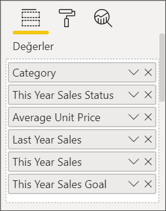
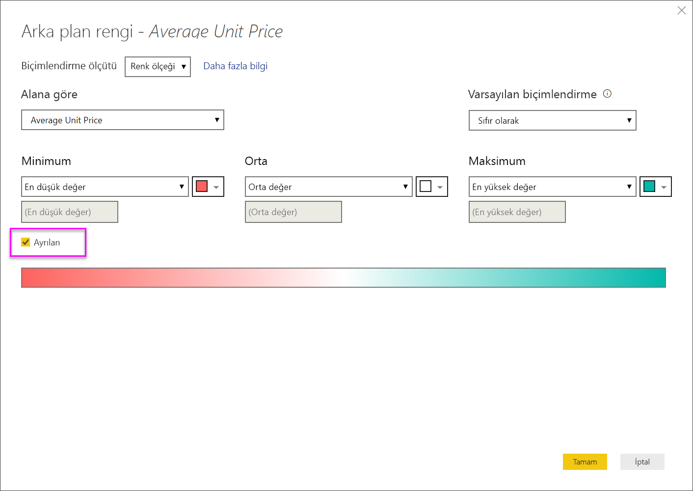

# Power BI rapor ve panolarındaki tablolar
Tablo, mantıksal satır ve sütun dizilerinde ilgili verileri içeren bir kılavuzdur. Tabloda başlık ve toplam satırı da bulunabilir. Tablolar, tek bir kategoriye ait birden fazla değeri incelediğiniz nicelik karşılaştırmaları için idealdir. Örneğin bu tabloda **Category** için 5 farklı ölçü gösterilmektedir.

Raporlarda tablolar oluşturun ve bir tablodaki öğelerle aynı rapor sayfasındaki diğer görseller arasında çapraz vurgulama gerçekleştirin.  Ayrıca satırları, sütunları ve hatta tek tek hücreleri seçip çapraz vurgulama uygulayabilirsiniz. Tek veya birden fazla hücre seçimi kopyalanarak diğer uygulamalara yapıştırılabilir.

## Tablolar ne zaman kullanılır?
Tablolar şunlar için harika seçimdir:

* ayrıntılı verileri ve tam değerleri görüp karşılaştırmak için (görsel gösterimler yerine)
* verileri tablo biçiminde görüntülemek için
* sayısal verileri kategorilere göre ayrılmış şekilde görüntülemek için   

> [!NOTE]
> Bir tabloda çok fazla değer varsa tabloyu matrise dönüştürmeyi ve/veya detaya gitme özelliğini kullanmayı deneyin. Bir tablonun görüntüleyeceği en fazla veri noktası 3.500'dür.

## Önkoşullar
- Power BI hizmeti veya Power BI Desktop
- Perakende Analizi örneği

## Tablo oluşturma
Yukarıdaki resimde görülen ve ürün kategorisine göre satış değerlerini gösteren tabloyu oluşturacağız. Örneği takip etmek için Power BI hizmetinde oturum açıp **Veri Al \> Örnekler \> Perakende Analizi Örneği > Bağlan**'ı seçtikten sonra **Panoya git** seçeneğini belirleyin. Bir görsel öğe oluşturmak için veri kümesinde ve raporda düzenleme izinlerine sahip olmanız gerekir. Neyse ki, Power BI örneklerinin tümü düzenlenebilir. Sizinle bir rapor paylaşıldıysa, raporlarda görsel öğe oluşturamazsınız.

1. Sol gezinti bölmesinden **Çalışma Alanları > Çalışma Alanım**’ı seçin.    
2. Veri Kümeleri sekmesini seçin ve sayfayı kaydırarak yeni eklediğiniz Perakende Analizi Örneği veri kümesini bulun.  **Rapor oluştur** simgesini seçin.

    
2. Rapor düzenleyicisinde **Item** > **Category**'yi seçin.  Power BI otomatik olarak tüm kategorileri listeleyen bir tablo oluşturur.

    
3. **Sales > Average Unit Price**, **Sales > Last Year Sales** ve **Sales > This Year Sales** öğelerini seçip 3 seçeneği de (Değer, Hedef, Durum) belirleyin.   
4. Görsel Öğeler bölmesinde **Değerler** kutusunu bulun ve değerleri grafiğinizdeki sıralama bu sayfadaki ilk görüntüdeki gibi olana kadar sürükleyip bırakın.  Değerlerinizin aşağıdaki gibi görünmesi gerekir.

    
5. Raptiye simgesini seçerek tabloyu panoya sabitleyin  

     

## Tabloyu biçimlendirme
Bir tabloyu biçimlendirmek için kullanabileceğiniz birçok farklı yöntem vardır. Burada yalnızca birkaç tanesini inceleyeceğiz. Diğer biçimlendirme seçenekleri hakkında bilgi edinmek için Biçimlendirme bölmesini açıp (boya rulosu simgesi ) keşferebilirsiniz.

* Tablo kılavuzunu biçimlendirmeyi deneyin. Burada mavi dikey kılavuz ekledik, satırlara boşluk ekledik, tablonun ana hatlarını ve metin boyutunu bir miktar artırdık.

    

    
* Sütun başlıklarında arka plan rengini değiştirdik, ana hat ekledik ve yazı tipi boyutunu artırdık. 

    

    

* Hatta tek sütunlara ve sütun başlıklarına bile biçimlendirme uygulayabilirsiniz. İlk olarak **Alan biçimlendirme**’yi genişletin ve açılır listeden biçimlendirilecek sütunu seçin. Sütun değerlerine bağlı olarak, Alan biçimlendirme şunun gibi ayarları yapmanızı sağlar: görüntüleme birimleri, yazı tipi rengi, ondalık basamak sayısı, arka plan, hizalama ve daha fazlası. Ayarları düzenledikten sonra bu ayarları üst bilgiye ve toplamlar satırına da uygulayıp uygulamayacağınıza karar verin.

    

* Birkaç ek biçimlendirme sonrasında tablonun son halini aşağıda görebilirsiniz. Çok sayıda biçimlendirme seçeneği olduğundan öğrenmenin en iyi yolu varsayılan biçimlendirme ile başlayıp Biçimlendirme bölmesini   açmak ve seçenekleri keşfetmeye başlamaktır. 

    

### Koşullu biçimlendirme
Biçimlendirme türlerinden biri de *koşullu biçimlendirmedir* ve Power BI hizmetinde veya Desktop uygulamasında **Görsel Öğeler** bölmesinin **Değerler** kutusundaki alanlara uygulanır. 

Tablolar için koşullu biçimlendirme sayesinde gradyan renklerini kullanma dahil olmak üzere hücre değerlerine göre özel hücre arka plan renkleri ve yazı tipi renkleri belirtebilirsiniz. 

1. Power BI hizmetinin veya Desktop uygulamasının **Görsel Öğeler** bölmesinde, **Değerler** kutusunda yer alan değerlerden biçimlendirmek istediğiniz değerin yanındaki aşağı oku seçin (veya alana sağ tıklayın). Koşullu biçimlendirmeyi yalnızca **Alanlar** kutusunun **Değerler** alanındaki alanlar için yönetebilirsiniz.

    
2. **Arka plan renk ölçekleri**'ni seçin. Açılan iletişim kutusunda rengin yanı sıra *Minimum* ve *Maksimum* değerleri yapılandırabilirsiniz. **Ayrılan** kutusunu seçerseniz isteğe bağlı bir *Orta* değeri de yapılandırabilirsiniz.

    

    Şimdi Average Unit Price değerlerine özel biçimlendirme uygulayalım. **Ayrılan**'ı seçin, birkaç renk ekleyin ve **Tamam**'ı seçin. 

    
3. Tabloya hem pozitif hem de negatif değerler içeren yeni bir alan ekleyin.  **Sales > Total Sales Variance** öğesini seçin. 

    
4. **Total Sales Variance** öğesinin yanındaki aşağı oku seçip **Koşullu biçimlendirme > Veri çubukları** yolunu izleyerek veri çubuğu koşullu biçimlendirmesi ekleyin.

    
5. Açılan iletişim kutusunda **Pozitif çubuk** ve **Negatif çubuk** renklerini ayarlayın, **Yalnızca çubuğu göster**'in yanına onay işareti ekleyin ve istediğiniz diğer değişiklikleri yapın.

    

    **Tamam**'ı seçtiğinizde tabloda sayısal değerler verine veri çubukları gösterilir ve bu sayede tablo daha kolay anlaşılır hale gelir.

    
6. Bir görselleştirmedeki koşullu biçimlendirmeyi kaldırmak için alana tekrar sağ tıklayın ve **Koşullu Biçimlendirmeyi Kaldır**'ı seçin.

> [!TIP]
> Koşullu biçimlendirmeye Biçimlendirme bölmesinden (boya rulosu simgesi) de erişebilirsiniz. Biçimlendirmek istediğiniz değeri seçip **Renk ölçekleri** veya **Veri çubukları seçenekleri**’ni **Açık** konumuna getirerek varsayılan ayarları uygulayabilir veya **Gelişmiş denetimler**’i seçerek ayarları özelleştirebilirsiniz.
> 
## Power BI tablolarındaki değerleri diğer uygulamalarda kullanmak üzere kopyalama

Tablonuzda veya matrisinizde Dynamics CRM ve Excel gibi farklı uygulamalarda ve hatta diğer Power BI raporlarında kullanmak istediğiniz içerik bulunabilir. Power BI’da sağ tıkladığınızda tek bir hücreyi veya birden fazla hücreyi panonuza kopyalayabilir, daha sonra diğer uygulamaya yapıştırabilirsiniz.

* Tek bir hücrenin değerini kopyalamak için hücreyi seçin, sağ tıklayın ve **Değeri kopyala**’yı seçin. Panonuza kaydedilen biçimlendirilmemiş hücre değerini başka bir uygulamaya yapıştırabilirsiniz.

    

* Birden fazla hücreyi kopyalamak için bir hücre aralığını veya CTRL tuşunu basılı tutarak birden fazla hücreyi seçin. Kopyalanan veriler sütun ve satır üst bilgilerini içerecektir.

    

    Kopyalanan veriler sütun ve satır üst bilgilerini içerir.

    

## Tablonun sütun genişliğini ayarlama
Bazen Power BI bir rapordaki veya bir panodaki sütun başlığını kısaltabilir. Sütun adının tamamını göstermek için başlığın sağ tarafındaki boşluğa giderek ikili okun görünmesini bekleyin, ardından seçin ve sürükleyin.

## Önemli noktalar ve sorun giderme
* Sütun biçimlendirmesi uygularken her sütun için yalnızca bir hizalama seçeneği belirleyebilirsiniz: Otomatik, Sol, Orta, Sağ. Genellikle, bir sütun tamamen metin veya tamamen sayı içerebilir ve bunların karışımını içeremez. Ancak, bir sütunun hem sayı hem de metin içerdiği durumlarda **Otomatik** seçeneği metni sola, sayıları ise sağa hizalar. Bu davranış, soldan sağa okunan dilleri destekler.   

## Sonraki adımlar

[Power BI'da ağaç haritaları](power-bi-visualization-treemaps.md)

[Power BI'daki görselleştirme türleri](power-bi-visualization-types-for-reports-and-q-and-a.md)