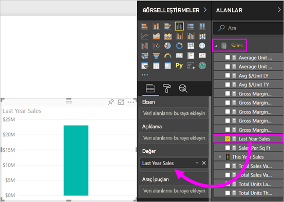
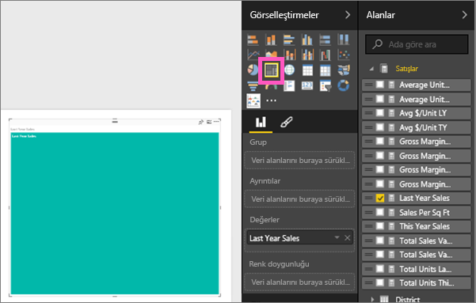
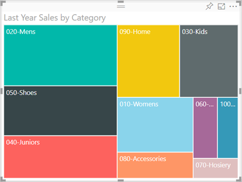
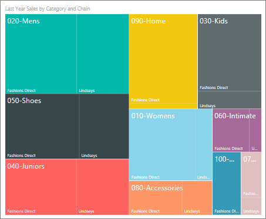
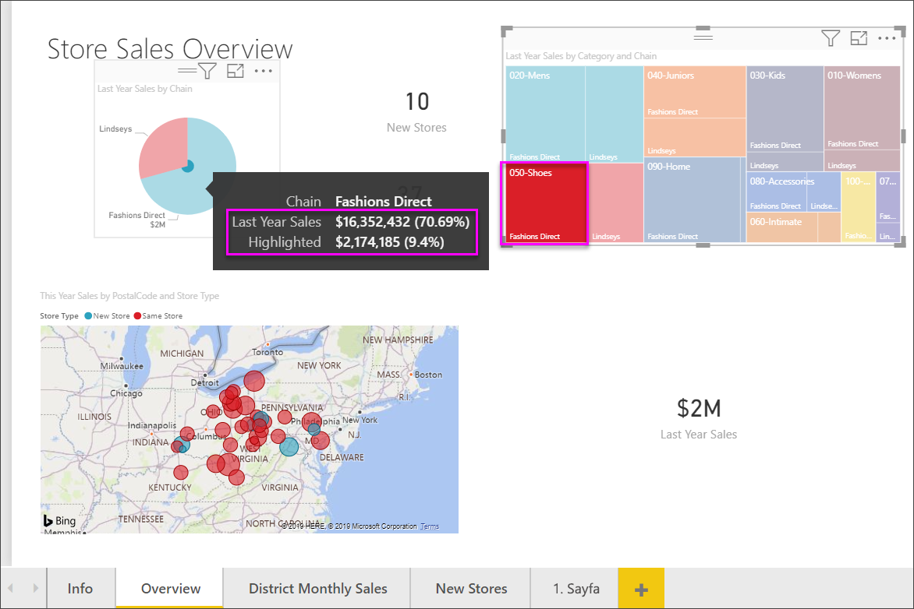

# Power BI'da ağaç haritaları
Ağaç haritaları, hiyerarşik verileri iç içe geçmiş dikdörtgenler kümesi şeklinde görüntüler.  Hiyerarşinin her düzeyi başka dikdörtgenler ("yapraklar") içeren renkli bir dikdörtgen (çoğunlukla "dal" olarak adlandırılır) ile gösterilir.  Her dikdörtgenin içindeki alan, ölçülmekte olan değere bağlıdır. Ayrıca dikdörtgenler, sol üstten (en büyük) sağ alta (en küçük) doğru boyutlarına göre düzenlenir.

Örneğin, satışlarımı çözümleyecek olursam şu giysi kategorileri için *dallar* olarak da adlandırılan üst düzey dikdörtgenlerim olabilir: **Urban**, **Rural**, **Youth** ve **Mix**.  Kategori dikdörtgenlerim, o kategorideki giysi üreticileri için *yapraklar* olarak da adlandırılan daha küçük dikdörtgenlere ayrılır. Ayrıca bu küçük dikdörtgenler, satılan sayıya göre boyutlandırılır ve gölgelendirilir.  

Yukarıdaki **Urban** dalında çok sayıda `Maximus` giysisi satılmış, daha az miktarda `Natura` ve `Fama`, çok az da `Leo` satılmıştır.  Bu nedenle, Ağaç Haritamın **Urban** dalı:
* sol üst köşedeki `Maximus` için en büyük dikdörtgeni içerecektir
* `Natura` ve `Fama` için biraz daha küçük dikdörtgenler içerecektir
* satılan diğer tüm giysiler için diğer dikdörtgenler yer alacak 
* ve `Leo` için de küçük bir dikdörtgen yer alacaktır.  

Ayrıca her bir yaprak düğümünün boyutunu ve gölgelendirmesini kıyaslayarak, diğer giysi kategorilerinde satılan öğe sayısı ile karşılaştırma yapabilirim; dikdörtgenler ne kadar büyük ve koyu olursa değer o kadar yüksek olur.

## Ağaç haritası ne zaman kullanılır?
Ağaç haritaları aşağıdaki durumlarda kullanım için mükemmel seçimdir:

* büyük miktarlarda hiyerarşik veri görüntüleme.
* çubuk grafik, yüksek miktarlardaki değerleri etkili bir şekilde işleyemediğinde.
* her bir parça ve bütün arasındaki oranları gösterme.
* hiyerarşideki kategorilerin her bir düzeyinde ölçü dağılımının desenini gösterme.
* boyut ve renk kodlaması kullanarak öznitelikleri gösterme.
* desenleri, aykırı değerleri, en önemli katkıda bulunanları ve istisnaları bulma.

### Önkoşullar
 - Power BI hizmeti veya Power BI Desktop
 - Perakende Analizi örneği

## Basit bir ağaç haritası oluşturma
Önce, ağaç haritası oluşturma işleminin gösterildiği bir videoyu izlemek ister misiniz?  Bu videoda 2:10'a atlayarak Amanda'nın ağaç haritası oluşturmasını izleyin.

<iframe width="560" height="315" src="https://www.youtube.com/embed/IkJda4O7oGs" frameborder="0" allowfullscreen></iframe>

Alternatif olarak kendi ağaç haritanızı da oluşturabilirsiniz. Bu yönergelerde Perakende Analizi Örneği kullanılmaktadır. Örneği takip etmek için Power BI hizmetinde oturum açıp **Veri Al \> Örnekler \> Perakende Analizi Örneği \> Bağlan \> Panoya git** seçeneklerini belirleyin. Bir raporda görsel öğe oluşturmak için veri kümesinde ve raporda düzenleme izinleri gerekir. Neyse ki, Power BI örnekleri düzenlenebilir. Ancak birisinin sizinle paylaştığı bir rapora görselleştirmeler ekleyemezsiniz.  

1. Perakende Analizi örnek raporunu açmak için "Toplam depo" kutucuğunu seçin.    
2. [Düzenleme Görünümü](../service-interact-with-a-report-in-editing-view.md)’nü açın ve **Satışlar** > **Geçen Yılın Satışları** ölçüsünü seçin.   
      
3. Grafiği ağaç haritasına dönüştürün.  
      
4. **Grup** kutusuna **Item** > **Category** alanlarını sürükleyin. Power BI, dikdörtgen boyutunun toplam satışı temel aldığı, rengin ise kategoriyi gösterdiği bir ağaç haritası oluşturur.  Temelde, toplam satışın kategoriye göre boyutunu görsel olarak açıklayan bir hiyerarşi oluşturdunuz.  **Men's** kategorisi en yüksek satışa sahipken **Hosiery** kategorisi en düşük satışlara sahiptir.   
      
5. Ağaç haritanızı tamamlamak için **Ayrıntılar**'a **Store** > **Chain** alanlarını sürükleyin. Artık geçen yılın satışlarını kategori ve zincire göre karşılaştırabilirsiniz.   
   
   
   > [!NOTE]
   > Renk doygunluğu ve Ayrıntılar aynı anda kullanılamaz.
   > 
   > 
5. **Category**'nin bu kısmı için araç ipucunu göstermek üzere bir **Chain** alanının üzerine gelin.  Örneğin, imleç **090-Home** dikdörtgeninde **Fashions Direct** üzerine getirildiğinde dikdörtgen, Home kategorisinin Fashions Direct bölümü için araç ipucunu görüntüler.  
   
6. [Ağaç haritasını bir pano kutucuğu olarak ekleyin (görseli sabitleyin)](../service-dashboard-tiles.md). 
7. [Raporu kaydedin](../service-report-save.md).

## Vurgulama ve çapraz filtreleme
Filtreler bölmesini kullanma hakkında bilgi için bkz. [Bir rapora filtre ekleme](../power-bi-report-add-filter.md).

Ağaç haritasında bir Kategori veya Ayrıntı vurgulandığında rapor sayfasındaki diğer görselleştirmeler çapraz filtrelenir. (Vurgulamayı değiştirerek farklı sonuçlar elde edebilirsiniz.) Örneği takip etmek için, bu rapor sayfasına bazı görseller ekleyin veya ağaç haritasını bu rapordaki diğer boş olmayan sayfalardan birine kopyalayın.

1. Ağaç haritasında, bir Category veya Category içinden bir Chain seçin.  Bu işlem ile sayfadaki diğer görselleştirmeler çapraz vurgulanır. Örneğin **050-Shoes** kategorisi seçildiğinde geçen yılki ayakkabı satışının 3.640.471 ABD doları olduğu ve bunun 2.174.185 ABD doları tutarındaki kısmının Fashions Direct'ten geldiği görülür.  
   

2. **Zincire göre Geçen Yılın Satışları** pasta grafiğinde, **Fashions Direct** dilimini seçtiğinizde ağaç haritası filtrelenir.  
       

3. Grafiklerin birbirini çapraz vurgulamasını ve çapraz filtrelemesini yönetmek için bkz. [Power BI raporlarındaki görselleştirme etkileşimleri](../service-reports-visual-interactions.md)

## Sonraki adımlar

[Power BI’daki şelale grafikler](power-bi-visualization-waterfall-charts.md)

[Power BI'daki görselleştirme türleri](power-bi-visualization-types-for-reports-and-q-and-a.md)