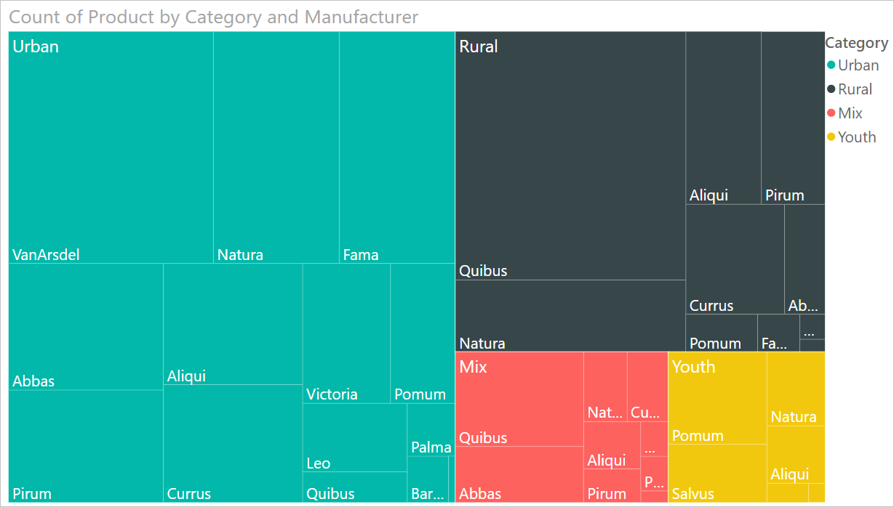
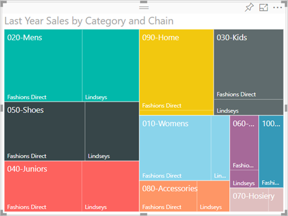

# Power BI'da ağaç haritaları

[!INCLUDE[consumer-appliesto-nyyn](../includes/consumer-appliesto-nyyn.md)]

[!INCLUDE [power-bi-visuals-desktop-banner](../includes/power-bi-visuals-desktop-banner.md)]

Ağaç haritaları, hiyerarşik verileri iç içe geçmiş dikdörtgenler kümesi şeklinde görüntüler. Hiyerarşinin her düzeyi daha küçük dikdörtgenler (yapraklar) içeren renkli bir dikdörtgen (dal) ile gösterilir. Power BI her dikdörtgenin içindeki alanı, ölçülen değeri temel alarak boyutlandırır. Dikdörtgenler, sol üstten (en büyük) sağ alta (en küçük) doğru boyutlarına göre yerleştirilir.

Örneğin, satışlarınızı analiz ediyorsanız giysi kategorisi için üst düzey dallarınız olabilir: **Urban**, **Rural**, **Youth** ve **Mix**. Power BI, bu kategorideki giysi üreticileri için kategori dikdörtgenlerinizi yapraklara ayırır. Bu yapraklar, satılan sayıya göre boyutlandırılır ve gölgelendirilir.

Yukarıdaki **Urban** dalında çok sayıda **VanArsdel** giysisi satılmış. Daha az **Natura** ve **Fama** satılmış. Yalnızca birkaç tane **Leo** satılmış. Bu nedenle Ağar Haritanızın **Urban** dalı şöyle görünür:

* Sol üst köşede en büyük **VanArsdel** dikdörtgeni.

* Biraz daha küçük **Natura** ve **Fama** dikdörtgenleri.

* Satılan diğer tüm giysileri temsil eden birçok başka dikdörtgen.

* **Leo** için küçük bir dikdörtgen.

Her yaprak düğümünün boyutunu ve gölgelendirmesini karşılaştırarak, diğer giysi kategorilerinde satılan öğe sayısı ile karşılaştırma yapabilirsiniz; dikdörtgenler ne kadar büyük ve koyu olursa değer o kadar yüksek olur.

## Ağaç haritası ne zaman kullanılır?

Ağaç haritaları aşağıdaki durumlarda kullanım için mükemmel seçimdir:

* Büyük miktarlarda hiyerarşik veri görüntüleme.

* Çubuk grafik, büyük miktarlardaki değerleri etkili bir şekilde işleyemediğinde.

* Her parça ve bütün arasındaki oranları gösterme.

* Hiyerarşideki kategorilerin her düzeyinde ölçü dağılımının desenini gösterme.

* Boyut ve renk kodlaması kullanarak öznitelikleri gösterme.

* Desenleri, aykırı değerleri, en önemli katkıda bulunanları ve istisnaları bulma.

## Önkoşul

Bu öğreticide [Perakende Analizi örneği .PBIX dosyası](https://download.microsoft.com/download/9/6/D/96DDC2FF-2568-491D-AAFA-AFDD6F763AE3/Retail%20Analysis%20Sample%20PBIX.pbix) kullanılmıştır.

1. Menü çubuğunun sol üst köşesinden **Dosya** > **Aç**’ı seçin
   
2. **Perakende Analizi örneği PBIX dosyasının** kopyasını bulun

1. **Perakende Analizi örneği PBIX dosyasını** rapor görünümünde  açın.

1. Seç  yeni bir sayfa ekleyin.

> [!NOTE]
> Raporunuzu bir Power BI iş arkadaşınızla paylaşmak için her ikinizin de bireysel Power BI Pro lisanslarınızın olması veya raporun Premium kapasitede depolanması gerekir.    

**Perakende Analizi Örneği** veri kümesini aldıktan sonra başlayabilirsiniz.

## Basit bir ağaç haritası oluşturma

Bir rapor oluşturacak ve basit bir ağaç haritası ekleyeceksiniz.

1. **Alanlar** bölmesinde **Sales** > **Last Year Sales** ölçüsünü seçin.

   

1. Ağaç haritası simgesini seçerek  grafiği ağaç haritasına dönüştürün.

   

1. **Öğe** > **Kategori**’yi seçerek **Kategori**’yi **Grup** kutusuna ekleyin.

    Power BI, dikdörtgen boyutunun toplam satışı temel aldığı, rengin ise kategoriyi gösterdiği bir ağaç haritası oluşturur. Temelde, toplam satışın kategoriye göre boyutunu görsel olarak açıklayan bir hiyerarşi oluşturdunuz. **Men's** kategorisi en yüksek satışa sahipken **Hosiery** kategorisi en düşük satışlara sahiptir.

    

1. Ağaç haritanızı tamamlamak için **Depolama** > **Zincir**’i seçerek **Zincir**’i **Ayrıntılar**’a ekleyin. Artık geçen yılın satışlarını kategori ve zincire göre karşılaştırabilirsiniz.

   

   > [!NOTE]
   > Renk doygunluğu ve Ayrıntılar aynı anda kullanılamaz.

1. **Category**'nin bu kısmı için araç ipucunu göstermek üzere bir **Chain** alanının üzerine gelin.

    Örneğin, imleç **090-Home** dikdörtgeninde **Fashions Direct** üzerine getirildiğinde dikdörtgen, Home kategorisinin Fashions Direct bölümü için araç ipucunu görüntüler.

   

## Vurgulama ve çapraz filtreleme

Ağaç haritasında bir **Kategori** veya **Ayrıntı** vurgulandığında rapor sayfasındaki diğer görselleştirmeler çapraz filtrelenir. Örneği takip etmek için, bu rapor sayfasına bazı görseller ekleyin veya ağaç haritasını bu rapordaki diğer sayfalardan birine kopyalayın. Aşağıdaki görüntüde ağaç haritası **Genel Bakış** sayfasına kopyalanmıştır. 

1. Ağaç haritasında, **Kategori** veya **Kategori**'nin içinden bir **Zincir** seçin. Bu işlem, sayfadaki diğer görselleştirmeleri çapraz vurgulayacaktır. Örneğin **050-Shoes** kategorisi seçildiğinde geçen yılki ayakkabı satışının **16.352.432 ABD doları** olduğu ve bunun **2.174.185 ABD doları** tutarındaki kısmının **Fashions Direct**’ten geldiği görülür.

   

1. **Zincire göre Geçen Yılın Satışları** pasta grafiğinde, **Fashions Direct** dilimini seçtiğinizde ağaç haritası filtrelenir.
   

1. Grafiklerin birbirini çapraz vurgulamasını ve çapraz filtrelemesini yönetmek için bkz. [Power BI raporunda görseller arasındaki etkileşimi değiştirme](../create-reports/service-reports-visual-interactions.md).

## Sonraki adımlar

* [Power BI’daki şelale grafikler](power-bi-visualization-waterfall-charts.md)

* [Power BI'daki görselleştirme türleri](power-bi-visualization-types-for-reports-and-q-and-a.md)

