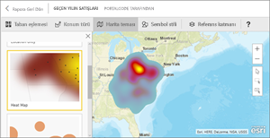
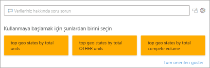
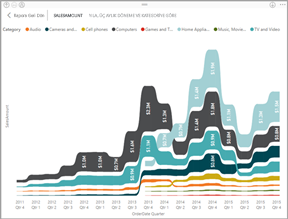
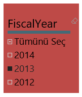
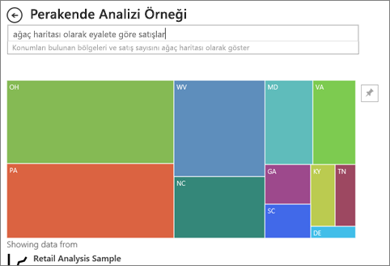

# Power BI'daki görselleştirme türleri
## Power BI görselleştirmeleri
Yeni görselleştirmeler ekleyeceğiz, takipte kalın!

İndirip pano ve raporlarınızda kullanabileceğiniz [özel görsellerin](../power-bi-custom-visuals.md) bulunduğu [Microsoft AppSource](https://appsource.microsoft.com/marketplace/apps?product=power-bi-visuals)'a göz atın. Buradaki listeye sürekli olarak yeni özel görseller eklenmektedir. Yaratıcılığınızı konuşturmak mı istiyorsunuz? [Kendi görsellerinizi oluşturmayı ve topluluk sitesine eklemeyi öğrenin](../developer/office-store.md).  

## Power BI'da kullanılabilen görselleştirmelerin listesi
Tüm bu görselleştirmeler Power BI raporlarına eklenebilir, Soru-Cevap'ta belirtilebilir ve panolara sabitlenebilir.

### Alan grafikleri: Basit (Katmanlı) ve Yığılmış

>[!TIP]
>Basit Alan grafiği için çizgi grafik temel alınır ve eksen ile çizgi arasındaki alan doldurulmuştur.

Daha fazla bilgi için bkz. [Temel Alan grafiği](power-bi-visualization-basic-area-chart.md).

### Çubuk grafikler ve sütun grafikleri

 

>[!TIP]
>Belirli bir değere farklı kategorilerde bakmak için standart olarak çubuk grafikler kullanılır.

### Kartlar: Çok satırlı

### Kartlar: Tek sayı

Daha fazla bilgi için bkz. [Kart (büyük sayı kutucuğu) oluşturma](power-bi-visualization-card.md).

### Birleşik haritalar

>[!TIP]
>Birleşik haritada sütun grafikleri ile çizgi grafikler birleştirilir. *Çizgi ve Yığılmış Sütun Grafiği* ile *Çizgi ve Kümelenmiş Sütun Grafiği* arasından seçim yapın.

Daha fazla bilgi için bkz. [Power BI'daki birleşik grafikler](power-bi-visualization-combo-chart.md).

### Halka grafikler

>[!TIP]
>Halka grafikler, Pasta grafiklerine benzerdir.  Parçaların bütünle ilişkisini gösterir.

Daha fazla bilgi için bkz. [Power BI'daki halka grafikler](power-bi-visualization-doughnut-charts.md).

### Huni grafikler

>[!TIP]
>Huniler, aşamalardan oluşan bir işlemin görselleştirilmesine yardımcı olur ve öğe akışı bir aşamadan diğerine sıralı olarak yapılır.  Aşamalar arasında sıralı bir akış olan durumlarda (müşteri adaylarıyla başlayıp satışı tamamlama ile sona eren bir satış işlemi gibi) huni kullanın.

Daha fazla bilgi için bkz. [Power BI'daki huni grafikler](power-bi-visualization-funnel-charts.md).

### Ölçek grafikleri

>[!TIP]
>Bir hedef bağlamında geçerli durumu görüntüler.

Daha fazla bilgi için bkz. [Power BI'daki ölçer grafikler](power-bi-visualization-radial-gauge-charts.md).

### Ana etmenler grafiği

Ana etmenler grafiği, seçili bir sonuç veya değere en çok katkıda bulunanları gösterir.

Daha fazla bilgi için bkz. [Power BI'daki ana etmen grafikleri](power-bi-visualization-influencers.md)

### KPI'ler

>[!TIP]
>Ölçülebilir bir hedef doğrultusunda ilerleme durumunu görüntüler.

Daha fazla bilgi için bkz. [Power BI'daki KPI’lar](power-bi-visualization-kpi.md).

### Çizgi grafikler

>[!TIP]
>Değerler dizisinin tümünün, genellikle zaman içindeki genel şeklini vurgular.

### Haritalar: Temel haritalar

>[!TIP]
>Hem kategorik hem de nicel bilgileri uzamsal konumlar ile ilişkilendirmek için kullanılır.

Daha fazla bilgi için bkz. [Harita görselleri için ipuçları ve püf noktaları](power-bi-map-tips-and-tricks.md).

### Haritalar: ArcGIS haritaları

Daha fazla bilgi için bkz. [Power BI'daki ArcGIS’lar](power-bi-visualization-arcgis.md).

### Haritalar: Kartogramlar (Koroplet)

>[!TIP]
>Renk ne kadar yoğunsa değer de o kadar büyüktür.

Daha fazla bilgi için bkz. [Power BI'daki Doldurulmuş Haritalar](power-bi-visualization-filled-maps-choropleths.md).

### Haritalar: Şekil haritaları

>[!TIP]
>Bölgeleri renge göre karşılaştırır.

Daha fazla bilgi için bkz. [Power BI'daki Şekil Haritaları](desktop-shape-map.md).

### Matris

>[!TIP]
>Tablo iki boyutu destekler ancak matris, çok boyutlu verileri daha anlamlı bir şekilde görüntülemeyi kolaylaştırır ve basamaklı düzeni destekler. Matris verileri otomatik olarak toplar ve detaya gitmeye olanak tanır. 

Daha fazla bilgi için bkz. [Power BI'daki matris görselleri](desktop-matrix-visual.md).

### Pasta grafikleri

>[!TIP]
>Pasta grafikleri parçaların bütünle ilişkisini gösterir. 

### Soru-Cevap görseli

>[!TIP]
>[Panolarda Soru-Cevap deneyimine](../power-bi-tutorial-q-and-a.md) benzer şekilde Soru-Cevap görselleri de doğal dili kullanarak verilerinizle ilgili sorular sormanıza olanak tanır. 

Daha fazla bilgi için bkz. [Power BI’daki Soru-Cevap görselleri](power-bi-visualization-q-and-a.md).

### R betik görselleri

>[!TIP]
>R betikleriyle oluşturulan ve genellikle *R görselleri* olarak adlandırılan görseller, R’ın zengin analizlerini ve görselleştirme gücünü kullanarak tahmin etme özelliği gibi gelişmiş veri şekillendirme özellikleri ve analizler sunabilir. R görselleri Power BI Desktop’ta oluşturularak Power BI hizmetine yayımlanabilir.   

Daha fazla bilgi için bkz. [Power BI’daki R görselleri](service-r-visuals.md).

### Şerit grafik

>[!TIP]
>Şerit grafikleri hangi veri kategorisinin en yüksek derecelendirmeye (en büyük değer) sahip olduğunu gösterir. Şerit grafikler, sıralama değişimini gösterme konusunda etkili bir araçtır; en yüksek sıra (değer) her bir zaman aralığı için her zaman en üstte görüntülenir.

Daha fazla bilgi için bkz. [Power BI’daki şerit grafikleri](desktop-ribbon-charts.md).

### Dağılım ve Kabarcık grafikleri

>[!TIP]
>2 (dağılım) veya 3 (kabarcık) nicel ölçü arasındaki ilişkileri (ilişki olup olmadığı, hangi sırada olduğu vb.) görüntüler.

Daha fazla bilgi için bkz. [Power BI'daki dağılım grafikleri](power-bi-visualization-scatter.md).

### Yüksek yoğunluklu dağılım

>[!TIP]
>Bir görsel üzerindeki çok fazla veri noktası o görseli çıkmaza sokabilir, bu nedenle görselleştirmenin doğruluğunu sağlamak için karmaşık bir örnekleme algoritması kullanılır.

Daha fazla bilgi için bkz. [Power BI'daki Yüksek Yoğunluklu Dağılım Grafikleri](desktop-high-density-scatter-charts.md).

### Dilimleyiciler

Daha fazla bilgi için bkz. [Power BI'daki dilimleyiciler](power-bi-visualization-slicers.md).

### Tek başına resimler

Daha fazla bilgi için bkz. [Panoya resim pencere öğesi ekleme](../service-dashboard-add-widget.md).

### Tablolar

>[!TIP]
>Birçok kategori içeren öğeler arasında nicel karşılaştırmalar yapılacağında kullanışlıdır.

Daha fazla bilgi için bkz. [Power BI'da tablolarla çalışma](power-bi-visualization-tables.md).

### Ağaç haritaları

Daha fazla bilgi için bkz. [Power BI'daki ağaç haritaları](power-bi-visualization-treemaps.md).

>[!TIP]
>Değerleri boyut aracılığıyla temsil eden renkli dikdörtgenlerden oluşan grafiklerdir.  Bu grafikler hiyerarşik (ana dikdörtgenlerde iç içe geçmiş dikdörtgenler halinde) olabilir.

### Şelale grafikler

>[!TIP]
>Şelale grafikler, değer eklenip çıkarıldığında değişen toplamı gösterir.

Daha fazla bilgi için bkz. [Power BI'daki şelale grafikleri](power-bi-visualization-waterfall-charts.md).

## Soru-Cevap özelliğinin hangi görselleştirmeleri kullanacağını belirtme
Power BI'ın Soru-Cevap özelliğini kullanarak doğal dil sorguları yazarken sorgunuzda görselleştirme türünü belirtebilirsiniz.  Örnek:

"***sales by state as a treemap***" (ağaç haritası olarak eyalete göre satışlar)

## Sonraki adımlar
[Power BI raporlarındaki görselleştirmeler](power-bi-report-visualizations.md)    
[Doğru görsel başvuruları ile ilgili sqlbi.com sayfası](http://www.sqlbi.com/wp-content/uploads/videotrainings/dashboarddesign/visuals-reference-may2017-A3.pdf)