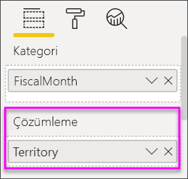

# Power BI'da şelale grafikler

[!INCLUDE [power-bi-visuals-desktop-banner](../includes/power-bi-visuals-desktop-banner.md)]

Şelale grafikleri, Power BI değer ekleyip çıkardıkça değişen toplamı gösterir. Bunlar, bir başlangıç değerinin (net gelir gibi) bir dizi pozitif ve negatif değişiklikten nasıl etkilendiğini anlamak için faydalıdır.

Artış ve azalmaları hızla fark edebilmeniz için sütunlar renk kodludur. Başlangıç değeri ve son değer sütunları genellikle [yatay eksende başlar](https://support.office.com/article/Create-a-waterfall-chart-in-Office-2016-for-Windows-8de1ece4-ff21-4d37-acd7-546f5527f185#BKMK_Float "yatay eksende başlat") ve ara değerler de yüzen sütunlar olarak görünür. Bu stil nedeniyle şelale grafikler köprü grafikleri olarak da adlandırılır.

   > [!NOTE]
   > Bu videoda Power BI Desktop’ın eski bir sürümü kullanılmaktadır.
   > 
   > 

<iframe width="560" height="315" src="https://www.youtube.com/embed/qKRZPBnaUXM" frameborder="0" allow="autoplay; encrypted-media" allowfullscreen></iframe>

## Şelale grafikler ne zaman kullanılır?

Şelale grafikler aşağıdaki durumlarda harika bir seçimdir:

* Zamanda, serilerde veya farklı kategorilerde ölçü değişikliği yaptığınızda.

* Toplam değere etki eden büyük değişiklikleri denetlemek için.

* Çeşitli gelir kaynaklarını göstererek şirketinizin yıllık kârının çizimini yapmak ve toplam kâra (veya zarara) ulaşmak için.

* Şirketinizin bir yılın başındaki ve sonundaki çalışan sayısını göstermek için.

* Her ay kazandığınız ve harcadığınız para tutarını ve hesabınızın değişen bakiyesini görselleştirmek için.

## Önkoşul

Bu öğreticide [Perakende Analizi örneği .PBIX dosyası](https://download.microsoft.com/download/9/6/D/96DDC2FF-2568-491D-AAFA-AFDD6F763AE3/Retail%20Analysis%20Sample%20PBIX.pbix) kullanılmıştır.

1. Menü çubuğunun sol üst köşesinden **Dosya** > **Aç**’ı seçin
   
2. **Perakende Analizi örneği PBIX dosyasının** kopyasını bulun

1. **Perakende Analizi örneği PBIX dosyasını** rapor görünümünde  açın.

1. Seç  yeni bir sayfa ekleyin.

## Bir şelale grafik oluşturma

Aya göre satış varyansını (tahmini satış ile gerçek satış karşılaştırması) görüntüleyen bir şelale grafik oluşturacaksınız.

### Şelale grafiği oluşturma

1. **Alanlar** bölmesinde **Sales**  > **Total Sales Variance** alanını seçin.

   

1. Şelale simgesini seçerek 

    

1. **Kategori** kutusuna eklemek üzere **Time** > **FiscalMonth** alanını seçin.

    

### Şelale grafiğini sıralama

1. Power BI’ın şelale grafiğini aya göre kronolojik olarak sıraladığından emin olun. Grafiğin sağ üst köşesinden **Diğer seçenekler** (...) düğmesini seçin.

    Bu örnek için **Sıralama ölçütü**'nü ve **FiscalMonth** öğesini seçin. Seçiminizin yanındaki sarı gösterge, belirttiğiniz seçeneğin ne zaman uygulandığını gösterir.

    
    
    Ayları kronolojik düzende görüntülemek için **Artan düzende sırala**'yı seçin. Önceki adımda olduğu gibi **Artan düzende sırala** seçeneğinin solunda sarı bir gösterge olup olmadığını kontrol edin. Bu, belirlediğiniz seçeneğin uygulandığını gösterir.

    

    

    Grafiğinizin FiscalMonth için Ocak'tan Ağustos'a kadar sıralandığına dikkat edin.  

### Şelale grafiğini keşfetme

Aydan aya değişikliklere en çok katkıda bulunan öğeleri görmek için biraz daha ayrıntıya inin.

1.  **Depolama** > **Bölge**’yi seçtiğinizde **Bölge**, **Döküm** demetine eklenir.

    

    Power BI görselleştirmeye başka veriler eklemek için **Döküm**'deki değeri kullanır. Her mali ay için artışa ve azalmaya en çok katkıda bulunan beş öğeyi ekler. Diğer bir deyişle şimdi Şubat ayının tek veri noktası yerine altı veri noktası vardır.  

    

    Sizi yalnızca en çok katkıda bulunan iki öğenin ilgilendirdiğini varsayalım.

1. **Biçim** bölmesinde **Kırılım**’ı seçin ve **En yüksek kırılım**’ı **2** olarak ayarlayın.

    

    Hızlı bir gözden geçirmeyle şelale grafiğinizde hem negatif hem de pozitif olarak harekete en çok katkıda bulunan bölgelerin Ohio ve Pennsylvania olduğunu görüyoruz.

    

## Sonraki adımlar

* [Power BI raporunda görsellerin etkileşim kurma biçimini değiştirme](../service-reports-visual-interactions.md)

* [Power BI'daki görselleştirme türleri](power-bi-visualization-types-for-reports-and-q-and-a.md)
