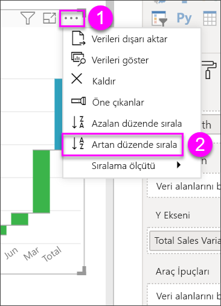

# Power BI'da şelale grafikler
Şelale grafikler, değerler eklenirken veya çıkarılırken değişen toplamı gösterir. Bir başlangıç değerinin (örneğin, net gelir) bir dizi pozitif ve negatif değişiklikten nasıl etkilendiğini anlamak için faydalıdır.

Artış ve azalışları hızlıca görebilmeniz için sütunlar renk kodludur. Başlangıç değeri ve son değer sütunları genellikle [yatay eksende başlar](https://support.office.com/article/Create-a-waterfall-chart-in-Office-2016-for-Windows-8de1ece4-ff21-4d37-acd7-546f5527f185#BKMK_Float "start on the horizontal axis") ve ara değerler, yüzen sütun şeklinde görünür. Bu "görünüm" nedeniyle şelale grafikler köprü grafikleri olarak da adlandırılır.

<iframe width="560" height="315" src="https://www.youtube.com/embed/qKRZPBnaUXM" frameborder="0" allow="autoplay; encrypted-media" allowfullscreen></iframe>

## Şelale grafikler ne zaman kullanılır?
Şelale grafikler aşağıdaki durumlarda harika bir seçimdir:

* zaman serilerinde veya farklı kategorilerde ölçü değişikliği yaptığınızda
* toplam değere etki eden büyük değişiklikleri denetlemek için
* çeşitli gelir kaynaklarını göstererek şirketinizin yıllık kârının çizimini yapmak ve toplam kâra (veya zarara) ulaşmak için.
* şirketinizin bir yılın başındaki ve sonundaki çalışan sayısını göstermek için
* her ay kazandığınız ve harcadığınız para tutarını ve hesabınızın değişen bakiyesini görselleştirmek için. 

## Bir şelale grafik oluşturma
Aya göre satış varyansını (tahmini satış ile gerçek satış karşılaştırması) görüntüleyen bir şelale grafik oluşturacağız. Birlikte ilerlemek için Power BI'da oturum açın ve **Veril Al \> Örnekler \> Perakende Analizi Örneği**'ni seçin. 

1. **Veri Kümeleri** sekmesini seçin ve yeni "Retail Analysis Sample" veri kümesine gidin.  Veri kümesini rapor düzenleme görünümünde açmak için **Rapor oluştur** simgesini seçin. 
   
    
2. **Alanlar** bölmesinde, **Sales \> Total Sales Variance** seçeneğini belirleyin. 
3. Grafiği bir **Şelale**'ye dönüştürün. **Total Sales Variance** **Y Ekseni**'nde değilse bu eksene sürükleyin.
   
    
4. **Kategori** kutusuna eklemek üzere **Time** \> **FiscalMonth** alanını seçin. 
   
    
5. Şelale grafiği kronolojik olarak sıralayın. Grafiğin sağ üst köşesinden üç nokta (...) simgesini seçin ve **FiscalMonth** seçeneğini belirleyin.
   
    
   
    
6. Aydan aya değişikliklere en çok katkıda bulunan öğeleri görmek için biraz daha ayrıntıya inin. **Store** > **Territory** alanını **Kırılım** demetine sürükleyin.
   
    
7. Varsayılan olarak, Power BI aya göre artış ve azalışa en çok katkıda bulunan 5 öğeyi ekler. Ancak biz yalnızca en çok katkıda bulunan 2 öğeyle ilgileniyoruz.  Biçimlendirme bölmesinde **Kırılım**'ı seçin ve **En yüksek çözümlemeler** ayarını 2 olarak belirleyin.
   
    
   
    Hızlı bir gözden geçirmeyle şelale grafiğimizde negatif ve pozitif olarak harekete en çok katkıda bulunan bölgelerin Ohio ve Pennsylvania olduğunu görüyoruz. 
   
    
8. Bu ilgi çekici bir bulgu. Ohio ve Pennsylvania, bu 2 bölgedeki satışlar diğer bölgelere göre çok daha yüksek olduğu için mi böyle büyük bir etkiye sahip?  Bunu kontrol edebiliriz. Bu yılki satış değerini ve geçen yılki satışları bölgeye göre inceleyen bir harita oluşturun.  
   
    
   
    Haritamız teorimizi destekler niteliktedir.  Harita, bu 2 bölgenin, geçen yıl (kabarcık boyutu) ve bu yılın en yüksek satış değerlerine sahip olduğunu göstermektedir.

## Vurgulama ve çapraz filtreleme
Filtreler bölmesini kullanma hakkında bilgi için bkz. [Bir rapora filtre ekleme](../power-bi-report-add-filter.md).

Bir şelale grafikte sütunların vurgulanması, rapor sayfasındaki diğer görselleştirmelerde çapraz filtre uygular. (Vurgulamayı değiştirerek farklı sonuçlar elde edebilirsiniz.) Ancak, Total sütunu vurgulamayı tetiklemez veya çapraz filtrelemeye yanıt vermez.

## Sonraki adımlar

[Görsel etkileşimler](../service-reports-visual-interactions.md)

[Power BI'daki görselleştirme türleri](power-bi-visualization-types-for-reports-and-q-and-a.md)