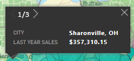
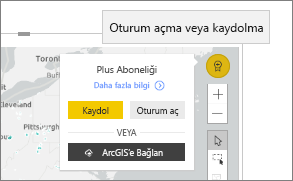

# Power BI'da ArcGIS haritaları ile etkileşim kurma
Bu konu başlığı, ArcGIS haritasını Power BI hizmeti, Desktop veya mobil sürümünde kullanan bir kişinin bakış açısından yazılmıştır. Tasarımcı sizinle bir ArcGIS Maps for Power BI görseli paylaştığında, görselle etkileşime geçmek için pek çok yol bulunur.  ArcGIS haritası oluşturma hakkında daha fazla bilgi edinmek için [Esri tarafından sunulan ArcGIS haritaları öğreticisine](../visuals/power-bi-visualization-arcgis.md) bakın.

ArcGIS haritaları ile Power BI birlikte kullanıldığında eşleme deneyimi, haritada belirli noktaları göstermenin ötesinde yepyeni bir boyut kazanıyor. Rapor tasarımcıları bir harita ile başlar ve bu haritaya demografik veri katmanları ekler. Uzamsal analiz içeren bir haritadaki bu konum tabanlı veri katmanlarının (nüfus sayımı verileri gibi) birleşimi, görselleştirmelerinizdeki verilerin daha derinlemesine anlaşılmasını sağlar.

> [!TIP]
> GIS, Coğrafi Bilgi Sistemi anlamına gelir.
> 

Bu ArcGIS Maps for Power BI görseli, şehre göre son yılın satışlarını gösterir ve bir sokak tabanlı harita ile ortalama hane halkı geliri başvuru katmanını kullanır. Harita, iki raptiye (kırmızı ve sarı) ve bir sürüş süresi yarıçapı (mor renkte) içerir.

> [!TIP]
> Birçok örneğe göz atmak ve referansları okumak için [Esri'nin Power BI sayfasını](https://www.esri.com/powerbi) ziyaret edin. Ardından Esri'nin [ArcGIS Maps for Power BI ile Çalışmaya Başlama sayfasına](https://doc.arcgis.com/en/maps-for-powerbi/get-started/about-maps-for-power-bi.htm) bakın.
> 
> 

## Kullanıcı onayı

Bir iş arkadaşınız sizinle ilk defa ArcGIS haritası paylaştığında Power BI, ekranda bir onay istemi görüntüler. ArcGIS Maps for Power BI, Esri (https://www.esri.com) ) tarafından sağlanmakta olup ArcGIS Maps for Power BI kullanımınız Esri'nin koşulları ve gizlilik ilkesine tabidir. ArcGIS Maps for Power BI görsellerini kullanmak isteyen Power BI kullanıcılarının onay iletişim kutusunu kabul etmesi gerekir.

## Katmanları anlama

Bir ArcGIS Maps for Power BI görselinde birçok farklı türde demografik konum bilgileri katmanları olabilir.

### Temel haritalar

Her ArcGIS Maps for Power BI görseli bir temel harita ile başlar. Temel haritaları verilerin tuvali olarak düşünün. Temel harita, temel bir koyu veya açık tuval,

 

ya da sokak ve ulaşım ayrıntısı içeren bir tuval olabilir. 

  

Temel harita, tamamen tuvale uygulanır. Kaydırıp yakınlaştırdıkça harita güncelleştirilir. Daha ayrıntılı sokak ve ulaşım bilgilerini görmek için yakınlaştırın. Bir kıtadan diğerine kaydırdığınızda ayrıntı düzeyi sabit kalır. Burada Porto’dan Pekin’e kaydırdığımızı görebilirsiniz.

  

### Başvuru katmanları

Rapor *tasarımcısı* bir başvuru katmanı ekleyebilir. Başvuru katmanları Esri tarafından barındırılır ve bir konum hakkında ek bir demografik bilgi katmanı sağlar. Aşağıdaki örnekte, nüfus yoğunluğuna ilişkin bir başvuru katmanı bulunur. Daha koyu renkler daha yüksek yoğunluğu temsil eder.

  

### Bilgi Grafikleri

Rapor *tasarımcısı* birçok bilgi grafikleri katmanı ekleyebilir. Bilgi grafikleri, görsel tuvalin sağ tarafında görüntülenen hızlı görsel göstergelerdir. Bilgi grafikleri Esri tarafından barındırılır ve bir konum hakkında ek bir demografik bilgi katmanı sağlar. Aşağıdaki örnekte üç bilgi grafiği uygulanmıştır. Bunlar haritanın kendisi yerine kartlarda görüntülenir. Bilgi grafiği kartları, haritada yakınlaştırma, kaydırma ve alan seçimi yaptığınızda güncelleştirilir.

  

### Raptiye

Raptiyeler, şehir veya adres gibi kesin konumları temsil eder. Bazen rapor *tasarımcıları* raptiyeleri sürüş süresi yarıçapı ile kullanır. Bu örnekte Charlotte, Kuzey Carolina’nın 50 millik yarıçapı içindeki mağazalar gösterilmektedir.

 

## ArcGIS Maps for Power BI görseliyle etkileşim kurma
Kullanabileceğiniz özellikler, raporun sizinle nasıl paylaşıldığına ve Power BI hesabınızın türüne bağlıdır. Sorularınız varsa sistem yöneticinize başvurun. ArcGIS Maps for Power BI görselleri, bir rapordaki diğer görsellere çok benzer şekilde davranır. [Görselleştirme oluşturmak için kullanılan verileri gösterebilme](../consumer/end-user-show-data.md), haritayı [Odak modunda ve tam ekran modunda](../consumer/end-user-focus.md) görebilme, [açıklama ekleyebilme](../consumer/end-user-comment.md), rapor *tasarımcısı* tarafından ayarlanan [filtrelerle etkileşime girebilme](../consumer/end-user-report-filter.md) ve daha fazlasını yapabilme olanağı elde edersiniz. ArcGIS görselleri, rapor sayfasındaki diğer görselleri çapraz filtreleyip bunun tersini de yapabilir.

Araç ipuçlarını görüntülemek için temel harita konumlarının (örneğin bir balonun) üzerine gelin. Ayrıca, ek araç ipuçlarını görüntülemek ve temel haritada ya da başvuru katmanında belirli seçimler yapmak için ArcGIS görsel seçim araçlarını kullanın.  

### Seçim araçları

ArcGIS Maps for Power BI beş seçim modu sunar. Aynı anda en fazla 250 veri noktası seçilebilir.

#### Tek seçim aracı

 

Başvuru katmanından bir veri noktası, balon, raptiye veya tek bir veri noktası seçin. Power BI, seçiminizle ilgili ayrıntıların bulunduğu bir araç ipucu görüntüler. Tek seçim, seçiminize göre rapor sayfasındaki diğer görsellere çapraz filtre uygular ve seçilen alan için bilgi grafiği kartlarını güncelleştirir. 

Burada temel haritamızdan kahverengi bir balon veri noktası seçtik. Power BI:
- seçimimizi vurgular,
- ilgili veri noktası için bir araç ipucu görüntüler, 
- bilgi grafiği kartlarını yalnızca seçimimize ilişkin verileri görüntüleyecek şekilde güncelleştirir ve
- sütun grafiğini çapraz olarak vurgular.

Haritada başvuru katmanı varsa, konum seçtiğinizde bir araç ipucunda ayrıntılar görüntülenir. Burada Seneca İlçesi’ni seçerek rapor *tasarımcısının* haritaya eklediği başvuru katmanındaki (nüfus yoğunluğu) verileri görebiliyoruz. Bu örnekte veri noktamız iki farklı ilçe içerdiğinden araç ipucumuzda iki sayfa bulunuyor. Her sayfada bir grafik bulunur. Ek ayrıntıları görüntülemek için grafikte bir çubuk seçin. 

> [!TIP]
  > Bazen belirli bir konum seçmek için yakınlaştırarak araç ipucu sayfalarının sayısını azaltabilirsiniz.  Diğer durumlarda, çakışan konumlar söz konusuysa Power BI size bir seferde 1 adetten fazla araç ipucu sunabilir. Araç ipuçları arasında hareket etmek için okları seçin
  > 
  > 

#### Çoklu seçim aracı

 

Harita üzerinde bir dikdörtgen çizer ve içerdiği veri noktalarını seçer. Birden fazla dikdörtgen alan seçmek için CTRL tuşunu kullanın. Çoklu seçim, seçilen alan için bilgi grafiği kartlarını güncelleştirir ve seçiminize göre rapor sayfasındaki diğer görsellere çapraz vurgulama yapar.

 

#### Başvuru katmanı aracı

 

Referans katmanlarındaki sınırların veya çokgenlerin, kapsanan veri noktalarının seçilmesi için kullanılmasına olanak sağlar. Görmekte zorluk çekebilirsiniz ancak başvuru katmanında sarı bir ana hat bulunuyor. Tek seçim aracından farklı olarak, bir araç ipucu almıyoruz. Bunun yerine, bu ana hattın kenarları içinde yer alan herhangi bir veri noktasıyla ilgili verileri alırız. Bu örnekte, seçimimiz Winston Salem’deki Lindseys mağazasına ait bir veri noktası içeriyor.

 

#### Arabellek aracı

 

Arabellek katmanını kullanarak veri noktalarının seçimine olanak sağlar. Örneğin, bu aracı kullanarak bir sürüş süresi yarıçapı seçin ve raporun geri kalanı ile etkileşime girin. Sürüş süresi yarıçapı etkin kalır ve bilgi grafiği kartları sürüş süresi yarıçapını yansıtmaya devam eder, ancak haritadaki diğer veri noktalarının seçilmesi, rapor sayfasındaki diğer görsellere çapraz filtre uygular.

 

#### Benzerini Bul aracı

 

Benzer özniteliklere sahip konumları bulmanıza olanak tanır. Analiz içinde kullanmak istediğiniz en fazla beş boyut tanımlamak üzere bir veya daha fazla ilgi çekici nokta ya da başvuru konumu seçerek başlarsınız. Benzerini Bul, haritanızdaki tanımladığınız başvuru konumlarına en çok benzeyen 10 konumu hesaplar. Daha sonra sonuçlarınızın her birine ilişkin demografi hakkında daha fazla bilgi edinmek için bilgi grafiği kartlarını kullanabilir, bu konumların her birinin sürüş mesafesinde bulunan yerleri anlamak üzere sürüş süresi alanları oluşturabilir veya raporunuzu filtreleyip daha fazla içgörü elde etmek için Benzerini Bul aracını bile kullanabilirsiniz. En önemlisi, tüm hesaplamalar makinenizde yerel olarak yapılır, bu nedenle gizli verilerinizin korunduğundan emin olabilirsiniz.

## Önemli Noktalar ve Sınırlamalar
ArcGIS Maps for Power BI aşağıdaki hizmetlerde ve uygulamalarda kullanılabilir:

|Hizmet/Uygulama  |Kullanılabilirlik  |
|---------|---------|
|Power BI Desktop     |     Evet    |
|Power BI hizmeti (app.powerbi.com)     |    Evet     |
|Power BI mobil uygulamaları     |  Evet      |
|Power BI - web'de yayımlama     |  Hayır       |
|Power BI Embedded     |     Hayır    |
|Power BI hizmeti - ekleme (PowerBI.com)  | Hayır |

## ArcGIS Maps for Power BI birlikte nasıl çalışır?
ArcGIS Maps for Power BI, Esri (https://www.esri.com) ) tarafından sağlanmaktadır. ArcGIS Maps for Power BI kullanımınız Esri'nin [koşullarına](https://go.microsoft.com/fwlink/?LinkID=8263222) ve [gizlilik ilkesine](https://go.microsoft.com/fwlink/?LinkID=826323) tabidir. ArcGIS Maps for Power BI görsellerini kullanmak isteyen Power BI kullanıcılarının, onay iletişim kutusunu kabul etmesi gerekir (ayrıntılı bilgi için bkz. Kullanıcı Onayı).  Esri tarafından sağlanan ArcGIS Maps for Power BI’ın kullanımı, Esri’nin Koşullarına ve Gizlilik İlkesine tabidir. Bunların bağlantıları, onay iletişim kutusunda da belirtilir. Her kullanıcı ArcGIS Maps for Power BI’ı ilk kez kullanmadan önce onay vermelidir. Kullanıcı, onayı kabul ettikten sonra görsele bağlı veriler en azından coğrafi kodlama (konum bilgilerini bir haritada gösterilebilen enlem ve boylam bilgilerine dönüştürme) için Esri’nin hizmetlerine gönderilir. Veri görselleştirmesine bağlı tüm verilerin Esri’nin hizmetlerine gönderilebildiğini varsaymanız gerekir. Esri; altlık haritalar, uzamsal analiz ve coğrafi kodlama gibi hizmetler sunar. ArcGIS Maps for Power BI görseli, sağlanan bir sertifika ile korunan ve Esri tarafından bakımı yapılan bir SSL bağlantısını kullanarak bu hizmetlerle etkileşime geçer. ArcGIS Maps for Power BI hakkında ek bilgilere Esri’nin [ArcGIS Maps for Power BI ürün sayfasından](https://www.esri.com/powerbi) ulaşılabilir.

### Power BI Plus

Bir kullanıcı, ArcGIS Maps for Power BI aracılığıyla Esri tarafından sunulan bir Plus aboneliğine kaydolduğunda Esri ile doğrudan bir ilişki içine girer. Power BI, Esri’ye kullanıcı hakkındaki kişisel bilgileri göndermez. Kullanıcı, kendi AAD kimliğini kullanarak, Esri tarafından sağlanan bir AAD uygulamasında oturum açar ve bu uygulamaya güvenir. Kullanıcı bunu yaparak kendi kişisel bilgilerini doğrudan Esri ile paylaşmış olur. Kullanıcı, bir ArcGIS Maps for Power BI görseline Plus içeriği ekledikten sonra bu görseli görüntülemek veya düzenlemek isteyen iş arkadaşlarınız da Esri’nin Plus aboneliğine ihtiyaç duyar. 

Esri tarafından sağlanan ArcGIS Maps for Power BI’ın nasıl çalıştığıyla ilgili teknik ayrıntılar içeren sorular için Esri’ye destek sitesi üzerinden ulaşın.

## Önemli noktalar ve sorun giderme

**ArcGIS haritası görüntülenmiyor**    
ArcGIS Maps for Power BI'ın kullanılamadığı hizmet veya uygulamalarda ilgili görselleştirme, Power BI logosu içeren boş bir görsel olarak gösterilir.

**Tüm bilgilerimi haritada göremiyorum**    
Haritada enlem/boylam değerleri için coğrafi kodlama yapıldığında en fazla 30.000 veri noktası görüntülenir. Posta kodları veya sokak adresleri gibi veri noktaları için coğrafi kodlama yaparken yalnızca ilk 15.000 veri noktası için coğrafi kodlama yapılır. Yer adlarına veya ülkelere yönelik coğrafi kodlama, 1500 adres sınırına tabi değildir.

**ArcGIS Maps for Power BI kullanımı için herhangi bir ücret ödenir mi?**

Tüm Power BI kullanıcıları, ArcGIS Maps for Power BI'ı hiçbir ek ücret ödemeden kullanılabilir. Bu, **Esri** tarafından sağlanan bir bileşendir ve bu makalede daha önce belirtildiği üzere, kullanımınız **Esri** tarafından sağlanan koşullara ve gizlilik ilkesine tabidir. ArcGIS **Plus** aboneliği ücretlidir.

**Önbelleğimin dolu olduğu hakkında bir hata iletisi alıyorum**

Bu davranış bir hatadır ve üzerinde çalışılmaktadır.  Çözüm sunulana kadar Power BI önbelleğini temizlemeye yönelik talimatlar için hata iletisinde görüntülenen bağlantıyı seçin.

**ArcGIS haritalarımı çevrimdışı görüntüleyebilir miyim?**

Hayır, Power BI'ın haritaları görüntülemesi için ağ bağlantısı gerekir.

## Sonraki adımlar
Yardım alma: **Esri**, **ArcGIS Maps for Power BI**'ın özellikleri hakkında [kapsamlı belgeler](https://go.microsoft.com/fwlink/?LinkID=828772) sağlamaktadır.

Power BI [topluluğunun **ArcGIS Maps for Power BI**'a yönelik tartışma sayfasında](https://go.microsoft.com/fwlink/?LinkID=828771) soru sorabilir, en güncel bilgilere ulaşabilir, sorunları bildirebilir ve sorularınıza cevap bulabilirsiniz.

[ArcGIS Maps for Power BI ürün sayfası](https://www.esri.com/powerbi)
