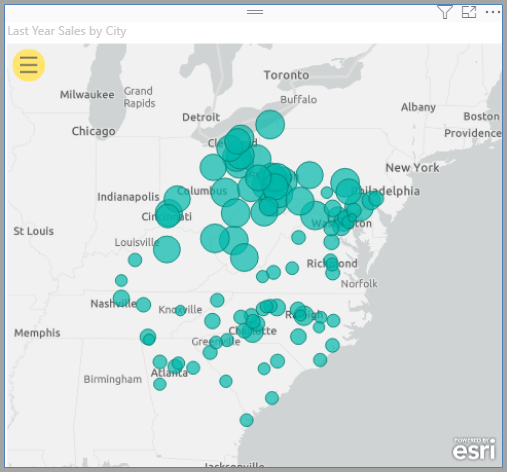

# Power BI'da ArcGIS haritaları oluşturma

[!INCLUDE[consumer-appliesto-yyyn](../includes/consumer-appliesto-yyyn.md)]    

> [!NOTE]
> Bu görseller hem Power BI Desktop hem de Power BI hizmetinde oluşturulup görüntülenebilir. Bu makaledeki adımlar ve gösterimler Power BI Desktop’tan alınmıştır.

Bu genel bakış, Power BI için ArcGIS Haritası oluşturan bir kişinin bakış açısından yazılmıştır. Bir _tasarımcı_ bir iş arkadaşıyla Power BI için ArcGIS Haritası paylaştıktan sonra, iş arkadaşı haritayı görüntüleyebilir ve haritayla etkileşim kurabilir ancak değişiklikleri kaydedemez. ArcGIS haritasını görüntüleme hakkında daha fazla bilgi için bkz. [ArcGIS Maps for Power BI'ı keşfetme](https://doc.arcgis.com/en/maps-for-powerbi/use/explore-maps.htm).

ArcGIS haritaları ile Power BI birlikte kullanıldığında eşleme deneyimi, haritada belirli noktaları göstermenin ötesinde yepyeni bir boyut kazanıyor. Harika, bilgilendirici harita görselleştirmeleri oluşturmak için altlık haritalar, konum türleri, temalar, sembol stilleri ve başvuru katmanları arasından seçiminizi yapın. Haritalarda yetkilendirmeli veri katmanlarıyla uzamsal çözümlemenin bir arada kullanılması, görselleştirmenizdeki verilerin daha kapsamlı şekilde anlaşılmasını sağlar. Mobil cihazlarda ArcGIS Maps for Power BI haritası oluşturamazsınız ancak haritaları görüntüleyebilir ve bunlarla etkileşim kurabilirsiniz.

> [!NOTE]
> ArcGIS Maps for Power BI şu anda Power BI Rapor Sunucusu için kullanılamaz.

> [!TIP]
> GIS, Coğrafi Bilgi Sistemleri anlamına gelir.

Aşağıdaki örnekte, 2016 yılına ait ortanca harcanabilir gelir demografik katmanındaki bölgesel satışların yoğunluk haritası yoluyla gösterilmesi için koyu gri bir tuval kullanılmıştır. Okumaya devam ettikçe fark edeceğiniz üzere, ArcGIS Maps for Power BI kullandığınızda hikayenizi en iyi şekilde anlatabilmeniz için gelişmiş eşleme özelliği, demografik bilgiler ve çok daha ilgili çekici harita görselleştirmeleri elde edersiniz.

> [!TIP]
> Birçok örneğe göz atmak ve referansları okumak için [**Esri'nin ArcGIS Maps for Power BI sayfasını**](https://www.esri.com/powerbi) ziyaret edin. Ayrıca Esri'nin **[ArcGIS Maps for Power BI çevrimiçi](https://doc.arcgis.com/en/maps-for-powerbi/get-started/about-maps-for-power-bi.htm) yardım** sayfasını görüntüleyin.

## Kullanıcı onayı

ArcGIS Maps for Power BI, Esri ([https://www.esri.com](https://www.esri.com/)) tarafından sağlanmaktadır. ArcGIS Maps for Power BI kullanımınız Esri'nin [koşullarına](https://go.microsoft.com/fwlink/?LinkID=826322) ve [gizlilik ilkesine](https://go.microsoft.com/fwlink/?LinkID=826323) tabidir. ArcGIS Maps for Power BI görsellerini kullanmak isteyen Power BI kullanıcılarının, onay iletişim kutusunu kabul etmesi gerekir. Bu iletişim kutusu yalnızca ArcGIS Maps for Power BI'ı ilk kez kullandığınızda görüntülenir.

## Önkoşullar

Bu öğreticide Power BI Desktop ve PBIX [Perakende Analizi örneği](https://download.microsoft.com/download/9/6/D/96DDC2FF-2568-491D-AAFA-AFDD6F763AE3/Retail%20Analysis%20Sample%20PBIX.pbix) kullanılmıştır. ArcGIS Maps for Power BI, Power BI hizmeti kullanılarak da oluşturulabilir.

1. Menü çubuğunun sol üst kısmından **Dosya** > **Rapor aç** 'ı seçin.
2. Yerel makinenizde kayıtlı **Perakende Analizi örneği PBIX dosyasını** bulun.
3. **Perakende Analizi Örneği](media/power-bi-visualizations-arcgis/arcgis-tutorial-icon-01.png)'ni rapor görünümünde** Rapor görünümü simgesi seçerek rapora yeni bir sayfa ekleyin.

## ArcGIS Maps for Power BI harita görselleştirmesi oluşturma

Rapora harita eklemek için şu adımları izleyin:

1. Görselleştirmeler bölmesinde ArcGIS Maps for Power BI simgesini seçin.

    

2. Power BI, rapor tuvaline boş bir şablon ekler. Bu genel bakışta Power BI'da bulunan **Standart** sürümü kullanacağız. Uygun lisanslara sahip geçerli bir ArGIS hesabında oturum açarsanız daha fazla özelliğe erişebilirsiniz. Ayrıntılar için [ArcGIS Maps for Power BI çevrimiçi yardım sayfasını](https://doc.arcgis.com/en/maps-for-powerbi/get-started/account-types.htm) inceleyin.

    

3. **Alanlar** bölmesindeki veri alanlarından birini **Konum** alanına sürükleyin veya koordinatları uygun **Enlem** ve/veya **Boylam** kutularına sürükleyin. Biz bu örnekte **Store > City** seçeneğini kullanıyoruz.

    > [!NOTE]
    > ArcGIS Maps for Power BI, seçtiğiniz alanların haritada şekil mi yoksa nokta olarak mı en iyi şekilde görüntüleneceğini otomatik olarak algılar. Varsayılan değeri ayarlardan değiştirebilirsiniz (bkz. [ArcGIS Maps for Power BI görselleştirmesini biçimlendirme](#format-the-arcgis-maps-for-power-bi-visualization)).

    

4. Verilerin gösterilme biçimini ayarlamak için **Alanlar** bölmesinden bir ölçüyü **Boyut** demetine sürükleyin. Biz bu örnekte **Sales > Last Year Sales** seçeneğini kullanıyoruz.

    

Power BI için ilk ArcGIS Haritanızı oluşturdunuz. Şimdi de temel haritalar, konum türleri, temalar ve daha fazlasını kullanarak haritamızı iyileştirip biçimlendirelim.

## ArcGIS Maps for Power BI görselleştirmesini biçimlendirme

**ArcGIS Maps for Power BI** biçimlendirme özelliklerine erişmek için:

1. Görselleştirmeler bölmesinde **Biçim** sekmesine tıklayarak biçimlendirme seçeneklerini açın.

    

    ArcGIS Maps biçimlendirme seçenekleri şunlardır:

    * **Katmanlar:** Katmanlar listesinin (içindekiler listesi) başlığını değiştirin, katmanlar listesini açın veya kapatın, listeyi haritanın üzerine sabitleyin, sabit listenin konumunu tanımlayın. Katmanlar listesi varsayılan olarak açıktır ve genişletilmiş harita araçları  ile kullanılabilir.
    * **Harita araçları:** Gezinti araçlarını açın veya kapatın, harita kapsamını geçerli konuma kilitleyin, harita üzerindeki bilgi grafiği kartlarının konumunu tanımlayın. Yakınlaştır ve Uzaklaştır düğmeleri varsayılan olarak kapalıdır.
    * **Konum türü:** Verilerinizin bulunduğu ülkeyi/bölgeyi belirtmek, haritanızdaki konumların doğruluğunu artırmaya yardımcı olur. Verileriniz tek bir ülkeye/bölgeye aitse açılan listeden ilgili ülkeyi/bölgeyi seçin. Verileriniz dünya geneline yayılmış durumdaysa Dünya'yı seçin.
    * **Arama:** Arama işlevini açın veya kapatın, varsayılan raptiye rengini değiştirin. Arama varsayılan olarak açıktır ve genişletilmiş harita araçları  ile kullanılabilir.

### ArcGIS Maps for Power BI haritasını düzenleme

Harita görselleştirmesi eklediğinizde harita araçları kullanılabilir duruma gelir.

> [!NOTE]
> Bu öğreticide yalnızca ArcGIS Maps for Power BI'ın **Standart** sürümünde sunulan özellikler ve seçenekler gösterilmektedir. Uygun lisanslara sahip geçerli bir [ArGIS hesabında](https://doc.arcgis.com/en/maps-for-powerbi/get-started/account-types.htm) oturum açarsanız daha fazla özelliğe erişebilirsiniz.

Harita araçlarını genişletmek için:

1. Araçları genişletmek için Harita araçları düğmesine tıklayın.

    

Harita araçları genişletilerek kullanılabilir özellikler gösterilir. Her bir özellik seçildiğinde, ayrıntılı seçeneklerin sunulduğu bir görev bölmesi açılır.

> [!TIP]
> Esri, ArcGIS Maps for Power BI kullanımıyla ilgili [kapsamlı belgeler](https://go.microsoft.com/fwlink/?LinkID=828772) sunar.

#### Temel haritayı değiştirme

Temel harita, haritadaki veriler için bir arka plan veya görsel bağlam sunar. Örneğin sokakları gösteren bir temel harita, adres verileriniz için bağlam sunabilir. **Standart** hesapla dört temel harita sunulur: Koyu Gri Tuval, Açık Gri Tuval, OpenStreetMap ve Sokaklar.

Temel haritayı değiştirmek için şu adımları izleyin:

1. **Temel harita** düğmesine  tıklayarak galeriyi açın.
2. **Koyu Gri Tuval** adlı temel haritayı seçin.

    

    Harita güncelleştirilir ve yeni temel harita kullanılır.

Daha fazla bilgi için ArcGIS Maps for Power BI çevrimiçi yardım sayfasının [Temel haritayı değiştirme](https://doc.arcgis.com/en/maps-for-powerbi/design/change-the-basemap.htm) bölümünü inceleyin.

#### Harita katmanların gösterme

ArcGIS Maps for Power BI'da katmanlar halindeki coğrafi veriler üzerinde çalışırsınız. Katmanlar, haritaları oluşturmak için kullanılan coğrafi verilerden oluşan mantıksal koleksiyonlardır. Katmanlar ayrıca coğrafi analiz için de temel olarak kullanılır.

Katmanlar listesini görüntülemek için harita araçlarında **Katmanlar**  düğmesine tıklayın.

Katmanlar listesi, haritayı oluşturan tüm katmanları görüntüler. Her katmanda haritayı özelleştirmenize ve kullanmanıza yardımcı olacak bir dizi seçenek bulunur. Menüde görüntülenen seçenekler, seçilen katman türüne bağlı olarak değişir. Örneğin Power BI verileri kullanılarak oluşturulan bir katmanın (bu örnekte oluşturduğunuz **Şehir** katmanı gibi) sembollerini ve konum türünü değiştirebilirsiniz. Ancak bu seçenekler başvuru veya sürüş süresi katmanları için sunulmaz.

Daha fazla bilgi için ArcGIS Maps for Power BI çevrimiçi yardım sayfasının [Katmanlarla çalışma](https://doc.arcgis.com/en/maps-for-powerbi/design/work-with-layers.htm) bölümünü inceleyin.

#### Konum türünü belirtme

ArcGIS Maps for Power BI, konum verilerini haritaya doğru şekilde yerleştirmek için güçlü coğrafi teknolojilerinden faydalanır ve öğeleri veri türüne bağlı olarak nokta veya sınır biçiminde oluşturur. Örneğin enlem-boylam koordinatı haritada nokta olarak oluşturulurken eyalet alanı sınır veya çokgen olarak oluşturulur. Konum türünü belirterek konumların oluşturulma şeklini değiştirebilirsiniz.

Konumların haritanızdaki doğruluğunu artırmak için Konum türü özelliğini kullanın. Bunu hızlıca gerçekleştirmek için görselleştirmenin Biçim bölmesinde bir ülke/bölge seçebilirsiniz (Konum türü kategorisini genişletin ve uygun ülkeyi/bölgeyi seçin). İsterseniz katman seçenekleri bölmesinde yer alan tam kapsamlı Konum türü özelliğini kullanarak daha fazla seçeneğe erişebilirsiniz.

Katman seçenekleri menüsünden erişilen tam kapsamlı **Konum türü** özelliği, verilerinizi nokta veya sınır (çokgen) olarak gösterme seçeneğine ek olarak verilerin yer aldığı ülkeyi/bölgeyi belirtme imkanı sunar. Sınırlar genellikle ülkeler, ilçeler, posta kodları gibi standart coğrafi alanları tanımlamak için kullanılır. Veri konumlarınız için sınırı ve belirli bir ülkeyi/bölgeyi seçmeniz durumunda ilçeler, sayım bölgeleri, bölgeler veya belediyeler gibi standart sınırlar arasından seçim yapabilirsiniz. Her ülke/bölge için farklı konum türleri mevcuttur.

Verilerinizin konum türünü değiştirmek için şu adımları izleyin:

1. Katmanlar listesinden çalışmak istediğiniz veri katmanını seçin.
2. **Katman seçenekleri** düğmesine tıklayıp **Konum türü** 'nü seçin.

    

    Konumları haritada nokta olarak oluşturmak için varsayılan değerleri kabul edin ve **Bir ülke > ABD** 'yi seçin.

    

Daha fazla bilgi için ArcGIS Maps for Power BI çevrimiçi yardım sayfasının [Konum türünü belirtme](https://doc.arcgis.com/en/maps-for-powerbi/design/specify-location-type.htm) bölümünü inceleyin.

#### Haritanın sembollerini özelleştirme

ArcGIS Maps for Power BI, konumları haritada nasıl oluşturacağını belirlemek için Alanlar bölmesindeki değerleri kullanır. **Semboller** özelliği, varsayılan stili değiştirerek hikayenizi daha iyi anlatmanızı sağlar. Farklı bir harita teması seçebilir ve haritada konumları göstermek için kullanılan sembolleri ve renkleri özelleştirebilirsiniz. Harita görselinin Alanlar bölmesine eklediğiniz değerlere bağlı olarak farklı harita temaları ve stil seçenekleri sunulur.

Bir katmanın sembollerini değiştirmek için şu adımları izleyin:

1. Katmanlar listesinden çalışmak istediğiniz veri katmanını seçin.

2. **Katman seçenekleri** düğmesine tıklayıp **Semboller** 'i seçin.

Semboller bölmesi açılır ve Harita teması kategorisi genişletilir.

##### Harita temasını değiştirme

Bu örnekte hem **Konum** hem de **Boyut** alanlarına değer eklediğimiz için harita varsayılan olarak **Boyut** temasını kullanmaktadır.

Harita temasını değiştirmek için şu adımları izleyin:

1. Diğer harita temalarını seçerek haritanızdaki değişikliklere göz atın.

    

2. **Boyut** temasını seçin.

Ayrıntılı bilgi için ArcGIS Maps for Power BI çevrimiçi yardım sayfasının [Harita temasını değiştirme](https://doc.arcgis.com/en/maps-for-powerbi/design/change-the-map-theme.htm) bölümünü inceleyin.

##### Katman saydamlığı

Haritanızda birden çok katman olduğunda katmanları saydam olarak ayarlamak yararlı olabilir. Bu sayede diğer katmanlardaki öğeler görünür olmaya devam eder.

Katmanın saydamlık değerini ayarlamak için şu adımları izleyin:

1. **Semboller** bölmesinde **Saydamlık** kategorisini genişletin.

2. Metin kutusuna yüzde değeri girin veya kaydırıcıyı sola (daha az saydam) veya sağa (daha çok saydam) sürükleyin.

##### Sembol stili

Sembol stilleri, verilerin haritada nasıl gösterildiğine ilişkin ince ayarlar yapmanızı sağlar. Varsayılan sembol stilleri, seçilen Konum türü ve Harita teması seçeneklerine göre belirlenir. Kullanılabilir stil seçenekleri de değer içeren alan kutularına ve bu değerlerin özelliğine göre değişiklik gösterir.

Sembol stilini değiştirmek için şu adımları izleyin:

1. **Semboller** bölmesinde **Sembol stili** kategorisini genişletin.

2. Sembol ayarlarını istediğiniz gibi değiştirin. Semboller için şekil, renk, saydamlık, ana hat rengi, kalınlık ve saydamlık ayarı yapın. Sembol boyutu kategorisini genişleterek bu seçenekleri değiştirin. Verilerinize ve seçilen harita temasına göre farklı seçenekler görüntülenir.

    Aşağıdaki örnekte, harita teması **Boyut** olarak ayarlanmış bir haritada saydamlık, stil ve boyut ile ilgili olarak yapılan birkaç sembol stili ayarlama işlemi gösterilmektedir.

    

3. Stil seçeneklerini ayarlamayı tamamladığınızda Semboller bölmesini kapatın.

### Verilerinizi analiz etme

ArcGIS Maps for Power BI, verilerinizdeki desenleri bulmanızı ve harita ile etkileyici bir hikaye anlatmanızı sağlayan birçok farklı araç sunar.

Analiz özellikleri şunlardır:

- Haritada konum seçme
- Belirli bir adresi, yeri veya ilgi çekici noktayı arama
- Daha fazla bağlam sağlamak için başvuru katmanı ekleme
- Belirtilen yarıçap veya sürüş süresi içindeki konumları bulma
- Haritada görüntülenen alanla ilgili demografik bilgileri gösteren kartlar ekleme

#### Konum seçme

ArcGIS Maps for Power BI, haritadaki konumları seçmenize yardımcı olacak birçok farklı seçim aracı sunar. Görüntülenen araçlar, Katmanlar listesinde seçili olan katman türüne göre değişir.

Seçim araçlarını görüntülemek için şu adımları izleyin:

1. Harita araçlarından **Seçim araçları** düğmesine  tıklayarak araç takımını genişletin.

    Dört farklı seçim aracı mevcuttur. Etkin olan katman türüne göre **Seçim araçları** menüsünde farklı araçlar görüntülenebilir. Bu örnekteki haritada yalnızca bir veri katmanı bulunduğundan **Tek seçim** ve **Kutu seçimi** araçları görünür.
    
    | **Araç** | **Açıklama** |
    | --- | --- |
    |  | **Tek seçim** : Bu araç, belirli konumlara tıklamak için kullanılabilecek bir tek seçim aracıdır. Varsayılan seçim aracı budur. Ctrl tuşunu basılı tutup tıklayarak birden çok konum seçebilirsiniz. Haritadaki veri konumlarına tıkladığınızda seçim yapılır ve diğer görselleştirmelerle etkileşimler tetiklenir. Başvuru katmanındaki bir raptiyeye veya konuma tıkladığınızda araç ipucu görüntülenir. |
    |   | **Kutu seçimi** : Dikdörtgen seçiciyi sürükleyerek birden çok konum seçin veya konumlara tıklayarak teker teker seçin. Seçim aracında olduğu gibi başvuru katmanındaki bir raptiyeye veya konuma tıkladığınızda araç ipucu görüntülenir. Kutu seçimi aracı etkin olduğunda haritayı kaydıramazsınız. |
    |   | **Başvuru katmanı seçimi** : Haritaya bir [başvuru katmanı](https://doc.arcgis.com/en/maps-for-powerbi/design/add-a-reference-layer.htm) eklediyseniz bu aracı kullanarak başvuru katmanındaki alanlara tıklayıp konumları seçebilirsiniz. Başvuru katmanında sınırlı alanda bulunan konumlar vurgulanır. Haritanın diğer alanlarındaki konumlar kullanılamaz. Bu araç yalnızca haritada bir veya daha fazla başvuru katmanı bulunduğunda ve başvuru katmanı etkin olduğunda görünür. |
    |   | **Sürüş süresi seçimi** : Haritaya bir [sürüş süresi alanı](https://doc.arcgis.com/en/maps-for-powerbi/design/find-nearby-locations.htm) eklediyseniz sürüş süresi alanı seçim aracını kullanarak tanımlı alan içindeki veri konumlarını seçebilirsiniz. |
    
2. Haritada bir veya daha fazla konum seçin. Aynı anda en fazla 250 veri noktası seçebilirsiniz.

Daha fazla bilgi için ArcGIS Maps for Power BI çevrimiçi yardım sayfasının [Haritada konum seçme](https://doc.arcgis.com/en/maps-for-powerbi/design/select-features-on-the-map.htm) bölümünü inceleyin.

#### Bir konumu sabitleme

Haritada belirli bir adresi, yeri veya ilgi çekici noktayı sabitleyin. Bu örnekte Pittsburgh International Airport (Pittsburgh Uluslararası Havalimanı) araması yapacaksınız.

Bir konumu sabitlemek için aşağıdaki adımları izleyin:

1. Harita araçlarında **Ara** düğmesine  tıklayarak Arama bölmesini açın.
2. Arama kutusuna **Pittsburgh international** anahtar sözcüklerini yazın.

    Anahtar sözcükler arasında adres, yer veya ilgi çekici nokta bulunabilir. Yazmaya başladığınızda benzer son aramalar veya benzer anahtar sözcükleri temel alan öneriler görüntülenir.

3. Sonuç listesinden **Pittsburgh International Airport** girişini seçip **Kapat** 'a tıklayın.

    Harita üzerinde bir sembol görüntülenir ve konum otomatik olarak yakınlaştırılır. Harita üzerindeki raptiyeler yalnızca geçerli oturum boyunca korunur. Sabitlenmiş konumlar haritayla birlikte kaydedilemez. Sabitlenmiş konum, Katmanlar listesinde katman olarak da görünür. Diğer katmanlarda olduğu gibi bu katmanı da yeniden adlandırabilir, gösterebilir, gizleyebilir veya haritadan kaldırabilirsiniz.

4. Raptiyenin rengini değiştirmek için harita görselinin **Biçim** bölmesinde **Arama** kategorisini genişletin ve yeni bir renk seçin.

> [!NOTE]
> **Arama** özelliği daha önce ArcGIS Maps for Power BI'da bulunan Raptiyeler özelliğinin yerini almıştır.

Daha fazla bilgi için ArcGIS Maps for Power BI çevrimiçi yardım sayfasının [Bir konumu sabitleme](https://doc.arcgis.com/en/maps-for-powerbi/design/pin-locations.htm) bölümünü inceleyin.

#### Başvuru katmanı ekleme

Başvuru katmanları, harita üzerinde görüntülediğiniz Power BI verileri için bağlam sağlar. Başvuru katmanlarında hane halkı geliri, yaş veya eğitim gibi demografik bilgiler bulunabilir. Bu katmanlar ayrıca haritanızdaki konumların etrafındaki alanlar hakkında daha fazla bilgi sunmak için ArcGIS Online üzerindeki herkese açık paylaşılan özellik katmanlarını da içerebilir.

##### Demografik bilgi katmanı ekleme

ArcGIS Maps for Power BI Standart sürümü, ABD demografik bilgilerine ilişkin katmanlar sunarak Power BI'daki verilerin bağlama göre ele alınmasına yardımcı olur.

Demografik bilgi katmanı eklemek için şu adımları izleyin:

1. Harita araçlarından **Analiz araçları** düğmesine  tıklayarak araç takımını genişletin.
2. **Başvuru katmanı** düğmesine  tıklayın.

    Açılan **Başvuru katmanı** bölmesinde **Demografik bilgiler** sekmesi ve katmanları görünür.

3. Galeride ilerleyin ve haritanıza eklemek istediğiniz katmanın küçük resmi üzerindeki **Ekle** düğmesine tıklayın.

    Bu örnek için **2016 ABD Ortalama Hane Halkı Geliri** katmanını bulup **Ekle** 'ye tıklayın.
    
    Harita güncelleştirilir ve yeni katman gösterilir.
    
    
    
Demografik başvuru katmanları etkileşimlidir. Bir alana tıkladığınızda daha fazla bilgi içeren bir araç ipucu görüntülenir. Ayrıca **Başvuru seçimi** aracını kullanarak başvuru katmanındaki bir alanın içinde yer alan [harita alanlarını da seçebilirsiniz](https://doc.arcgis.com/en/maps-for-powerbi/design/select-features-on-the-map.htm).

##### ArcGIS'ten başvuru katmanı ekleme

ArcGIS Maps for Power BI ile ArcGIS üzerinde bulunan ve herkese açık olarak paylaşılan özellik katmanları arasında arama yapabilirsiniz. Bu sayede veri katmanınızdaki konumların etrafındaki alanlarla ilgili binlerce başvuru katmanına erişebilirsiniz. Geçerli bir ArcGIS hesabıyla ArcGIS Maps for Power BI oturumu açtıktan sonra kuruluşunuzda, kuruluşunuzun gruplarında veya herkese açık içerik arasında arama yapabilirsiniz. Bu örnekte Standart hesap kullandığınız için arama sonuçlarında yalnızca herkese açık içerik görüntülenir.

ArcGIS başvuru katmanı eklemek için şu adımları izleyin:

1. Başvuru bölmesinde **ArcGIS** sekmesine tıklayın.

2. Arama alanına **USA Congressional districts** yazıp **Enter** tuşuna basın.

    Galeride olası sonuçlar gösterilir.

3. USA 116th Congressional Districts katmanını bulup Ekle'ye tıklayın.

    Harita güncelleştirilir ve yeni katman gösterilir.
    
    
    
ArcGIS başvuru katmanları etkileşimlidir. Bir alana tıkladığınızda daha fazla bilgi içeren bir araç ipucu görüntülenir. Ayrıca **Başvuru seçimi** aracını kullanarak başvuru katmanındaki bir alanın içinde yer alan [harita alanlarını da seçebilirsiniz](https://doc.arcgis.com/en/maps-for-powerbi/design/select-features-on-the-map.htm).

#### Yakındaki konumları bulma

Sabitlenmiş konumlar dahil olmak üzere haritanızdaki konumları başlangıç noktası olarak kullanıp yakındaki konumları bulabilirsiniz. Örneğin belirli bir ilgi çekici noktayı arıyorsanız bu noktadan belirli bir sürüş süresi veya mesafe uzaklıkta olan harita konumlarını seçebilirsiniz.

Bu örnekte daha önce sabitlediğiniz Pittsburgh International Airport'u başlangıç noktası olarak kullanacak ve havaalanının 100 mil yakınındaki konumları bulacaksınız. Bu adımları kullanarak belirli bir sürüş süresi içindeki konumları da bulabilirsiniz.

Çıkış noktasından belirli bir sürüş süresi uzaklıktaki konumları bulmak için şu adımları izleyin:

1. Harita araçlarından **Analiz araçları** düğmesine  tıklayarak araç takımını genişletin.

2. **Sürüş süresi** düğmesine  tıklayın.

    **Sürüş süresi** bölmesi açılır.

3. Tek seçim aracına tıklayın ve haritada daha önce sabitlediğiniz **Pittsburgh International Airport** 'u seçin.
4. **Arama alanı** açılan menüsünde **Yarıçap** 'ı seçip mesafeyi **100** mil olarak ayarlayın.
5. **Tamam** 'a tıklayın.

    Haritada sabitlenmiş havaalanı konumunu çevreleyen bir daire gösterilir. Sürüş süresi bölmesi genişletilerek sürüş mesafesi alanı için stil seçenekleri gösterilir.
    
    
    
    Sürüş mesafesi alanı, Katmanlar listesinde katman olarak da görünür. Diğer katmanlarda olduğu gibi bu katmanı da yeniden adlandırabilir, gösterebilir, gizleyebilir veya haritadan kaldırabilirsiniz.

6. Sürüş süresi katmanı, Katmanlar listesinde etkin durumdayken Sürüş süresi seçimi aracını kullanarak sürüş mesafesi alanına tıklayın.

    Arama alanı içindeki konumlar seçilir. Haritadaki seçilmeyen konumlar daha küçük görünür veya daha saydam hale gelir. Diğer görselleştirmeler, seçilen konumlara göre güncelleştirilir.

Daha fazla bilgi için ArcGIS Maps for Power BI çevrimiçi yardım sayfasının [Yakındaki konumları bulma](https://doc.arcgis.com/en/maps-for-powerbi/design/find-nearby-locations.htm) bölümünü inceleyin.

#### Bilgi grafiği kartı ekleme

Başvuru katmanları gibi bilgi grafiği kartları da haritadaki alanlarla ilgili ek bilgi sağlar. Bilgi grafiği kartları haritanın üzerine uygulanır ve seçili konumun etrafındaki alanla veya geçerli harita kapsamında görüntülenen genel alanla ilgili demografik bilgiler görüntüler. Ayrıntılı bilgi için ArcGIS Maps for Power BI çevrimiçi yardım sayfasının [Bilgi grafiği kartı ekleme](https://doc.arcgis.com/en/maps-for-powerbi/design/add-infographics.htm) bölümünü inceleyin.

### Yardım alın

Esri, ArcGIS Maps for Power BI için kapsamlı çevrimiçi belgeler sunar.

Görselleştirmeden ArcGIS Maps for Power BI çevrimiçi yardımına erişmek için şu adımları izleyin:

1. Harita araçlarından **Ayarlar** düğmesine  tıklayın.

2. **Ayarlar** bölmesinde **Yardım** düğmesine tıklayın.
3. Açılan onay penceresinde **Tamam** 'a tıklayın.

    ArcGIS Maps for Power BI çevrimiçi yardımı tarayıcıda açılır.
    
    - ArcGIS Maps for Power BI çevrimiçi yardım sayfasında [sık sorulan soruların](https://doc.arcgis.com/en/maps-for-powerbi/get-started/pbi-faq.htm#anchor5) yanıtlarını bulabilirsiniz.
    - Power BI [topluluğunun **ArcGIS Maps for Power BI** 'a yönelik tartışma sayfasında](https://go.microsoft.com/fwlink/?LinkID=828771) soru sorabilir, en güncel bilgilere ulaşabilir, sorunları bildirebilir ve sorularınıza cevap bulabilirsiniz.
    - İyileştirme önerileriniz varsa lütfen [Power BI Ideas listesinde](https://ideas.powerbi.com/) paylaşın.
    
### Kuruluşunuzda ArcGIS Maps for Power BI kullanımını yönetme

Tasarımcılar, Power BI yöneticileri ve kullanıcı yöneticileri, ArcGIS Maps for Power BI hizmetinin kullanımını yönetebilir. Bu rollerin gerçekleştirebileceği eylemler aşağıdaki bölümlerde özetlenmiştir.

#### Tasarımcı seçenekleri

Power BI Desktop’ta tasarımcılar ArcGIS Maps for Power BI’yı güvenlik sekmesinden devre dışı bırakabilir. **Dosya**  >  **Seçenekler ve ayarlar** ’ı ve sonra **Seçenekler**  >  **Güvenlik** ’i seçin. ArcGIS Haritaları devre dışı bırakıldığında varsayılan olarak yüklenmez.

#### Yönetici seçenekleri

Power BI hizmetinde yöneticiler, ArcGIS Maps for Power BI’ı tüm kullanıcılar için kapatabilir. **Ayarlar** > **Yönetim Portalı** > **Kiracı ayarları** ’nı seçin. Bu seçenek devre dışı bırakıldığında, Power BI Görsel Öğeler bölmesinde artık ArcGIS Maps for Power BI simgesi gösterilmez.

#### Kullanıcı Yöneticisi seçenekleri

Power BI Desktop, bir kuruluşta dağıtılan bilgisayarlar genelinde ArcGIS Maps for Power BI’ı devre dışı bırakmak amacıyla **Grup İlkesi** kullanımını destekler.

| **Öznitelik** | **Değer** |
| --- | --- |
| Anahtar | Software\Policies\Microsoft\Power BI Desktop |
| valueName | EnableArcGISMaps |

1 (ondalık) değeri, ArcGIS Maps for Power BI'ı etkinleştirir.

0 (ondalık) değeri, ArcGIS Maps for Power BI'ı devre dışı bırakır.

## Önemli noktalar ve sınırlamalar

ArcGIS Maps for Power BI aşağıdaki hizmetlerde ve uygulamalarda kullanılabilir:

| Hizmet/Uygulama | Kullanılabilirlik |
| --- | --- |
| Power BI Desktop | Evet |
| Power BI hizmeti (powerbi.com) | Evet |
| Power BI mobil uygulamaları\* | Evet |
| Power BI - web'de yayımlama | Hayır |
| Power BI Embedded | Hayır |
| Power BI hizmeti - ekleme (powerbi.com) | Hayır |
| Power BI Rapor Sunucusu | Hayır |

\*Mobil ortamlarda Power BI içinde bulunan ve ArcGIS Maps for Power BI görselleştirmesi kullanılarak oluşturulan haritaları görüntüleyebilirsiniz ([Standart hesap](https://doc.arcgis.com/en/maps-for-powerbi/get-started/account-types.htm)). Premium ArcGIS içeriğine sahip olan haritalar mobil ortamlar için desteklenmez.

ArcGIS Maps for Power BI'ın kullanılamadığı hizmet veya uygulamalarda ilgili görselleştirme, Power BI logosu içeren boş bir görsel olarak gösterilir.

Aşağıdaki tabloda tüm Power BI kullanıcılarına sunulan standart özelliklerle oturum açmış olan ArcGIS kullanıcılarına sunulan özellikler karşılaştırılmıştır:

|  Standart (Power BI ile birlikte) |   ArcGIS hesabınızla |
| --- | --- | --- |
| Temel haritalar |
| 4 temel harita | Tüm Esri temel haritaları ve özel temel haritalar dahil olmak üzere kuruluşunuzun temel haritalarına erişim |
| Coğrafi Kodlama |
| Harita başına 3.500 konum | Harita başına 10.000 konum |
 | Aylık 10.000 konum | Aylık sınır yoktur |
| Başvuru katmanları |
| ABD demografik bilgilerini içeren 10 başvuru katmanı | ArcGIS kuruluşunuzdaki tüm web haritalarına ve katmanlarına erişim |
 | ArcGIS'te herkese açık olarak paylaşılan özellik katmanları | ArcGIS'te herkese açık olarak paylaşılan özellik katmanları |
 | ArcGIS Living Atlas dünya haritalarına ve katmanlarına erişim (özellik hizmetleri) |
| Bilgi Grafikleri |
| ABD demografik değişkenlerinden oluşan galeri (7 kategori) | ABD ve küresel demografik değişkenleri dahil olmak üzere ArcGIS GeoEnrichment veri tarayıcısına tam erişim |
|

## Sonraki adımlar

- [Sizinle paylaşılan bir ArcGIS haritasıyla etkileşim kurma](https://doc.arcgis.com/en/maps-for-powerbi/use/explore-maps.htm)
- [ArcGIS Maps for Power BI güncelleştirmelerinin duyurulduğu blog gönderileri](https://www.esri.com/arcgis-blog/?s=#ArcGIS%20Maps%20for%20Power%20BI)
- Başka bir sorunuz mu var? [Power BI Topluluğu'na sorun](https://community.powerbi.com/)