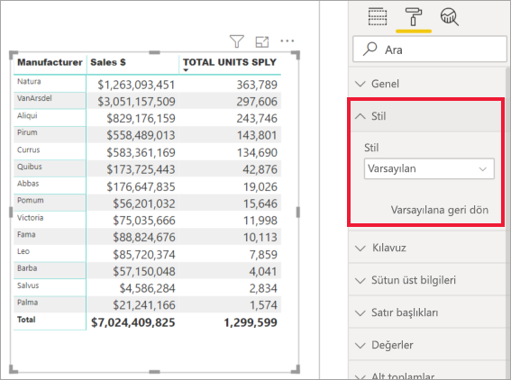

# Biçimlendirme panosuyla çalışmaya başlama

[!INCLUDE[consumer-appliesto-nyyn](../includes/consumer-appliesto-nyyn.md)]    

Rapor üzerinde düzenleme izinleriniz varsa, sayısız biçimlendirme seçeneğinden yararlanabilirsiniz. Power BI raporlarında veri serilerinin ve veri noktalarının rengini ve hatta görselleştirmelerin arka planını değiştirebilirsiniz. Ayrıca x ekseninin ve y ekseninin gösterimini değiştirebilirsiniz. Hatta görselleştirmelerin, şekillerin ve başlıkların yazı tipi özelliklerini bile biçimlendirebilirsiniz. Power BI raporlarınızın görünümü üzerinde size tam denetim olanağı sağlar.

Başlamak için, Power BI Desktop veya Power BI hizmetinde bir rapor açın. Her ikisinde de aynı biçimlendirme seçenekleri sağlanır. Power BI hizmetinde rapor açarken, menü çubuğundan **Düzenle**'yi seçtiğinizden emin olun. 

Raporları düzenlerken bir görselleştirme seçtiğinizde **Görsel Öğeler** bölmesi görünür. Görselleştirmeleri değiştirmek için bu bölmeyi kullanın. **Görsel Öğeler** bölmesinin hemen altında üç simge bulunur: **Alanlar** simgesi (üst üste çubuklar), **Biçim** simgesi (rulo fırça) ve **Analiz** simgesi (büyüteç). Aşağıdaki resimde **Alanlar** simgesi seçilidir ve bu seçim, simgenin altında sarı bir çizgiyle gösterilir.

**Biçim**'i seçtiğinizde simgenin altındaki alanda, geçerli durumda seçili olan görselleştirme için kullanılabilir özelleştirmeler görüntülenir.  

Her görselleştirmenin birçok öğesini özelleştirebilirsiniz. Kullanılabilir seçenekler, seçtiğiniz görsele göre değişiklik gösterir. Seçeneklerden bazıları şunlardır:

* Gösterge
* X ekseni
* Y ekseni
* Veri renkleri
* Veri etiketleri
* Şekiller
* Çizim alanı
* Başlık
* Arka plan
* Görünüşü kilitle
* Kenarlık
* Araç İpuçları
* Görsel üst bilgileri
* Şekiller
* Konum    
ve daha fazlası.

> [!NOTE]
>  
> Bu öğelerin hepsini her görselleştirme türünde göremezsiniz. Kullanabileceğiniz özelleştirme türleri, seçtiğiniz görselleştirmeye göre değişir; örneğin, pasta grafiklerinde X ekseni bulunmadığı için pasta grafiği seçtiğinizde X ekseni öğesini göremezsiniz.

Ayrıca, seçili bir görselleştirmeniz yoksa simgelerin yerinde, sayfadaki tüm görselleştirmelere filtre uygulamanıza olanak sağlayan **Filtreler** bölümü görünür.

Biçimlendirme seçeneklerini kullanmayı öğrenmenin en iyi yolu bunları denemektir. İstediğiniz zaman değişikliklerinizi geri alabilir veya varsayılan değerlere döndürebilirsiniz. İnanılmaz sayıda seçenek sağlanmakta ve sürekli yenileri eklenmektedir. Biçimlendirme seçeneklerinin hepsini tek makalede açıklamak mümkün değildir. Ama başlangıç olarak birkaç seçeneği birlikte gözden geçirelim. 

1. Görselde kullanılan renkleri değiştirme   
2. Stil uygulama    
3. Eksen özelliklerini değiştirme    
4. Veri etiketleri ekleme    

## Renklerle çalışma

Bir görselleştirmedeki renkleri özelleştirmek için gerekli adımlara göz atalım.

1. Etkin duruma getirmek için bir görselleştirmeyi seçin.

2. Boya rulosu simgesini seçin ve Biçimlendirme sekmesini açın. Biçimlendirme sekmesinde, seçili görselde kullanılabilecek tüm biçimlendirme öğeleri görüntülenir.

    

3. Kullanılabilir özelleştirmelerini genişletmek için **Veri Renkleri**’ni seçin.  

    

4. **Tümünü göster** ayarını Açık konuma getirin ve sütunlar için farklı renkler seçin.

    

İşte renklerle çalışırken yararlı olabilecek birkaç ipucu. Aşağıdaki listede verilen rakamlar, alttaki ekranda bu faydalı öğelere nereden erişebileceğinizi veya bunları nereden değiştirebileceğinizi de göstermektedir.

1. Rengi sevmediniz mi? Sorun değil, varsayılan ayara geri dönmek için **Varsayılana geri dön** seçeneğini belirlemeniz yeterlidir. 

2. Renk değişikliklerinden herhangi birini sevmediniz mi? **Veri rengi** bölümünün alt kısmında **Varsayılana geri dön**’ü seçin; renkleriniz varsayılan ayarlarına döndürülür. 

3. Palette olmayan bir rengi mi uygulamak istiyorsunuz? **Özel renk** seçeneğini belirleyip renk yelpazesinden istediğiniz rengi seçin.  

   

Yaptığınız değişikliği sevmediniz mi? Zaten alışkın olduğunuz bir yöntem olan **CTRL+Z** ile değişikliğinizi geri alabilirsiniz.

## Tabloya stil uygulama
Bazı Power BI görselleştirmelerinin **Stil** seçeneği vardır. Tek tıklamayla, biçimlendirme seçeneklerinin eksiksiz bir kümesi görselleştirmenize aynı anda uygulanır. 

1. Bir tablo veya matrisi seçerek etkinleştirin.   
1. Biçimlendirme sekmesini açın ve **Stil**’i seçin.

   

1. Açılan listeden bir stil seçin. 

   

Stil uyguladıktan sonra bile, bu görselleştirmenin özelliklerini (rengi de dahil) biçimlendirmeye devam edebilirsiniz.

## Eksen özelliklerini değiştirme

X ekseni ve Y eksenini değiştirmek genellikle kullanışlı bir işlemdir. Renkleri değiştirirken yaptığınız gibi bir ekseni de, aşağıdaki görüntüde gösterilen şekilde eksenin solundaki aşağı ok simgesini seçerek değiştirebilirsiniz.  

Aşağıdaki örnekte Y eksenini biçimlendirmek için:
- etiketleri görselleştirmenin sağ tarafına taşıdık

- başlangıç değerini sıfır olarak değiştirdik.

- etiket yazı tipi rengini siyah olarak değiştirdik

- etiket yazı tipi boyutunu 12’ye artırdık

- Y ekseni başlığı ekledik

    

**X Ekseni**'nin veya **Y Ekseni**’nin yanındaki radyo düğmesini açıp kapatarak eksen etiketlerini tamamen kaldırabilirsiniz. Ayrıca, **Başlık**'ın yanındaki radyo düğmesini seçerek eksen başlıklarını etkinleştirmeyi veya devre dışı bırakmayı tercih edebilirsiniz.  

## Veri etiketleri ekleme    

Kendiniz keşfetmeye başlamadan önce son bir biçimlendirme örneği verelim.  Alan grafiğine veri etiketleri ekleyelim. 

İşte *öncesi* resmi. 

İşte bu da *sonrası* resmi.

Görselleştirmeyi seçerek etkin hale getirdik ve Biçimlendirme sekmesini açtık.  **Veri etiketleri**’ni seçtik ve bunları Açık konuma getirdik. Sonra yazı tipini 12’ye büyüttük, yazı tipi ailesini Arial Black olarak değiştirdik, **Arka planı göster**’i Açık konuma getirdik, arka plan rengini %5 saydamlıkla beyaz yaptık.

Bunlar mümkün olan biçimlendirme görevlerinden yalnızca birkaçıdır. Raporu Düzenleme modunda açın ve güzel, bilgilendirici görselleştirmeler oluşturmak için Biçimlendirme bölmesini keyifle keşfedin.

## Sonraki adımlar
Daha fazla bilgi için aşağıdaki makaleyi inceleyin: 

* [Raporları paylaşma](../collaborate-share/service-share-reports.md)

* [Power BI'da renk biçimlendirmeye ilişkin ipuçları ve püf noktaları](service-tips-and-tricks-for-color-formatting.md)  
* [Tablolarda koşullu biçimlendirme](../create-reports/desktop-conditional-table-formatting.md)

