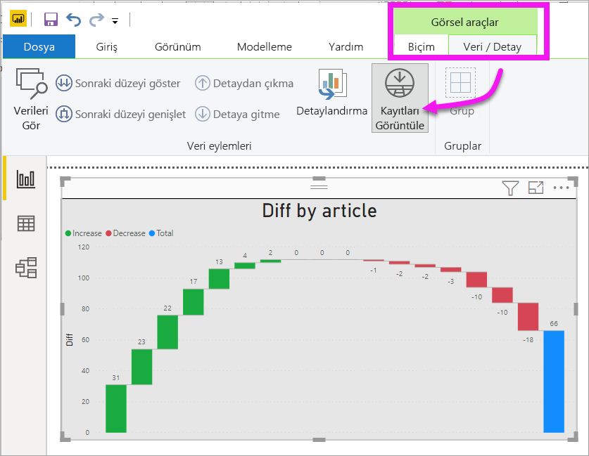

# Görselleştirmenin temel alınan verilerini görüntüleme

[!INCLUDE[consumer-appliesto-yyyn](../includes/consumer-appliesto-nyyn.md)]    

## Verileri göster
Power BI görselleştirmeleri, veri kümelerinizdeki veriler kullanılarak oluşturulur. Verilerin kaynağını merak ediyorsanız Power BI, görseli oluşturmak için kullanılan verileri *görüntülemenizi* sağlar. **Verileri Göster** 'i seçtiğinizde, Power BI ilgili verileri görselleştirmenin altında (veya yanında) görüntüler.

İsterseniz görselleştirmeyi oluşturmak için kullanılan verileri .xlsx veya .csv biçiminde dışarı aktarıp Excel'de görüntüleyebilirsiniz. Daha fazla bilgi için bkz. [Power BI görselleştirmelerindeki verileri dışarı aktarma](power-bi-visualization-export-data.md).

> [!NOTE]
> *Verileri Göster* ve *Verileri Dışarı Aktar* seçenekleri hem Power BI hizmetinde hem de Power BI Desktop uygulamasında kullanılabilir. Ancak Power BI Desktop uygulaması ek bir ayrıntı katmanı daha sunar. [*Kayıtları Göster* seçeneği veri kümesindeki satırları görüntüler](../create-reports/desktop-see-data-see-records.md).
> 
> 

## *Verileri Göster* seçeneğini kullanma 
1. Power BI Desktop'ta etkin duruma getirmek için bir görselleştirmeyi seçin.

2. **Diğer eylemler** (...) ve **Verileri göster** öğelerini seçin. 
    

3. Veriler varsayılan olarak görselin altında gösterilir.
   
   

4. Yönü değiştirmek için, görselleştirmenin sağ üst köşesinde dikey düzeni  seçin.
   
   
5. Verileri .csv biçiminde dışarı aktarmak için üç noktayı ve ardından **Verileri dışarı aktar** 'ı seçin.
   
    
   
    Verileri Excel'e aktarma hakkında daha fazla bilgi için bkz. [Power BI görselleştirmelerindeki verileri dışarı aktarma](power-bi-visualization-export-data.md).
6. Verileri gizlemek için **Araştır** > **verileri göster** seçimini kaldırın.

## Kayıtları göster seçeneğini kullanma
Ayrıca bir görselleştirmedeki tek bir veri kaydına odaklanıp bu öğenin temel aldığı verilerin de detayına gidebilirsiniz. 

1. **Kayıtları görüntüle** seçeneğini kullanmak için, bir görselleştirmeyi seçerek etkin duruma getirin. 

2. Masaüstü şeridinde **Görsel araçlar** > **Veri/Detay** > **Kayıtları görüntüle** sekmesini seçin. 

    

3. Görselleştirme üzerinde bir veri noktası veya satır seçin. Bu örnekte soldan dördüncü sütunu seçtik. Power BI, bu veri noktasına ait olan veri kümesi kaydını gösterir.

    

4. Masaüstü rapor tuvaline geri dönmek için **Rapora geri dön** 'ü seçin. 

## Önemli noktalar ve sorun giderme

- Şeritteki **Kayıtları görüntüle** düğmesinin devre dışı ve gri renkte olması, seçili görselleştirmenin Kayıtları Görüntüle özelliğini desteklemediği anlamına gelir.
- Kayıtları Görüntüle görünümünde verileri değiştiremez ve rapora geri kaydedemezsiniz.
- Görselinizdeki çok boyutlu bir modelde hesaplanmış ölçü kullanılıyorsa Kayıtları Görüntüle özelliğinden yararlanamazsınız.
- Canlı bir çok boyutlu (MD) modele bağlıyken Kayıtları Görüntüle özelliğini kullanamazsınız.  

## Sonraki adımlar
[Power BI görselleştirmelerindeki verileri dışarı aktarma](power-bi-visualization-export-data.md)    

Başka bir sorunuz mu var? [Power BI Topluluğu'na başvurun](https://community.powerbi.com/)

