# Power BI'da renk biçimlendirmeye ilişkin ipuçları ve püf noktaları
Power BI, panolarınızı ve raporlarınızı özelleştirmek için birçok farklı yol sunar. Bu makalede, Power BI görselleştirmelerinizi daha etkileyici ve ilgi çekici bir hale getirip ihtiyaçlarınıza göre özelleştirmenizi sağlayacak birçok ipucu verilmektedir.

İpuçlarını aşağıda bulabilirsiniz. Başka bir ipucu öneriniz mi var? Harika! Bu listeye ekleyip eklemeyeceğimize karar vermemiz için ipucunuzu bizimle paylaşın.

* Tek bir veri noktasının rengini değiştirme
* Bir grafiğin renkleri için sayısal bir değeri temel alma
* Veri noktalarının rengi için bir alan değerini temel alma
* Renk ölçeğinde kullanılan renkleri özelleştirme
* Ayrılan renk ölçeklerini kullanma
* Power BI'da yapılan bir işlemi geri alma

Değişiklik yapmak için raporu düzenliyor olmalısınız. Raporu açın ve aşağıdaki görüntüde gösterildiği gibi üst menü alanından **Raporu Düzenle**'yi seçin.

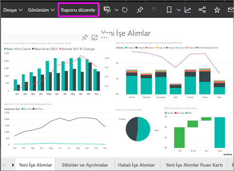

**Rapor** tuvalinin sağ tarafında **Görsel Öğeler** bölmesi göründüğünde özelleştirme işlemine başlayabilirsiniz. Bölme gösterilmiyorsa, açmak için sağ üst köşeden oku seçin.

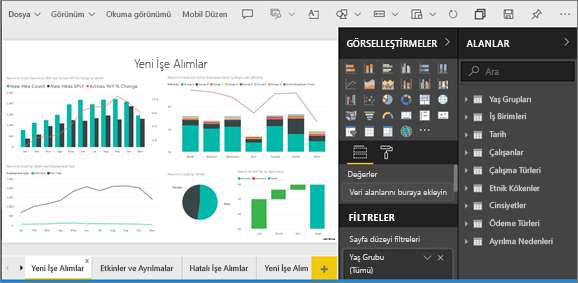

## Tek bir veri noktasının rengini değiştirme
Bazen belirli bir veri noktasını vurgulamak istersiniz. Örneğin, yeni bir ürünün lansmanı için satış rakamları veya yeni bir programın tanıtımından sonra kalite puanlarındaki artış ile ilgili bir noktanın vurgulanması gerekebilir. Power BI ile rengini değiştirerek belirli bir veri noktasını vurgulayabilirsiniz.

Aşağıdaki görselleştirme satılan birimleri ürün segmentine göre derecelendirir. 

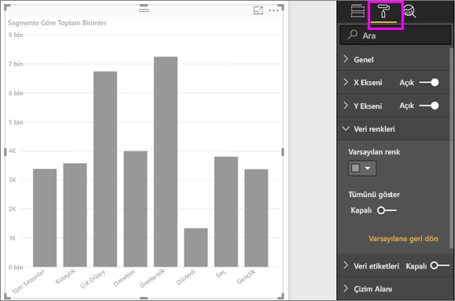

Şimdi, renkleri kullanarak bu yeni segmentin nasıl performans gösterdiğini ortaya koymak için **Convenience** segmentine dikkat çekmek istediğinizi düşünün. Uygulamanız gereken adımlar:

**Veri Renkleri** bölümünü genişletin ve **Tümünü göster** için kaydırıcıyı Açık konuma getirin. Bu işlemin ardından, görselleştirmedeki tüm veri öğelerine ilişkin renkler görüntüler. Veri noktalarının üzerine geldiğinizde herhangi bir veri noktası üzerinde değişiklik yapabilmeniz için kaydırma etkinleştirilir.

**Convenience** veri noktasını turuncu olarak ayarlayın. 

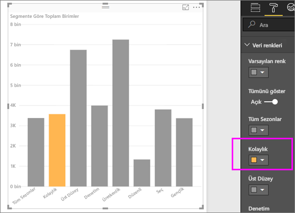

Seçtiğinizde, **Convenience** veri noktası turuncunun güzel bir tonunda vurgulanır ve belirgin bir şekilde öne çıkar.

Görselleştirme türlerini değiştirip geri dönseniz bile Power BI seçiminizi hatırlar ve **Convenience**'ın turuncu kalmasını sağlar.

Görselleştirmede bir veya birkaç veri öğesi ya da veri öğelerinin tümü için veri noktasının rengini değiştirebilirsiniz. Görselinizin, şirketinizin renklerini yansıtmasını da istiyor olabilirsiniz. 

Renkleri kullanarak her türlü işlemi gerçekleştirebilirsiniz. Sonraki bölümde, gradyanlara bakacağız.

## Bir grafiğin renkleri için sayısal bir değeri temel alma
Grafiklerde genellikle renkleri, bir alanın sayısal değerine göre dinamik olarak ayarlama özelliğinden faydalanılır. Bunu yaptığınızda bir çubuğun boyutu için önceden kullanılan değerden farklı bir değer gösterebilir ve tek bir grafta iki değer sunabilirsiniz. Ayrıca bunu, belirli bir değerin üzerindeki (veya altındaki) veri noktalarını vurgulamak için de kullanabilirsiniz. Örneğin, kârlılığın düşük olduğu alanları vurgulamak isteyebilirsiniz.

Aşağıdaki bölümlerde, renk için bir sayısal değeri temel almaya ilişkin farklı yöntemler gösterilmiştir.

## Veri noktalarının rengi için bir değeri temel alma
Rengi bir değere göre değiştirmek için, renk için temel alınmasını istediğiniz alanı **Alanlar** bölmesindeki **Renk Doygunluğu** alanına sürükleyin. Aşağıdaki görüntüde, **%Market Share SPLY YTD** alanı **Renk Doygunluğu** alanına sürüklenmiştir. 

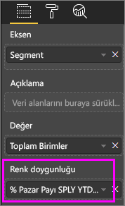

Biçimlendirme bölmesinde, **Veri renkleri**'nin altında **%Market Share SPLY YTD** değerinin sütun grafiğinizdeki rengi ve gölgelendirmeyi nasıl değiştireceğini belirleyin. Bu örnekte, %Market Share için düşük değerler açık mavi ve yüksek değerler de koyu maviyle gösterilir.

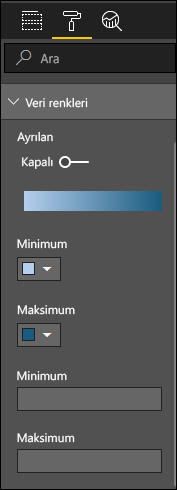

Sizin de görebileceğiniz gibi, hem **Productivity** hem de **Extreme** için daha fazla birim satmış olsak da (sütunları daha yüksektir), **Moderation** segmentinin **%Market Share SPLY YTD** değeri daha büyüktür (sütununun renk doygunluğu daha fazladır).

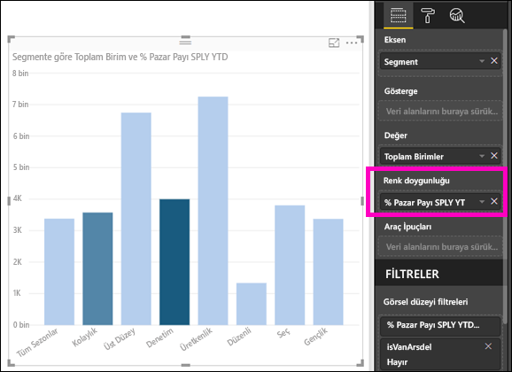

## Renk ölçeğinde kullanılan renkleri özelleştirme
Renk ölçeğinde kullanılan renkleri de özelleştirebilirsiniz. Varsayılan olarak, verilerinizdeki en düşük değer en az doygun renkle, en yüksek değer ise en doygun renkle eşlenir. Yukarıdaki görüntüde mavi gradyan kullandık. 

**Veri Renkleri**'ni genişlettiğinizde, verilerinizi görselleştirmek için kullanılan bir renk gradyanı görürsünüz. Renk aralığı, **Minimum** ve **Maksimum** renk değerleri arasındaki renk yelpazesini görüntüleyen bir gradyan çubukta gösterilir. **Minimum** değer rengi solda, **Maksimum** değer rengi ise sağdadır.

Ölçeği, farklı bir renk aralığı kullanmak üzere değiştirmek için **Minimum** veya **Maksimum** seçeneklerinin yanındaki renk açılan listesini seçip bir renk belirleyin. Aşağıdaki görüntüde, **Maksimum** seçeneğine ilişkin renk siyah olarak değiştirilmiştir. Gradyan çubukta ise **Minimum** ve **Maksimum** arasındaki yeni renk yelpazesi gösterilmektedir.

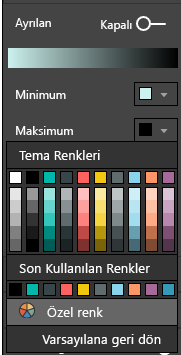

Değerlerin bu renklerle nasıl eşleneceğini de değiştirebilirsiniz. Aşağıdaki görüntüde, **Minimum** ve **Maksimum** değerlerine ilişkin renkler sırasıyla turuncu ve yeşil olarak ayarlanmıştır.

İlk görüntüde, grafikteki çubukların, çubukta gösterilen gradyanı nasıl yansıttığına dikkat edin; en yüksek değer yeşil, en düşük değer ise turuncudur. Ayrıca, bu değerler arasındaki her çubuk renk yelpazesinde bulunan, yeşil ve turuncu arasındaki tonlarla renklendirilmiştir.

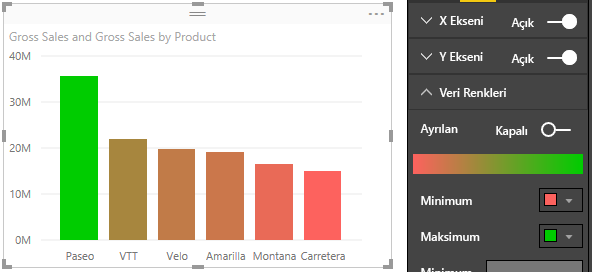

Şimdi, **Minimum** ve **Maksimum** renk seçicileri altında bulunan **Minimum** ve **Maksimum** değer kutularına (aşağıda gösterilmiştir) sayısal değer girdiğimizde ne olacağını görelim. **Minimum**’u 20.000.000 ve **Maksimum**’u 20.000.001 olarak ayarlayalım.

Bu değerler ayarlandığında, grafikte **Minimum**'un altında veya **Maksimum**'un üzerindeki değerler için artık gradyan uygulanmaz. **Maksimum** değerin üzerinde bir değere sahip tüm çubuklar yeşil, **Minimum** değerin altında bir değere sahip tüm çubuklar ise kırmızı renkte gösterilir.

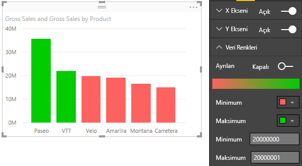

## Ayrılan renk ölçeklerini kullanma
Bazı durumlarda, verilerinizde doğal olarak ayrılan bir ölçek olabilir. Örneğin, sıcaklık aralığının donma noktasında doğal bir merkez noktası, kârlılık puanının ise doğal bir orta noktası (sıfır) mevcuttur.

Ayrılan renk ölçeklerini kullanmak için **Ayrılan** kaydırıcısını **Açık** konumuna getirin. **Ayrılan** kaydırıcısı etkinleştirildiğinde, aşağıdaki görüntüde gösterildiği gibi **Orta** adlı ek bir renk seçici ve değer kutusu görünür.

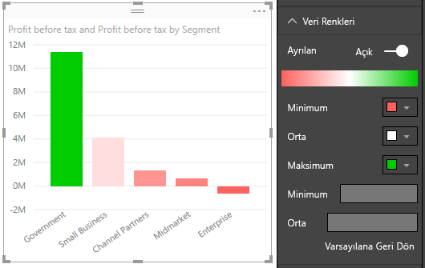

**Ayrılan** kaydırıcısı etkinleştirildiğinde **Minimum**, **Maksimum** ve **Orta** seçenekleri için renkleri ayrı olarak ayarlayabilirsiniz. Aşağıdaki görüntüde **Orta** değer kutusu bir olarak ayarlanmıştır, bu yüzden değeri birin üzerinde olan çubuklar yeşil bir gradyan tonuna sahipken, birin altında bulunan çubuklar kırmızı tondadır.

## Power BI'da yapılan bir işlemi geri alma
Diğer birçok Microsoft hizmeti ve yazılımı gibi Power BI da son komutunuzu geri almanız için kolay bir yol sunar. Örneğin, bir veya bir dizi veri noktasının rengini değiştirdiniz ve görselleştirmede ortaya çıkan rengi beğenmediniz. Önceden hangi rengin seçili olduğunu hatırlamıyorsunuz ancak eski renge geri dönmek istiyorsunuz!

Son eyleminizi veya son birkaç eyleminizi **geri almak** için tüm yapmanız gereken:

- CTRL+Z tuş bileşimini kullanın

## Geri bildirim
Paylaşmak istediğiniz bir ipucu var mı? Bu listeye ekleyip eklemeyeceğimize karar vermemiz için lütfen ipucunuzu bizimle paylaşın.

>[!NOTE]
>**Biçim** simgesi seçiliyken kullanılabilen bu renk, eksen özelleştirmeleri ve ilgili özelleştirmeler Power BI Desktop'ta da kullanılabilir.

## Sonraki adımlar
[Renk biçimlendirme ve eksen özelliklerini kullanmaya başlama](service-getting-started-with-color-formatting-and-axis-properties.md)

