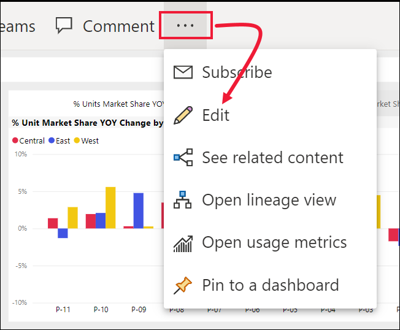

# Raporlarda biçimlendirmeye ilişkin ipuçları ve püf noktaları

[!INCLUDE[consumer-appliesto-nyyn](../includes/consumer-appliesto-nyyn.md)]    

Power BI, raporlarınızı özelleştirmek için birçok farklı yol sunar. Bu makalede, Power BI görselleştirmelerinizi daha etkileyici ve ilgi çekici bir hale getirip ihtiyaçlarınıza göre özelleştirmenizi sağlayacak birçok ipucu verilmektedir.

İpuçlarını aşağıda bulabilirsiniz. Başka bir ipucu öneriniz mi var? Harika! Bu listeye ekleyip eklemeyeceğimize karar vermemiz için ipucunuzu bizimle paylaşın.

* Raporun tamamına tema uygulama
* Tek bir veri noktasının rengini değiştirme
* Koşullu biçimlendirme
* Bir grafiğin renkleri için sayısal bir değeri temel alma
* Veri noktalarının rengi için bir alan değerini temel alma
* Renk ölçeğinde kullanılan renkleri özelleştirme
* Ayrılan renk ölçeklerini kullanma
* Tablo satırlarına renk ekleme
* Power BI'da yapılan bir işlemi geri alma

Herhangi bir değişiklik yapmak için rapor üzerinde düzenleme izinlerine sahip olmanız gerekir. Power BI Desktop'ta raporu **Rapor** görünümünde açın. Power BI hizmetinde bu, aşağıdaki resimde gösterildiği gibi raporu açmak ve menü çubuğunda **Düzenle**’yi seçmek anlamına gelir.

Rapor tuvalinin sağ tarafında **Filtreler** ve **Görsel Öğeler** bölmeleri göründüğünde özelleştirme işlemine başlayabilirsiniz. Bölmeler gösterilmiyorsa, bunları açmak için sağ üst köşeden oku seçin.

## Tema uygulama
Rapor temalarıyla raporunuzun tamamında kurumsal renkler kullanmak, simge kümelerini değiştirmek veya yeni varsayılan görsel biçimlendirmeyi uygulamak gibi tasarım değişiklikleri uygulayabilirsiniz. Rapor teması uyguladığınızda, raporunuzdaki tüm görsellerde seçtiğiniz temanın renkleri ve biçimlendirmesi kullanılır. Daha fazla bilgi edinmek için bkz. [Rapor temalarını kullanma](../create-reports/desktop-report-themes.md)

Burada Sales and Marketing (Satış ve Pazarlama) raporuna **Yenilik** temasını uyguladık.

## Tek bir veri noktasının rengini değiştirme
Bazen belirli bir veri noktasını vurgulamak istersiniz. Örneğin, yeni bir ürünün lansmanı için satış rakamı veya yeni bir programın tanıtımından sonra kalite puanlarındaki artış ile ilgili bir noktanın vurgulanması gerekebilir. Power BI ile rengini değiştirerek belirli bir veri noktasını vurgulayabilirsiniz.

Aşağıdaki görselleştirme satılan birimleri ürün segmentine göre derecelendirir. 

Şimdi, renkleri kullanarak bu yeni segmentin nasıl performans gösterdiğini ortaya koymak için **Convenience** segmentine dikkat çekmek istediğinizi düşünün. Uygulamanız gereken adımlar:

**Veri renkleri** kartını genişletin ve **Tümünü göster** için kaydırıcıyı Açık konuma getirin. Bu işlemin ardından, görselleştirmedeki tüm veri öğelerine ilişkin renkler görüntüler. Artık veri noktalarından istediklerinizi değiştirebilirsiniz.

**Convenience** veri noktasını turuncu olarak ayarlayın. 

Seçtiğinizde, **Convenience** veri noktası turuncunun güzel bir tonunda vurgulanır ve belirgin bir şekilde öne çıkar.

Görselleştirme türlerini değiştirip geri dönseniz bile Power BI seçiminizi hatırlar ve **Convenience**'ın turuncu kalmasını sağlar.

Görselleştirmede bir veya birkaç veri öğesi ya da veri öğelerinin tümü için veri noktasının rengini değiştirebilirsiniz. Görselinizin, şirketinizin sarı, yeşil ve mavi renklerini yansıtmasını da istiyor olabilirsiniz. 

Renkleri kullanarak her türlü işlemi gerçekleştirebilirsiniz. Sonraki bölümde, koşullu biçimlendirmeyi gözden geçireceğiz.

## Görselleştirmeler için koşullu biçimlendirme
Görselleştirmelerde genellikle renkleri, bir alanın sayısal değerine göre dinamik olarak ayarlama özelliğinden faydalanılır. Bunu yaptığınızda bir çubuğun boyutu için önceden kullanılan değerden farklı bir değer gösterebilir ve tek bir grafta iki değer sunabilirsiniz. Ayrıca bunu, belirli bir değerin üzerindeki (veya altındaki) veri noktalarını vurgulamak için de kullanabilirsiniz. Örneğin, kârlılığın düşük olduğu alanları vurgulamak isteyebilirsiniz.

Aşağıdaki bölümlerde, renk için bir sayısal değeri temel almaya ilişkin farklı yöntemler gösterilmiştir.

### Veri noktalarının rengi için bir değeri temel alma
Rengin değere göre değişmesini sağlamak için, bir görselleştirmeyi seçerek etkinleştirin. Boya rulosu simgesini ve ardından **Veri renkleri** kartını seçerek Biçimlendirme bölmesini açın. **Varsayılan rengin** altında fx simgesini seçin.  

**Varsayılan renkler** bölmesinde açılan listeleri kullanarak koşullu biçimlendirme için kullanılacak alanları tanımlayın. Bu örnekte **Sales fact** > **Total Units** alanını, **En düşük değer** için açık maviyi ve **En yüksek değer** için koyu maviyi seçtik. 

Görselin rengini biçimlendirirken görselin parçası olmayan bir alanı da kullanabilirsiniz. Aşağıdaki resimde **%Market Share SPLY YTD** alanı kullanılıyor. 

Sizin de görebileceğiniz gibi, hem **Productivity** hem de **Extreme** için daha fazla birim satmış olsak da (sütunları daha yüksektir), **Moderation** segmentinin **%Market Share SPLY YTD** değeri daha büyüktür (sütununun renk doygunluğu daha fazladır).

### Renk ölçeğinde kullanılan renkleri özelleştirme
Değerlerin bu renklerle nasıl eşleneceğini de değiştirebilirsiniz. Aşağıdaki görüntüde, **Minimum** ve **Maksimum** değerlerine ilişkin renkler sırasıyla turuncu ve yeşil olarak ayarlanmıştır.

İlk görüntüde, grafikteki çubukların, çubukta gösterilen gradyanı nasıl yansıttığına dikkat edin; en yüksek değer yeşil, en düşük değer ise turuncudur. Ayrıca, bu değerler arasındaki her çubuk renk yelpazesinde bulunan, yeşil ve turuncu arasındaki tonlarla renklendirilmiştir.

Şimdi **Minimum** ve **Maksimum** değer kutularına sayısal değerler girdiğimizde ne olduğuna bakalım. Hem **Minimum** hem de **Maksimum** için açılır kutularda **Özel**'i seçin, sonra da **Minimum** değerini 3.500 ve **Maksimum** değerini 6.000 olarak ayarlayın.

Bu değerler ayarlandığında, grafikte **Minimum**'un altında veya **Maksimum**'un üzerindeki değerler için artık gradyan uygulanmaz. **Maksimum** değerin üzerinde bir değere sahip tüm çubuklar yeşil, **Minimum** değerin altında bir değere sahip tüm çubuklar ise kırmızı renkte gösterilir.

### Ayrılan renk ölçeklerini kullanma
Bazı durumlarda, verilerinizde doğal olarak ayrılan bir ölçek olabilir. Örneğin, sıcaklık aralığının donma noktasında doğal bir merkez noktası, kârlılık puanının ise doğal bir orta noktası (sıfır) mevcuttur.

Ayrılan renk ölçeklerini kullanmak için **Ayrılan** onay kutusunu seçin. **Ayrılan** kaydırıcısı etkinleştirildiğinde, aşağıdaki resimde gösterildiği gibi **Orta** adlı ek bir renk seçici gösterilir.

**Ayrılan** kaydırıcısı etkinleştirildiğinde **Minimum**, **Maksimum** ve **Orta** seçenekleri için renkleri ayrı olarak ayarlayabilirsiniz. Aşağıdaki resimde **% Market Share SPLY YTD** için **Orta** değeri 0,2 olarak ayarlanmıştır, bu yüzden değeri 0,2'nin üzerinde olan çubuklar yeşil bir gradyan tonuna sahipken, 0,2'nin altında olan çubuklar kırmızı tondadır.

## Tablo satırlarına renk ekleme
Tablolar ve matrislerde renk biçimlendirmesi için birçok seçenek sunulur. 

Tablo veya matrise renk uygulamanın en hızlı yollarından biri Biçimlendirme sekmesini açıp **Stil**’i seçmektir.  Aşağıdaki resimde biz **Kalın üst bilgi parlak satırları**’nı seçtik.

Diğer renk biçimlendirme seçenekleriyle denemeler yapın. Bu resimde, **Sütun üst bilgileri**’nin altında arka plan rengini ve **Değerler** (satırlar) için hem **Arka plan rengi**’ni hem de **Alternatif arka plan rengi**’ni değiştirdik.

## Power BI'da yapılan bir işlemi geri alma
Diğer birçok Microsoft hizmeti ve yazılımı gibi Power BI da son komutunuzu geri almanız için kolay bir yol sunar. Örneğin, bir veya bir dizi veri noktasının rengini değiştirdiniz ve görselleştirmede ortaya çıkan rengi beğenmediniz. Önceden hangi rengin seçili olduğunu hatırlamıyorsunuz ancak eski renge geri dönmek istiyorsunuz!

Son eyleminizi veya son birkaç eyleminizi **geri almak** için tüm yapmanız gereken CTRL+Z tuşlarına basmaktır.

Biçimlendirme kartında yaptığınız tüm değişiklikleri atmak için **Varsayılana dön**’ü seçin.

## Görüşlerinizi bize iletin
Paylaşmak istediğiniz bir ipucu var mı? Bu listeye ekleyip eklemeyeceğimize karar vermemiz için lütfen ipucunuzu bizimle paylaşın.

## Sonraki adımlar
[Renk biçimlendirme ve eksen özelliklerini kullanmaya başlama](service-getting-started-with-color-formatting-and-axis-properties.md)

[Raporları paylaşma](../collaborate-share/service-share-reports.md).

