# Azure Active Directory B2B kullanarak dış Konuk kullanıcılarına Power BI içeriği dağıtma

**Özet:** Bu, Işletmeden işletmeye (Azure AD B2B) Azure Active Directory tümleştirmesini kullanarak kuruluşun dışındaki kullanıcılara içerik dağıtmayı gösteren teknik bir teknik incelemeye sahiptir.

**Yazarlar:** Lukasz Pawlowski, Kasper de Jonge

**Teknik gözden geçirenler:** Adam Solson, Sheng Liu, Qian Liang, Sergei Gundorov, Jacob Grimm, adam Saxton, Maya Shenhav, Nimrod Shalit, Elisabeth Olson

> [!NOTE]
> Tarayıcınızdan **Yazdır**’ı ve ardından **PDF olarak kaydet**’i seçerek bu teknik incelemeyi yazdırabilir veya kaydedebilirsiniz.

## Giriş

Power BI kuruluşların işletmelerini 360 derece bir görünümünü sağlar ve bu kuruluşlardaki herkesin verileri kullanarak akıllı kararlar vermesini kolaylaştırır. Bu kuruluşların birçoğu dış iş ortakları, istemciler ve yükleniciler için güçlü ve güvenilen ilişkilere sahiptir. Bu kuruluşların, bu dış iş ortaklarının kullanıcılarına Power BI panolar ve raporlar için güvenli erişim sağlaması gerekir.

Power BI, [işletmeler arası (Azure AD B2B) Azure Active Directory](https://docs.microsoft.com/azure/active-directory/b2b/what-is-b2b) ile tümleşerek, kuruluşun dışındaki konuk kullanıcılara Power BI içeriğinin güvenli dağıtımına olanak tanır; ancak hala denetim ve iç verilere erişimi yöneten.

Bu Teknik İnceleme, Power BI Azure Active Directory B2B tümleştirmesini anlamak için ihtiyacınız olan tüm ayrıntıları ele almaktadır. En yaygın kullanım örneği, kurulum, lisanslama ve satır düzeyi güvenliği ele alınmaktadır.

> [!NOTE]
> Bu Teknik İnceleme boyunca Azure AD 'ye Azure Active Directory ve Iş için Azure AD B2B olarak iş Azure Active Directory.

## Larla

Contoso, bir bir oto üreticisi ve üretim işlemlerini çalıştırmak için gerekli tüm bileşenleri, malzemeleri ve hizmetleri sağlayan birçok farklı tedarikçiyle çalışır. Contoso, tedarik zinciri lojistik ve tedarik zincirinin önemli performans ölçümlerini izlemek için Power BI kullanmayı planlıyor. Contoso, dış tedarik zinciri iş ortakları analiziyle güvenli ve yönetilebilir bir şekilde paylaşmak istiyor.

Contoso, Power BI ve Azure AD B2B kullanarak dış kullanıcılar için aşağıdaki deneyimleri etkinleştirebilir.

### Öğe paylaşımı başına geçici ad

Contoso, contoso arabalarına yönelik oylayıcılar oluşturan bir tedarikçiyle birlikte çalışmaktadır. Genellikle, tüm contoso arabalarından verileri kullanarak çütörlerin güvenilirliğini iyileştirmeleri gerekir. Contoso 'da analist, bir isdiator güvenilirlik raporunu tedarikçide bir mühendisle paylaşmak için Power BI kullanır. Mühendis, raporu görüntülemek için bir bağlantı içeren bir e-posta alır.

Yukarıda açıklandığı gibi, bu geçici paylaşım iş kullanıcıları tarafından gerektiği şekilde gerçekleştirilir. Dış kullanıcıya Power BI tarafından gönderilen bağlantı, bir Azure AD B2B davet bağlantıdır. Dış Kullanıcı bağlantıyı açtığında, contoso 'nun Azure AD kuruluşuna Konuk Kullanıcı olarak katılması istenir. Davet kabul edildikten sonra, bağlantı ilgili raporu veya panoyu açar. Azure Active Directory Yöneticisi, dış kullanıcıları kuruluşa davet etme iznini devreder ve bu belgenin Idare bölümünde açıklandığı gibi bu kullanıcıların daveti kabul ettiklerinde neler yapabileceğini seçer. Contoso analisti, yalnızca Azure AD yöneticisi tarafından bu eyleme izin verildiğinden ve Power BI yöneticisinin kullanıcıların Power BI kiracı ayarlarındaki içeriği görüntülemek üzere konukları davet etmesini sağladığından Konuk kullanıcıyı davet edebilir.

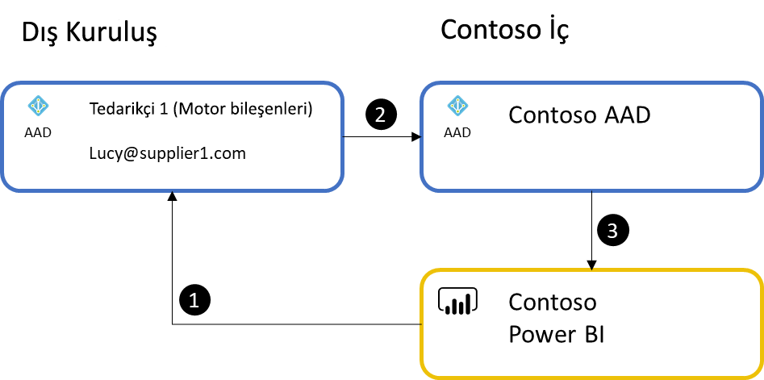

1. İşlem, bir panoyu paylaşan bir contoso iç kullanıcısı veya dış Kullanıcı içeren bir rapor ile başlar. Dış Kullanıcı contoso Azure AD 'de zaten bir konuk değilse davet edilir. E-posta adreslerine, contoso Azure AD 'ye davet içeren bir e-posta gönderilir
2. Alıcı, contoso Azure AD 'ye yapılan daveti kabul eder ve contoso Azure AD 'ye Konuk Kullanıcı olarak eklenir.
3. Daha sonra alıcı, Kullanıcı için salt okunan Power BI panosuna, rapora veya uygulamaya yönlendirilir.

Contoso 'daki iş kullanıcıları iş amaçları için gerektiğinde davet etme eylemini gerçekleştirdiğinden, işlem geçici olarak değerlendirilir. Paylaşılan her öğe, dış kullanıcının içeriği görüntülemek için erişebileceği tek bağlantıdır.

Dış Kullanıcı contoso kaynaklarına erişim için davet edildikten sonra contoso Azure AD 'de bunlar için bir gölge hesap oluşturulabilir ve yeniden davet edilmesi gerekmez.  Power BI panosu gibi bir contoso kaynağına ilk kez erişmeye çalıştıklarında, daveti kullanan bir izin süreci aracılığıyla gider.  Bu onay tamamlarsa, contoso 'nun içeriğine erişemez.  Sunulan özgün bağlantı aracılığıyla davetlerine bir sorun yaşarsanız, bir Azure AD yöneticisi, belirli bir davet bağlantısının kullanımı için yeniden gönderebilir.

### Öğe paylaşımı başına planlı

Contoso, oyların güvenilirlik analizini gerçekleştirmek için bir alt yükleniciyle birlikte çalışmaktadır. Taşeron, contoso 'nun Power BI ortamındaki verilere erişmesi gereken 10 kişiden oluşan bir ekibe sahiptir. Contoso Azure AD yöneticisi, tüm kullanıcıları davet etme ve taşeronun yaptığı eklemeleri/değişiklikleri herhangi bir şekilde işlemesini sağlar. Azure AD yöneticisi, taşeron 'daki tüm çalışanlar için bir güvenlik grubu oluşturur. Contoso çalışanları, güvenlik grubunu kullanarak raporlara erişimi kolayca yönetebilir ve gerekli tüm taşeron personelinin tüm gerekli raporlara, panolara ve Power BI uygulamalarına erişiminin olmasını sağlayabilir. Azure AD yöneticisi, her zaman personel yönetimini sağlamak için Contoso veya taşeronda bir güvenilen çalışana davet haklarının yetkisini almanın yanı sıra davet işlemine de engel olabilir.

Bazı kuruluşlar dış kullanıcılar eklendiğinde daha fazla denetim gerektirir, bir dış kuruluşta veya birçok harici kuruluşa çok sayıda kullanıcı davet edilir. Bu durumlarda, planlı paylaşım paylaşım ölçeğini yönetmek, kuruluş ilkelerini zorlamak ve hatta dış kullanıcıları davet etmek ve yönetmek üzere güvenilen bireylere haklar vermek için kullanılabilir. Azure AD B2B, bir [BT Yöneticisi tarafından doğrudan Azure Portal](https://docs.microsoft.com/azure/active-directory/b2b/add-users-administrator)gönderilmek üzere planlı davetleri destekler veya bir kullanıcı kümesinin tek bir eylemde davet edilmesi için [davet Yöneticisi API 'sini kullanarak PowerShell](https://docs.microsoft.com/azure/active-directory/b2b/customize-invitation-api) aracılığıyla yapılır. Kuruluş, planlı davet yaklaşımını kullanarak kullanıcıları davet edebilen ve onay süreçlerini uygulayabilen kişileri denetleyebilir. Dinamik gruplar gibi gelişmiş Azure AD özellikleri, güvenlik grubu üyeliğini otomatik olarak korumayı kolaylaştırır.

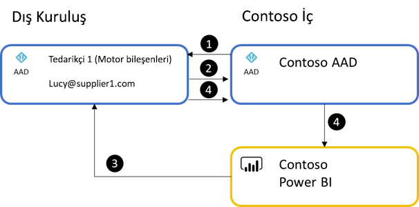

1. BT Yöneticisi ile işlem yıldızı, Konuk kullanıcıyı el ile veya Azure Active Directory tarafından verilen API aracılığıyla davet ediyor.
2. Kullanıcı kuruluşa daveti kabul eder.
3. Kullanıcı daveti kabul ettiğinde, Power BI bir kullanıcı harici kullanıcıyla veya içinde bulundukları bir güvenlik grubuyla bir raporu ya da panoyu paylaşabilir. Power BI normal paylaşımda olduğu gibi, dış kullanıcı da öğenin bağlantısını içeren bir e-posta alır.
4. Dış Kullanıcı bağlantıya eriştiğinde, dizinindeki kimlik doğrulaması contoso 'nun Azure AD 'ye geçirilir ve Power BI içeriğine erişim sağlamak için kullanılır.

### Power BI uygulamaların geçici veya planlı paylaşımı

Contoso, bir veya daha fazla tedarikçiyle paylaşılması gereken bir raporlar ve panolar kümesi içerir. Tüm gerekli dış kullanıcıların bu içeriğe erişebildiğinden emin olmak için Power BI bir uygulama olarak paketlenmiştir. Dış kullanıcılar doğrudan uygulama erişim listesine veya güvenlik gruplarına eklenir. Contoso 'daki birisi, uygulama URL 'sini örneğin bir e-postada tüm dış kullanıcılara gönderir. Dış kullanıcılar bağlantıyı açtığında, tek bir kolay gezinme deneyimindeki tüm içeriği görürler.

Power BI uygulamasının kullanılması, contoso 'nun tedarikçileri için bir bı portalı oluşturmasını kolaylaştırır. Tek bir erişim listesi, öğe düzeyi izinlerinin denetlenmesi ve ayarlanması için gereken tüm içeriğe erişimi, harcanan süreyi azaltarak denetler. Azure AD B2B, tedarikçinin yerel kimliğini kullanarak güvenlik erişimini korur, böylece kullanıcılar ek oturum açma kimlik bilgileri gerektirmez. Planlı davetleri güvenlik grupları ile birlikte kullanıyorsanız, personelin proje içine veya dışına çevrildiğinden uygulamaya erişim yönetimi basitleştirilmiştir. Bir tedarikçiden gelen tüm dış kullanıcıların otomatik olarak uygun güvenlik grubuna eklenmesi için güvenlik gruplarında el ile veya [dinamik grupları](https://docs.microsoft.com/azure/active-directory/b2b/use-dynamic-groups)kullanarak üyelik.

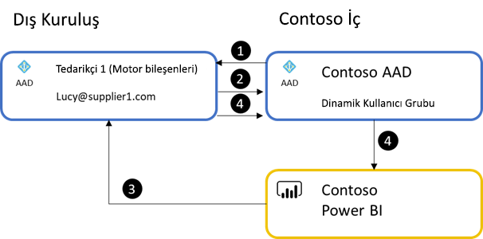

1. İşlem, Azure portal veya PowerShell aracılığıyla contoso 'nun Azure AD kuruluşuna davet edilen Kullanıcı tarafından başlar
2. Kullanıcı, Azure AD 'de bir kullanıcı grubuna eklenebilir. Statik veya dinamik bir Kullanıcı grubu kullanılabilir, ancak dinamik gruplar el ile çalışmanın azaltılmasına yardımcı olur.
3. Dış kullanıcılara, Kullanıcı grubu üzerinden Power BI uygulamasına erişim verilir. Uygulama URL 'SI doğrudan dış kullanıcıya gönderilmelidir veya erişimi olan bir siteye yerleştirilmelidir. Power BI dış kullanıcılara uygulama bağlantısı ile bir e-posta göndermek için en iyi çaba, ancak üyeliği değiştirilebilen Kullanıcı gruplarını kullanırken, Power BI Kullanıcı grupları aracılığıyla yönetilen tüm dış kullanıcılara gönderemeyebilir.
4. Dış Kullanıcı Power BI uygulama URL 'sine eriştiğinde, bu kullanıcıların kimliği, contoso 'nun Azure AD tarafından doğrulanır, Kullanıcı için uygulama yüklenir ve Kullanıcı tüm içerilen raporları ve panoları uygulama içinde görebilir.

Uygulamalar, uygulama yazarlarının Kullanıcı için uygulamayı otomatik olarak yüklemesine izin veren benzersiz bir özelliği de vardır; bu nedenle Kullanıcı oturum açtığında kullanılabilir. Bu özellik yalnızca, uygulamanın yayımlandığı veya güncelleştirildiği sırada contoso kuruluşunun zaten parçası olan dış kullanıcılar için otomatik olarak yüklenir. Bu nedenle, planlı davetlerle en iyi şekilde kullanılır ve kullanıcılar contoso Azure AD 'ye eklendikten sonra yayınlanan veya güncellenen uygulamaya bağlıdır. Dış kullanıcılar uygulama bağlantısını kullanarak her zaman uygulamayı yükleyebilir.

### Kuruluşlar genelinde içeriklere açıklama ekleme ve abone olma

Contoso, alt yüklenicileri veya tedarikçileriyle çalışmaya devam ettiğinden, dış mühendislerin contoso analistleriyle yakından çalışması gerekir. Power BI, kullanıcıların tüketebilecekleri içerikler hakkında iletişim kurmasına yardımcı olan çeşitli işbirliği özellikleri sağlar. Pano yorumu (ve yakında rapor yorumu), kullanıcıların göreceği veri noktalarını tartışmasına ve soru sormak için rapor yazarlarıyla iletişim kurmasına olanak tanır.

Şu anda dış Konuk kullanıcılar açıklamalara bırakarak ve yanıtları okuyarak açıklamalara katılabilirler. Ancak, iç kullanıcılardan farklı olarak, Konuk kullanıcılar @mentioned ve bir yorum aldığını bildirimleri alamaz. Konuk kullanıcılar, yazma sırasında Power BI içindeki abonelikler özelliğini kullanamaz. Yakında yayınlanacak bir sürümde, bu kısıtlamalar yükseltilmemiş ve ziyaretçi Kullanıcı e-postasına @mentions bir e-posta alır ve bir abonelik, Power BI içerik bağlantısı içeren e-postasına gönderilir.

### Power BI Mobile Apps 'teki içeriğe erişme

Gelecek bir sürümde, contoso kullanıcıları dış Konuk karşılıklarıyla rapor veya Pano paylaştığında, Power BI konuğa bildiren bir e-posta gönderilir. Konuk Kullanıcı, Mobil cihazındaki raporun veya panonun bağlantısını açtığında, içerik yüklüyse, cihazındaki yerel Power BI mobil uygulamalarda bu içerik açılır. Konuk Kullanıcı, dış kiracıda bunlarla paylaşılan içerik arasında geziniyor ve kendi kendi içeriğine kendi kendi içeriklerine geri gidebilecektir.

> [!NOTE]
> Konuk Kullanıcı Power BI mobil uygulamayı açamıyor ve hemen dış kiracıya gidebilmesi için dış Kiracıdaki bir öğenin bağlantısıyla başlaması gerekir. Yaygın geçici çözümler, bu belgenin ilerleyen kısımlarında yer alarak [üst kuruluşun Power BI içerik bağlantılarını dağıtma](#distributing-links-to-content-in-the-parent-organizations-power-bi) bölümünde açıklanmaktadır.

### Power BI içeriğinin platformlar arası düzenlemesi ve yönetimi

Contoso ve tedarikçileri ve alt yüklenicileri giderek daha yakından çalışır. Genellikle, alt yüklenici 'daki analist, contoso ile paylaşılan bir rapora eklenen ek ölçümler veya veri görselleştirmeleri gerektirir. Verilerin contoso Power BI kiracısında bulunması gerekir, ancak dış kullanıcıların bu dosyayı düzenleyebilmeleri, yeni içerik oluşturması ve hatta uygun kişilere dağıtması gerekir.

Power BI, **dış konuk kullanıcıların kuruluştaki içeriği düzenleyebilmesini ve yönetebilmesini** sağlayan bir seçenek sunar. Varsayılan olarak, dış kullanıcılar salt okunurdur ve tüketim odaklı bir deneyime sahiptir. Ancak, bu yeni ayar Power BI yöneticisinin hangi dış kullanıcıların kendi kuruluşlarındaki içeriği düzenleyebileceği ve yönetebileceğini seçmesine olanak tanır. Dış Kullanıcı izin verildiğinde raporları, panoları düzenleyebilir, uygulamaları yayımlayabilir veya güncelleştirebilir, çalışma alanlarında çalışabilir ve kullanma iznine sahip oldukları verilere bağlanabilir.

Bu senaryo, bu belgede daha sonra Power BI dış kullanıcıların içeriği düzenlemesini ve yönetmesini sağlayan bölümünde ayrıntılı olarak açıklanmıştır.

## Power BI ve Azure AD B2B kullanan Kurumsal ilişkiler

Power BI tüm kullanıcıları kuruluşa dahili olduğunda Azure AD B2B kullanmanız gerekmez. Ancak, iki veya daha fazla kuruluş veri ve Öngörüler üzerinde işbirliği yapmak istiyorken, Power BI Azure AD B2B desteği, bunu kolaylaştırır.

Genellikle, Power BI içinde Azure AD B2B stili şirketler arası işbirliği için uygun olan kurumsal yapılar ile karşılaşıldı. Azure AD B2B çoğu durumda iyi çalışmaktadır, ancak bazı durumlarda bu belgenin sonunda ele alınan yaygın alternatif yaklaşımlar göz önünde bulundurulmaktadır.

### Durum 1: kuruluşlar arasında doğrudan işbirliği

Contoso 'nun, kordiator tedarikçiyle olan ilişkisi, kuruluşlar arasındaki doğrudan işbirliğinin bir örneğidir. Contoso 'da ve tedarikçide, en az sayıda kullanıcı olduğundan, bu, Azure AD B2B tabanlı dış paylaşımının kullanılması idealdir. Kullanımı kolaydır ve kolay bir şekilde yönetilir. Bu ayrıca danışmanlık hizmetleri 'nde bir danışman 'nin bir kuruluş için içerik oluşturması gerekebilecek ortak bir modeldir.

Genellikle, bu paylaşım, öğe paylaşımı başına ad hoc kullanılarak başlangıçta oluşur. Ancak, takımlar büyüdükçe veya ilişkiler detacağından, her öğe için planlanmış yaklaşım, yönetim yükünü azaltmak için tercih edilen yöntem haline gelir. Ayrıca, Power BI uygulamaların geçici veya planlı paylaşımı, kuruluşlar genelinde içeriğe yorum yapma ve bu içeriklere abone olma, Mobil uygulamalardaki içeriğe erişim de, Power BI içeriğinin yanı sıra, şirketler arası düzenleme ve yönetimi de alabilir. Önemlisi, her iki kuruluşun kullanıcıları kendi kuruluşlarında Power BI Pro lisanslarsa, bu Pro lisanslarını diğer Power BI ortamlarında kullanabilirler. Bu, davet eden kuruluşun dış kullanıcılara yönelik bir Power BI Pro lisansı için ödeme yapması gerekmiyorsa, avantajlı lisanslama sağlar. Bu, bu belgenin ilerleyen kısımlarında lisanslama bölümünde daha ayrıntılı bir şekilde ele alınmıştır.

### Durum 2: üst ve yan kuruluşları veya bağlı kuruluşları

Bazı kuruluş yapıları, kısmen veya tamamen sahip olunan bağlı kuruluşları, bağlantılı şirketler veya yönetilen hizmet sağlayıcısı ilişkileri dahil daha karmaşıktır. Bu kuruluşların, tutan şirket gibi bir üst kuruluşu vardır ancak temel kuruluşlar, bazen farklı bölgesel gereksinimler altında yarı olarak çalışabilen işler. Bu, her kuruluşun kendi Azure AD ortamına sahip olduğunu ve Power BI kiracılarını ayırdığını gösterir.

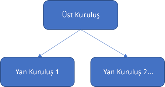

Bu yapıda, ana kuruluşun genellikle genel kuruluşlarına standartlaştırılmış Öngörüler dağıtması gerekir. Genellikle, bu paylaşım, standartlaştırılmış yetkili içeriğin geniş kitlelere dağıtılmasını olanaklı olduğundan, aşağıdaki görüntüde gösterildiği gibi Power BI Apps yaklaşımını geçici veya planlı paylaşımı kullanılarak gerçekleşir. Uygulamada, bu belgede daha önce bahsedilen tüm senaryoların bir birleşimi kullanılmıştır.

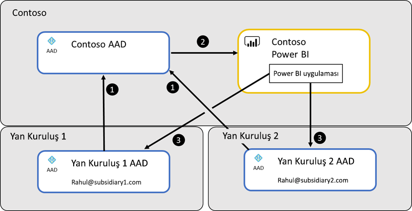

Bu işlem aşağıdaki süreci izler:

1. Her bir yan kuruluşun kullanıcıları contoso 'nun Azure AD 'ye davet edilir
2. Ardından Power BI uygulama, bu kullanıcılara gerekli verilere erişim sağlamak için yayımlanır
3. Son olarak, kullanıcılar uygulamayı raporları görmek için verilen bir bağlantı üzerinden açar

Bu yapıdaki kuruluşların karşılaştığı birkaç önemli zorluk vardır:

- Üst kuruluşun Power BI içerik bağlantılarını dağıtma
- Bağlı kullanıcıların üst kuruluş tarafından barındırılan veri kaynağına erişmesine izin verme

#### Üst kuruluşun Power BI içeriğe bağlantı dağıtma

İçeriğe bağlantı dağıtmak için yaygın olarak kullanılan üç yaklaşım kullanılır. İlk ve en temel, uygulamanın bağlantısının gerekli kullanıcılara gönderilmesi veya açılan bir SharePoint Online sitesine yerleştirmektir. Kullanıcılar, gerek duydukları verilere daha hızlı erişmek için tarayıcılarındaki bağlantıya yer işareti ekleyebilir.

İkinci yaklaşım, Power BI içerik özelliğinin platformlar arası düzenlemesini ve yönetimini temel alır. Üst kuruluş, yan kuruluşlardaki kullanıcıların Power BI erişmesini ve izin üzerinden neleri erişebileceğini denetmaları sağlar. Bu, bağlı olan kullanıcının ana kuruluşun kiracısında kendileriyle paylaşılan kapsamlı bir içerik listesi gördüğü Power BI girişe erişim sağlar. Daha sonra ana kuruluşların Power BI ortamının URL 'SI, yan kuruluşlardaki kullanıcılara verilir.

Son yaklaşım, her bir yan için Power BI kiracısında oluşturulan Power BI uygulamasını kullanır. Power BI uygulama, [dış bağlantı seçeneğiyle yapılandırılmış kutucukları](https://docs.microsoft.com/power-bi/service-dashboard-edit-tile#hyperlink)olan bir Pano içerir. Kullanıcı kutucuğa bastığında, ana kuruluşun Power BI uygun rapor, pano veya uygulamaya götürülürsünüz. Bu yaklaşım, uygulamanın bağlı olan tüm kullanıcılar için otomatik olarak yüklenebilmesine ve kendi Power BI ortamlarında oturum açtıklarında bu uygulamaların kullanılabilir olmasını sağlar. Bu yaklaşımın bir avantajı, bağlantıyı yerel olarak açabilme Power BI mobil uygulamalarla iyi çalışmadır. Ayrıca, Power BI ortamları arasında daha kolay geçiş sağlamak için bunu ikinci yaklaşımla birleştirebilirsiniz.

#### Bağlı kullanıcıların üst kuruluş tarafından barındırılan veri kaynaklarına erişmesine izin verme

Genellikle bir yan kuruluşdaki analistlerin, ana kuruluşun sağladığı verileri kullanarak kendi analizlerini oluşturması gerekir. Bu durumda, genellikle zorluk karşılamak için bulut veri kaynakları kullanılır.

İlk yaklaşım, aşağıdaki görüntüde gösterildiği gibi üst ve yan kuruluşları genelinde analistlerin ihtiyaçlarını sunan bir kurumsal sınıf veri ambarı oluşturmak için [Azure Analysis Services](https://docs.microsoft.com/azure/analysis-services/analysis-services-overview) yararlanır. Contoso, verileri barındırabilir ve satır düzeyi güvenlik gibi özellikleri kullanarak her bir yan bilgisayardaki kullanıcıların yalnızca verilerine erişebilmesini sağlar. Her kuruluştaki analistler, Power BI Desktop aracılığıyla veri ambarına erişebilir ve sonuç analizlerini ilgili Power BI kiracılarına yayımlayabilir.

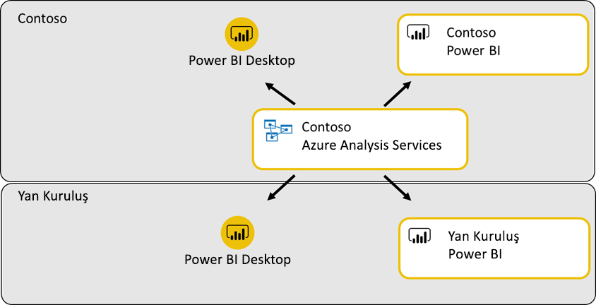

İkinci yaklaşım, verilere erişim sağlamak üzere ilişkisel bir veri ambarı oluşturmak için [Azure SQL veritabanı](https://azure.microsoft.com/services/sql-database/) 'ndan yararlanır. Bu, Azure Analysis Services yaklaşımına benzer şekilde çalışır, ancak satır düzeyi güvenlik gibi bazı yetenekler, yan kuruluşlar arasında dağıtılması ve bakımını yapmak zor olabilir.

Daha karmaşık yaklaşımlar da olasıdır, ancak yukarıdaki en yaygın olarak en sık kullanılan yaklaşım vardır.

### Durum 3: iş ortakları genelinde paylaşılan ortam

Contoso, paylaşılan bir derleme satırında bir otomobil oluşturmak için bir rakiple ortaklığı girebilir, ancak farklı markalara veya farklı bölgelerde araç dağıtmak için. Bu, kuruluşlar genelinde veri, zekası ve analizler için kapsamlı işbirliği ve birlikte sahipliğin yapılmasını gerektirir. Bu yapı aynı zamanda bir danışmanın ekibinin bir istemci için proje tabanlı analizler olabileceği danışmanlık hizmetleri sektöründe de yaygındır.

Uygulamada, bu yapılar aşağıdaki görüntüde gösterildiği gibi karmaşıktır ve personelin bakımını ister. Etkili olması için bu yapı, kuruluşların ilgili Power BI kiracılar için satın alınan Power BI Pro lisanslarını yeniden kullanmasına izin verdiğinden Power BI içerik özelliğinin şirketler arası düzenlemesini ve yönetimini kullanır.

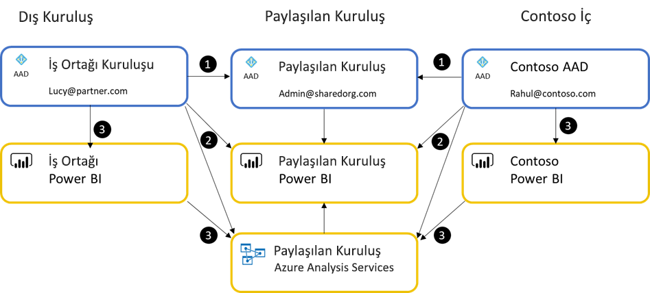

Paylaşılan bir Power BI kiracı oluşturmak için bir Azure Active Directory oluşturulması ve bu Active Directory 'deki bir kullanıcı için en az bir Power BI Pro Kullanıcı hesabının satın alınması gerekir. Bu Kullanıcı, gerekli kullanıcıları paylaşılan kuruluşa davet eder. Bu senaryoda, contoso kullanıcıları paylaşılan kuruluşun Power BI içinde çalıştıklarında dış Kullanıcı olarak kabul edilir.

İşlem aşağıdaki gibidir:

1. Paylaşılan kuruluş yeni bir Azure Active Directory olarak oluşturulmuştur ve yeni kuruluşta en az bir kullanıcı hesabı oluşturulur. Bu kullanıcıya atanmış bir Power BI Pro Lisansı olmalıdır.
2. Bu Kullanıcı daha sonra bir Power BI kiracı oluşturur ve gerekli kullanıcıları contoso ve Iş ortağı kuruluştan davet eder. Kullanıcı aynı zamanda Azure Analysis Services gibi paylaşılan veri varlıkları da oluşturur. Contoso ve Iş ortağının kullanıcıları, paylaşılan kuruluşun Power BI Konuk Kullanıcı olarak erişebilir. Power BI içinde içerik düzenleme ve yönetme izni varsa, dış kullanıcılar Power BI giriş, çalışma alanları, karşıya yükleme veya düzenleme ve rapor paylaşma olabilir. Genellikle tüm paylaşılan varlıklar, paylaşılan kuruluştan depolanır ve bunlara erişir.
3. Tarafların işbirliğini nasıl kabul ettiğinize bağlı olarak, her bir kuruluşun, paylaşılan veri ambarı varlıklarını kullanarak kendi özel verilerini ve analizlerini geliştirmesi mümkündür. Bunlar, dahili Power BI kiracılarını kullanarak bunları kendi iç kullanıcılarına dağıtabilirler.

### Durum 4: yüzlerce veya binlerce harici iş ortağına dağıtım

Contoso, bir tedarikçi için bir üdiator güvenilirlik raporu oluşturmuş olsa da, contoso isteklerinizi, yüzlerce tedarikçi için standartlaştırılmış bir rapor kümesi oluşturmaya yönelik olarak sunulmuştur. Bu, contoso 'nun tüm tedarikçilerin geliştirmeler yapması veya üretim kusurlarını çözmesi için ihtiyaç duydukları analizler olmasını sağlar.

Bir kuruluşun birçok harici kullanıcıya/kuruluşa standartlaştırılmış veri ve Öngörüler dağıtması gerektiğinde, hızlı bir şekilde ve kapsamlı geliştirme maliyeti olmadan bir bı portalı oluşturmak için Power BI Apps senaryosunun geçici veya planlı paylaşımını kullanabilirler. Power BI bir uygulama kullanarak böyle bir portal oluşturma işlemi, örnek olay Incelemesi: Power BI + Azure AD B2B ile bir bı portalı oluşturma-bu belgenin ilerleyen bölümlerinde adım adım yönergeler ele alınmıştır.

Bu durumun yaygın bir çeşidi, bir kuruluşun, özellikle de Power BI ile Azure B2C 'yi kullanmak için tüketicilerle Öngörüler paylaşmaya çalışıldığında olduğu durumdur. Power BI Azure B2C 'yi yerel olarak desteklemez. Bu durum için seçenekleri değerlendiriyorsanız, bu belgenin ilerleyen kısımlarında yer aldığı yaygın alternatif seçeneğinde Alternatif seçenek 2 ' yi kullanmayı düşünün.

## Örnek olay Incelemesi: Power BI + Azure AD B2B kullanarak bı portalı oluşturma – adım adım yönergeler

Power BI Azure AD B2B tümleştirmesi, contoso 'yu, ziyaretçi kullanıcılarına kendi bı portalına güvenli erişim sağlamak için sorunsuz ve sorunsuz bir yol sağlar. Contoso bu ayarı üç adımdan oluşabilir:

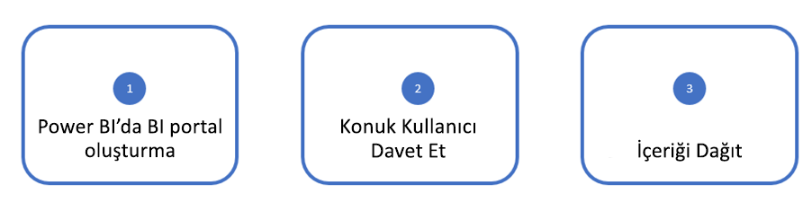

1. Power BI’da BI portal oluşturma

    Contoso ilk görevi Power BI ' de bı portalını oluşturmaktır. Contoso BI portalı, çok sayıda iç ve Konuk Kullanıcı için kullanılabilir hale getirilen, amaç tarafından oluşturulan panolar ve raporlar koleksiyonundan oluşur. Bunu Power BI yapmanın önerilen yolu Power BI bir uygulama oluşturmak içindir. [Power BI uygulamalar](https://powerbi.microsoft.com/blog/distribute-to-large-audiences-with-power-bi-apps/)hakkında daha fazla bilgi edinin.

- Contoso BI ekibi Power BI bir çalışma alanı oluşturuyor

    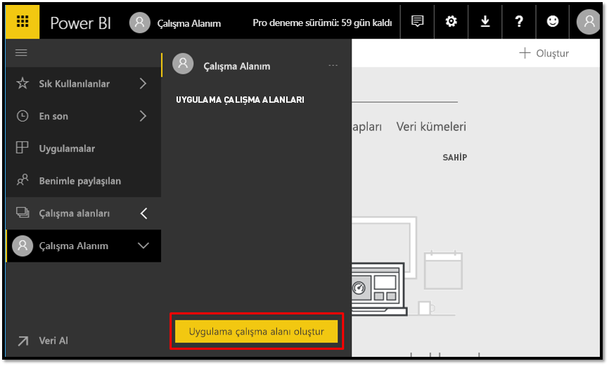
    

- Diğer yazarlar çalışma alanına eklenir

    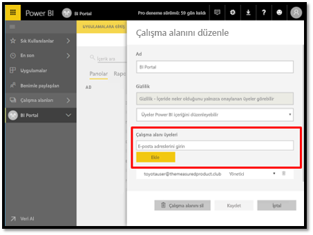

- İçerik çalışma alanı içinde oluşturuldu

    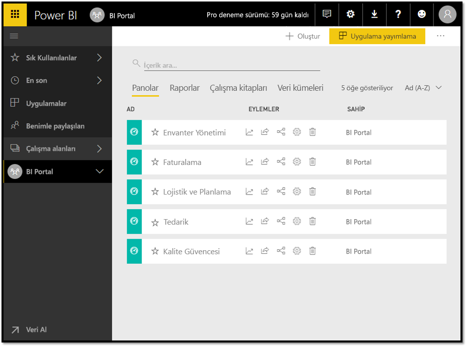

    İçerik bir çalışma alanında oluşturuldığına göre, contoso iş ortağı kuruluşlarında Konuk kullanıcıları bu içeriği tüketmek üzere davet etmeye hazırdır.

2. Konuk Kullanıcı Davet Et

    Contoso 'nun Konuk kullanıcıları Power BI ' deki bı portalına davet etmesi için iki yol vardır:

    * Planlı davetler
    * Geçici davetler

    **Planlı davetler**

    Bu yaklaşımda contoso, Konuk kullanıcıları Azure AD 'ye önceden davet eder ve Power BI içeriği bunlara dağıtır. Contoso, Azure portal veya PowerShell kullanarak Konuk kullanıcıları davet edebilir. Azure portal Konuk kullanıcıları davet etme adımları aşağıda verilmiştir:

    - Contoso Azure AD Yöneticisi **, tüm kullanıcılar > yeni Konuk kullanıcı > Kullanıcılar ve gruplar > Azure portal > Azure Active Directory** gider

    

    - Konuk kullanıcılar için bir davet iletisi ekleyin ve davet et 'e tıklayın

    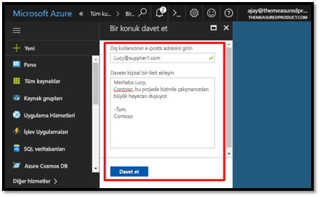

    > [!NOTE]
    > Azure portal Konuk kullanıcıları davet etmek için kiracınızın Azure Active Directory için yönetici olmanız gerekir.

    Contoso birçok konuk kullanıcıyı davet etmek isterse, PowerShell 'i kullanarak bunu yapabilir. Contoso 'nun Azure AD yöneticisi, tüm konuk kullanıcıların e-posta adreslerini bir CSV dosyasında depolar. [Azure ACTIVE DIRECTORY B2B işbirliği kodu ve PowerShell örnekleri](https://docs.microsoft.com/azure/active-directory/b2b/code-samples) ve yönergeleri aşağıda verilmiştir.

    Davetden sonra, Konuk kullanıcılar davet bağlantısına sahip bir e-posta alır.

    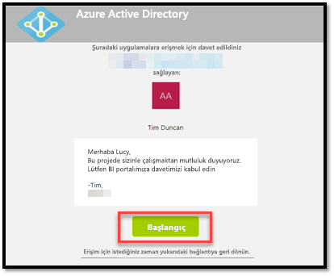

    Konuk kullanıcılar bağlantıya tıkladıktan sonra, contoso Azure AD kiracısındaki içeriğe erişebilirler.

    > [!NOTE]
    > [Burada](https://docs.microsoft.com/azure/active-directory/active-directory-b2b-invitation-email)açıklandığı gıbı Azure AD markalama özelliğini kullanarak davetiye e-postası düzeninin değiştirilmesi mümkündür.

    **Geçici davetler**

    Contoso, bir süre önce davet etmek istediği tüm konuk kullanıcılarını bilmezse ne olur? Ya da, bı portalını oluşturan contoso analistinin içeriği Konuk kullanıcılara dağıtmak istiyor musunuz? Bu senaryoyu Ayrıca, geçici davetlerle Power BI de destekliyoruz.

    Analist yalnızca dış kullanıcıları yayımlarken uygulamanın erişim listesine ekleyebilir. Konuk kullanıcılar bir davet alır ve kabul ettikten sonra otomatik olarak Power BI içeriğine yönlendirilir.

    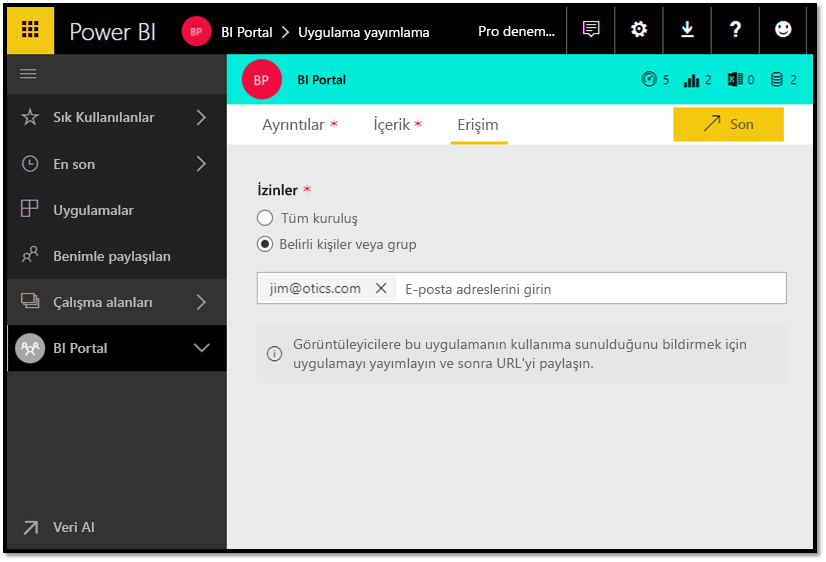

    > [!NOTE]
    > Davetlere yalnızca bir dış Kullanıcı kuruluşunuza ilk kez davet edilmeleri gerekir.

3. İçeriği Dağıt

    Artık contoso 'nun bı ekibi, bı portalını oluşturmuş ve konuk kullanıcıları davet ettiği için, konuk kullanıcıların uygulamaya erişmesine ve yayımlamasına izin vererek, bu kişilerin portalını son kullanıcılarına dağıtabilirler. Daha önce contoso kiracısına eklenen konuk kullanıcıların adlarını otomatik olarak tamamlar Power BI. Diğer Konuk kullanıcılara geçici davetler de bu noktada eklenebilir.

    > [!NOTE]
    > Dış kullanıcılar için uygulamaya erişimi yönetmek üzere güvenlik grupları kullanıyorsanız, planlı davetler yaklaşımını kullanın ve uygulamaya erişmesi gereken her bir dış kullanıcıyla doğrudan uygulama bağlantısını paylaşabilirsiniz. Aksi takdirde, dış kullanıcı uygulamanın içinden içerik yükleyemeyebilir veya içeriği görüntüleyemeyebilir. _

    Konuk kullanıcılar, uygulamanın bağlantısını içeren bir e-posta alır.

    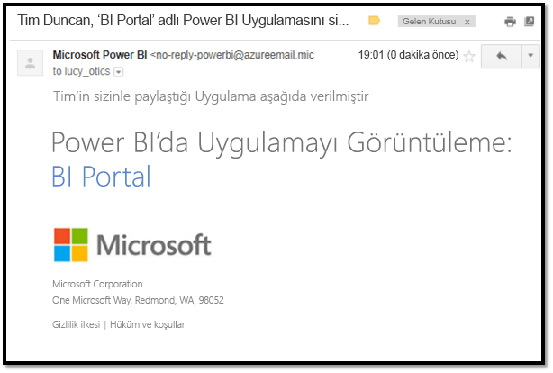

    Bu bağlantıya tıklanınca, Konuk kullanıcılardan kendi kuruluşlarının kimliğiyle kimlik doğrulaması yapması istenir.

    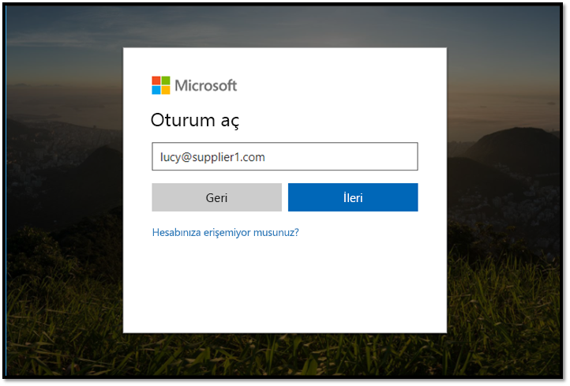

    Kimlik doğrulaması başarılı olduktan sonra Contoso BI uygulamasına yönlendirilir.

    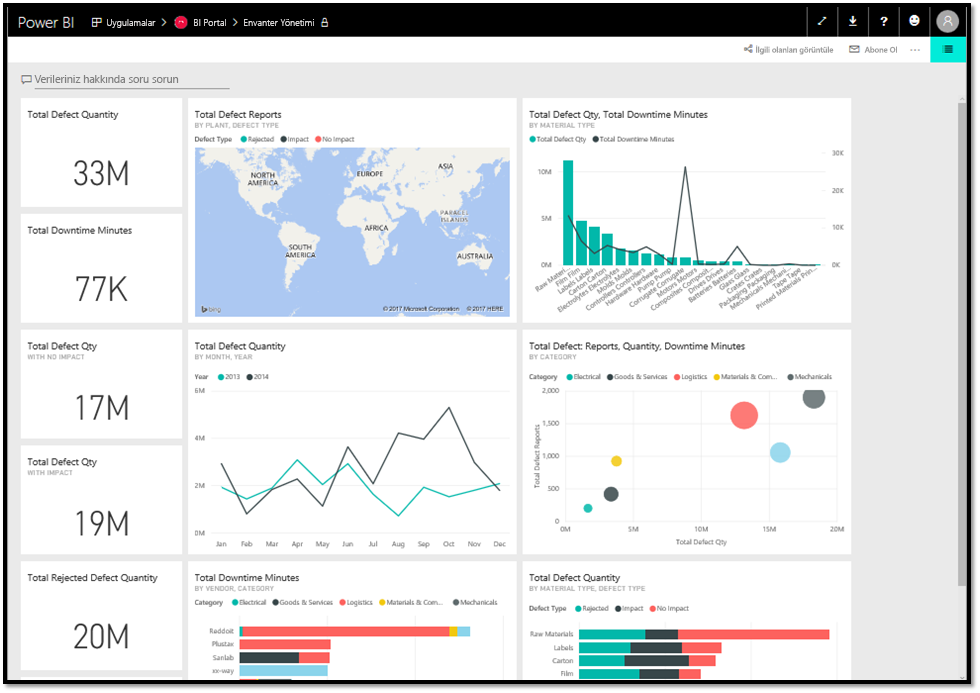

    Konuk kullanıcılar daha sonra contoso uygulamasına e-postadaki bağlantıya tıklayarak veya bağlantıyı işaretleyerek bu uygulamayı alabilir. Contoso, bu bağlantıyı konuk kullanıcıların zaten kullandığı mevcut extranet portalına ekleyerek Konuk kullanıcılar için de daha kolay hale getirir.

4. Sonraki adımlar

    Contoso, bir Power BI uygulaması ve Azure AD B2B kullanarak, tedarikçilerinin kendi tedarikçileri için kod içermeyen bir şekilde hızlı bir şekilde bir bı portalı oluşturabildi. Bu, standartlaştırılmış analizler tarafından ihtiyaç duyulan tüm tedarikçilere dağıtımı büyük ölçüde basitleştirilmiştir.

    Örnek, tek bir ortak raporun tedarikçiler arasında nasıl dağıtılabileceğini gösterdi, Power BI çok daha fazla ilerleyebiliriz. Her ortağın yalnızca kendileriyle ilgili verileri gördüğünden emin olmak için, satır düzeyi güvenlik, rapor ve veri modeline kolayca eklenebilir. Bu belgede daha sonra gelen dış iş ortakları için veri güvenliği bu işlemi ayrıntılarda açıklar.

    Genellikle bireysel raporların ve panoların mevcut bir portala katıştırılması gerekir. Bu, örnekte gösterilen birçok tekniği yeniden kullanmak için de gerçekleştirilebilir. Ancak, bu durumlarda, raporları veya panoları doğrudan bir çalışma alanından eklemek daha kolay olabilir. Kullanıcılara gereken güvenlik iznini davet etme ve atama süreci aynı kalır.

## Supplier1 'in altında, contoso kiracısından Power BI içeriğe nasıl erişebilmektedir?

Contoso 'nun iş ortağı kuruluşlarında Konuk kullanıcılara sorunsuz bir şekilde Power BI nasıl dağıtabileceğini gördüğünüze göre, bu, BT 'nin altında nasıl çalıştığını inceleyelim.

Contoso, dizinine [lucy@supplier1.com](mailto:lucy@supplier1.com) davet edildiğinde, azure ad [Lucy@supplier1.com](mailto:Lucy@supplier1.com) ve contoso Azure AD kiracısı arasında bir bağlantı oluşturur. Bu bağlantı, Azure AD 'nin contoso kiracısındaki içeriğe Lucy@supplier1.com erişebileceğini bilmesini sağlar.

Lucy, contoso 'nun Power BI uygulamasına erişmeye çalıştığında, Azure AD, kullanıcının contoso kiracısına erişebildiğini doğrular ve sonra, contoso kiracısındaki içeriğe erişmek için bilgisayarın kimliğinin doğrulandığını belirten bir belirteç Power BI sağlar. Power BI, bu belirteci yetkilendirmek için kullanır ve Lucy 'in contoso Power BI uygulamasına erişimi olduğundan emin olun.

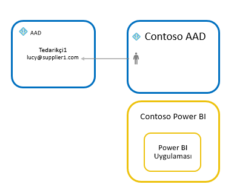

Power BI Azure AD B2B tümleştirmesi tüm iş e-posta adresleriyle birlikte çalışmaktadır. Kullanıcının bir Azure AD kimliği yoksa, bir tane oluşturması istenebilir. Aşağıdaki görüntüde ayrıntılı akış gösterilmektedir:

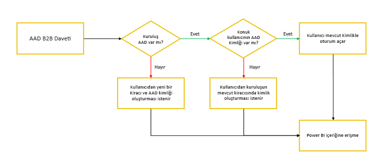

Azure AD hesabının dış tarafın Azure AD 'de kullanılacağını veya oluşturulduğunu bilmek önemlidir, bu, bilgisayarın kendi Kullanıcı adı ve parolasını kullanmasını ve kimlik bilgilerinin, her seferinde diğer kiracılarda çalışmayı otomatik olarak durdurmasını olanaklı kılar. Bu, kurumda Azure AD kullandığında şirketten ayrıldığında.

## Lisanslama

Contoso, kuruluşların ve iş ortağı kuruluşlarından konuk kullanıcıların Power BI içeriğe erişimine sahip olmasını sağlamak için üç yaklaşımdan birini seçebilir.

> [!NOTE]
> _Azure AD B2B's ücretsiz katmanı, Azure AD B2B ile Power BI kullanmak için yeterlidir. Dinamik gruplar gibi bazı gelişmiş Azure AD B2B özellikleri için ek lisans gerekir. Daha fazla bilgi için lütfen Azure AD B2B belgelerine bakın:_ [ _https://docs.microsoft.com/azure/active-directory/b2b/licensing-guidance_ ](https://docs.microsoft.com/azure/active-directory/b2b/licensing-guidance)

### Yaklaşım 1: contoso Power BI Premium kullanır

Contoso, bu yaklaşımla Power BI Premium kapasiteyi satın alır ve bu kapasiteye bı portalı içeriğini atar. Bu, konuk kullanıcıların iş ortağı kuruluşlarından Power BI lisansı olmadan contoso Power BI uygulamasına erişmesini sağlar.

Dış kullanıcılar ayrıca, Power BI Premium içinde içerik kullanılırken yalnızca Power BI "ücretsiz" kullanıcılara sunulan tüketim deneyimlerine tabidir.

Contoso, daha fazla yenileme ücretleri, adanmış kapasite ve büyük model boyutları gibi uygulamalar için diğer Power BI Premium özelliklerinden de yararlanabilir.

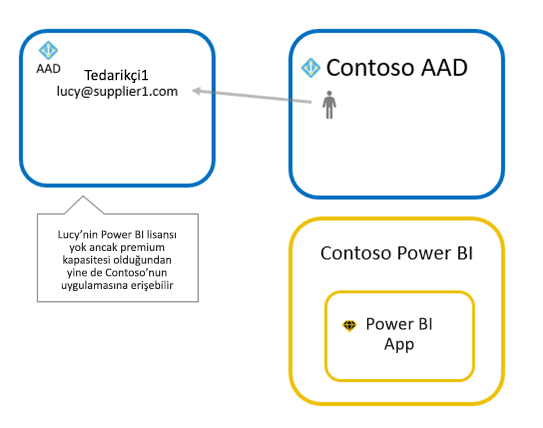

### 2\. yaklaşım: contoso, Konuk kullanıcılara Power BI Pro lisansları atar

Bu yaklaşım sayesinde contoso, iş ortağı kuruluşlarından Konuk kullanıcılara Pro lisansları atar. Bu, contoso 'nun Microsoft 365 Yönetim merkezinden yapılabilir. Bu, konuk kullanıcıların iş ortağı kuruluşlarından, bir lisansı satın almadan contoso Power BI uygulamasına erişmesini sağlar. Bu, kuruluş Power BI henüz benimsememiş dış kullanıcılarla paylaşmak için uygun olabilir.

> [!NOTE]
> Contoso Pro lisansı, yalnızca contoso kiracısındaki içeriğe erişirken Konuk kullanıcılar için geçerlidir. Pro lisansları Power BI Premium kapasitede olmayan içeriklere erişim sağlar. Ancak, bir Pro lisansına sahip dış kullanıcılar varsayılan olarak yalnızca tüketim deneyimine göre kısıtlanır. Bu, bu belgenin ilerleyen kısımlarında yer alan _Power BI içeriğini düzenlemek ve yönetmek için dış kullanıcıları etkinleştirme_ bölümünde açıklanan yaklaşım kullanılarak değiştirilebilir.

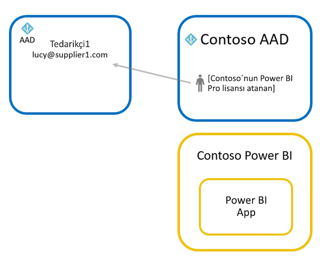

### Yaklaşım 3: Konuk kullanıcılar kendi Power BI Pro lisansını getirir

Bu yaklaşımla, 1. tedarikçide Power BI Pro bir lisans atar. Bu lisans, daha sonra contoso Power BI uygulamasına bu lisansla erişebilirler. Lucy, dış bir Power BI ortamına erişirken kendi kuruluşlarından Pro lisansını kullanabilmesi için, bu yaklaşım bazen _kendi lisansını getir_ (KLG) olarak adlandırılır. Her iki kuruluş Power BI kullanıyorsa, bu genel analiz çözümü için avantajlı lisanslama sağlar ve dış kullanıcılara lisans atama yükünü en aza indirir.

> [!NOTE]
> 1\. tedarikçiye göre belirtilen Pro lisansı, Lucy 'in Konuk Kullanıcı olduğu tüm Power BI kiracılarına uygulanır. Pro lisansları Power BI Premium kapasitede olmayan içeriklere erişim sağlar. Ancak, bir Pro lisansına sahip dış kullanıcılar varsayılan olarak yalnızca tüketim deneyimine göre kısıtlanır. Bu, bu belgenin ilerleyen kısımlarında yer alan _Power BI içeriğini düzenlemek ve yönetmek için dış kullanıcıları etkinleştirme_ bölümünde açıklanan yaklaşım kullanılarak değiştirilebilir.

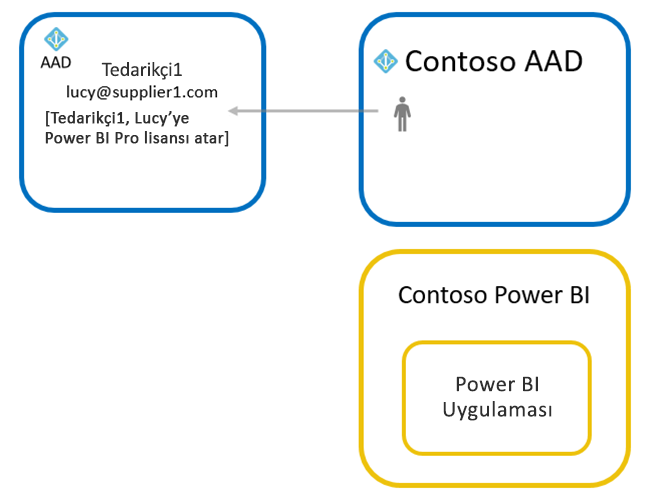

## Dış iş ortakları için veri güvenliği

Genellikle birden çok harici tedarikçiyle çalışırken, contoso 'nun her tedarikçinin verileri yalnızca kendi ürünleri hakkında görmesi gerekir. Kullanıcı tabanlı güvenlik ve dinamik satır düzeyi güvenliği, Power BI ile gerçekleştirmeyi kolaylaştırır.

### Kullanıcı tabanlı güvenlik

Power BI en güçlü özelliklerinden biri satır düzeyi güvenlik ' dir. Bu özellik contoso 'nun tek bir rapor ve veri kümesi oluşturmasına ve her kullanıcı için farklı güvenlik kuralları uygulamaya devam etmesine olanak tanır. Derinlemesine bir açıklama için bkz. [satır düzeyi güvenlik (RLS)](https://powerbi.microsoft.com/documentation/powerbi-admin-rls/).

Power BI Azure AD B2B tümleştirmesi, contoso kiracısına davet edildiklerinde, contoso 'nun Konuk kullanıcılara satır düzeyi güvenlik kuralları atamasını sağlar. Daha önce gördüğünüz gibi, contoso, planlı veya geçici davetlere göre Konuk kullanıcılar ekleyebilir. Contoso satır düzeyi güvenliği zorunlu kılmak istiyorsa, Konuk kullanıcıları daha önce eklemek ve içeriği paylaşmadan önce güvenlik rollerine atamak için planlı davetleri kullanmanız önemle önerilir. Contoso bunun yerine geçici davetleri kullanıyorsa, konuk kullanıcıların herhangi bir veri göremeyecek kısa bir süre olabilir.

> [!NOTE]
> Geçici davetleri kullanırken RLS tarafından korunan verilere erişmenin bu gecikmesi, kullanıcıların aldığı e-postada bir paylaşım bağlantısı açarken boş veya kopuk görünümlü raporlar/panolar göreceği için BT ekibinizdeki istekleri desteklemeye yol açabilir. Bu nedenle, bu senaryoda planlı davetlerinizi kullanmanız önemle önerilir. * *

Bunun için bir örnek ile bunu inceleyelim.

Daha önce bahsedildiği gibi, contoso dünyanın her yerindeki tedarikçilere sahiptir ve tedarikçinin kuruluşlarından gelen kullanıcıların, yalnızca kendi bölgesindeki verilerden öngörü elde ettiğinizden emin olmak ister.  Ancak contoso kullanıcıları tüm verilere erişebilir. Contoso, birkaç farklı rapor oluşturmak yerine tek bir rapor oluşturur ve verileri görüntüleyen kullanıcıyı temel alarak filtreler.

Contoso 'nun verileri kimin bağlanıına bağlı olarak filtreleyediğinden emin olmak için Power BI masaüstünde iki rol oluşturulur. Biri SalesTerritory "Avrupa" ve diğeri "Kuzey Amerika" için tüm verileri filtrelemeye yöneliktir.

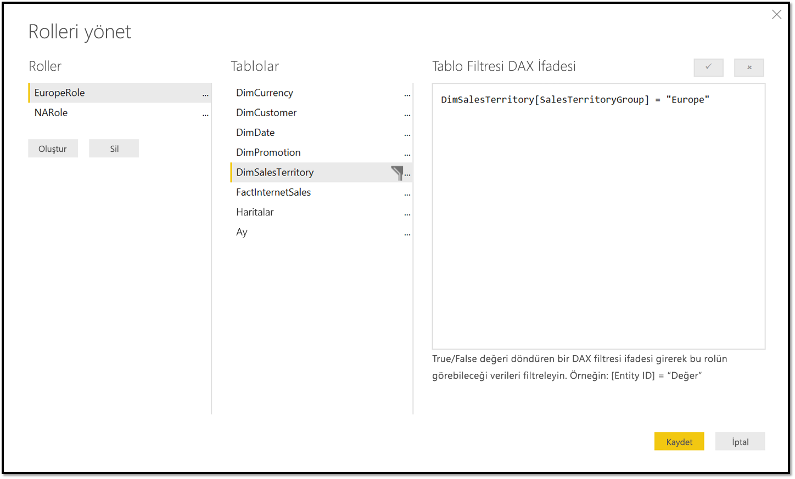

Raporda her bir rol tanımlandığında, bu kullanıcılara herhangi bir veriye erişmek için belirli bir rol atanması gerekir. Rol atama Power BI hizmeti içinde gerçekleşir ( **veri kümeleri > güvenliği** )

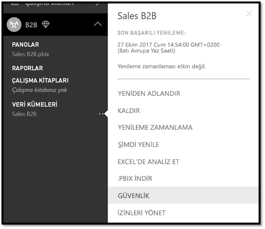

Bu, Contoso BI ekibinin oluşturdukları iki rolü görebilecekleri bir sayfa açar.  Artık contoso 'nun bı ekibi, rollere Kullanıcı atayabilir.

Contoso örneğinde, Avrupa rolüne "[adam@themeasuredproduct.com](mailto:adam@themeasuredproduct.com)" e-posta adresine sahip bir iş ortağı kuruluşunda Kullanıcı ekleniyor:

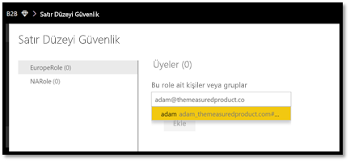

Bu, Azure AD tarafından çözümlendiğinde, adın, eklenmek üzere bir pencerede gösterilmesini görebilir:

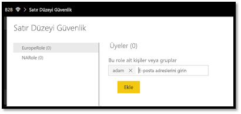

Artık bu kullanıcı kendileriyle paylaşılan uygulamayı açtığında yalnızca Avrupa 'daki verileri içeren bir rapor görür:

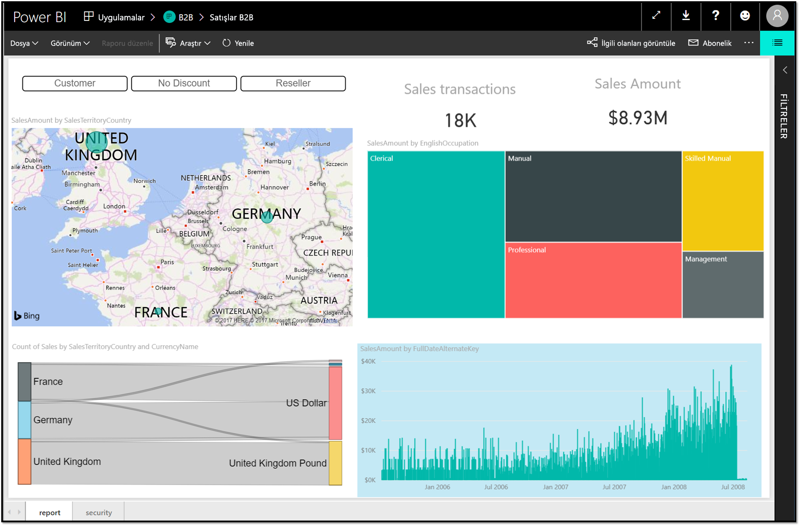

### Dinamik satır düzeyi güvenliği

Diğer bir ilginç konu, dinamik satır düzeyi güvenliği 'nin (RLS) Azure AD B2B ile nasıl çalıştığını görtir.

Kısacası, dinamik satır düzeyi güvenliği, Power BI bağlanan kişinin kullanıcı adına göre modeldeki verileri filtreleyerek işe yarar. Kullanıcı grupları için birden çok rol eklemek yerine, modeldeki kullanıcıları tanımlarsınız. Burada ayrıntılı olarak açıklanmaktadır. Kasper da Jong, [Power BI Desktop dinamik güvenlik konusu sayfası](https://www.kasperonbi.com/power-bi-desktop-dynamic-security-cheat-sheet/)ve [Bu teknik](https://msdn.microsoft.com/library/jj127437.aspx) incelemede, satır düzeyindeki güvenliğin tüm özellikleri hakkında ayrıntılı bir yazma işlemi sunar.

Küçük bir örneğe bakalım-contoso Sales ile gruplar hakkında basit bir rapora sahiptir:

Artık bu raporun iki konuk kullanıcıyla paylaşılması gerekir. Dahili Kullanıcı her şeyi görebilir, ancak Konuk kullanıcılar yalnızca erişimi olan grupları görebilirler. Bu, verileri yalnızca Konuk kullanıcılar için filtrelemeniz gerektiği anlamına gelir. Contoso, verileri uygun şekilde filtrelemek için Teknik İnceleme ve blog gönderisine göre dinamik RLS modelini kullanır. Bu, contoso 'nun veri adlarını verilere eklemesi anlamına gelir:

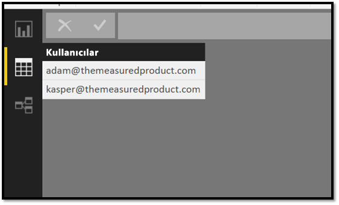

Sonra contoso, verileri doğru ilişkiler ile uygun şekilde filtreleyen doğru veri modelini oluşturur:

Oturum açmış olan kişileri temel alarak verileri otomatik olarak filtrelemek için Contoso 'nun, bağlanan kullanıcıya geçen bir rol oluşturması gerekir. Bu durumda, contoso iki rol oluşturur: ilki, Kullanıcı tablosunu Power BI oturum açan kullanıcının geçerli kullanıcı adıyla filtreleyen "SecurityRole" (Azure AD B2B Konuk kullanıcıları için bile geçerlidir).

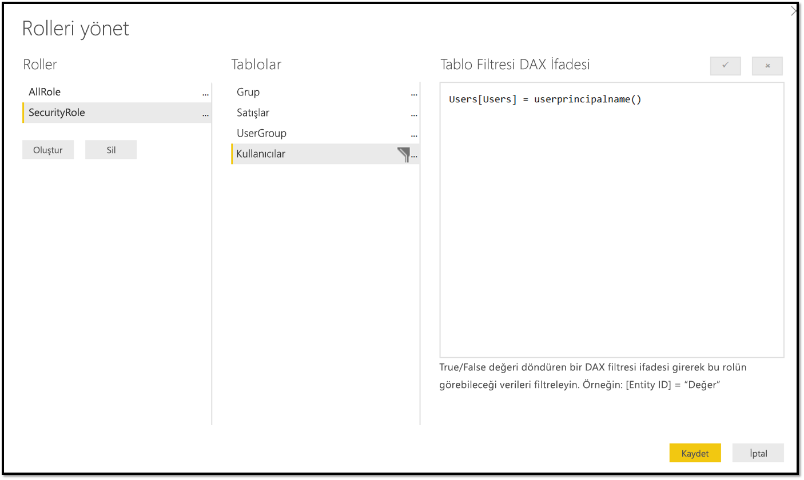

Contoso, her şeyi görebilen iç kullanıcılar için başka bir "AllRole" de oluşturur. bu rolde herhangi bir güvenlik koşulu yoktur.

Contoso, Power BI Masaüstü dosyasını hizmetine yükledikten sonra, Konuk kullanıcıları "SecurityRole" ve dahili kullanıcılara "AllRole" atayabilir.

Artık, Konuk kullanıcılar raporu açtığında yalnızca A grubundan satışları görürler:

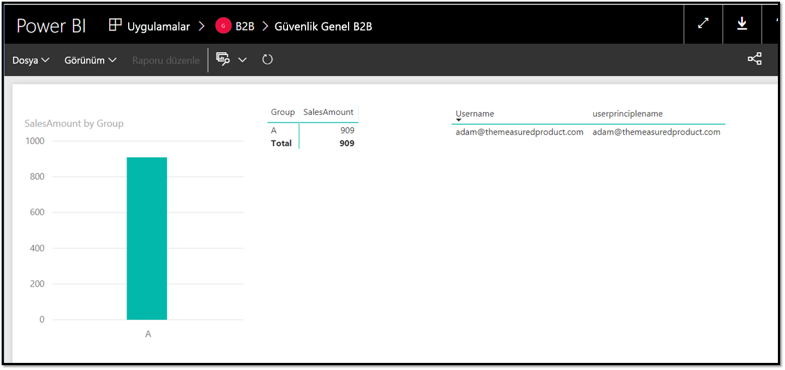

Sağdaki matriste Kullanıcı adı () ve USERPRINCIPALNAME () işlevinin sonucunu, hem konuk kullanıcıların e-posta adresini döndürün.

Artık iç Kullanıcı tüm verileri görmek için alır:

Görebileceğiniz gibi, dinamik RLS hem iç hem de Konuk kullanıcılarla birlikte çalışmaktadır.

> [!NOTE]
> Bu senaryo, Azure Analysis Services bir model kullanılırken de geçerlidir. Azure Analysis Service, genellikle Power BI aynı Azure AD 'ye bağlanır; bu durumda, ayrıca Azure AD B2B aracılığıyla davet edilen konuk kullanıcıları da bilir Azure Analysis Services.

## Şirket içi veri kaynaklarına bağlanma

Power BI, contoso 'nın [SQL Server Analysis Services](https://powerbi.microsoft.com/documentation/powerbi-gateway-enterprise-manage-ssas/) veya Şirket [içi veri ağ geçidine](https://powerbi.microsoft.com/documentation/powerbi-gateway-onprem/)doğrudan teşekkürler [SQL Server](https://powerbi.microsoft.com/documentation/powerbi-gateway-kerberos-for-sso-pbi-to-on-premises-data/) gibi şirket içi veri kaynaklarından yararlanmasını sağlar. Power BI ile birlikte kullanılan aynı kimlik bilgileriyle bu veri kaynaklarında oturum açmak bile mümkündür.

> [!NOTE]
> Power BI kiracınıza bağlanmak üzere bir ağ geçidi yüklerken kiracınızda oluşturulmuş bir Kullanıcı kullanmanız gerekir. Dış kullanıcılar bir ağ geçidi yükleyemez ve kiracınıza bağlanamaz. _

Dış kullanıcılar için, dış kullanıcılar genellikle şirket içi AD tarafından bilinmediği için bu daha karmaşık olabilir. Power BI, contoso yöneticilerinin dış kullanıcı adlarını, [veri Analysis Services kaynağınızı yönetme](https://powerbi.microsoft.com/documentation/powerbi-gateway-enterprise-manage-ssas/)bölümünde açıklandığı gibi iç kullanıcı adlarıyla eşlemelerine izin vererek bunun için geçici bir çözüm sunar. Örneğin, [lucy@supplier1.com](mailto:lucy@supplier1.com) [Lucy\_supplier1\_com #EXT@contoso.com](mailto:lucy_supplier1_com)ile eşlenebilir.

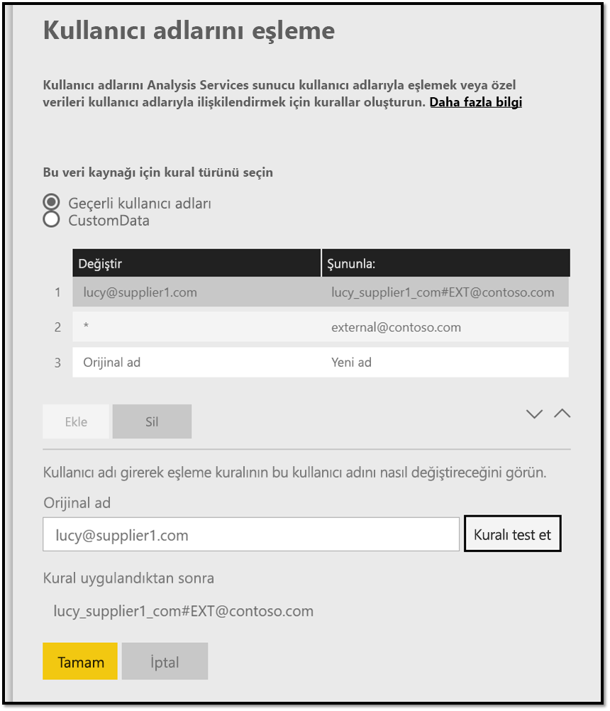

Bu yöntem, contoso 'nun yalnızca bir kullanıcısı varsa veya contoso tüm dış kullanıcıları tek bir dahili hesapla eşleyebilir ise bu yöntem uygundur. Her kullanıcının kendi kimlik bilgilerine ihtiyacı olan daha karmaşık senaryolar için, [veri kaynağınızı yönetme-Analysis Services](https://powerbi.microsoft.com/documentation/powerbi-gateway-enterprise-manage-ssas/)açıklandığı şekilde eşlemeyi yapmak üzere [Özel ad öznitelikleri](https://technet.microsoft.com/library/cc961737.aspx) kullanan daha gelişmiş bir yaklaşım vardır. Bu, contoso yöneticisinin Azure AD 'nizin her kullanıcısı için bir eşleme tanımlamasına olanak tanır (Ayrıca dış B2B kullanıcıları).  Bu öznitelikler, betik veya kod kullanarak AD nesne modeli aracılığıyla ayarlanabilir, böylece contoso, davet veya zamanlanan bir temposunda eşlemeyi tamamen otomatikleştirebilir.

## Dış kullanıcıların Power BI içinde içerik düzenlemesine ve yönetmesine olanak sağlama

Contoso, dış kullanıcıların daha önce Power BI içeriği düzenleme ve Yönetimi bölümünde açıklandığı gibi kuruluş içinde içerik katkıda bulunmasına izin verebilir.

> [!NOTE]
> Kuruluşunuzun Power BI içeriğini düzenlemek ve yönetmek için kullanıcının çalışma alanım dışında bir çalışma alanında Power BI Pro lisansına sahip olması gerekir. Kullanıcılar bu belgenin _lisanslama_ bölümünde açıklandığı gibi Pro lisanslarını alabilir.

Power BI Yönetici portalı, **dış konuk kullanıcıların kiracı ayarları 'ndaki kuruluş ayarında içeriği düzenlemesine ve yönetmesine izin ver** ' i sağlar. Varsayılan olarak, ayar devre dışı olarak ayarlanır, yani dış kullanıcılar varsayılan olarak kısıtlanmış bir salt okuma deneyimi alır. Bu ayar, UserType 'ın Azure AD 'de Konuk olarak ayarlandığı kullanıcılar için geçerlidir. Aşağıdaki tabloda, Kullanıcıtürlerine ve ayarların nasıl yapılandırıldığına bağlı olarak davranış kullanıcıları deneyimi açıklanmaktadır.

| **Azure AD 'de Kullanıcı türü** | **Dış konuk kullanıcıların içerik ayarını düzenlemesine ve yönetmesine izin ver** | **Durum** |
| --- | --- | --- |
| Konuk | Kullanıcı için devre dışı (varsayılan) | Yalnızca öğe başına tüketim görünümü. Konuk kullanıcıya gönderilen bir URL aracılığıyla görüntülenen raporlara, panolara ve uygulamalara salt okuma erişimi sağlar. Power BI Mobil uygulamalar, Konuk kullanıcıya salt okunurdur bir görünüm sağlar. |
| Konuk | Kullanıcı için etkinleştirildi | Dış Kullanıcı tam Power BI deneyimine erişebilir, ancak bazı özellikler kullanılamaz. Dış Kullanıcı, Power BI hizmeti URL 'sini Power BI ' de, kiracı bilgileri dahil olmak üzere kullanarak oturum açması gerekir. Kullanıcı, giriş deneyimini, çalışma alanım 'ı ve izinleri temel alarak içeriğe gözatabilir, görüntüleyebilir ve oluşturabilir.    Power BI Mobil uygulamalar, Konuk kullanıcıya salt okunurdur bir görünüm sağlar. |

> [!NOTE]
> Azure AD 'deki dış kullanıcılar, UserType üyesine de ayarlanabilir. Bu şu anda Power BI desteklenmiyor.

Power BI yönetici portalında, bu ayar aşağıdaki görüntüde gösterilmiştir.

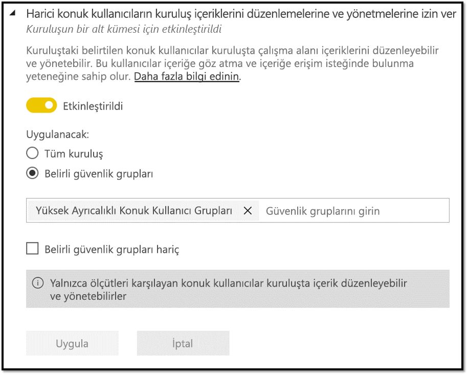

Konuk kullanıcılar salt okunurdur ve içeriği düzenleyebilir ve yönetebilir. Varsayılan ayar devre dışıdır, yani tüm konuk kullanıcılar salt okuma deneyimidir. Power BI Yöneticisi, kuruluştaki tüm konuk kullanıcılar için ya da Azure AD 'de tanımlanan belirli güvenlik grupları için ayarı etkinleştirebilir. Aşağıdaki görüntüde, contoso Power BI Yöneticisi, Azure AD 'de hangi dış kullanıcıların contoso kiracısında içerik düzenleyip yönetebileceğini yönetmek için bir güvenlik grubu oluşturdu.

Bu kullanıcıların Power BI oturum açmasını sağlamak için kiracı URL 'sini sağlayın. Kiracı URL'sini bulmak için şu adımları izleyin.

1. Power BI hizmeti, üst menüdeki yardım ( **?** ) **Power BI**.
2. **Kiracı URL 'sinin**yanındaki değeri arayın. Bu, Konuk kullanıcılarınızla paylaşabileceğiniz kiracı URL 'sidir.

    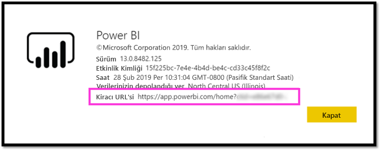

Dış konuk kullanıcıların kuruluştaki içeriği düzenlemesine ve yönetmesine Izin ver ' i kullanırken, belirtilen Konuk kullanıcılar kuruluşunuzun Power BI erişim sağlar ve iznine sahip oldukları tüm içerikleri görür. Evden erişebilir, çalışma alanlarına gözatabilir ve içeriğe katkıda bulunabilir, erişim listesinde oldukları uygulamaları yükleyebilir ve çalışma alanım vardır. Yeni çalışma alanı deneyiminin kullanıldığı çalışma alanları oluşturabilir ve bu çalışma alanlarının Yöneticisi olabilir.

> [!NOTE]
> Bu seçeneği kullandığınızda, varsayılan Azure AD ayarları, konuk kullanıcıların, daha düşük bir deneyime yol açabilecek kişiler gibi bazı özellikleri kullanmasına engel olduğundan, bu belgenin idare bölümünü gözden geçirdiğinizden emin olun. * *

Dış konuk kullanıcıların kuruluş kiracı ayarında içerik düzenlemesine ve yönetmesine Izin ver aracılığıyla etkinleştirilen Konuk kullanıcılar için bazı deneyimler kullanılamaz. Raporları güncelleştirmek veya yayımlamak için, konuk kullanıcıların karşıya yükleme Power BI Desktop dosyaları da dahil olmak üzere Power BI hizmeti Web Kullanıcı arabirimini kullanması gerekir. Aşağıdaki deneyimler desteklenmez:

- Power BI Desktop'tan Power BI hizmetine doğrudan yayımlama
- Konuk kullanıcılar Power BI hizmetindeki hizmet veri kümelerine bağlanmak için Power BI Desktop kullanamaz
- Office 365 gruplarına bağlı olan klasik çalışma alanları: Konuk Kullanıcı, bu çalışma alanları için yönetici oluşturamaz veya bu alanları kullanamaz. Bunlara üye olabilirler.
- Çalışma alanı erişim listeleri için geçici davet gönderme desteklenmez
- Konuk kullanıcılarda Excel için Power BI Publisher desteklenmez
- Konuk kullanıcılar Power BI Gateway yükleyemez ve bunu kuruluşunuza bağlayamaz
- Konuk kullanıcılar kuruluşun tamamına yayımlayan uygulamalar yükleyemez
- Konuk kullanıcılar kurumsal içerik paketlerini kullanamaz, oluşturamaz, güncelleştiremez veya yükleyemez
- Konuk kullanıcılar Excel'de Çözümle özelliğini kullanamaz
- Konuk kullanıcılar, açıklama eklemek @mentioned olamaz (Bu işlev gelecek bir yayına eklenecektir)
- Konuk kullanıcılar abonelikleri kullanamaz (Bu işlev gelecek bir sürüme eklenecektir)
- Bu özelliği kullanan konuk kullanıcıların iş veya okul hesabı olmalıdır. Kişisel hesapları kullanan Konuk kullanıcılar, oturum açma kısıtlamaları nedeniyle daha fazla sınırlama yaşar.

## İdare

### Azure AD B2B ile ilgili Power BI deneyimlerini etkileyen ek Azure AD ayarları

Azure AD B2B paylaşımı kullanılırken, Azure Active Directory Yöneticisi dış kullanıcının deneyiminin yönlerini denetler. Bunlar, kiracınızın Azure Active Directory ayarları içindeki dış işbirliği ayarları sayfasında denetlenir.

Ayarlarla ilgili ayrıntılara buradan ulaşabilirsiniz:

[https://docs.microsoft.com/azure/active-directory/b2b/delegate-invitations](https://docs.microsoft.com/azure/active-directory/b2b/delegate-invitations)

> [!NOTE]
> Varsayılan olarak, Konuk kullanıcıları izinleri sınırlı seçeneği Evet olarak ayarlanır. bu nedenle Power BI içindeki Konuk kullanıcılar özellikle de kişiler seçicisinin bu kullanıcılar için çalışmamasına ilişkin sınırlı deneyimlere sahiptir. İyi bir deneyim sağlamak için aşağıda gösterildiği gibi, Azure AD yöneticinizle birlikte çalışmak önemlidir. * *

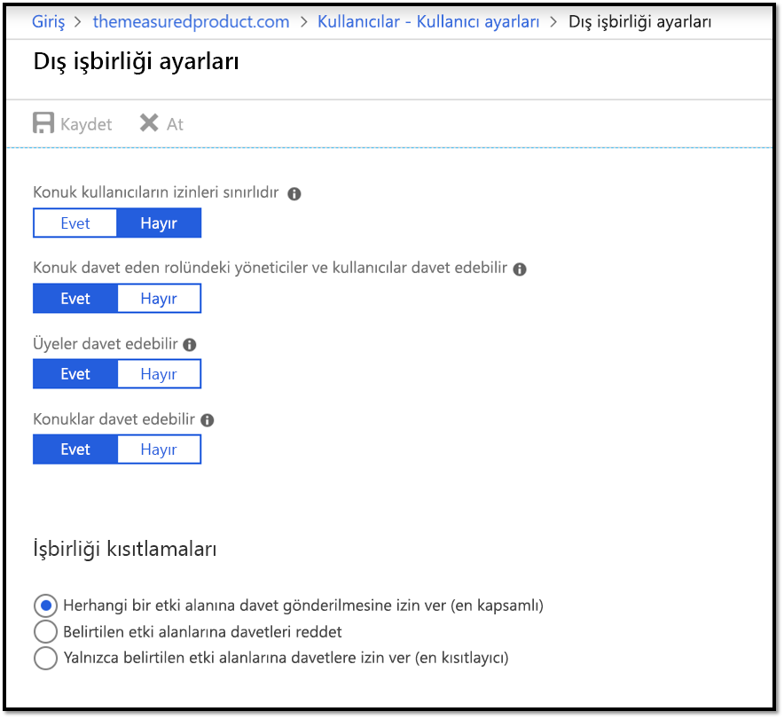

### Konuk davetlerinizi denetleme

Power BI Yöneticiler Power BI Yönetici portalını ziyaret ederek yalnızca Power BI için dış paylaşımı denetleyebilir. Ancak kiracı yöneticileri, çeşitli Azure AD ilkeleriyle dış paylaşımı da denetleyebilir.  Bu ilkeler, kiracı yöneticilerinin

- Son kullanıcılara göre davetleri kapatma
- Yalnızca konuk davet eden rolündeki Yöneticiler ve kullanıcılar davet edebilir
- Yöneticiler, konuk davet eden rolü ve Üyeler davet edebilir
- Konuklar dahil tüm kullanıcılar davet edebilir

Bu ilkeler hakkında daha fazla bilgiyi [Azure ACTIVE DIRECTORY B2B işbirliği Için temsilci davetlerinde](https://docs.microsoft.com/azure/active-directory/active-directory-b2b-delegate-invitations)bulabilirsiniz.

Dış kullanıcılara göre tüm Power BI eylemleri [Denetim portalımızda da denetlenir](https://powerbi.microsoft.com/documentation/powerbi-admin-auditing/).

### Konuk kullanıcılar için koşullu erişim ilkeleri

Contoso, contoso kiracısından içeriğe erişen Konuk kullanıcılar için koşullu erişim ilkeleri uygulayabilir. [B2B işbirliği kullanıcıları Için koşullu erişim](https://docs.microsoft.com/azure/active-directory/active-directory-b2b-mfa-instructions)bölümünde ayrıntılı yönergeler bulabilirsiniz.

## Yaygın alternatif yaklaşımlar

Azure AD B2B, kuruluşların genelinde veri ve rapor paylaşmayı kolaylaştırırken, yaygın olarak kullanılan birkaç farklı yaklaşım vardır ve belirli durumlarda üst düzey olabilir.

### Alternatif seçenek 1: iş ortağı kullanıcıları için yinelenen kimlikler oluşturma

Bu seçenekle, contoso kiracısındaki her iş ortağı kullanıcısı için aşağıdaki görüntüde gösterildiği gibi Contoso 'nun yinelenen kimliklerini el ile oluşturması gerekiyordu. Power BI içinde contoso, uygun raporlar, panolar veya uygulamalar için atanan kimliklere paylaşabilir.

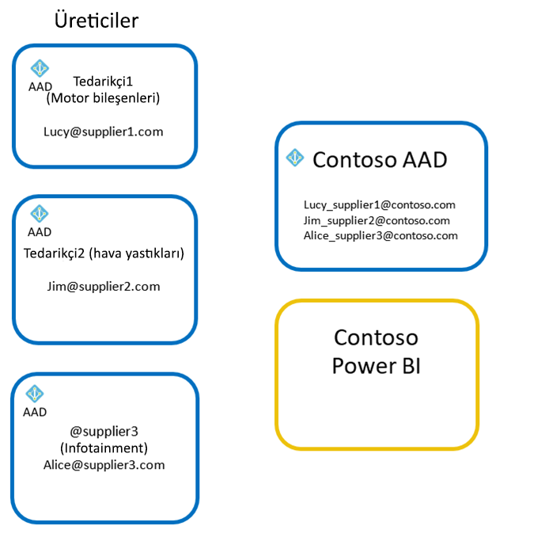

Bu alternatifi seçme nedenleri:

- Kullanıcının kimliği kuruluşunuz tarafından denetlendiğinden, e-posta, SharePoint vb. gibi tüm ilgili hizmetler kuruluşunuzun denetimi içinde de bulunur. BT yöneticileriniz parolaları sıfırlayabilir, hesaplara erişimi devre dışı bırakabilir veya bu hizmetlerde denetim etkinliklerini yapabilir.
- İş için kişisel hesapları kullanan kullanıcıların bazı hizmetlere erişmesi kısıtlıdır, böylece bir kurumsal hesap gerekebilir.
- Bazı hizmetler yalnızca kuruluşunuzun kullanıcıları üzerinde çalışır. Örneğin, Azure B2B kullanan dış kullanıcıların kişisel/mobil cihazlarındaki içeriği yönetmek için Intune 'U kullanmak mümkün olmayabilir.

Bu alternatifi seçmemek için nedenler:

- İş ortağı kuruluşlarındaki kullanıcıların iki kimlik bilgileri kümesini hatırlamaları gerekir. biri kendi kuruluşlarından içeriğe ve diğer bir deyişle, contoso 'daki içeriğe erişebilir. Bu, bu Konuk kullanıcılar için bir sorun ve çok sayıda Konuk kullanıcının bu deneyim tarafından karıştırılır.
- Contoso, bu kullanıcılara Kullanıcı başına lisans satın alıp atamalıdır. Bir kullanıcının e-posta alması veya Office uygulamaları kullanması gerekiyorsa, Power BI içerik düzenleme ve paylaşma Power BI Pro dahil olmak üzere uygun lisanslara ihtiyaç duyar.
- Contoso, dış kullanıcılar için iç kullanıcılarla karşılaştırıldığında daha sıkı yetkilendirme ve idare ilkeleri zorlamak isteyebilir. Bunun için Contoso 'nun dış kullanıcılar için şirket içi bir terminoloji oluşturması ve tüm contoso kullanıcılarının bu terminoloji hakkında eğitililmesi gerekir.
- Kullanıcı kuruluştan ayrıldığında, contoso Yöneticisi kendi hesabını el ile silene kadar contoso kaynaklarına erişime sahip olmaya devam eder
- Contoso yöneticilerinin, oluşturma, parola sıfırlama vb. dahil olmak üzere konuğun kimliğini yönetmesi gerekir.

### Alternatif seçenek 2: özel kimlik doğrulaması kullanarak özel bir Power BI Embedded uygulaması oluşturma

Contoso için başka bir seçenek de özel kimlik doğrulaması ([' veri sahibi](https://docs.microsoft.com/power-bi/developer/embed-sample-for-customers)') ile kendi özel katıştırılmış Power BI uygulamasını derlemenize yöneliktir. Birçok kuruluş, Power BI içeriğini dış iş ortaklarına dağıtmak üzere özel bir uygulama oluşturmak için zaman veya kaynaklara sahip olmasa da, bazı kuruluşlar için bu en iyi yaklaşım ve ciddi bir değerlendirme sunar.

Genellikle, kuruluşların iş ortakları için tüm kurumsal kaynaklara erişimi merkezileştirme, dahili kurumsal kaynaklardan yalıtımı sağlaması ve iş ortaklarının birçok iş ortağı desteklemesi için kolaylaştırılmış deneyimler sağlaması için mevcut iş ortağı portalları vardır. bireysel kullanıcıları.

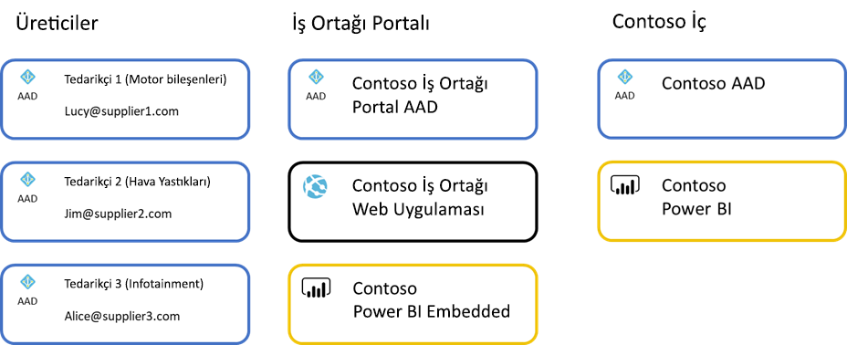

Yukarıdaki örnekte, her bir tedarikçi oturum açağından, bir kimlik sağlayıcısı olarak AAD kullanan contoso Iş Ortağı Portalı ' na sahip kullanıcılar. AAD B2B, Azure B2C, yerel kimlikler veya diğer birçok kimlik sağlayıcısı ile Federasyonu kullanabilir. Kullanıcı oturum açıp Azure Web uygulaması veya benzer bir altyapı kullanarak bir iş ortağı portalı derlemesine erişir.

Web uygulaması içinde, Power BI raporları Power BI Embedded dağıtımından katıştırılır. Web uygulaması, tedarikçilerin contoso ile etkileşime geçmesini kolaylaştıran bir yerleşik deneyimdeki raporlara ve ilgili hizmetlere erişimi daha kolay hale getirir. Bu portal ortamı, tedarikçilerin bu kaynaklara erişememesini sağlamak için Contoso iç AAD ve contoso 'nun dahili Power BI ortamından yalıtılmalıdır. Genellikle veri yalıtımı sağlamak için veriler ayrı bir Iş ortağı veri ambarında depolanır. Bu yalıtımın, dış kullanıcı sayısını kuruluşunuzun verilerine doğrudan erişimi olan, dış Kullanıcı için hangi verilerin kullanılabilir olduğunu sınırlayan ve dış kullanıcılarla yanlışlıkla paylaşımı sınırlayan bir şekilde kısıtladığından, bu yalıtımı avantajlara sahiptir.

Power BI Embedded kullanarak portal, son kullanıcılara lisans atama hakkında kaygıları kolaylaştıran, uygulama belirteci veya ana Kullanıcı ile Azure modelinde satın alınan Premium kapasiteyi kullanarak avantajdan yararlanabilir. kullanımıyla. İş ortakları bir Iş ortağının gereksinimlerine göre tasarlanan tek bir portala erişebildiğinden Portal, genel olarak daha yüksek kaliteli ve tutarlı bir deneyim sunabilir. Son olarak, Power BI Embedded tabanlı çözümler genellikle çok kiracılı olacak şekilde tasarlandığından, iş ortağı kuruluşları arasında yalıtımı güvence altına almanızı kolaylaştırır.

Bu alternatifi seçme nedenleri:

- İş ortağı kuruluşların sayısı arttıkça daha kolay yönetilebilir. İş ortakları contoso 'nun iç AAD dizininden yalıtılmış ayrı bir dizine eklendiğinden, BT 'nin idare görevlerini basitleştirir ve iç verilerin yanlışlıkla dış kullanıcılara paylaşılmasını önlemeye yardımcı olur.
- Tipik Iş ortağı portalları, iş ortakları genelinde tutarlı deneyimlerle yüksek düzeyde markalı deneyimlerdir ve tipik iş ortaklarının ihtiyaçlarını karşılamak için kolaylaştırılmıştır. Contoso bu nedenle, tüm gerekli hizmetleri tek bir portalda tümleştirerek iş ortaklarına daha iyi bir genel deneyim sunabilir.
- Power BI Embedded içinde içerik düzenlemesi gibi gelişmiş senaryolar için lisanslama maliyetleri, Azure satın alınan Power BI Premium kapsamına alınır ve bu kullanıcılara Power BI Pro lisansların atanmasını gerektirmez.
- Çok kiracılı bir çözüm olarak tasarlanmış olması halinde, iş ortakları genelinde daha iyi yalıtım sağlar.
- Iş ortağı portalı genellikle Power BI raporlarının, panolardan ve uygulamalardan daha fazla iş ortağı için diğer araçları içerir.

Bu alternatifi seçmemek için nedenler:

- Bu tür bir portalın oluşturulması, çalışması ve bakımını yapmak için önemli çaba, kaynak ve zamanda önemli bir yatırım yapar.
- Birden çok iş akışında dikkatli planlama ve yürütme gerektiğinden çözüm, B2B paylaşımını kullanmaktan çok daha uzun.
- Daha az sayıda iş ortağı olduğu durumlarda, bu alternatif için gereken çaba çok yüksek olmak üzere çok yüksektir.
- Geçici paylaşım ile işbirliği, kuruluşunuzun karşılaştığı birincil senaryodur.
- Raporlar ve panolar her iş ortağı için farklıdır. Bu alternatif, doğrudan Iş ortaklarıyla doğrudan paylaşılmasından daha fazla yönetim yükü getirir.

## SSS

**Contoso, otomatik olarak kullanılan bir davet gönderebilir, böylece Kullanıcı yalnızca "başlamaya hazırlanıyor" olur mu? Ya da Kullanıcı, kullanım URL 'sine her zaman tıklasın mı?**

Son kullanıcının, içeriğe erişebilmeleri için her zaman onay deneyimine tıklaması gerekir.

Çok sayıda konuk kullanıcı davet ediyorsanız, [kaynak kuruluştaki konuk davet eden rolüne bir kullanıcı ekleyerek](https://docs.microsoft.com/azure/active-directory/active-directory-b2b-add-guest-to-role)bunu çekırdek Azure AD yöneticinizden temsilcilerinizi öneririz. Bu Kullanıcı, oturum açma kullanıcı arabirimi, PowerShell betikleri veya API 'Leri kullanarak iş ortağı kuruluştaki diğer kullanıcıları davet edebilir. Bu, Azure AD yöneticilerinizin yönetim yükünü, iş ortağı kuruluştaki kullanıcılara davet etmek veya yeniden gönderilmesi için azaltır.

**Contoso, iş ortaklarının Multi-Factor Authentication yoksa Konuk kullanıcılar için Multi-Factor Authentication 'ı zorlayabilir mi?**

Evet. Daha fazla bilgi için bkz. [B2B işbirliği kullanıcıları Için koşullu erişim](https://docs.microsoft.com/azure/active-directory/active-directory-b2b-mfa-instructions).

**Davet edilen iş ortağı, kendi şirket içi kimlik doğrulamasını eklemek için Federasyon kullanıyorsa B2B işbirliği nasıl çalışır?**

Ortağın Şirket içi kimlik doğrulama altyapısına federal bir Azure AD kiracısı varsa, şirket içi çoklu oturum açma (SSO) otomatik olarak sağlanır. Ortağın bir Azure AD kiracısı yoksa, yeni kullanıcılar için bir Azure AD hesabı oluşturulabilir.

**Tüketici e-posta hesaplarıyla Konuk kullanıcıları davet edebilir miyim?**

Konuk kullanıcıları tüketici e-posta hesaplarıyla davet Power BI desteklenir. Buna hotmail.com, outlook.com ve gmail.com gibi etki alanları dahildir. Ancak, bu kullanıcılar iş veya okul hesabı olan kullanıcıların karşılaştığı kısıtlamaların ötesinde sınırlamalar yaşayabilir.
