# Power BI Premium kapasiteleri dağıtma ve yönetme

**Özet:** Power BI Premium, daha tutarlı performans, büyük veri birimlerine yönelik destek ve kuruluşunuzdaki herkes için Birleşik bir self servis ve kurumsal bı platformunun esnekliğini sağlar. Bu düzey 300 teknik teknik incelemesi, Power BI yöneticileri, içerik yazarları ve yayımcıları için özel olarak yazılmıştır. Power BI Premium potansiyelini anlamalarına yardımcı olmak ve ölçeklenebilir çözümlerin nasıl tasarlanacağını, dağıtılacağını, izleneceğini ve sorun gidereceğinizi açıklamak.

**Yazar:** [Peter Myers](https://www.linkedin.com/in/peterjsmyers) (veri platformu MVP ve bağımsız bı uzmanı ile bit düzeyinde çözümler)

**Teknik gözden geçirenler:** Adam Saxton, Akshai ırchandani, Bhavik satıcı, David Mıknatıar, Josh Caplan, Michael Blyıthe, Nimrod Shalit, zeytin yeşili t, Swati Gupta

**Uygulama hedefi:** Power BI hizmeti, Power BI Premium ve Azure Power BI Embedded kapasiteleri

> [!NOTE]
> Tarayıcınızdan **Yazdır**’ı ve ardından **PDF olarak kaydet**’i seçerek bu teknik incelemeyi yazdırabilir veya kaydedebilirsiniz.

## Power BI ile tanışın

Power BI, hızlı ve bilinçli kararlar sağlayan Öngörüler sunmak için tasarlanan bir iş analizi hizmetidir. 2015 ' deki yayını, en büyük kuruluşa yönelik çözümler sağlamak için kullanılan popüler bir hizmet haline geldi.

İki şekilde sunulmaktadır: bir bulut hizmeti ve **Power BI rapor sunucusu**adlı şirket içi raporlama çözümü olarak. \[[1](#endnote-01)\]

Bulut hizmeti olarak Power BI, hizmet olarak yazılım (SaaS) \[[2](#endnote-02)\]. Kuruluşların işletmelerini izlemek için çözümler geliştirme, dağıtma, yönetme ve paylaşma olanağı sağlayan bir dizi hizmet ve uygulamayı temsil eder.

Power BI hizmeti kapsamlı bir açıklamasını sağlamak için bu teknik incelemeyi amaç değildir. Bunun yerine, Power BI Premium konusuyla ilgili konulara odaklanır. Power BI hakkında genel bilgi için kapsamlı [Power BI belgelerine](service-admin-premium-multi-geo.md)bakın. İyi performanslı kurumsal dağıtımlar elde etmeye odaklanılan Power BI hizmeti hakkında daha ayrıntılı bir açıklama için, [Power BI kurumsal dağıtım](https://aka.ms/pbienterprisedeploy) teknik Incelemesi kapsamlı planlama konusuna bakın.

Bu teknik incelemeyi konusunun bağlamı dahilinde bu bölüm, kapasiteleri, Power BI içerik türlerini, model depolama modlarını ve lisanslamayı tanıtır ve açıklamaktadır. Bu konuların anlaşılmasının, Power BI Premium başarıyla dağıtımı ve yönetilmesi için gereklidir.

### Kapasiteler

**Kapasiteler** , Power BI içeriği barındırmak ve teslim etmek için kullanılan bir kaynak kümesini (depolama, işlemci ve bellek) temsil eden bir çekirdek Power BI kavramıdır. Kapasiteler paylaşımlı veya ayrılmıştır. **Paylaşılan Kapasite** diğer Microsoft müşterileriyle paylaşılırken, **Ayrılmış Kapasite** ise tamamen tek bir müşteriye ayrılmıştır. Adanmış kapasiteler, [Premium kapasiteler](#premium-capacities) konusunda sunulmuştur.

Paylaşılan kapasitede iş yükleri, diğer müşterilerle paylaşılan hesaplama kaynaklarında çalışır. Kapasite, kaynakları paylaşmalıdır, ancak en büyük model boyutu (1 GB) ve günlük yenileme sıklığı (günde sekiz kez) gibi "dengeli yürütme" sağlamak için sınırlamalar uygulanır.

### Çalışma alanları

Power BI çalışma alanları kapasitelerde bulunur ve güvenlik, işbirliği ve dağıtım kapsayıcılarını temsil eder. Her Power BI kullanıcısının **Çalışma Alanım** olarak bilinen kendi kişisel çalışma alanı vardır. İşbirliği ve dağıtımı etkinleştirmek için ek çalışma alanları oluşturulabilir ve bunlar **çalışma alanları**olarak bilinir. Varsayılan olarak, kişisel çalışma alanları dahil çalışma alanları paylaşılan kapasitede oluşturulur.

### Power BI Içerik türleri

Power BI Premium konuları tanıtmak için temel içerik türleri dahil olmak üzere Power BI mimarisine ilişkin kapsamlı bir tartışmayla başlamak önemlidir.

Tüm Power BI içerikler, Power BI içerik kapsayıcıları olan çalışma alanları içinde depolanır ve yönetilir. Her Power BI kullanıcısının kendi kişisel çalışma alanı vardır, ancak en iyi yöntem çalışma alanları oluşturmaktır. Çalışma alanları, içeriğin birlikte sahipliğini ve içerik üzerinde işbirliği yapabilme özelliğini etkinleştirir. Ayrıca, uygulamalar olarak geniş kitlelere içerik hazırlama ve dağıtma olanağı da sağlar.

Aşağıdaki Power BI içerik çalışma alanlarında depolanır:

- Veri akışları
- Veri kümeleri
- Çalışma kitapları
- Raporlar
- Panolar

#### Veri akışları

Power BI veri akışları, kuruluşların verileri farklı kaynaklardan birleştirmelerine yardımcı olur. Bunlar, modellerdeki kullanım için hazırlanan ve hazırlanan veriler olarak düşünülebilir, ancak raporlama için doğrudan kaynak olarak kullanılamaz. Şirket içi ve bulut tabanlı veri kaynaklarından veri alımını sağlayan Microsoft veri bağlayıcıları kapsamlı koleksiyonundan yararlanır.

Veri akışları yalnızca çalışma alanlarında oluşturulup yönetilebilir ve Azure Data Lake Storage 2. içindeki ortak veri modelinde (CDM) varlık olarak depolanır. Genellikle, güncel verileri depolamak için yineleme esasına göre yenilenmek üzere zamanlanır.

Daha fazla bilgi için [Power BI (Önizleme) belgesinde self servis veri hazırlığı](service-dataflows-overview.md) ' ne bakın.

#### Veri kümeleri

Power BI veri kümeleri, raporlama ve görselleştirme için hazırlanma verilerinin kaynağını temsil eder. Tarafından oluşturulan birçok veri kümesi türü vardır:

- Power BI kapasitede barındırılmayan mevcut bir veri modeline bağlanma
- Model içeren bir Power BI Desktop dosyasını karşıya yükleme
- Excel çalışma kitabını karşıya yükleme (bir veya daha fazla Excel tablosu ve/veya çalışma kitabı veri modeli içeren) veya virgülle ayrılmış değer (CSV) dosyasını karşıya yükleme
- Gönderim, akış veya karma akış veri kümesi oluşturmak için Power BI hizmeti kullanma

\[[3](#endnote-03)\]akış veri kümeleri hariç, veri kümesi, Analysis Services nesnelerin yetişkinlere yönelik modelleme teknolojilerinden yararlanan bir veri modelini temsil eder.

Belgelerde, bazen terimlerin veri kümeleri ve modellerin de bir arada bulunduğunu unutmayın. Genellikle, bir Power BI hizmeti perspektifinden **veri kümesi** olarak adlandırılır ve bir geliştirme perspektifinden **model**olarak adlandırılır. Bu teknik incelemeyi bağlamında aynı şeyi de çok fazla anlama.

##### Dışarıdan barındırılan modeller

Dışarıdan barındırılan bir modele bağlanmak için şirket içi [veri ağ geçidinin](service-gateway-onprem.md) , şirket içi ya da VM tarafından barındırılan hizmet olarak altyapı (IaaS) olup olmadığı SQL Server Analysis Services bağlanmak üzere yüklenmesi gerekir. Azure Analysis Services ağ geçidi gerektirmez. Bu senaryo genellikle, genellikle kurumsal veri ambarının (EDW) bir parçası oluşturan mevcut model yatırımlarının mevcut olduğu durumlarda anlamlı hale gelir. Power BI, Analysis Services için **canlı bağlantı** (LC) gerçekleştirmesini ve bu işlemi Power BI rapor kullanıcısının kimliğini kullanarak veri izinlerini zorunlu kılar. SQL Server Analysis Services için hem çok boyutlu modeller (küpler) hem de tablolu modeller desteklenir. Aşağıdaki görüntüde gösterildiği gibi, canlı bir bağlantı veri kümesi sorguları dışarıdan barındırılan modellere geçirir.

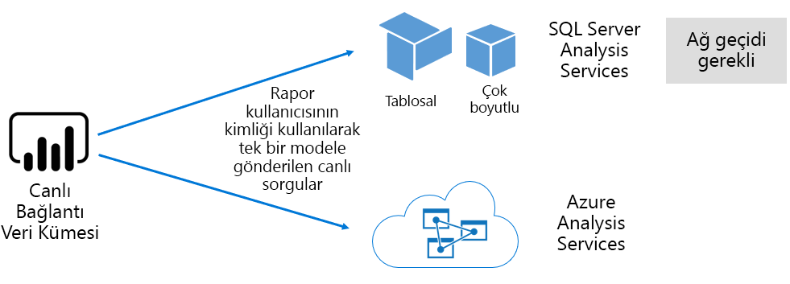

##### Power BI Desktop geliştirilmiş modeller

Power BI Desktop-Power BI geliştirme için tasarlanan bir istemci uygulaması, etkin bir Analysis Services tablolu model olan bir model geliştirmek için kullanılabilir. Modeller veri akışlarından içeri aktarılarak, daha sonra diğer veri kaynaklarıyla tümleştirilebilen şekilde geliştirilebilir. Modelleme 'nin nasıl elde edilelecekleri konusunda ayrıntılar bu teknik incelemeyi kapsamı dışında, Power BI Desktop kullanılarak geliştirilecek üç farklı tür veya model olduğunu anlamak önemlidir. Bu modlar, verilerin modele içeri aktarılıp aktarılmadığını veya veri kaynağında kalıp kalmadığını belirleme. Üç mod şunlardır: Import, DirectQuery ve Composite. Her mod için, [model depolama modları](#model-storage-modes) konusunun tüm bir tartışması ele alınacaktır.

Power BI masaüstünde geliştirilen dışarıdan barındırılan modeller ve modeller, belirli bir kullanıcı için alınabilecek verileri sınırlamak üzere satır düzeyi güvenlik (RLS) uygulayabilir. Örneğin, satışçılar güvenlik grubuna atanan kullanıcılar yalnızca atandıkları satış bölgeleri için rapor verilerini görüntüleyebilir. RLS rolleri dinamik veya statik olabilir. **Dinamik roller** rapor kullanıcısına göre filtreleyerek, **statik roller** role atanan tüm kullanıcılar için aynı filtreleri uygular.

##### Excel çalışma kitabı modelleri

Excel çalışma kitaplarını veya CSV dosyalarını temel alan veri kümeleri oluşturmak, bir modelin otomatik olarak oluşturulmasına neden olur. Excel tabloları ve CSV verileri, model tabloları oluşturmak için içeri aktarılacak, ancak bir Excel çalışma kitabı veri modeli Power BI modeli oluşturmak için yeniden dönüştürülecek. Her durumda, dosya verileri bir modele aktarılır.

Bu şekilde, modelleri temsil eden Power BI veri kümeleri hakkında da yapılabilir:

- Power BI hizmeti barındırılır veya Analysis Services tarafından dışarıdan barındırılır
- İçeri aktarılan verileri depolayabilirler veya temel alınan veri kaynaklarına geçiş sorgusu istekleri veya her ikisinin karışımı de verebilir

Modelleri temsil eden Power BI veri kümeleri hakkında önemli olguların özeti aşağıda verilmiştir:

- SQL Server Analysis Services barındırılan modeller, LC sorguları gerçekleştirmek için bir ağ geçidi gerektirir
- Veri içeri aktarılan Power BI barındırılan modeller
  - Sorgulanabilmeleri için belleğe tam olarak yüklenmelidir
  - Verilerin güncel tutulması için yenilemeyi gerektir ve kaynak verilere doğrudan Internet üzerinden erişilemezse ağ geçitlerini içermelidir
- DirectQuery (DQ) depolama modunu kullanan Power BI barındırılan modeller, kaynak verilere bağlantı gerektirir. Model sorgulandığında, Power BI sorunları geçerli verileri almak için kaynak verilere sorgular. Kaynak verilere doğrudan Internet üzerinden erişilemezse, bu mod ağ geçitlerini içermelidir.
- Modeller, belirli kullanıcılara veri erişimini sınırlamak için filtre uygulayan RLS kurallarını uygulayabilir

Power BI Premium başarılı bir şekilde dağıtmak ve yönetmek için, modellerin nerede barındırıldığını, depolama modunu, ağ geçitlerinde herhangi bir bağımlılığı, içeri aktarılan verilerin boyutunu ve yenileme türünü ve sıklığını anlamak önemlidir. Bunların hepsi Power BI Premium kaynakları üzerinde önemli bir etkiye sahip olabilir. Buna ek olarak, model tasarımı, veri hazırlama sorgularını ve hesaplamaları da dahil olmak üzere dikkat edilecek noktalar karışımına eklenebilir.

Power BI barındırılan içeri aktarma modellerinin zamanlamaya göre yenileyebileceğini veya Power BI hizmeti bir kullanıcı tarafından talep üzerine tetikleneceğini anlamak da önemlidir.

İyileştirilmiş modelleri tasarlama, daha sonra bu teknik kağıdın daha sonra [En Iyi duruma getirme](#optimizing-models) konusunda açıklanmaktadır.

#### Çalışma kitapları

Power BI çalışma kitapları, \[[4](#endnote-04)\]Power BI içerik türüdür. Power BI hizmeti karşıya yüklenmiş Excel çalışma kitaplarlardır ve veri kümeleri (modeller) oluşturan karşıya yüklenen Excel çalışma kitaplarında karıştırılmamalıdır. Çalışma kitabı içerik türü, Power BI hizmeti karşıya yüklenebilen veya OneDrive veya SharePoint Online 'daki Bulut depolamada kalabilen bir çalışma kitabı bağlantısını temsil eder.

Bu içerik türünün, Power BI veri görselleştirmeleri için bir veri kaynağı olarak kullanılamaz olduğunu anlamak önemlidir. Bunun yerine, Excel Online 'ı kullanarak Power BI hizmeti bir çalışma kitabı olarak açılabilir. Bu içerik türünün ana amacı, eski Excel çalışma kitabı raporlarına Power BI hizmeti içinden erişilebilmesini ve veri görselleştirmelerinin Power BI panolara sabitlenebilmesini sağlar.

Daha fazla bilgi için [Excel çalışma kitabı dosyalarından veri al](service-excel-workbook-files.md) belgesine bakın.

#### Raporlar

İki tür rapor vardır: Power BI raporları ve sayfalandırılmış raporlar.

**Power BI raporlar** yalnızca tek bir veri kümesine bağlanan etkileşimli bir veri görselleştirme deneyimleri sağlar. Raporlar genellikle kullanıcı katılımını, filtreleme, Dilimleme, çapraz filtreleme ve vurgulama, detaya gitme, detaya gitme, detaya gitme, soru-& cevap verme ve Dil Sorga, odaklanan, sayfa gezintisi, sahne ışığı, yer imlerini görüntüleme ve daha fazlası.

Bu teknik incelemeyi bağlamında, Power BI mimarisinin, Power BI rapor tasarımının ve kullanıcı etkileşimlerinin Power BI hizmeti kaynakları üzerinde nasıl etki kullanabileceğini anlamak önemlidir:

- İçeri aktarma modellerine göre raporları yüklemek ve bunlarla etkileşim kurmak için, model tam olarak belleğe yüklenmelidir (Power BI hizmeti veya dışarıdan barındırılan).
- Her rapor görseli, modeli sorgulayarak verileri almak için bir sorgu yayınlar
- Genellikle, filtre ve Dilimleyici etkileşimleri modeli sorgulamayı içerir. Örneğin, bir dilimleyici seçimini değiştirme, varsayılan olarak, sayfada her görsele yeniden yükleme gerektirir \[[5](#endnote-05)\]
- Power BI raporlar geçerli verileri görüntülemeyi garanti etmez ve rapor sayfasını ve görsellerini yeniden yüklemek için kullanıcının raporu yenilemesini gerektirebilir
- Kullanıcılar soru sormak için & doğal dil özelliği ile birlikte çalışabilir ve Power BI rapor tasarımını sağlamak için izin verir ve veri kümesi Power BI barındırılan bir veri içeri aktarma modelini ya da Q & A 'yı etkinleştirmek üzere yapılandırılmış bir LC veri kümesini temsil eder.

**Sayfalandırılmış raporlar** SQL Server REPORTING SERVICES (SSRS) raporlarının yayımlanmasına ve oluşturulmasına (\*. rdl biçimi) izin verir. Adından da anlaşılacağı gibi sayfalandırılmış raporlar genellikle gereksinimler sabit bir sayfa boyutuna yazdırma gereksinimi yaparken veya tamamen genişletilmesi gereken verilerin değişken listeleri olduğunda kullanılır. Örneğin, çok sayfalı işleme için tasarlanan bir fatura (bir görselin içinde kaydırma yerine) ve yazdırma.

Desteklenen iki rapor türü, rapor yazarları için seçim sağlar ve bunlara gereksinimleri ve amaçlanan kullanımı temel alarak türü seçmesini sağlar. Genellikle, Power BI raporlar, kullanıcının verileri araştırmasına ve bulmasına izin veren etkileşimli deneyimler için idealdir, ancak sayfalandırılmış raporlar parametre temelli sayfa düzenlerine daha uygundur.

Rapor türünden bağımsız olarak, yanıt veren rapor yükleme ve veri güncelleştirmelerinin sağlanması (filtreler veya parametreler değiştirildiğinde), güvenilir ve iyi performanslı bir kullanıcı deneyimi sunmak için zorunludur.

#### Panolar

Power BI panolar, izleme deneyimlerini sunmaya yöneliktir ve kavramsal olarak Power BI raporlardan farklıdır. Panolar, bölmelerde değerleri ve veri görselleştirmelerini ifade etmek için tek bir cam bölmesinde görüntülenmek üzere tasarlanmıştır. Panolar genellikle Power BI raporlardan daha az etkileşim deneyimi sunar ve bazı Pano tasarımlarıyla hiçbir etkileşim gerektirmez. Örneğin, bir sunucu odasında dokunmatik olmayan bir ekran üzerinde sunulan katılımsız bir Pano. Bunun önemli bir farkı, panoların birden çok veri kümesinden veri kaynağı olan kutucukları sunmasına, ancak bir Power BI raporun yalnızca tek bir veri kümesini temel alan bir zaman adına dayanmasına sahip olabileceği

Bir panonun hızlı bir şekilde yüklemek ve en güncel verileri (Power BI hizmeti) her zaman ifade etmek için tasarlanmış olduğunu anlamak önemlidir. Bu, kutucuk sorgu sonuçlarını önbelleğe alarak bunu elde eder ve her Pano için bunu yapar. Aslında, dinamik RLS uygulayan modellere dayalı bir panoya erişimi olan her bir kullanıcı için bunu yapması gerekir.

Power BI hizmeti, Power BI barındırılan içeri aktarma modelleri yenilendikten sonra Pano sorgu önbelleklerini otomatik olarak güncelleştirir. LC ve DQ modelleriyle, veri kümesi sahibinin, 15 dakikada bir ve yaklaşık olarak bir haftada bir olarak yapılandırılabilen Power BI hizmeti önbelleği ne sıklıkta güncelleştirdiği üzerinde bir denetim derecesi vardır. LC sorgu önbelleği güncelleştirmelerinin, son önbellek güncelleştirmesinden bu yana bir model yenilemenin yapılıp yapılmayacağını ve bir yenileme gerçekleşmediğinden önbelleğin güncelleştirilmesine devam etmediğini öğrenmek için önce model meta verilerini sorgulayıp unutmayın. Bu denetim DQ modelleri için mümkün değildir ve bu nedenle önbellek güncelleştirmeleri kaynak verilerin değiştirilip değiştirilmediğini belirtir.

DQ ve LC modellerini temel alan Pano sorgu önbelleği güncelleştirmeleri, hem Power BI hizmeti kaynaklarında hem de dış veri kaynaklarında önemli ölçüde etkileyebilir. Dinamik RLS uygulayan ve her saat yenilenen ve bu panonun 100 kullanıcıyla paylaştığı bir Azure Analysis Services modeline bağlı olarak, 20 kutucuğa sahip bir panoyu göz önünde bulundurun. Veri kümesi saatte bir yenilenecek şekilde yapılandırıldıysa, bu, en az 2000 (20 x 100) LC sorgusuna neden olur. Bu, Power BI hizmeti ve dış veri kaynaklarında daha büyük bir yük yerleştirebilir ve kullanılabilir kaynaklarda uygulanan limitleri de aşabilir. Kapasite kaynakları ve limitleri [Kapasite düğümleri](#capacity-nodes) konusunda açıklanmaktadır.

Kullanıcılar, Power BI hizmeti kaynaklar gerektiren çeşitli yollarla bir panoyla etkileşim kurabilir. Özellikle şunları yapabilirler:

- Panolar kutucuklarının yenilenmesini tetikleyin, bu, tüm ilgili Power BI barındırılan veri içeri aktarma modellerinin isteğe bağlı olarak yenilenmesini sağlayabilir
- Soru sormak için Q & doğal dil özelliğiyle iletişim kurun (Pano tasarımına izin vermek ve veri kümesi, & soru-cevap sağlamak üzere yapılandırılmış Power BI tarafından barındırılan bir veri içeri aktarma modeli veya bir LC veri kümesi mi olduğunu de sağlar)
- Temel alınan bir veri kümesinden Öngörüler bulmayı Power BI ve bunları gösteren görsellerle (kutucuğun Power BI barındırılan veri içeri aktarma modeli olan bir veri kümesini temel alarak) yanıt vermesini sağlamak için Hızlı İçgörüler özelliğini kullanın
- Eşikleri, eşik değerlerini döşeme değerlerine göre karşılaştırmak için Power BI hizmeti gerektiren ve eşikler aşıldığında kullanıcılara bildirme (kutucuğun tek bir sayısal değer görüntüleyeceğini ve bir Power BI barındırılan veri içeri aktarma modeli olan veri kümesi

### Model depolama modları

Power BI Desktop, bir modelin üç moddan birinde geliştirilmesini sağlar. Her bir veri modeli depolama modunun ve Power BI hizmeti kaynaklardaki olası etkilerin anlaşılması önemlidir. Bu bölümde üç mod da tanıtılmıştır. Bunlar daha sonra bu teknik incelemede daha sonra En Iyi duruma getirme konusunda daha ayrıntılı olarak ele alınacaktır.

#### İçeri aktarma modu

İçeri aktarma modu, bellek içi sorgulama, mod için kullanılabilen tasarım esnekliği ve belirli Power BI hizmeti özellikleri için destek (soru-& cevap Hızlı İçgörüler) nedeniyle model geliştirmek için kullanılan en yaygın moddur. , vb.). Yeni bir Power BI Desktop çözümü oluştururken varsayılan moddur.

İçeri aktarılan verilerin her zaman diske depolandığını ve sorgulanmak ya da yenilenmesi için belleğe tam olarak yüklenmesi gerektiğini anlamak önemlidir. Bellekte bir kez içeri aktarma modellerini güçlendirme hızlı sorgu sonuçları elde edin. İçeri aktarma modelinin belleğe kısmen yüklenmekte olduğunu anlamak da önemlidir.

Yenilendiğinde, veriler sıkıştırılır ve iyileştirilir ve ardından VertiPaq depolama altyapısı tarafından diske depolanır. Diskten belleğe yüklendiğinde, 10 kat sıkıştırması görüntülenebilir ve bu nedenle 10 GB kaynak verilerinin boyut olarak yaklaşık 1 GB 'a sıkışmasını beklemeniz mantıklıdır. Diskteki depolama boyutu, en üstte %20 oranında bir düşüş elde edebilir. \[[6](#endnote-06)\]

Tasarım esnekliği üç şekilde elde edilebilir. Veri modemler şunları yapabilir:

- Veri kaynağı türü ve biçiminden bağımsız olarak birden çok veri kaynağından verileri önbelleğe alarak verileri tümleştirme
- Veri hazırlama sorguları oluştururken Power Query formül dilinin (resmi olarak adlandırılır) işlevleri kümesinden yararlanın
- Modeli iş mantığı ile geliştirme sırasında, hesaplanmış sütunlarla, hesaplanan tablolarla ve ölçülerle elde edilen tüm veri çözümleme Ifadeleri (DAX) işlevleri kümesinden yararlanın

Aşağıdaki görüntüde gösterildiği gibi, bir Içeri aktarma modeli, desteklenen herhangi bir sayıdaki veri kaynağı türünden verileri tümleştirilebilir.

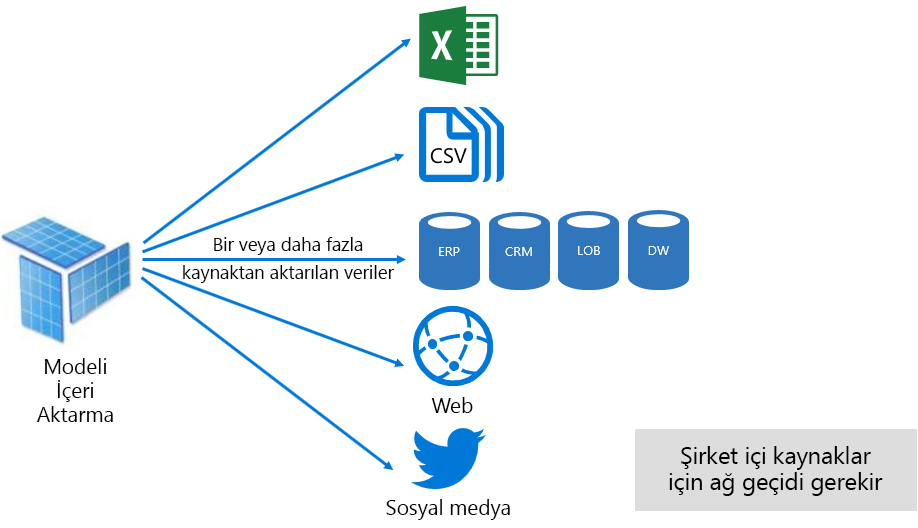

Ancak, içeri aktarma modelleriyle ilişkili etkileyici avantajlar olsa da, çok olumsuz yönleri de vardır:

- Power BI modeli sorgulayabilmesi için modelin tamamı belleğe yüklenmelidir, bu da modellerin büyümesi ve boyutu arttıkça kullanılabilir kaynaklara basınç getirebilir
- Model verileri yalnızca en son yenileme olarak geçerli olur ve bu nedenle içeri aktarma modellerinin yenilenmesi gerekir, tercihen zamanlanan bir temelde
- Tam yenileme, tüm tablolardaki tüm verileri kaldırır ve veri kaynağından yeniden yükler. Bu, Power BI hizmeti ve veri kaynaklarına yönelik zaman ve kaynak açısından çok pahalı olabilir. Power BI, tüm tabloların kesilmesinden ve yeniden yüklenmesini önlemenize engel olan artımlı yenileme desteğine sahiptir ve bu, [Power BI tarafından barındırılan modellerin En Iyi duruma getirilmesi](#optimizing-power-bi-hosted-models) konusunda ele alınmıştır.

Power BI hizmeti kaynak açısından, içeri aktarma modelleri şunları gerektirir:

- Sorgulanırken veya yenilendiğinde modeli yüklemek için yeterli bellek yok
- Verileri yenilemek için kaynakları ve ek bellek kaynaklarını işleme

#### DirectQuery modu

DirectQuery (DQ) modunda geliştirilen modeller verileri içeri aktarmaz. Bunun yerine, yalnızca sorgulanan veriler temel alınan veri kaynağına yerel sorgular yayınlar.

Bir DQ modeli geliştirmeyi düşünmek için iki temel neden vardır. İlk neden, veri azaltma yöntemleri uygulanırken veri birimlerinin çok büyük olduğu durumlarda (bir modele yüklemek veya pratikte yenilemek için). İkinci neden, raporların ve panoların "gerçek zamanlı" verileri sunmaya gerek duymasının yanı sıra, zamanlanan yenileme sınırları (bir günde 48 kez ayrılmış kapasite için kez) sağlar.

DQ modelleriyle ilişkili birkaç avantaj vardır:

- İçeri aktarma modeli boyut sınırları uygulanmıyor
- Modeller yenileme gerektirmez
- Rapor kullanıcıları rapor filtreleri ve Dilimleyicilerle etkileşim kurarken en son verileri görür ve geçerli verileri almak için raporun tamamını yenileyebilir
- DQ modellerini temel alan Pano kutucukları, 15 dakikada bir sıklıkta otomatik olarak güncelleştirebilir

Ancak, DQ modelleriyle ilişkili çok sayıda olumsuz ve kısıtlama vardır:

- Model, desteklenen tek bir veri kaynağını temel almalıdır ve bu nedenle veri kaynağında tüm veri tümleştirmesinin zaten elde edilmesi gerekir. Desteklenen veri kaynakları, \[[7](#endnote-07)\]birçok popüler veri deposu desteğiyle ilişkisel ve analitik sistemlerdir.
- Performans yavaş olabilir, büyük olasılıkla Power BI hizmeti olumsuz etkileyebilir (sorgular çok CPU yoğunluklu olabilir) ve veri kaynağında (analitik sorgular için iyileştirilemeyebilir)
- Power Query sorguları aşırı karmaşık olamaz ve veri kaynağı tarafından anlaþýlabilecek yerel sorgulara dönüştürebilirler.
- DAX işlevleri, veri kaynağı tarafından anlalanabilecek yerel sorgulara dönüştürebilecek olanlarla sınırlıdır ve hesaplanan tablolar veya yerleşik akıllı zaman gösterimi özellikleri için destek yoktur
- Varsayılan olarak, 1.000.000 'den fazla satırı almayı gerektiren model sorguları başarısız olur
- Birden çok Görselle rapor ve panolar, özellikle veri kaynağı geçici olduğunda tutarsız sonuçlar gösterebilir
- Q & A ve Hızlı İçgörüler desteklenmez

Power BI hizmeti kaynak perspektifinden, DQ modelleri şunları gerektirir:

- Model yüklemek için en az bellek (yalnızca meta veriler) sorgulanırken
- Bazen veri kaynağına gönderilen sorguları oluşturmak ve işlemek için önemli işlemci kaynakları

Daha fazla bilgi için [Power BI Desktop belgesinde doğrudan sorgu kullan](desktop-use-directquery.md) ' a bakın.

#### Bileşik mod

Bileşik modda geliştirilen modeller, bireysel model tabloları için depolama modunun yapılandırılmasına izin verir. Bu nedenle, Import ve DQ tablolarının bir karışımını destekler. Ayrıca, hesaplanan tabloları (DAX ile tanımlanır) ve birden çok DQ veri kaynağını da destekler.

Tablo depolama modu, Import, DirectQuery veya Dual olarak yapılandırılabilir. Çift depolama modu olarak yapılandırılmış bir tablo hem Içeri hem de DirectQuery 'dir ve bu, Power BI hizmeti sorgu temelinde sorgu üzerinde kullanmak için en verimli modu belirlemesine izin verir.

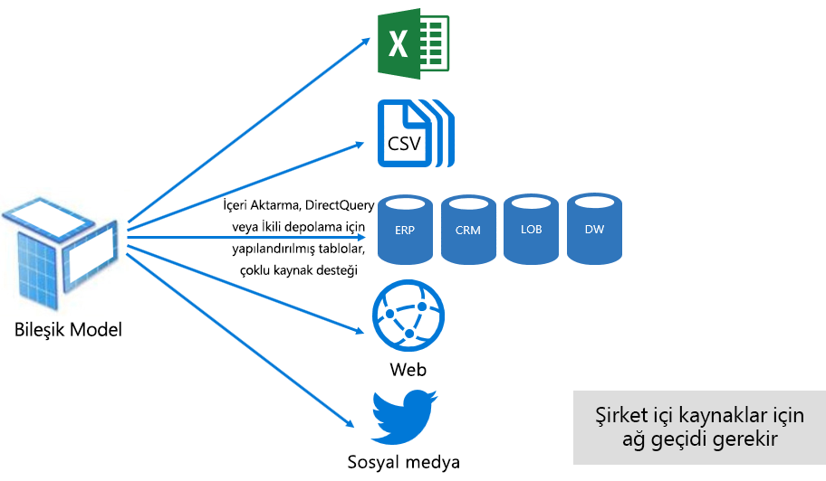

Bileşik modeller en iyi Içeri aktarma ve DirectQuery modlarını sunmaya çalışır. Uygun şekilde yapılandırıldığında, bellek içi modellerin yüksek sorgu performansını veri kaynaklarından neredeyse gerçek zamanlı verileri alma özelliğiyle birleştirebilirler.

Bileşik modeller geliştiren veri modelleyicileri, Içeri aktarma veya Ikili depolama modundaki ve DirectQuery modundaki gerçek tür tablolarındaki boyut türü tabloları yapılandırmak olasıdır. Örneğin, bir ürün boyut türü tablosu içeren bir modeli çift modda ve DirectQuery modundaki bir Sales olgu türü tablosunda düşünün. Ürün tablosu, bir rapor Dilimleyiciyi işlemek için bellek içi ve hızlı bir şekilde sorgulanamaz. Daha sonra satış tablosu, ilgili ürün tablosuna katılmış olan DirectQuery modunda sorgulanabilir. İkinci sorgu, tek bir verimli yerel sorgu oluşturmayı, ürün ve satış tablolarına katılmayı ve Dilimleyici değerlerine göre filtrelemeyi olanaklı hale getirir.

Genel olarak, her model moduyla ilişkili avantajlar ve dezavantajlar bileşik modellerdeki tablo depolama moduna uygulanabilir olarak düşünülebilir.

Daha fazla bilgi için [Power BI Desktop belgesinde bileşik modeller kullanma](desktop-composite-models.md) bölümüne bakın.

### Lisanslama

Power BI üç lisansa sahiptir:

- Ücretsiz Power BI
- Power BI Pro
- Power BI Premium

**Power BI ücretsiz** lisans, bir bireyin Power BI hizmeti oturum açmasını ve model ve rapor yayımlayarak kişisel çalışma alanlarında çalışmayı sağlar. Bu lisansı kullanarak Power BI içeriği paylaşmak mümkün olmadığı anlaşılması önemlidir. Bu lisans, adından da anlaşılacağı gibi ücretsizdir.

**Power BI Pro** lisansı, bir bireyin, çalışma alanları içinde oluşturma ve işbirliği yapma ve Power BI içeriği paylaşma ve dağıtma olanağı sağlar. Ayrıca, şirket içi veri kaynaklarından de dahil olmak üzere veri kümelerinin yenilenmesini, verileri otomatik olarak güncel tutacak şekilde yapılandırabilir. Bunlara ek olarak, verilerin nasıl erişildiğini ve kullanıldığını denetleyebilir ve yönetebilir. Bu lisans, Kullanıcı Power BI Premium adanmış bir kapasiteyle ilişkilendirilmedikçe başkalarından paylaşılan içerik almak için gereklidir.

**Power BI Premium** lisansı, kiracı düzeyinde bir Lisansdır ve [giriş Power BI Premium](#introducing-power-bi-premium) bölümünde ele alınmıştır.

Power BI lisanslama hakkında daha fazla bilgi için [Power BI fiyatlandırma](https://powerbi.microsoft.com/pricing/) sayfasına bakın.

## Power BI Premium tanıtımı

Power BI Premium, ölçek, güvenilir performans ve öngörülebilir maliyetlerle birleştirilmiş bir self servis ve kurumsal bı platformu sunar. Bu, öncelikle kuruluşunuzun Power BI hizmeti çalıştırmak için adanmış kaynaklar sağlayarak bunu elde eder.

Ayrıca, Power BI Premium birçok kurumsal özellik sunar:

- Uygun maliyetli içerik dağıtımı, dış kullanıcılar da dahil olmak üzere Power BI içeriğinin sınırsız Power BI sınırsız kullanıcıya paylaşılmasını sağlar
- \[[8](#endnote-08)\] daha büyük veri kümesi boyutlarına yönelik destek
- Veri akışlarının ve veri kümelerinin daha yüksek yenileme oranları (günde 48 kata kadar)
- Veri akışlarının ve veri kümelerinin artımlı yenilemesi
- Veri akışı bağlı varlıkları ve dönüşümlerin paralel yürütmesi
- Sayfalandırılmış raporlar
- Power BI Rapor Sunucusu, şirket içi raporlama için
- Uygulama kullanıcıları adına uygulamalara içerik ekleme özelliği (PaaS)

Bu özelliklerin birçoğu, verimli ve ölçeklenebilir kurumsal çözümler sunmak için yararlanılabilir olabilir ve [Premium kapasiteler En Iyi duruma getirme](#optimizing-premium-capacities) bölümünde ele alınmıştır.

### Abonelikler ve lisanslama

Power BI Premium iki SKU (Stok Saklama Birimi) ailesinde sağlanan kiracı düzeyi bir Office 365 aboneliğidir:

- **Em** Ekleme için SKU 'Lar (EM1-EM3), yıllık taahhütte, aylık olarak faturalandırılır
- Ekleme ve kuruluş özellikleri için **P** SKU 'Ları (P1-P3), aylık veya yıllık taahhütte, aylık olarak faturalandırılır ve şirket içi Power BI rapor sunucusu yüklemek için bir lisans bulunur

Bir alternatif yaklaşım, tek bir SKU ailesine sahip bir Azure Power BI Embedded aboneliği satın almaya yöneliktir: yalnızca ekleme ve kapasite testi amacıyla **bir** SKU (a1-a6).

Tüm SKU 'Lar \[[9](#endnote-09)\]kapasite oluşturmak için v-çekirdek sunar, ancak em SKU 'ları daha küçük ölçekli ekleme için kısıtlanır. Bu teknik incelemede odak, P SKU 'Larında olsa da, tartışılmış olan özellikler aynı zamanda SKU 'Lara da uygundur.

Premium aboneliği SKU'larının aksine, Azure SKU'ları hiçbir taahhüt süresi gerektirmez ve saatlik faturalanır. Bunlar tam esneklik getirerek ölçek büyütmeye, ölçek küçültmeye, duraklatmaya, sürdürmeye ve silmeye olanak tanırlar.

Azure Power BI Embedded, büyük ölçüde bu teknik incelemeye ait kapsam dışındadır, ancak iş yüklerini test etmek ve ölçmek için pratik ve ekonomik bir seçenek olarak test yaklaşımları konusunda ele alınmıştır.

Azure SKU 'Ları hakkında daha fazla bilgi için [azure Power BI Embedded belgelerine](/azure/power-bi-embedded/)bakın.

Power BI Premium abonelikleri Microsoft 365 yönetim merkezinde yöneticiler tarafından satın alınır. Özellikle, yalnızca Office 365 genel yöneticileri veya faturalandırma yöneticileri SKU 'Ları satın alabilir.

Satın aldıktan sonra kiracı, kapasiteye atamak için karşılık gelen bir sanal çekirdek sayısını alır-bu, sanal **çekirdek havuzu**olarak bilinir. Örneğin, P3 SKU satın almak kiracıya 32 sanal çekirdek sağlar.

Daha fazla bilgi için [Power BI Premium belge satın alma](service-admin-premium-purchase.md) bölümüne bakın.

### Premium kapasiteler

İş yüklerinin diğer müşterilerle paylaşılan hesaplama kaynaklarında çalıştığı paylaşılan bir kapasitenin aksine, **ayrılmış bir kapasite** bir kuruluş tarafından özel kullanım içindir. Barındırılan içerik için güvenilir ve tutarlı performans sağlayan adanmış hesaplama kaynaklarıyla yalıtılmıştır.

Bu teknik incelemeyi odak, EM veya P SKU 'larından herhangi biri ile ilişkili olduğu anlamına gelen **Premium kapasitesidir** .

#### Kapasite Düğümleri

Abonelikler ve lisanslama konusunda açıklandığı gibi, iki Power BI Premium SKU aileleri vardır: EM ve P. Tüm Power BI Premium SKU 'Ları, her biri işlemci, bellek ve depolamadan oluşan bir dizi kaynağı temsil eden kapasite düğümleri olarak kullanılabilir. Kaynaklara ek olarak, her SKU, saniyede DirectQuery (DQ) ve canlı bağlantı (LC) bağlantısı sayısı ve paralel model yenilemelerinin sayısı üzerinde işletimsel sınırlara sahiptir.

İşleme, arka uç ile ön üç arasında eşit olarak bölünmüş belirli sayıda sanal çekirdekle gerçekleştirilir.

**Arka uç sanal çekirdekleri** temel Power BI işlevselliğinden sorumludur: sorgu işleme, önbellek yönetimi, R hizmetlerini çalıştırma, veri yenileme, doğal dil işleme (Soru-Cevap), raporlar ile resimlerin sunucu tarafında işlenmesi. Arka uç v-çekirdekleri, etkin veri kümeleri olarak da adlandırılan modelleri barındırmak için birincil kullanılan sabit miktarda bellek atanır.

**Ön uç v-çekirdekler** Web hizmeti, pano ve rapor belge yönetimi, erişim hakları yönetimi, zamanlama, API 'ler, karşıya yüklemeler ve indirmelerden sorumludur ve genellikle Kullanıcı deneyimleriyle ilgili her şey için kullanılır.

Depolama kapasitesi başına 100 TB olarak ayarlanır.

Her Premium SKU 'sunun kaynakları ve limitleri (ve equivalently boyutlu bir SKU) aşağıdaki tabloda açıklanmıştır.

| Kapasite Düğümleri | Toplam sanal çekirdek sayısı | Arka uç sanal çekirdek sayısı | RAM (GB) | Ön uç sanal çekirdek sayısı | DQ/LC (saniye başına) | Model Yenileme Paralelliği |
| --- | --- | --- | --- | --- | --- | --- |
| EM1/A1 | 1 | 0.5 | 3 | 0.5 | 3,75 | 1 |
| EM2/A2 | 2 | 1 | 5 | 1 | 7,5 | 2 |
| EM3/A3 | 4 | 2 | 10 | 2 | 15 | 3 |
| P1/A4 | 8 | 4 | 25 | 4 | 30 | 6 |
| P2/A5 | 16 | 8 | 50 | 8 | 60 | 12 |
| P3/A6 | 32 | 16 | 100 | 16 | 120 | 24 |
| | | | | | | |

#### Kapasite Iş yükleri

Kapasite iş yükleri kullanıcılarının kullanımına sunulan hizmetlerdir. Varsayılan olarak, Premium ve Azure kapasiteleri yalnızca devre dışı bırakılabilen Power BI sorgularıyla ilişkili bir veri kümesi iş yükünü destekler.

Sayfalandırılmış raporlar, veri akışları ve AI için ek iş yükleri etkinleştirilebilir. Her ek iş yükü, iş yükü tarafından kullanılabilecek maksimum bellek (Toplam kullanılabilir bellek yüzdesi) yapılandırmasını gerektirir.

#### Kapasiteler nasıl çalışır?

Her zaman Power BI hizmeti kapasite kaynaklarının en iyi kullanımını kapasiteye göre uygulanan limitlerden aşmamak için çaba harcar.

Kapasite işlemleri, etkileşimli ya da arka plan olarak sınıflandırılır. Etkileşimli işlemler isteklerin işlenmesini ve kullanıcı etkileşimlerine (filtreleme, Soru-Cevap sorgulama vb.) yanıt verilmesini içerir. Genellikle, içeri aktarma modeli sorgulama bellek kaynağı yoğun, LC/DQ modellerini sorgularken CPU kullanımı yoğun bir işlemdir. Arka plan işlemleri veri akışı ile içeri aktarma modeli yenilemelerini ve pano sorgusunu önbelleğe almayı içerir.

Olası en iyi kullanıcı deneyimini sağlamak için, etkileşimli işlemlerin arka plan işlemleri üzerinden her zaman öncelikli olduğunu anlamak önemlidir. Kaynaklar yetersizse arka plan işlemleri kaynaklar serbest kaldığında işlenmek üzere kuyruğa eklenir. Veri kümesi yenilemeleri ve AI işlevleri gibi arka plan işlemleri, Power BI hizmeti ve bir kuyruğa eklenen orta işlemleri durdurulabilir.

İçeri aktarma modellerinin sorgulanabilmesi veya yenilenmesi için belleğe tam olarak yüklenmesi gerekir. Power BI hizmeti, kullanılabilir belleğin en fazla kullanımını sağlamak için gelişmiş algoritmaları kullanarak bellek kullanımını yönetir ve kapasiteyi fazla yürütmek için bir kapasitenin (Premium kapasiteye göre 100 TB 'a kadar) depolanması mümkün olsa da, Birleşik disk depolama alanı desteklenen belleği aştığında (sorgulama ve yenileme için ek bellek gerekliyse), bunların hepsi aynı anda belleğe yüklenemez.

Bu nedenle içeri aktarma modelleri, kullanıma bağlı olarak ve bellekten kaldırılır. İçeri aktarma modeli, sorgulandığında (etkileşimli işlem) veya henüz bellekte olmadığında ya da yenilenmediğinde (arka plan işlemi) yüklenir.

Bir modelin bellekten kaldırılması **çıkarma** olarak bilinir ve Power BI modellerin boyutuna bağlı olarak hızlı bir şekilde gerçekleştirebildiği bir işlemdir. Kapasitede hiçbir bellek baskısı olmazsa, modeller yalnızca belleğe yüklenir ve orada kalır. \[[10](#endnote-10)\] ancak, bir modeli yüklemek için yeterli bellek yoksa, Power BI hizmeti öncelikle belleği boşaltmaya gerek kalmaz. Son üç dakikada kullanılmamış \[[11](#endnote-11)\]ve ardından onları çıkararak devre dışı bırakılmış modelleri algılayarak belleği boşaltır. Çıkarılabilecek etkinlik dışı kalmış model yoksa Power BI hizmeti arka plan işlemleri için yüklenmiş modelleri çıkarmayı dener. Bu, AI iş yükü gibi arka plan iş yüklerinin çıkarlanmayı içerebilir. 30 saniyelik başarısız girişimden sonraki son çare \[[11](#endnote-11)\], etkileşimli işlem başarısız olur. Bu durumda, rapor kullanıcısı kısa bir süre içinde yeniden denemek için bir öneriyle hata vererek sorunsuz bir şekilde bildirilir.

Veri kümesi çıkarma 'nın normal ve beklenen bir davranış olduğunu tahmin etmek önemlidir. Birleşik boyutları kullanılabilir belleği aşabilecek modelleri yükleyerek ve kaldırarak bellek kullanımını en üst düzeye çıkarmaya çalışır. Bu davranış tasarım gereğidir ve rapor kullanıcılar açısından tamamen saydam olarak gerçekleştirilir. Yüksek çıkarma oranlarının kapasitede verimsiz kaynak kullanımına işaret ediyor olması şart değildir. Bununla birlikte yüksek çıkarma oranlarından dolayı sorgu veya yenileme yanıt süreleri zarar görürse, sorun haline gelir.

Model belleğe yüklenmesi gerektiği ve işleme için ek bellek gerektirdiğinden içeri aktarma modellerinin yenilemeleri her zaman bellek açısından yoğun bir işlemdir. Tam yenileme modele gereken belleğin yaklaşık olarak iki katını kullanabilir. Bu, modelin işlendiğinde bile sorgulanmasını sağlar (yenileme tamamlanana kadar sorgular mevcut modele gönderilir ve yeni model verileri kullanılabilir). Artımlı yenileme, daha az bellek gerektirir ve daha hızlı tamamlanabilir ve bu nedenle kapasite kaynaklarının basıncını önemli ölçüde azaltabilir. Modeller için yenilemeler, özellikle karmaşık Power Query dönüştürmeleri ya da karmaşık olan veya büyük tablolara dayanan hesaplanan tablolar/sütunlar içeren yenilemeler de yoğun CPU kullanabilir.

Yenileme benzeri sorgular-modelin belleğe yüklenmesini gerektir. Bellek yetersizse Power BI hizmeti etkin olmayan modelleri çıkarmayı dener ve bu mümkün olmazsa (tüm modeller etkinse) yenileme işi kuyruğa alınır. Yenilemeler genellikle, sorgulardan daha fazla CPU kullanımı çok daha fazla. Bu nedenle eş zamanlı yenileme sayısında kapasite sınırları vardır; yuvarlak olarak arka uç sanal çekirdek sayısının 1,5 katına ayarlanır. Eş zamanlı yenilemelerin sayısı çok fazlaysa, zamanlanmış bir yenileme kuyruğa alınır. Böyle bir durum olduğunda yenilemenin tamamlanması daha uzun sürer. İsteğe bağlı yenilemelerin (bir Kullanıcı isteği veya API çağrısı tarafından tetiklenen) üç kez \[[11](#endnote-11)\]yeniden deneneceğini ve hala yeterli kaynak yoksa başarısız olduğunu unutmayın.

## Power BI Premium yönetme

Power BI Premium yönetimi, abonelikleri satın almayı ve Premium kapasiteleri oluşturma, yönetme ve izleme işlemlerini içerir.

### Kapasiteler oluşturma ve yönetme

**Power BI yönetici** portalının **Kapasite Ayarları** sayfasında, satın alınan ve kullanılabilir olan sanal çekirdekler (yani bir kapasiteye atanmak üzere) ve Premium kapasiteler listelenmektedir. Bu sayfa, Office 365 genel yöneticileri veya Power BI hizmeti yöneticilerinin kullanılabilir sanal çekirdekler için Premium kapasiteler oluşturmalarına veya mevcut Premium kapasiteleri değiştirmesine olanak tanır.

Premium kapasite oluştururken yöneticinin şunları tanımlamak için gereklidir:

- Kapasite adı (kiracı dahilinde benzersiz)
- Kapasite yöneticileri
- Kapasite boyutu
- Veri yerleşimi için bölge \[[12](#endnote-12)\]

En az bir Kapasite Yöneticisinin atanması gerekir. Kapasite Yöneticisi olarak atanan kullanıcılar şunları yapabilir:

- Kapasiteye çalışma alanları atama
- Kullanıcı izinlerini yönetme, ek kapasite yöneticileri veya atama izinlerine sahip kullanıcılar eklemek için (bunları kapasiteye çalışma alanları atamalarına olanak tanımak için)
- Sayfalandırılmış raporlar ve veri akışları iş yükleri için maksimum bellek kullanımını yapılandırmak üzere iş yüklerini yönetme
- Sistem aşırı yüklemesi, [13](#endnote-13) \[tüm işlemleri sıfırlamak için kapasiteyi yeniden başlatın\]

Kapasite yöneticileri çalışma alanı içeriğine erişemez (açıkça çalışma alanı izinleri olmadığı sürece) ve kullanım ölçümleri, denetim günlükleri veya kiracı ayarları gibi tüm Power BI yönetici alanlarını (açıkça atanmamışsa) erişemez. Önemli bir bilgi olarak, Kapasite Yöneticilerinin yeni kapasiteler oluşturma veya mevcut kapasiteleri ölçeklendirme izinleri yoktur. Ayrıca, bunlara atanan kapasiteleri yalnızca görüntüleyebilecekleri ve yönetebilecekleri şekilde, her kapasite temelinde atanır.

Havuzdaki kullanılabilir sanal çekirdek sayısı ile kısıtlanan, kullanılabilir SKU seçenekleri listesinden kapasite boyutu seçilmelidir. Havuzdan bir veya daha fazla satın alınan SKU 'lardan kaynaklarda bulunan birden çok kapasite oluşturmak mümkündür. Örneğin, bir P3 SKU (32 sanal çekirdek) üç kapasite oluşturmak için kullanılabilir: bir P2 (16 sanal çekirdek) ve iki P1 (2 x 8 sanal çekirdek). Daha küçük ölçekli kapasiteler oluşturularak geliştirilmiş performans ve ölçek elde edilebilir ve bu konu, [Premium kapasiteleri En Iyi duruma getirme](#optimizing-premium-capacities) bölümünde ele alınmıştır. Aşağıdaki görüntüde, her çalışma alanı içeren beş Premium kapasiteden (3 x P1 ve 2 x P3) oluşan kurgusal contoso kuruluşu için örnek bir kurulum ve paylaşılan kapasitede birkaç çalışma alanı verilmiştir.

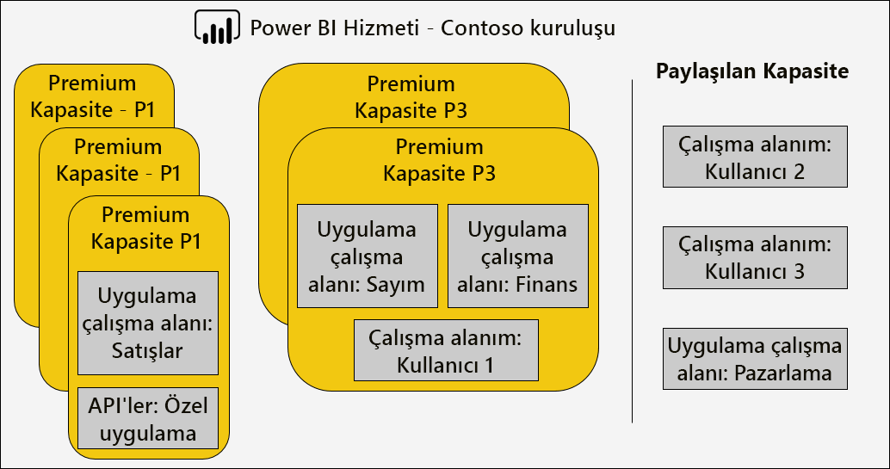

Premium kapasite, Power BI kiracının giriş bölgesinden farklı bir bölgeye atanabilir ve bu sayede veri merkezleri (tanımlı coğrafi bölgeler dahilinde) Power BI içerik bulunur. \[[12](#endnote-12)\]

Power BI hizmet yöneticileri ve Office 365 Genel Yöneticileri, Premium kapasiteleri değiştirebilirler. Özellikle şunları yapabilirler:

- Kaynakları ölçeklendirmek veya ölçeklendirmek için kapasite boyutunu değiştirin. Ancak, bir P SKU 'SU bir EM SKU 'SU için düşürülemiyor veya yükseltme de tam olarak gerçekleştirilemez.
- Kapasite yöneticileri ekleme veya kaldırma
- Atama izinlerine sahip kullanıcılar ekleme veya kaldırma
- Ek iş yükleri ekleme veya kaldırma
- Bölgeleri Değiştir

Atama izinleri, bir çalışma alanını belirli bir Premium kapasiteye atamak için gereklidir. Tüm kuruluşa, belirli kullanıcılara veya gruplara izinler verilebilir.

Varsayılan olarak, Premium kapasiteler çalışan Power BI sorgularıyla ilişkili iş yüklerini destekler. Ayrıca üç ek iş yükünü da destekler: **sayfalandırılmış raporlar**, **veri akışları**ve **AI**. Her iş yükü, bu iş yükü için kullanılabilecek maksimum belleğin yapılandırılmasını (toplam kullanılabilir belleğin yüzdesi olarak) gerektirir. En fazla bellek ayırmaların, barındırılabilecek etkin model sayısına ve yenilemelerin aktarım hızını etkileyebileceğini anlamak önemlidir.

Bellek, dinamik olarak veri akışlarına ayrılsa da istatistiksel olarak sayfalandırılmış raporlara ayrılır. Maksimum belleği statik olarak ayırmanın nedeni, sayfalandırılmış raporların, kapasitenin güvenli bir sınırlandırılmış alanı içinde çalışmasıdır. Modelleri yüklemek için kullanılabilir belleği azalttığından, sayfalandırılmış rapor belleği ayarlanırken dikkatli olunmalıdır.

|                     | EM3                      | P1                       | P2                      | P3                       |
|---------------------|--------------------------|--------------------------|-------------------------|--------------------------|
| Sayfalandırılmış raporlar | YOK | %20 varsayılan; %10 en küçük | %20 varsayılan; %5 en küçük | %20 varsayılan; %2,5 en küçük |
| Veri akışları | %20 varsayılan; %8 en küçük  | %20 varsayılan; %4 en küçük  | %20 varsayılan; %2 en küçük | %20 varsayılan; %1 en küçük  |
| AI | YOK | %20 varsayılan; %20 en küçük  | %20 varsayılan; %10 en küçük | %20 varsayılan; %5 en küçük  |
| | | | | |

Premium kapasiteyi silmek mümkündür ve çalışma alanlarının ve içeriğinin silinmesine neden olmayacaktır. Bunun yerine, atanan çalışma alanlarını paylaşılan kapasiteye taşır. Premium kapasite farklı bir bölgede oluşturulduğunda, çalışma alanı giriş bölgesinin paylaşılan kapasitesine taşınır.

### Kapasiteye çalışma alanları atama

Çalışma alanları, **Power BI yönetim**  **portalındaki** bir Premium kapasiteye veya bir çalışma alanı için **çalışma alanı** bölmesinde atanabilir.

Kapasite yöneticilerinin yanı sıra Office 365 genel yöneticileri veya Power BI hizmeti yöneticileri, **Power BI yönetici**  **portalında**çalışma alanlarını toplu olarak atayabilir. Toplu atama şunlara uygulanabilir:

- **Kullanıcılara göre çalışma alanları** : kişisel çalışma alanları da dahil olmak üzere bu kullanıcılara ait tüm çalışma alanları Premium kapasiteye atanır. Bu, farklı bir Premium kapasiteye zaten atandığında, çalışma alanlarının yeniden atanmasını içerir. Ayrıca, kullanıcılara çalışma alanı atama izinleri de atanır.

- **Belirli çalışma alanları**
- Tüm **kuruluşun çalışma alanları** : kişisel çalışma alanları dahil tüm çalışma alanları Premium kapasiteye atanır. Ayrıca, tüm geçerli ve gelecekteki kullanıcılara çalışma alanı atama izinleri atanır. \[[14](#endnote-14)\]

Kullanıcının hem çalışma alanı yöneticisi olması hem de atama izinlerine sahip olması durumunda, **Çalışma Alanı** bölmesi kullanılarak bir çalışma alanı Premium kapasiteye atanabilir.

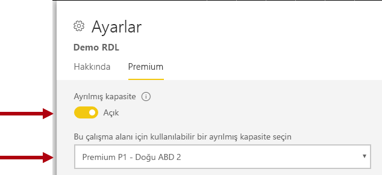

Çalışma alanı yöneticileri, atama izni gerekmeden bir çalışma alanını kapasiteden (paylaşılan kapasiteye) kaldırabilir. Ayrılmış kapasitelerden çalışma alanlarını kaldırmak, çalışma alanını paylaşılan kapasiteye etkin bir şekilde yeniden konumlandırır. Bir çalışma alanının Premium kapasiteden kaldırılması olumsuz sonuçlara neden olabilir; örneğin, paylaşılan içeriğin Power BI Ücretsiz lisanslı kullanıcılar için kullanılamaz hale gelmesi veya paylaşılan kapasiteler tarafından desteklenen kesintileri aştıklarında zamanlanan yenilemenin askıya alınması.

Power BI hizmetinde, Premium kapasiteye atanan bir çalışma alanı, çalışma alanı adındaki elmas simgesiyle kolayca tanımlanır.

### Kapasiteleri izleme

Premium kapasitelerin izlenmesi yöneticilerin kapasitelerin nasıl performans gösterdiğini anlamasını sağlar. Kapasiteler [Power BI Premium kapasite ölçümleri uygulaması](service-admin-premium-monitor-capacity.md) veya [Power BI Yönetici portalı](service-admin-premium-monitor-portal.md)kullanılarak izlenebilir.

#### Ölçümleri yorumlama

Ölçümler, kaynak kullanımı ve iş yükü etkinliğinin temel olarak anlaşılması amacıyla izlenmelidir. Kapasite yavaşlarsa hangi ölçümlerin izleneceğini ve varabileceğiniz sonuçları anlamak önemlidir.

Sorguların rapor kullanıcılarına duyarlı deneyimler sunmak ve daha yüksek sorgu aktarım hızı sağlamak için bir saniye içinde tamamlanması idealdir. Yenilemeler gibi arka plan işlemlerinin daha uzun sürede tamamlanması genellikle daha az önemlidir.

Genel olarak, yavaş raporlar aşırı ısınan bir kapasitenin göstergesi olabilir. Raporlar yüklenemediğinde aşırı ısınan bir kapasitenin göstergesidir. Her iki durumda da kök neden aşağıdakiler dahil olmak üzere birçok faktöre bağlanabilir:

- **Başarısız sorgular** kesin olarak bellek basıncına ve bir modelin belleğe yüklenemediğine işaret eder. Power BI hizmeti, başarısız olmadan önce 30 saniye boyunca bir model yüklemeye çalışır.

- **Çok sayıda sorgu bekleme süresinin** birçok nedeni olabilir:
  - Power BI hizmeti için önce model (ler) i ilk kez ve sonra da sorgulanan modeli yükleme (daha yüksek veri kümesi çıkarma tarifelerinin tek başına bir gösterge göstergesi değil), uzun sorgu bekleme süreleriyle birlikte bellek kullanımını belirten
  - Model yükleme süreleri (özellikle de büyük bir modeli belleğe yüklemeye bekleme)
  - Uzun süre çalışan sorgular
  - Çok fazla LC\DQ bağlantısı (Kapasite sınırlarını aşılıyor)
  - CPU doygunluğu
  - Sayfada çok sayıda Görselle karmaşık rapor tasarımları (her görselin bir sorgu olduğunu anımsayın)
- **Uzun sorgu süreleri**, özellikle bir kapasitede birden fazla veri kümesi etkin olduğunda ve yalnızca bir veri kümesi uzun sorgu süreleri ürettiğinde model tasarımlarının iyileştirilmediğini gösterebilir. Bu durum, kapasitenin yeterli kaynak kullandığı ve söz konusu veri kümesinin en iyi durumda olmadığı ya da sadece yavaş olduğu anlamına gelir. Uzun süre çalışan sorgular, diğer işlemlerin gerektirdiği kaynaklara erişimi engelleyebilecekleri için sorunlu olabilir.
- **Uzun yenileme bekleme süreleri veya AI çağrı bekleme süreleri** belleği tüketen çok sayıda etkin model veya sorunlu bir yenilemenin diğer yenilemeleri engellediği (paralel yenileme sınırlarını aşmaktadır).

Ölçümlerin nasıl kullanılacağına ilişkin daha ayrıntılı bir açıklama, [Premium kapasiteleri En Iyi duruma getirme](#optimizing-premium-capacities) bölümünün yanında açıklanmıştır.

## Premium kapasiteleri iyileştirme

Premium kapasite performans sorunları ortaya çıktığında, yaygın bir ilk yaklaşım, kabul edilebilir yanıt sürelerini geri yüklemek için önceden dağıtılan çözümleri iyileştirmek veya ayarlamak olacaktır. Bu geçersiz kılma, yaslanmadığı takdirde ek Premium kapasite satın alma yapmaktan kaçınmaktır.

Ek Premium kapasite gerektiğinde, bu bölümün ilerleyen kısımlarında ele alınacaktır iki seçenek vardır:

- Premium kapasitenin ölçeğini artırma
- Yeni bir Premium kapasite ekleme

Son olarak, test yaklaşımları ve Premium kapasite boyutlandırmanın bu bölümü sona ermesinden sonra.

### Genel En Iyi Yöntemler

En iyi kullanımı ve performansı elde etmek için, genel öneriler olarak panoda gerçekleştirilebilecek bazı en iyi uygulamalar vardır. Bu modüller şunlardır:

- Kişisel çalışma alanları yerine çalışma alanlarını kullanma
- İş açısından kritik ve self servis BI (SSBı) farklı kapasiteye ayırma

  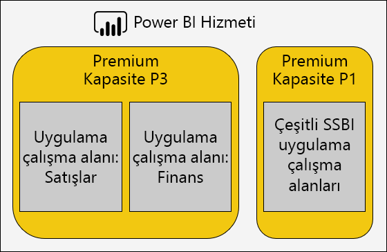

- Yalnızca Power BI Pro kullanıcılarla içerik paylaşıyorsanız, içeriği ayrılmış bir kapasiteye depolamaya gerek kalmaz
- Belirli bir yenileme zamanına ulaşmak veya belirli özelliklerin gerekli olduğu durumlarda (örneğin, büyük veri kümeleri veya sayfalandırılmış raporlar) için adanmış kapasiteler kullanın

### Yaygın soruların adreslenmesi

Power BI Premium dağıtımlarını en iyi duruma getirmek, iş yükü gereksinimlerinin, kullanılabilir kaynakların ve bunların etkili kullanımları hakkında daha fazla bilgiye sahip karmaşık bir konudur.

Bu konuda, olası sorunları ve açıklamaları açıklayan yedi ortak destek sorusu ve bunların tanımlanması ve çözümlenmesi hakkında bilgiler ele alınmaktadır.

#### Kapasite neden yavaşladı? Bununla ilgili ne yapabilirim?

Premium kapasitenin yavaşlamasına katkıda bulunabilen birçok sebep vardır. “Yavaş” dendiğinde neyin kastedildiğini anlamak için bu soruyla ilgili daha fazla bilgi gerekir. Raporlar yavaş mı yükleniyor? Yoksa yükleme başarısız mı oluyor? Rapor görselleri yavaş mı yükleniyor veya kullanıcılar raporla etkileşime geçtiğinde mi güncelleştiriliyor? Yenilemelerin tamamlanmasını beklenenden uzun sürüyor veya daha önce deneyimli mı?

Sebepleri anladıktan sonra araştırmaya başlayabilirsiniz. Aşağıdaki altı soruya verdiğiniz cevaplar daha özel soruları ele almanıza yardımcı olur.

#### Kapasitemi hangi içerikler kullanıyor?

Kapasiteye göre filtrelemek ve çalışma alanı içeriği için performans ölçümlerini gözden geçirmek için **Power BI Premium Kapasite Ölçümleri** uygulamasını kullanabilirsiniz. Premium kapasitede depolanan tüm içerikler için son yedi gün için performans ölçümlerini ve kaynak kullanımını saate göre gözden geçirmek mümkündür. Bu genellikle Premium kapasite performansı hakkında genel bir sorunu giderirken gereken ilk adımdır.

İzlenecek ana ölçümler şunları içerir:

- Ortalama CPU ve yüksek kullanım sayısı
- Belirli veri kümeleri, veri akışları ve sayfalandırılmış raporlar için Ortalama bellek ve yüksek kullanım sayısı ve bellek kullanımı
- Bellekte yüklü etkin veri kümeleri
- Ortalama ve en fazla sorgu süreleri
- Ortalama Sorgu bekleme süresi
- Ortalama veri kümesi ve veri akışı yenileme süreleri
- Ortalama AI çağrı süreleri ve bekleme süreleri

Ayrıca, Power BI Premium kapasite ölçümleri uygulamasında etkin bellek, son üç dakikada kullanımda olduğu için çıkartılabilen bir rapora ayrılan toplam bellek miktarını gösterir. Yenileme süresindeki ani bir artış büyük ve/veya etkin bir veri kümesi ile bağıntılı olabilir.

"Ortalama süreye göre Ilk 5" grafik, kapasite kaynaklarını kullanan ilk beş veri kümesini, sayfalandırılmış raporları, veri akışlarını ve AI çağrılarını vurgular. En üstteki beş listedeki içerikler, araştırma ve olası iyileştirme için adaylardır.

#### Raporlar neden yavaş?

Aşağıdaki tablolar olası sorunları ve bunları tanımlayıp düzeltmeye yönelik yöntemleri gösterir.

##### Yetersiz kapasite kaynakları

| Olası Açıklamalar | Nasıl Tanımlanır? | Nasıl Çözülür? |
| --- | --- | --- |
| Yüksek toplam etkin bellek (model son üç dakika içinde kullanımda olduğu için çıkarılamaz)   Sorgu bekleme süreleriyle birden çok yüksek ani artışlar   Yenileme bekleme süreleriyle birden çok yüksek ani artışlar | [16](#endnote-18)\]\[bellek ölçümlerini izleyin ve çıkarma sayıları \[[19](#endnote-19)\] | Model boyutunu azaltın veya DirectQuery moduna dönüştürün-bu bölümdeki [modelleri iyileştirme](#optimizing-models) konusuna bakın   Kapasiteyi büyütme   İçeriği farklı bir kapasiteye atama |

##### Verimsiz rapor tasarımları

| Olası Açıklamalar | Nasıl Tanımlanır? | Nasıl Çözülür? |
| --- | --- | --- |
| Rapor sayfaları çok sayıda görsel içerir (Etkileşimli filtreleme, görsel başına en az bir sorgu tetikleyebilir)   Görseller gerekenden daha fazla veri alır | Rapor tasarımlarını gözden geçirme   Kullanıcılara raporlarla nasıl etkileşime gireceğini anlamak için kullanıcılara rapor   Veri kümesi sorgu ölçümlerini izleme \[[20](#endnote-20)\] | Sayfa başına daha az Görselle raporları yeniden tasarlama |

##### Veri kümesi yavaş (özellikle raporlar daha önce iyi gerçekleştirildiğinde)

| Olası Açıklamalar | Nasıl Tanımlanır? | Nasıl Çözülür? |
| --- | --- | --- |
| Verilerin içeri aktarılması giderek daha fazla   RLS rolleri de dahil olmak üzere karmaşık veya verimsiz hesaplama mantığı   Model tam olarak iyileştirilmemiş   (DQ/LC) Ağ Geçidi gecikmesi   Yavaş DQ kaynak sorgusu yanıt süreleri | Model tasarımlarını gözden geçirme   Ağ Geçidi performans sayaçlarını izleme | Bu bölümdeki [modelleri En Iyi duruma getirme](#optimizing-models) konusuna bakın |

##### Yüksek eşzamanlı rapor kullanımı

| Olası Açıklamalar | Nasıl Tanımlanır? | Nasıl Çözülür? |
| --- | --- | --- |
| Yüksek sorgu bekleme süreleri   CPU doygunluğu   DQ/LC bağlantı sınırları aşıldı | CPU kullanımını izleme \[[21](#endnote-21)\], sorgu bekleme süreleri ve DQ/LC kullanımı \[[22](#endnote-22)\] ölçümleri + sorgu süreleri – dalgalanmayı eşzamanlılık sorunları belirtebiliyorsanız | Kapasiteyi ölçeklendirin veya içeriği farklı bir kapasiteye atayın   Sayfa başına daha az Görselle raporları yeniden tasarlama |

#### Raporlar neden yüklenmiyor?

Raporlar yükleme başarısız olduğunda en kötü durum senaryosu ve kapasitenin yetersiz bellek içerdiğinden ve daha fazla ısıtılan bulunduğundan emin olun. Bu, yüklenen tüm modeller aktif olarak sorgulandıkları için çıkarılamadığında ve tüm yenileme işlemleri durdurulduğunda veya geciktiğinde ortaya çıkabilir. Power BI hizmeti, 30 saniye boyunca veri kümesini yüklemeye çalışır. Bu işlem başarısız olursa durum kullanıcıya bildirilir ve kısa bir süre sonra tekrar denemesi önerilir.

Şu anda, rapor yükleme hatalarını izlemeye yönelik bir ölçüm bulunmamaktadır. Bu soruna yol açan etmenleri sistem belleğini, özellikle de en yüksek kullanım oranına ve en yüksek kullanım süresine sahip olanları izleyerek tanımlayabilirsiniz. Yüksek veri kümesi çıkarmaları ve veri kümesi yenilemeleri için ortalama bekleme süresinin uzun olması bu sorunun meydana geldiğini gösterebilir.

Bu çok nadiren yaşanıyorsa öncelikli bir sorun olarak kabul edilmeyebilir. Rapor kullanıcılarına hizmetin meşgul olduğu ve kısa bir süre sonra yeniden denemeleri gerektiği bildirilir. Bu çok sık yaşanırsa Premium kapasitesinin ölçeği artırılarak veya içeriği farklı bir kapasiteye atayarak bu sorun çözülebilir.

Kapasite Yöneticileri (ve Power BI hizmet yöneticileri) bunun ne zaman yaşandığını belirlemek için **Sorgu Hataları** ölçümünü izleyebilir. Sistemin aşırı yüklenmesi durumunda tüm işlemleri sıfırlayarak kapasiteyi yeniden başlatabilirler.

#### Yenilemeler neden zamanında başlamıyor?

Zamanlanan yenileme başlangıç süreleri garanti edilmez. Power BI hizmetinin her zaman arka plan işlemlerinden ziyade etkileşimli işlemleri önceliklendirdiğini unutmayın. Yenileme, iki koşul karşılandığında oluşabilen bir arka plan işlemidir:

- Yeterli bellek bulunduğunda
- Premium kapasite için desteklenen eşzamanlı yenileme sayısı aşılmadığında

Koşullar karşılanmazsa, koşullar uygun hale gelene kadar yenileme kuyruğa alınır.

Tam yenileme için, mevcut veri kümesi bellek boyutunun en az iki katının gerektiğini unutmayın. Yeterli bellek yoksa çıkarma işlemi belleği boşaltana kadar yenileme başlayamaz. Bu da veri kümelerinin biri veya daha fazlası etkin olmayan ve çıkarılabilir duruma gelene kadar gecikme yaşanacak demektir.

Desteklenen en fazla eşzamanlı yenileme sayısının, arka uç sanal çekirdeklerinin 1.5 katının yukarı yuvarlanmış hali olarak ayarlandığını unutmayın.

Zamanlanmış yenileme, sonraki zamanlanmış yenileme başlamadan önce başlayamadığında başarısız olur. Kullanıcı arabiriminden el ile tetiklenen bir isteğe bağlı yenileme, başarısız olmadan önce en az üç kere çalışmayı dener.

Kapasite Yöneticileri (ve Power BI hizmet yöneticileri), zamanlanan süre ve işlemin başlangıcı arasındaki ortalama gecikmeyi tespit etmek için **Ortalama Yenileme Bekleme Süresi (dakika)** ölçümünü izleyebilir.

Genellikle yönetime yönelik bir öncelik olmasa da, zamanında veri yenilemelerini etkilemek için yeterli bellek bulunduğundan emin olun. Bu, veri kümelerini bilinen yeterli kaynaklara sahip kapasiteler için ayrı tutmayı içerebilir. Yöneticilerin, çakışmaları en aza indirmek için zamanlanmış veri yenileme sürelerini azaltmaya veya azaltmasına yardımcı olmak üzere veri kümesi sahipleriyle koordine olabilmesi de mümkündür. Yöneticinin yenileme kuyruğunu görüntülemesi veya veri kümesi zamanlamalarının alınması mümkün değildir.

#### Yenilemeler neden yavaş?

Yenilemeler yavaş olabilir veya yavaş gibi algılanabilir (önceki soruda ele alındığı gibi).

Yenileme gerçekten yavaşsa, bu çeşitli nedenlerden kaynaklanabilir:

- Yetersiz CPU (yenileme çok CPU yoğunluklu olabilir)
- Yetersiz bellek, yenileme duraklamasına neden olur (koşulların recommence için uygun olduğu durumlarda yenilemeye başlaması gerekir)
- Veri kaynağı sistemi yanıt verme, ağ gecikmesi, geçersiz izinler veya ağ geçidi verimlilik dahil olmak üzere kapasite dışı nedenler
- Veri hacmi-aşağıda anlatıldığı gibi artımlı yenilemeyi yapılandırmak için iyi bir neden

Kapasite Yöneticileri (ve Power BI hizmet yöneticileri) zaman içinde karşılaştırma için bir kıyaslama gerçekleştirmek için **Ortalama Yenileme Süresi (dakika)** ölçümünü, zamanlanan süre ve işlemin başlangıcı arasındaki gecikmeyi belirlemek için de **Ortalama Yenileme Bekleme Süresi (dakika)** ölçümünü izleyebilir.

Artımlı yenileme, özellikle büyük model tabloları için veri yenileme süresini önemli ölçüde azaltabilir. Artımlı yenilemenin sunduğu dört avantaj bulunur:

- **Yenilemeler daha hızlıdır** : bir tablonun yalnızca bir alt kümesinin yüklenmesi gerekır, CPU ve bellek kullanımının azaltılması ve birden çok bölüm yenilenirken paralellik daha yüksek olabilir
- **Yenilemeler yalnızca gerekli olduğunda gerçekleşir** : artımlı yenileme ilkeleri, yalnızca veriler değiştirildiğinde yüklenecek şekilde yapılandırılabilir
- **Yenilemeler daha güvenilirdir** : geçici veri kaynağı sistemlerine yönelik daha kısa çalışan bağlantıların bağlantısının kesilmesi daha az açıktır
- **Modeller trim olarak kalıyor** : artımlı yenileme ilkeleri, geçmişi otomatik olarak kayan bir pencerenin ötesinde otomatik olarak kaldıracak şekilde yapılandırılabilir

Daha fazla bilgi için [Power BI Premium belgesinde artımlı yenileme](service-premium-incremental-refresh.md) bölümüne bakın.

#### Veri yenilemeleri neden tamamlanmıyor?

Veri yenileme başlarsa ancak tamamlanamazsa bunun çeşitli sebepleri olabilir:

- Premium kapasitede yalnızca bir model olsa bile yetersiz bellek, yani model boyutu çok büyük
- Veri kaynağı sistem bağlantısının kesilmesi, geçersiz izinler veya ağ geçidi hatası dahil olmak üzere kapasite dışı nedenler

Kapasite Yöneticileri (ve Power BI hizmet yöneticileri) **Belleğin yetersiz kalmasından ötürü Yenileme Hataları** ölçümünü izleyebilir.

#### AI çağrısı neden başarısız oluyor?

AI çağrıları birden çok nedenden dolayı başarısız olabilir. AI iş yükünü başlatmak için gereken minimum bellek 5 GB 'tır, ancak bazı giriş veri kümeleri için bu yeterli olmayabilir. Örneğin, otomatik makine öğrenme modeli eğitimi için en az iki kez ve bazen giriş veri kümesi boyutunun birden çok kez olması gerekir. Ayrıca, iki saatten uzun sürerse bir AI çağrısı sonlandırılır. İki saat içinde tamamlanmamış otomatik makine öğrenme modeli eğitimi çağrıları için, bu iki saat içinde bulunan en iyi model döndürülür.  AI çağrıları, öncelik veren etkileşimli istekler tarafından da kesintiye uğrar.

Yöneticiler, diğer isteklerin belirtileri için AI bekleme sürelerini izlemelidir. Yöneticiler ayrıca, giriş veri boyutlarına göre AI iş yükü için yeterli belleğin kullanılabilir olmasını da sağlayabilir. Bu, AI iş yüklerini yeterli kaynaklara sahip olacak şekilde bilinen kapasiteye yalıtmak içerebilir. Ayrıca, yöneticilerin veri akışı yenileme sürelerini koordine etmenize veya azaltmasına yardımcı olmak için veri akışı sahiplerini koordine etmek de mümkündür. Not, bir yöneticinin AI çağrı kuyruğunu görüntülemesi mümkün değildir.

### Modelleri iyileştirme

Etkili ve ölçeklenebilir bir çözüm sunmak için model tasarımının en uygun halde olması önemlidir. Ancak, bu teknik incelemeye ait kapsamın bir bütün olarak bir tartışma sağlaması daha dışındadır. Bunun yerine, modeller iyileştirilirken dikkate alınması gereken önemli hususlar bu bölümde sunulacaktır.

#### Power BI barındırılan modelleri iyileştirme

Premium kapasitede barındırılan modellerin en iyi duruma getirilmesi, veri kaynakları ve model katmanlarında elde edilebilir.

İçeri aktarma modeline yönelik iyileştirme olanaklarını göz önünde bulundurun:

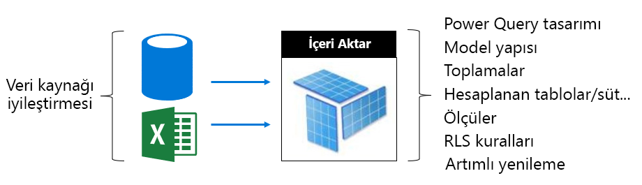

Veri kaynağı katmanında:

- İlişkisel veri kaynakları, verileri önceden tümleştirerek, uygun dizinler uygulanarak, artımlı yenileme dönemlerine bağlanan tablo bölümleri tanımlayarak ve hesaplamalar (hesaplanan yerde) için en hızlı olası yenilemeyi sağlamak üzere iyileştirilebilir. Model tabloları ve sütunları) veya görünümlere hesaplama mantığı ekleme
- İlişkisel olmayan veri kaynakları, ilişkisel depolarla önceden tümleştirilebilir
- Ağ geçitlerinin, tercihen ayrılmış makinelerde, yeterli ağ genişliğiyle, veri kaynaklarının yakınında yer alan yeterli kaynaklarının bulunduğundan emin olun

Model katmanında:

- Power Query sorgu tasarımları, karmaşık dönüşümleri (özellikle farklı veri kaynaklarını birleştirenleri) en aza indirebilir veya kaldırabilir (veri ambarları bunu Ayıklama-Dönüştürme-Yükleme aşamasında gerçekleştirir). Ayrıca, uygun veri kaynağı gizlilik düzeylerinin ayarlandığı doğrulanıyor, bu, sorgular arasında Birleşik bir sonuç üretmek için Power BI tam sonuçların yüklenmesini gerektirmemeye engel olabilir.
- Model, yüklenecek veriyi belirler ve model boyutunun üzerinde doğrudan etkiye sahiptir. Sütunları, satırları kaldırarak (özellikle geçmiş verilerini) veya özetlenen verileri yükleyerek (ayrıntılı verileri yükleme pahasına) gereksiz verileri yüklemesi engellenecek şekilde tasarlanabilir. Verimli şekilde depolama veya sıkıştırma yapamayan yüksek kardinaliteli sütunlar kaldırılarak (özellikle metin sütunları) boyut büyük ölçüde azaltılabilir.
- Çift yönlü filtrelemeye izin vermeyi gerektiren bir sebep olmadıkça, tek yönlü ilişkiler yapılandırılarak sorgu performansı geliştirilebilir. İki yönlü filtreleme yerine CROSSFILTER işlevini de kullanmayı düşünün.
- Toplama tabloları, önceden özetlenmiş verileri yükleyerek hızlı sorgu yanıtları elde edebilir. Ancak, bunun sonucu olarak modelin boyutu büyür ve yenileme süreleri uzar. Genellikle, toplama tabloları çok büyük modeller veya bileşik model tasarımları için ayrılmalıdır.
- Hesaplanan tablolar ve sütunlar model boyutunu artırıp yenileme süresinin uzamasına neden olur. Genellikle, veriler değerlendirildiğinde veya veri kaynağında hesaplanıyorsa, daha küçük bir depolama boyutu ve daha hızlı yenileme zamanı elde edilebilir. Bu mümkün değilse, Power Query özel sütunlar gelişmiş depolama sıkıştırması sunabilir.
- Ölçümler ve RLS kuralları için DAX ifadelerini ayarlamaya yönelik bir fırsat olabilir. Pahalı formüllerden kaçınmak için mantık yeniden yazılabilir
- Artımlı yenileme, yenileme süresini önemli ölçüde azaltabilir ve bellek ve CPU tasarrufu sağlayabilir. Artımlı yenileme, model boyutlarının kırpmalarını saklayan geçmiş verilerini kaldıracak şekilde de yapılandırılabilir.
- Farklı ve çakışan sorgu desenleri olduğunda, model iki model olarak yeniden tasarlanabilir. Örneğin, bazı raporlar tüm geçmişte yüksek düzeyde toplama sunar ve 24 saatlik gecikme süresine izin verebilir. Diğer raporlar bugünün verileriyle ilgilidir ve tek işlemlere ayrıntılı erişim gerektirir. Tüm raporları karşılamak için tek bir model tasarlamaktan ziyade her gereksinim için iyileştirilmiş iki model oluşturun.

Bir DirectQuery modeli için iyileştirme olanaklarını göz önünde bulundurun. Model sorgu isteklerini temel alınan veri kaynağına verdiği için veri kaynağı iyileştirmesi, yanıt veren model sorguları sağlamak açısından önemlidir.

 

Veri kaynağı katmanında:

- Veri kaynağı, verileri önceden tümleştirerek (model katmanında mümkün olmayan) en hızlı şekilde sorgulamayı sağlamak, uygun dizinleri uygulamak, tablo bölümlerini tanımlamak, özetlenen verileri (dizinli görünümler ile) gerçekleştirmek ve hesaplama miktarını en aza indirme. En iyi deneyim, geçiş sorgularının yalnızca filtrelemek ve dizinli tablolar veya görünümler arasında iç birleştirmeler gerçekleştirmesi gerektiğinde elde edilir.
- Ağ geçitlerinin, yeterli ağ bant genişliğine sahip ve veri kaynağına yakın bir şekilde ayrılmış makinelerde, tercihen yeterli kaynağa sahip olduğundan emin olun

Model katmanında:

- Sorgu tasarımlarının Power Query, tercihen hiçbir dönüştürme uygulamamalıdır; Aksi takdirde dönüşümleri mutlak bir en düşük düzeyde tutmaya çalışır
- Çift yönlü filtrelemeye izin vermeyi gerektiren bir sebep olmadıkça, tek yönlü ilişkiler yapılandırılarak sorgu performansı geliştirilebilir. Ayrıca, model ilişkilerinin, bilgi tutarlılığının uygulanacağını (Bu durum olduğunda) ve veri kaynağı sorgularının daha verimli iç birleşimler (dış birleşimler yerine) ile sonuçlanacağını varsayacak şekilde yapılandırılması gerekir.
- Power Query sorgu özel sütunları veya model hesaplanmış sütunu oluşturmaktan kaçının, mümkünse bunları veri kaynağında oluşturun
- Ölçümler ve RLS kuralları için DAX ifadelerini ayarlamaya yönelik bir fırsat olabilir. Pahalı formüllerden kaçınmak için mantık yeniden yazılabilir

Birleşik bir model için iyileştirme olanaklarını göz önünde bulundurun. Birleşik modelin içeri aktarma ve DirectQuery tablolarının karışımına olanak tanıdığını unutmayın.

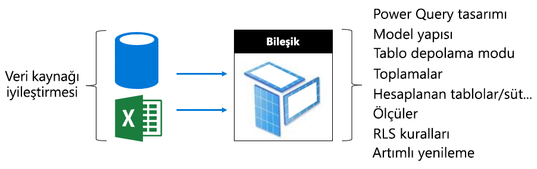

- Genellikle, Içeri aktarma ve DirectQuery modelleriyle ilgili en iyi duruma getirme konuları, bu depolama modlarını kullanan bileşik model tabloları için geçerlidir.
- Boyut türü tabloları (iş varlıklarını temsil eder) ikili depolama modu ve olgu türü tablolar (sıklıkla büyük tablolar olur ve işletimsel olguları temsil eder) olarak yapılandırarak dengeli bir tasarım elde etmeye çalışın. Çift depolama modu hem Içeri aktarma hem de DirectQuery depolama modları anlamına gelir ve bu Power BI hizmeti, geçiş için yerel bir sorgu oluştururken kullanılacak en verimli depolama modunu belirlemesine izin verir.
- Ağ geçitlerinin, tercihen ayrılmış makinelerde, yeterli ağ genişliğiyle, veri kaynaklarının yakınında yer alan yeterli kaynaklarının bulunduğundan emin olun
- İçeri aktarma depolama modu olarak yapılandırılan toplama tabloları, DirectQuery sorgu modunda olgu türü tabloları özetlemek için kullanıldığında önemli sorgu performansı artışı sunabilir. Bu durumda, toplama tabloları modelin boyutunu ve yenileme süresini artırır. Bu, genelde daha hızlı sorgular için kabul edilebilir bir ödünleşmedir.

#### Dışarıdan barındırılan modelleri iyileştirme

[Power BI barındırılan modeller](#optimizing-power-bi-hosted-models) konusunda ele alınan birçok iyileştirme olanağı, Azure Analysis Services ve SQL Server Analysis Services ile geliştirilen modeller için de geçerlidir. Bileşik modeller ve toplama tabloları gibi şu anda desteklenmeyen özellikler açık özel durumlardandır.

Dışarıda barındırılan veri kümelerine yönelik bir diğer durum da, Power BI hizmetiyle ilişkili olarak veritabanı barındırmadır. Azure Analysis Services için bu, Azure kaynağını Power BI kiracısıyla aynı bölgede (ana bölge) oluşturma anlamına gelir. Bu, SQL Server Analysis Services ve IaaS için de VM’i aynı bölgede barındırma, şirket içi için de verimli bir ağ geçidi kurulumu sağlama anlamına gelir.

Bunun yanı sıra, Azure Analysis Services veritabanlarının ve SQL Server Analysis Services tablosal veritabanlarının modellerin belleğe tam olarak yüklenmesini gerektirdiğini ve sorgulamayı desteklemek için sürekli olarak orada kaldıklarını hatırlamak faydalı olabilir. Power BI hizmeti gibi, modelin yenileme esnasında çevrimiçi kalması gerekiyorsa yeterli belleğin bulunması gerekir. Power BI hizmetinin aksine, kullanıma göre modellerin bellekte eski veya yeni hale getirilmesine yönelik bir kavram bulunmamaktadır. Bu nedenle, daha düşük bellek kullanımı ile model sorgulamayı en üst düzeye çıkarmak için Power BI Premium daha verimli bir yaklaşım sunar.

### Kapasite planlama

Premium kapasitesinin boyutu kullanılabilir olan bellek ve işlemci kaynaklarını ve kapasiteye uygulanan limitleri belirler. Premium kapasitelerinin sayısı da dikkate alınır. Birden fazla Premium kapasitesinin oluşturulması iş yüklerini birbirinden yalıtmaya yardımcı olabilir. Depolamanın kapasite düğümü başına 100 TB olduğunu ve bu durumun herhangi bir iş yükü için yeterli olduğunu unutmayın.

Premium kapasitelerinin sayısını ve boyutunu belirleme, özellikle oluşturduğunuz ilk kapasiteler için zorlayıcı bir durum olabilir. Kapasiteyi boyutlandırmanın ilk adımı, beklenen günlük kullanımı temsil eden ortalama iş yükünü anlamadır. Tüm iş yüklerinin eşit olduğunu anlamak önemlidir. Örneğin, ölçeğin bir ucunda tek bir görsel içeren bir rapor sayfasına 100 kullanıcının erişmesini sağlama hedefine kolayca erişilebilir. Ancak, ölçeğin diğer ucunda, her biri rapor sayfasında 100 görsel içeren 100 farklı rapora aynı anda 100 kullanıcının erişmesini sağlama, kapasite kaynaklarından oldukça farklı taleplerde bulunacaktır.

Bu nedenle, Kapasite Yöneticilerinin ortamınıza, içeriklerinize ve beklenen kullanımlara özgü birçok farklı etkeni göz önünde bulundurması gerekir. Burada üstün gelen hedef, tutarlı sorgu süreleri, kabul edilebilir bekleme süreleri ve çıkarma oranları sunarken kapasite kullanımını en üst düzeye çıkarmadır. Göz önünde bulundurulacak etkenler şunları içerebilir:

- **Model boyutu ve veri özellikleri** : sorgu veya yenilemeye izin vermek için içeri aktarma modellerinin tam olarak belleğe yüklenmesi gerekir. LC/DQ veri kümeleri, karmaşık ölçümleri veya RLS kurallarını değerlendirmek için önemli işlemci süresi ve muhtemelen önemli ölçüde bellek gerektirebilir. Bellek ve işlemci boyutu ve LC/DQ sorgu aktarım hızı kapasite boyutuyla kısıtlıdır.
- **Eşzamanlı etkin modeller** : farklı içeri aktarma modellerinin eşzamanlı olarak sorgulanması, bellekte kaldığı sırada en iyi yanıt verme ve performans sağlar. Yoğun şekilde sorgulanan modelleri barındırmak için yeterli bellek olmalıdır. Bunların yenilenmesi için de ek bellek gerekir.
- **Içeri aktarma modeli yenilemesi** : yenileme türü (tam veya artımlı), Power Query sorgularının süresi ve karmaşıklığı ve hesaplanan tablo/sütun mantığı, bellek ve özellikle işlemci kullanımı üzerinde etkili olabilir. Eş zamanlı yenilemeler kapasite boyutuyla kısıtlanır (1,5 x arka uç sanal çekirdek sayısı, yukarıya doğru yuvarlanır).
- **Eşzamanlı sorgular** : IŞLEMCI veya LC/DQ bağlantıları kapasite sınırını aştığında, birçok eşzamanlı sorgu yanıt vermeyen raporlara neden olabilir. Bu durum özellikle de çok sayıda görsel içeren rapor sayfaları için geçerlidir.
- **Veri akışları, sayfalandırılmış raporlar ve AI işlevleri** : kapasite, her biri yapılandırılabilir maksimum kapasite belleği yüzdesine ihtiyaç duyan veri akışları, sayfalandırılmış raporlar ve AI işlevlerini destekleyecek şekilde yapılandırılabilir. Bellek, veri akışlarına dinamik olarak ayrılır, ancak sayfalandırılmış raporlara ve AI iş yüküne statik olarak ayrılır.

Bu faktörlere ek olarak, Kapasite Yöneticileri birden fazla kapasite oluşturmayı düşünebilir. Birden fazla kapasite, iş yüklerinin yalıtılmasına olanak tanır ve öncelikli iş yüklerinin garanti kaynaklara sahip olmasını sağlayacak şekilde yapılandırılabilir. Örneğin, iş açısından kritik iş yüklerini self servis BI (SSBI) iş yüklerinden ayırmak için iki kapasite oluşturulabilir. İş açısından kritik kapasite, sadece BT departmanına sağlanan yazar erişimi ile garanti kaynaklar sunarak büyük kurumsal modelleri ayrı tutmak için kullanılabilir. İş analistlerine sağlanan erişim ile, SSBI kapasitesi sayısı gittikçe artan küçük modelleri barındırmak için kullanılabilir. SSBI kapasitesi, zaman zaman kabul edilebilir sorgu veya yenileme beklemeleri yaşayabilir.

Zamanla, Kapasite Yöneticileri içerikleri çalışma alanlarının arasında taşıyarak, çalışma alanlarını kapasitelerin arasında taşıyarak veya kapasitelerin ölçeğini artırıp azaltarak çalışma alanlarını dengeleyebilir. Genellikle, daha büyük modelleri barındırmak için ölçeği büyütün ve ölçeği ölçekleyerek daha yüksek eşzamanlılık yapabilirsiniz.

Lisans satın almanın sanal çekirdekleri bulunan kiracıyı sağladığını unutmayın. **P3** aboneliği satın alınarak bir veya dört taneye kadar Premium kapasite oluşturulabilir. Örn. 1 x P3, veya 2 x P2, veya 4 x P1. Boyutu P2 kapasitesinden P3 kapasitesine artırmadan önce iki tane P1 kapasitesi oluşturmak için sanal çekirdeklerin bölünmesi düşünülebilir.

### Test yaklaşımları

Kapasite boyutu kararlaştırıldığında, denetimli bir ortam oluşturularak test gerçekleştirilebilir. Bir Azure (A SKU’lar) kapasitesi oluşturma, pratik ve ekonomik seçeneklerden biridir. P1 kapasitesinin boyutu A4 kapasitesinin, P2 ve P3 kapasitelerinin boyutları da sırasıyla A5 ve A6 kapasitelerinin boyutlarıyla aynıdır. Hızla oluşturulabilen Azure kapasiteleri saatlik olarak faturalandırılır. Böylelikle, tahakkuk eden maliyetleri durdurmak için test etme tamamlandıktan sonra kolayca silinebilirler.

Test içeriği Azure kapasitesinde oluşturulan çalışma alanlarına eklenebilir. Ardından, tek bir kullanıcı olarak gerçekçi ve temsili bir sorgu iş yükü oluşturmak için raporlar çalıştırılabilir. İçeri aktarma modelleri varsa, her model için bir yenileme de gerçekleştirilmelidir. Kaynak kullanımını anlamak için tüm ölçümleri gözden geçirmek amacıyla izleme araçları kullanılabilir.

Testlerin tekrarlanabilir olması önemlidir: testlerin birkaç kez çalıştırılması ve her seferinde yaklaşık olarak aynı sonucu sunması gerekir. Gerçek üretim koşulları altında iş yükünü tahmin etmek için bu sonuçların ortalaması kullanılabilir.

Zaten bir kapasiteniz ve testi yüklemek istediğiniz raporlarınız varsa, hızla bir yük testi oluşturmak için [PowerShell yük oluşturma aracını](https://aka.ms/PowerBILoadTestingTool) kullanın. Araç, her raporun bir saat içinde kapasitenizin kaç tane örneğini çalıştırabileceğini tahmin etmenize olanak tanır. Kapasitenizin ayrı rapor işleme veya farklı raporları paralel olarak işleme yeteneğini değerlendirmek için aracı kullanabilirsiniz. Daha fazla bilgi için bkz. [Microsoft Power BI videosu: Premium kapasitesi](https://www.youtube.com/watch?time_continue=1860&v=C6vk6wk9dcw).

Daha karmaşık bir test oluşturmak için, gerçekçi bir iş yüküne benzetim yapan bir yük test etme uygulaması geliştirmeyi düşünebilirsiniz. Daha fazla bilgi için bkz. [Visual Studio Yük Testi ile Power BI Uygulamalarında Yük Test Etme](https://www.youtube.com/watch?v=UFbCh5TaR4w).

## Gerçek dünyada senaryoları keşfetme

Bu bölümde, yaygın sorunları veya sorunları tanımlamak, bunların nasıl tanımlanacağına ve nasıl çözüleceği konusunda nasıl yardımcı olacağı hakkında birçok gerçek dünya senaryosu tanıtılacaktır:

- [Veri kümelerini güncel tutma](#keeping-datasets-up-to-date)
- [Yavaş yanıt veren veri kümelerini tanımlama](#identifying-slow-responding-datasets)
- [Sporya yavaş yavaş yanıt veren veri kümelerinde nedenleri tanımlama](#identifying-causes-for-sporadically-slow-responding-datasets)
- [Yeterli bellek olup olmadığını belirleme](#determining-whether-there-is-enough-memory)
- [Yeterli CPU olup olmadığını belirleme](#determining-whether-there-is-enough-cpu)

Bu adımlar, grafik ve tablo örneklerinin yanı sıra, bir Power BI yöneticisinin erişebileceği **Power BI Premium kapasite ölçümleri uygulaması** 'ndan (uygulama).

### Veri kümelerini güncel tutma

Bu senaryoda, kullanıcılar rapor verilerinin bazen eski veya "eski" olduğunu görünmediği zaman bir araştırma tetikleniyor.

Uygulamada, **yönetici görsele etkileşime girer ve veri** kümelerini **en fazla bekleme süresi** istatistiklerine göre azalan sırada sıralar. Bu, en uzun bekleme süreleriyle çalışma alanı adına göre gruplanmış veri kümelerini açığa çıkarmalarına yardımcı olur.

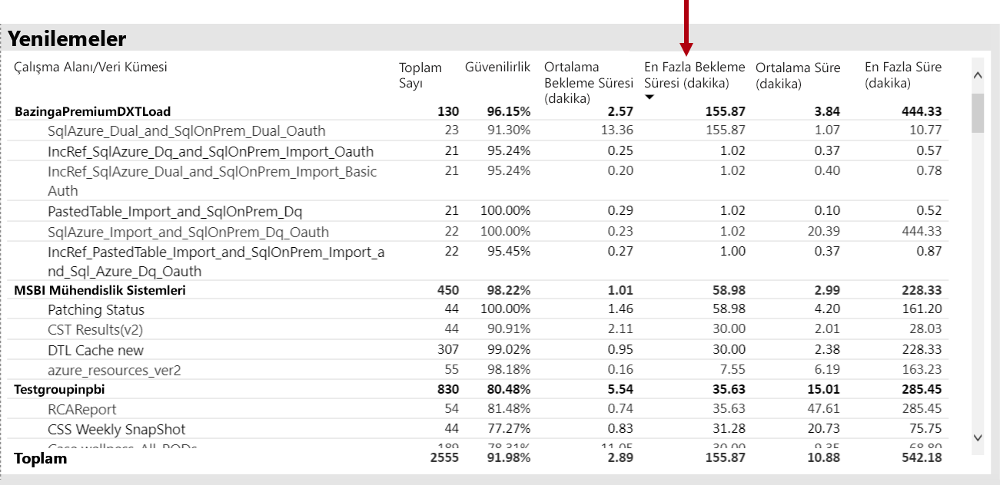

Ayrıca, **saatlik ortalama yenileme bekleme süreleri** görseline göre yenileme süresi her gün yaklaşık 4pm 'de sürekli olarak ayarlanır.

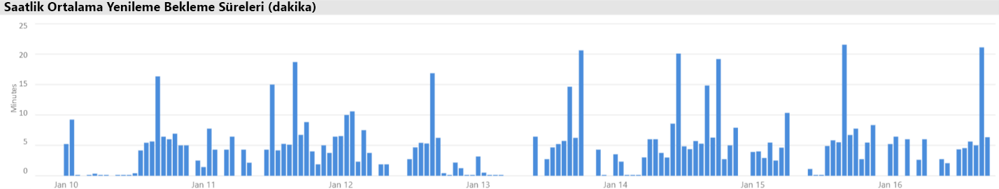

Bu sonuçlar için birkaç olası açıklamalar vardır:

- Aynı anda çok fazla yenileme denemesi gerçekleşirken, kapasite düğümü tarafından uygulanan sınırlar aşılıyor (varsayılan bellek ayırması olan P1 üzerinde altı eşzamanlı yenileme)

- Yenilenecek veri kümeleri kullanılabilir belleğe sığmayacak kadar büyük olabilir (tam yenileme için gereken en az 2x bellek gerektirir)
- Verimsiz Power Query mantığı, veri kümesi yenilemesi sırasında bellek kullanımının ani olarak oluşmasına neden olabilir. Yoğun bir kapasitede bu, zaman zaman fiziksel sınıra ulaşabilir ve bu da kapasiteyi ve potansiyel olarak diğer rapor görünümü işlemlerini etkiliyor olabilir.
- Bellekte kalması gereken sıklıkla sorgulanan veri kümeleri, sınırlı kullanılabilir bellek nedeniyle diğer veri kümelerinin yenilenmesi olanağını etkileyebilir

Bu sorunu araştırmaya yardımcı olmak için Power BI Yöneticisi şunları arayabilir:

- Veri yenileme sırasında düşük kullanılabilir bellek, kullanılabilir bellek, yenilenecek veri kümesinin boyutu 2x ' den az olduğunda
- Yenilenmeyen ve yenileme öncesinde bellekte olmayan veri kümeleri, ancak ağır yenileme süreleri boyunca etkileşimli trafiği göstermeye başladı. Herhangi bir zamanda belleğe hangi veri kümelerinin yüklendiğini görmek için bir Power BI Yöneticisi, uygulamadaki **veri** kümeleri sekmesindeki veri kümeleri alanına bakabilir ve **saatlik olarak yüklenen veri kümesi sayımlarına**tıklayarak belirli bir saate çapraz filtre uygulayabilir. Yerel bir ani (aşağıdaki görüntüde gösterilen), belleğe birden çok veri kümesinin yüklendiği bir saat, zamanlanan yenilemelerin başlangıcını erteleyebilir
- Yenileme zamanından önce çok sayıda farklı etkileşimli rapor sunmaya neden olan yüksek bellek baskısı olduğunu belirten, veri yenilemelerinin başlaması planlandığında artan veri kümesi çıkarmaları. **Saatlik veri kümesi çıkarmaları ve bellek tüketimi** görseli çıkarmalar üzerinde açık artışlar gösterebilir.

Aşağıdaki görüntüde, yük, Gecikmeli başlangıç yenileme başlangıcını öneren, yüklenen veri kümelerinde yerel bir ani artış gösterilmektedir. **Saatlik olarak yüklenen veri** kümelerinde bir zaman aralığı seçildiğinde görsel **veri kümesi boyutlarının** görsel olarak filtreleneceği.

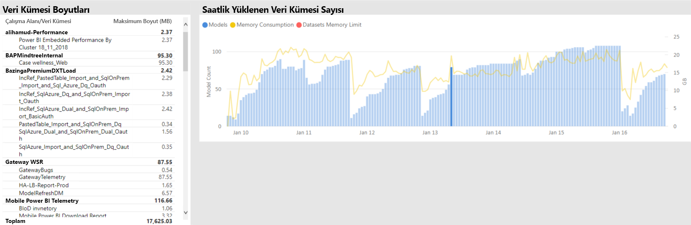

Power BI Yöneticisi, veri yenilemelerinin başlaması için yeterli belleğin kullanılabilir olmasını sağlamak üzere adımları gerçekleştirerek sorunu çözmeye çalışabilir:

- Veri kümesi sahiplerine başvurma ve veri yenileme zamanlamalarını bir yere eklemek ve bunları değiştirmek isteyen
- Gereksiz panoları veya Pano kutucukları kaldırarak veri kümesi sorgu yükünü azaltma, özellikle de satır düzeyi güvenliği zorlanlar
- Power Query mantığını iyileştirerek, hesaplanan sütunları veya tabloları modelleyerek, veri kümesi boyutlarını azaltarak veya artımlı veri yenileme işlemi gerçekleştirmek için daha büyük veri kümelerini yapılandırarak veri yenilemelerini hızlandırma

### Yavaş yanıt veren veri kümelerini tanımlama

Bu senaryoda, kullanıcılar belirli raporların açık bir süre sürdüğünü şikayet eden bir araştırma tetikleniyor ve zaman askıda kalır.

Uygulamada Power BI Yöneticisi, veri kümelerini azalan **ortalama süreye**göre sıralayarak en kötü performanslı veri kümelerini belirleyebilmek Için **sorgu süreleri** görselini kullanabilir. Bu görsel veri kümesi sorgu sayılarını da gösterir. bu sayede veri kümelerinin ne sıklıkta sorgulandığını görebilirsiniz.

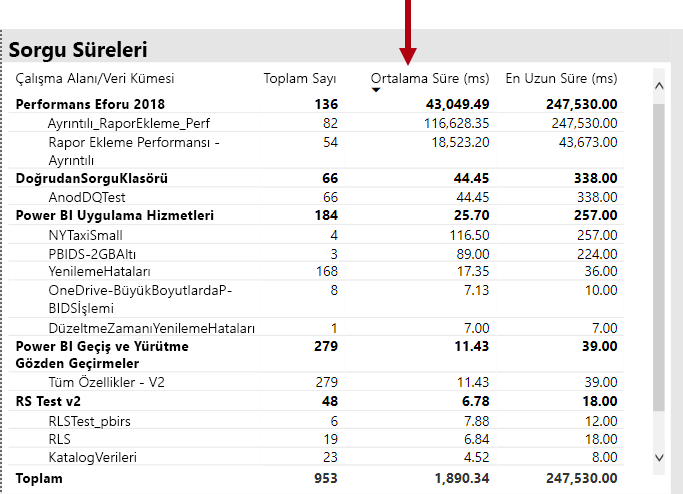

Power BI Yöneticisi **sorgu süresi dağıtım** görseline başvurabilir, bu da filtrelenmiş zaman aralığı için bir bütün olarak yapılan sorgu performansının genel dağıtımını (< = 30ms, 0-100 ms, vb.) gösterir. Genellikle, bir saniye veya daha az alan sorgular çoğu kullanıcı tarafından yanıt veriyor sayılır; daha uzun sürme sorguları, hatalı performans için bir algılama daha uzundur.

**Saatlik sorgu süresi dağıtım** görseli, Power BI yöneticisinin kapasite performansı zayıf olarak tespit edildiğinde bir saatlik dönemi belirlemesine izin verir. Sorgu sürelerini bir saniyede temsil eden çubuk kesimleri arttıkça, kullanıcıların kötü performansa neden olacağı riski daha büyük olur.

Görsele etkileşimli ve çubuğun bir segmenti seçildiğinde, rapor sayfasındaki ilgili **sorgu süreleri** tablosu görseli, temsil ettiği veri kümelerini göstermek için çapraz filtrelenmiştir. Bu çapraz filtreleme, Power BI yöneticisinin hangi veri kümelerinin yavaş yanıt verdiğini kolayca belirlemesine izin verir.

Aşağıdaki görüntüde, **saatlik sorgu süresi dağılımlarına**göre filtrelenmiş bir görsel gösterilmektedir ve bu, bir saatlik demetlerde en kötü performanslı veri kümelerine odaklanarak yapılır. 

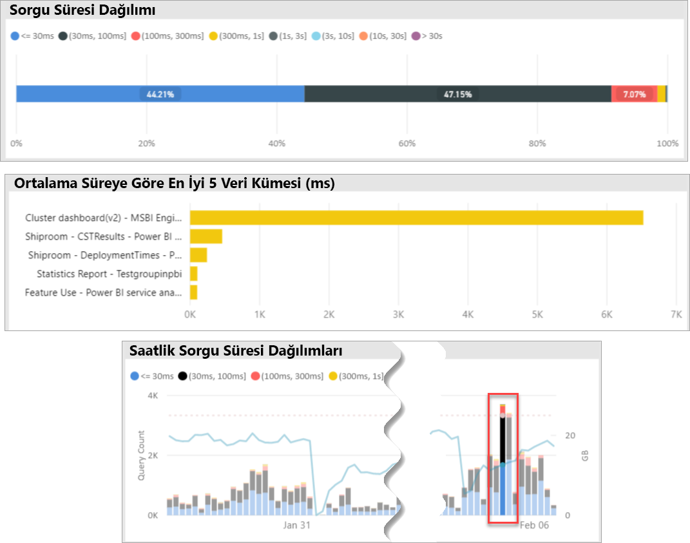

Belirli bir 1 saat zaman aralığı içinde zayıf veri kümesi tanımlandıktan sonra, Power BI Yöneticisi aşırı yüklenmiş bir kapasitenin veya kötü tasarlanmış bir veri kümesinin veya raporun neden olup olmadığını araştırabilir. Bunu başarmak için **Sorgu bekleme süreleri** görseline başvurabilir ve veri kümelerini azalan ortalama sorgu bekleme süresine göre sıralayabilirsiniz. Büyük bir sorgu yüzdesi bekliyorsa, veri kümesi için yüksek bir talep büyük olasılıkla birçok sorgunun beklediği nedendir. Ortalama Sorgu bekleme süresi önemli (> 100ms) ise, iyileştirmelerin olup olmadığını görmek için veri kümesini ve raporu gözden geçirmek gerekebilir. Örneğin, belirli rapor sayfaları veya DAX ifadesi iyileştirmesi hakkında belki de daha az görsel.

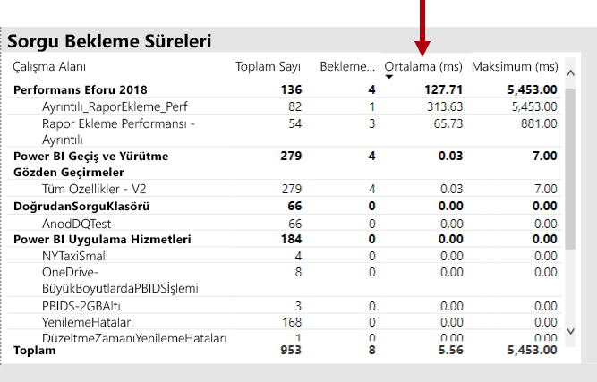

Veri kümelerinde sorgu bekleme süresi oluşturmanın birkaç olası nedeni vardır:

- En uygun model tasarımı, ölçü ifadeleri, hatta rapor tasarımı-yüksek düzeyde CPU kullanan, uzun süre çalışan sorgulara katkıda bulunan tüm koşullar. Bu, yeni sorguları CPU iş parçacıkları kullanılabilir olana kadar beklemeye zorlar ve genellikle yoğun iş saatlerinde görülen bir konvoy efekti (düşünme trafiği sıkıştı) oluşturabilir. Sorgu, veri kümelerinin Ortalama Sorgu bekleme süreleriyle aynı olup olmadığını belirleyecek ana kaynak olarak **bekler** .
- Aynı rapor veya veri kümesini kullanan yüksek sayıda eşzamanlı kapasite kullanıcısı (yüzlerce binlerce). İyi tasarlanmış veri kümeleri de bir eşzamanlılık eşiğinin ötesinde kötü bir şekilde gerçekleştirilebilir. Bu genellikle, diğer veri kümelerinin gösterdiği sorgu sayısı için önemli ölçüde daha yüksek bir değer gösteren tek bir veri kümesi tarafından belirtilir (yani, bir veri kümesi için 300K sorguları diğer tüm veri kümeleri için < 30K sorguları ile karşılaştırılır). Bazı bir noktada sorgu bu veri kümesi için bekler ve **sorgu süreleri** görselindeki görünür.
- Aynı anda sorgulanan birçok farklı veri kümesi, veri kümeleri genellikle bellek içinde ve yetersiz bellek olarak geçiş yapar. Bu, veri kümesi belleğe yüklendiğinde kullanıcıların yavaş performans yaşamasından kaynaklanır. Bu işlemi onaylamak için Power BI Yöneticisi **saatlik veri kümesi çıkarmaları ve bellek tüketimi** görseine başvurabilir. Bu, belleğe yüklenen çok sayıda veri kümesinin tekrar tekrar çıkarıldığını gösterebilir.

### Sporya yavaş yavaş yanıt veren veri kümelerinde nedenleri tanımlama

Bu senaryoda, kullanıcıların rapor görsellerini açıkladığı zaman bazen yanıt vermesi veya yanıt verebilmesini sağlamak için bir araştırma tetikleniyor, ancak diğer zamanlarda kabul edilebilir hale gelir.

Uygulama içinde, **sorgu süreleri** bölümü, aşağıdaki şekilde, külprit veri kümesini bulmak için kullanılmıştır:

- **Sorgu süreleri** (sorgulanan en üst veri kümelerinde başlayarak) veri kümesine göre bir yöneticiye filtrelenmiş veri kümesi ve **saatlik sorgu dağıtımları** görselindeki çapraz filtrelenmiş çubukları incelenmiştir.
- Tek bir saatlik çubuk, tüm sorgu süresi grupları ve bu veri kümesi için diğer bir saatlik çubuk (örn. renkler arasındaki oranlar büyük ölçüde değişir) ile ilgili olarak önemli değişiklikler gösteriyorsa, bu veri kümesinin mının.
- Zayıf performanslı sorguların düzensiz bir kısmını gösteren bir saatlik çubuklar, bu veri kümelerinin etkinliklerinin nedeniyle gürültülü bir komşu etkiden etkilenen bir TimeSpan belirtti.

Aşağıdaki görüntüde, "(3, 10 s]" yürütme süresi demeti boyutuyla belirtilen bir veri kümesinin performansının önemli bir şekilde gerçekleştiği, 30 Ocak 'ta bir saat gösterilmektedir. Tek saatlik bir çubuk, bu süre boyunca belleğe yüklenen tüm veri kümelerini ortaya çıkarırsa, bu sayede aday, veri kümelerinin çok gürültülü komşu etkisi olmasına neden olur.

Soruna neden olan bir TimeSpan belirlendikten sonra (yukarıdaki görüntüde 30 Ocak 'ta) Power BI Yöneticisi tüm veri kümesi filtrelerini kaldırabilir ve bu süre içinde hangi veri kümelerinin etkin bir şekilde sorgulandığını tespit etmek için yalnızca bu TimeSpan tarafından filtre uygulayabilir. Gürültülü komşu etkisi için küldeğer veri kümesi, genellikle en fazla sorgulanan veri kümesi veya en uzun ortalama sorgu süresine sahip olabilir.

Bu soruna yönelik bir çözüm, farklı Premium kapasitelerde farklı çalışma alanları üzerinde ya da veri kümesi boyutu, tüketim gereksinimleri ve veri yenileme desenlerinin desteklenmesine bağlı olarak, paylaşılan kapasitede bulunan küldeğer veri kümelerini dağıtmak olabilir.

Tersi de doğru olabilir. Power BI Yöneticisi, bir veri kümesi sorgu performansının büyük ölçüde iyileşme zamanlarını tanımlayabilir ve sonra kaybolup olmadığına bakar. Bu noktada belirli bilgiler eksikse, bu, sorunun nedeni soruna işaret etmenize yardımcı olabilir.

### Yeterli bellek olup olmadığını belirleme

Kapasite için iş yüklerini tamamlamaya yetecek miktarda bellek olup olmadığını öğrenmek için Power BI Yöneticisi, uygulamanın **veri kümeleri** sekmesinde **tüketilen bellek yüzdeleri** görselinizi ifade edebilir. **Tüm** (Toplam) bellek, etkin olarak sorgulanıp işlenmediğine bakılmaksızın belleğe yüklenen veri kümeleri tarafından tüketilen belleği temsil eder. **Etkin** bellek, etkin olarak işlenen veri kümeleri tarafından tüketilen belleği temsil eder.

Sağlıklı bir kapasitede, görsel şöyle görünür ve tümü (Toplam) ile etkin bellek arasında bir boşluk gösterir:

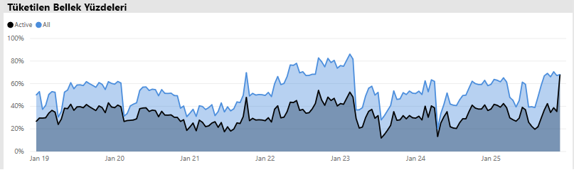

Bellek baskısı yaşayan bir kapasitede, aynı görselin etkin belleği ve toplam bellek ile yakınsama işlemini açık bir şekilde gösterir. Bu durumda Power BI Yöneticisi **Kapasite yeniden başlatması** ' ne tıklayabilir (yönetim portalının kapasite ayarları alanının **Gelişmiş seçeneklerinde** ). Tüm veri kümelerinin bellekten boşaltılmasına ve gerektiğinde (sorgular veya veri yenilemelerine göre) belleğe yeniden erişmesine izin veren kapasite sonuçları yeniden başlatılıyor.

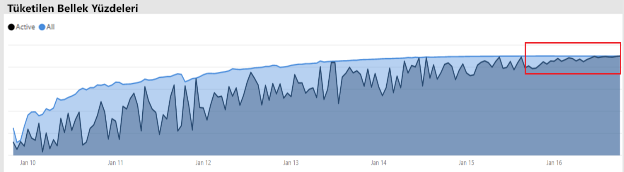

### Yeterli CPU olup olmadığını belirleme

Genel olarak, bir kapasitenin ortalama CPU kullanımı %80 altında kalmalıdır. Bu değerin aşılması, kapasitenin CPU doygunluğunun yaklaştığı anlamına gelir.

CPU doygunluğunun etkileri, tüm işlemleri işlemeye çalıştığı için çok sayıda CPU bağlam anahtarı gerçekleştiren kapasiteye bağlı olarak gerekenden daha uzun süren işlemlere göre ifade edilir. Çok sayıda eşzamanlı sorguya sahip Premium kapasitede bu, yüksek sorgu bekleme süreleriyle belirtilir. Yüksek sorgu bekleme sürelerinin bir sonucu normalden daha yavaş yanıt verebilir. Power BI Yöneticisi, **saatlik sorgu bekleme süresi dağıtımları** görselini görüntüleyerek CPU 'nun ne zaman doymuş olduğunu kolayca tanımlayabilir. Sorgu bekleme süresi sayımlarının düzenli olarak en yüksek noktaları potansiyel CPU doygunluğu olduğunu gösterir.

Benzer bir model bazen, CPU doygunluğa katkıda bulunduklarında arka plan işlemlerinde algılanabilir. Power BI Yöneticisi, belirli bir veri kümesi için yenileme saatlerinde düzenli bir ani artış arayabilir. Bu, (muhtemelen diğer devam eden veri kümesi yenilemelerinde ve/veya etkileşimli sorgularda olduğu gibi) CPU doygunluğu anlamına gelebilir. Bu örnekte, uygulamadaki **sistem** görünümüne başvurmak, CPU 'nun %100 ' de olduğunu açığa çıkarmayabilir. **Sistem** görünümü saatlik ortalamaları görüntüler, ancak CPU, bekleme sürelerine göre ani artışlar olarak gösterilen birkaç dakika ağır işlem için doygun hale gelebilir.

CPU doygunluğunun etkisini görmek için daha fazla etkinlik vardır. Bekleyen sorgu sayısı önemli olsa da, sorgu bekleme süresi her zaman bir ölçüde performans düşüşüne neden olmadan meydana gelir. Bazı veri kümeleri (karmaşıklık veya boyut belirten uzunlukla ortalama sorgu süresi), CPU doygunluğunun etkileriyle diğerlerinden daha açıktır. Bu veri kümelerini kolayca tanımlamak için Power BI Yöneticisi, **saatlik bekleme süresi dağıtım** görselindeki çubukların renk kompozisyonunun üzerinde değişiklik arayabilir. Bir aykırı değer çubuğunu biriktirdikten sonra, bu süre boyunca sorgu bekleyen veri kümelerini arayabilir ve ortalama sorgu süresine kıyasla ortalama sorgu bekleme süresine de bakabilirler. Bu iki ölçüm aynı büyüklüğüdür ve veri kümesi için sorgu iş yükü önemsiz değilse, büyük olasılıkla veri kümesi yetersiz CPU 'dan etkilenebilir.

Bu efekt özellikle bir veri kümesi birden çok kullanıcı tarafından (örneğin, bir eğitim oturumunda) yüksek frekanslı sorguların kısa Bursta kullanılırken, her bir patlama sırasında CPU doygunluğu oluşmasına neden olduğunda görünür. Bu durumda, bu veri kümesindeki önemli sorgu bekleme süreleriyle, kapasite (gürültülü komşu etkisi) diğer veri kümelerinde da etkilenilerek karşılaşılmış olabilir.

Bazı durumlarda, Power BI yöneticileri bu veri kümesi sahiplerini bir rapor (önbelleğe alınmış kutucuklar için bir veri kümesi yenilemesi ile düzenli aralıklarla sorgular) oluşturarak daha az geçici bir sorgu iş yükü oluşturmalarına talep edebilir. Bu, pano yüklendiğinde ani artışları önlemeye yardımcı olabilir. Bu çözüm, belirli iş gereksinimleri için her zaman mümkün olmayabilir, ancak veri kümesinde değişiklik yapmadan CPU doygunluğunun oluşmaması için etkili bir yol olabilir.

## Sonuç

Power BI Premium, daha tutarlı performans, büyük veri birimlerine yönelik destek ve kuruluşunuzdaki herkes için Birleşik bir self servis ve kurumsal bı platformunun esnekliğini sağlar. Bu düzey 300 teknik teknik incelemesi, Power BI yöneticileri, içerik yazarları ve yayımcıları için özel olarak yazılmıştır. Power BI Premium potansiyelini anlamalarına yardımcı olmak ve ölçeklenebilir çözümlerin nasıl tasarlanacağını, dağıtılacağını, izleneceğini ve sorun gidereceğinizi açıklamak.

Power BI Premium kapasiteleri dağıtmak ve yönetmek için, Yöneticiler ve model geliştiriciler, kapasiteye nasıl yanıt verileceğini, nasıl yönetilebileceğini ve izlenebileceğini ve modellerin uygun şekilde nasıl iyileştirebileceğini öğrenmek için çok iyi bir fikir ister performans sorunları ve darboğazları ortaya çıkar.

## Son notlar

\[1\] bu teknik kağıt yalnızca Power BI bulut hizmeti tarafından desteklenen Power BI Premium ilgilidir ve Power BI rapor sunucusu, yüklemek için gereken lisansın dahil olduğu durumlar dışında Power BI Rapor Sunucusu kapsamda değildir. Bazı Power BI Premium SKU 'Ları.

\[2\], uygulama kullanıcıları adına içerik eklemek için kullanıldığında bir bulut hizmeti olarak Power BI, hizmet olarak platform (PaaS). Bu tür gömme, biri Power BI Premium farklı iki ürünle elde edilebilir.

\[3\] gönderim, akış ve hibrit veri kümeleri Premium kapasitelerde depolanmaz ve bu nedenle Premium kapasiteleri dağıtıldığında, yönetirken ve izlerken dikkate alınmaz.

\[4\] Excel çalışma kitaplarını Power BI içerik türü olarak Premium kapasitelerde depolanmaz ve bu nedenle Premium kapasiteleri dağıtma, yönetme veya izleme konusunda dikkate alınmaz.

\[5\] görselleri, Dilimleyici etkileşimlerini yoksayacak şekilde yapılandırılabilir. Daha fazla bilgi için, [Power BI rapor belgesindeki görselleştirme etkileşimlerine](service-reports-visual-interactions.md) bakın.

\[6\] boyut farkı, dosya için kullanılan görev yöneticisi belleği ile Power BI Desktop dosya boyutu karşılaştırılmasıyla belirlenebilir.

\[7\] Microsoft veri kaynaklarına yönelik destek SQL Server, Azure veri blokları, Azure HDInsight Spark (Beta), Azure SQL veritabanı ve Azure SQL veri ambarı içerir. Ek kaynaklar hakkında daha fazla bilgi için, [Power BI belgesinde doğrudan sorgu tarafından desteklenen veri kaynaklarına](desktop-directquery-data-sources.md) bakın.

\[8\] Power BI Premium Power BI Desktop (. pbix) dosyasının boyutunu en fazla 10 GB 'a kadar karşıya yüklemeyi destekler. Karşıya yüklendikten sonra, yenileme sonucunda bir veri kümesi 12 GB 'a kadar büyüyebilir. En fazla karşıya yükleme boyutu SKU 'ya göre değişir. Daha fazla bilgi için, [büyük veri kümeleri belgesi için Power BI Premium desteğine](service-premium-large-datasets.md) bakın.

dört taneden az sanal çekirdekli \[9\] SKU 'Ları adanmış altyapıda çalıştırılmazlar. Buna EM1, EM2, a1 ve a2 SKU 'Ları dahildir.

\[10\] nadir bir deyişle, hizmet işlemleri nedeniyle modeller bellekten kaldırılabilir.

\[11\] bu zamanlamalar herhangi bir zamanda değiştirilebilir.

\[12\] bu, şu anda önizleme aşamasında olan çok coğrafi bölge olarak adlandırılır. Çoklu coğrafi dağıtımın mantığı genellikle performans ve ölçek yerine kurumsal veya idari uyumdur. Raporları ve panoları yükleme işlemi yine de meta veriler için ana bölgeye istekler göndermeyi içerir. Daha fazla bilgi için [Power BI Premium (Önizleme) Için çoklu coğrafi destek](service-admin-premium-multi-geo.md) belgesine bakın.

\[13\] kullanıcıların, Power BI hizmeti işlerle aşırı yükleme, aşırı karmaşık sorgular yazma, döngüsel başvurular oluşturma vb. gibi performans sorunlarına neden olabildiğinden emin olabilir.

\[14\] kuruluşun tüm çalışma alanlarını atama seçeneği önerilmez ve daha hedeflenmiş bir yaklaşım tercih edilir. Genellikle, üretim içeriği için kişisel çalışma alanlarını kullanmak en iyi uygulamadır.

\[15\] uygulamada veya Azure portal bir SKU 'Ları izlemek mümkündür, ancak Power BI yönetim portalı 'nda değil. Bir SKU 'yu izlemek için, uygulama, kaynağın okuyucu rolüne eklenmediyse, raporun yenilenmesi başarısız olur. Daha fazla bilgi için [izleyici Power BI Premium ve Power BI Embedded kapasiteleri](service-admin-premium-monitor-capacity.md) belgesine bakın.

\[16\] yenilemeler, başlamak için yeterli CPU veya bellek olmadığında bekleyebilir.

\[17\] bellekteki veri kümesi boyutu disk boyutundan daha büyük olabilir. %20 ' ye kadar.

\[18\] ortalama bellek kullanımı (GB) ve en yüksek bellek tüketimi (GB)

\[19\] veri kümesi çıkarmaları

\[20\] veri kümesi sorguları, veri kümesi ortalama sorgu süresi (MS), veri kümesi bekleme sayısı ve veri kümesi ortalama bekleme süresi (MS)

\[21\] CPU yüksek kullanım sayısı ve en yüksek kullanımındaki CPU süresi (son yedi gün)

\[22\] DQ/LC yüksek kullanım sayısı ve DQ/LC en yüksek kullanım süresi (son yedi gün)
