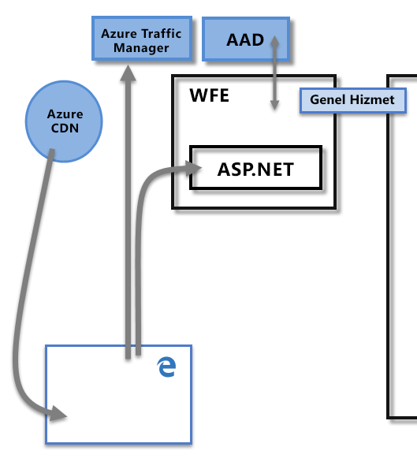
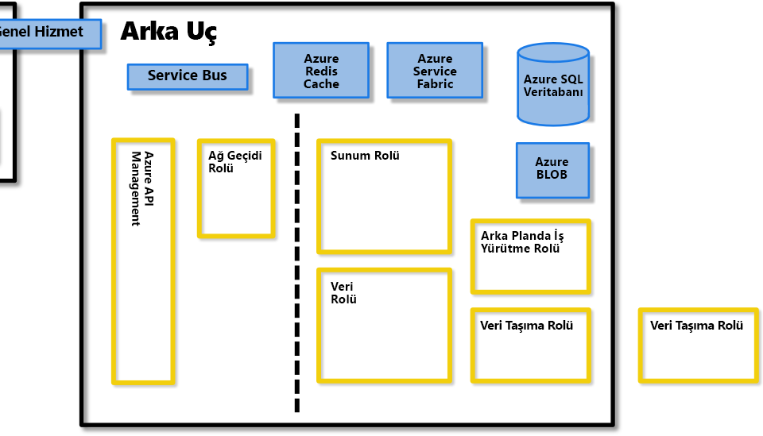
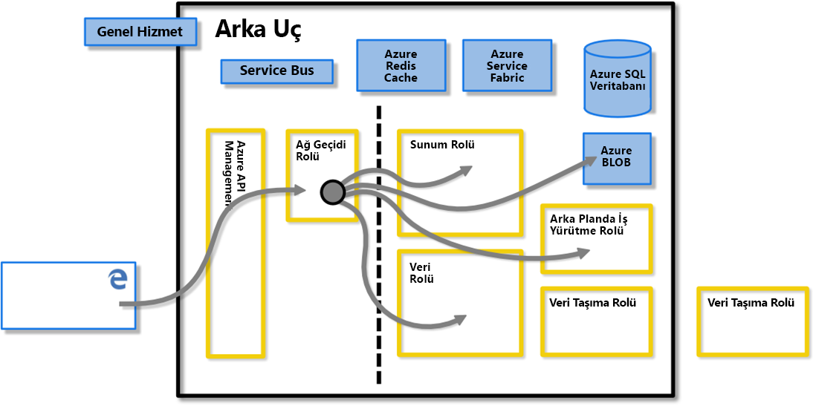
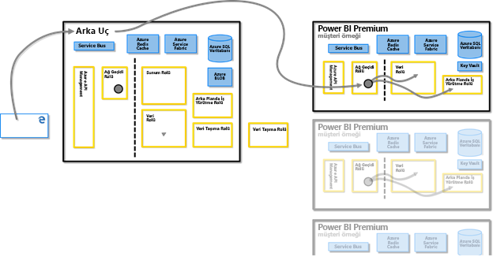
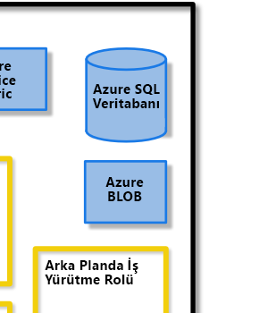
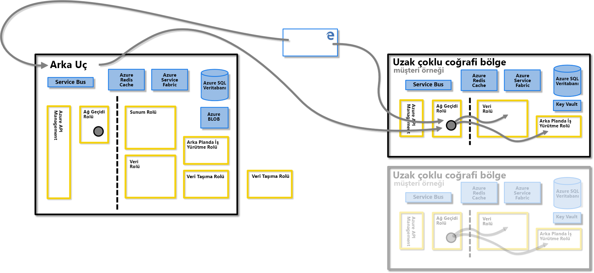
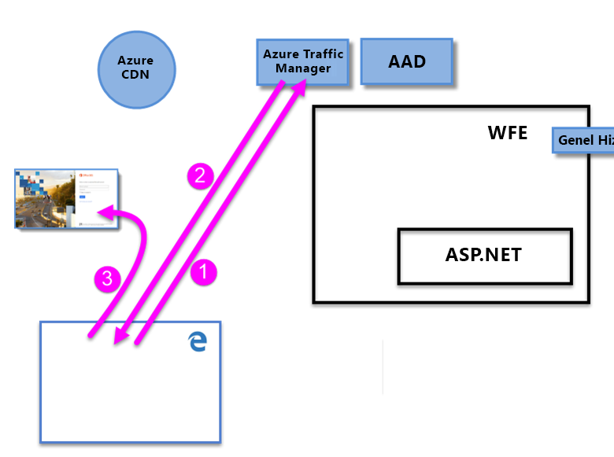
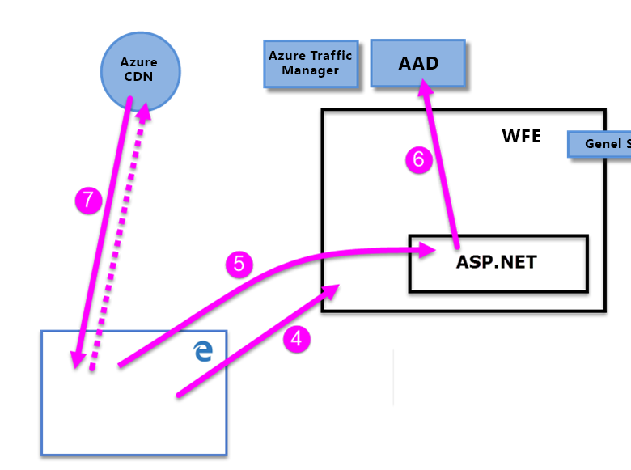

# Power BI güvenliği teknik incelemesi

**Özet:** Power BI, Microsoft’un çevrimiçi yazılım hizmeti (*SaaS* veya Hizmet olarak Yazılım) teklifidir. Bu hizmet, kolayca ve hızla self servis İş Zekası panoları, raporları, veri kümeleri ve görselleştirmeleri oluşturmanıza olanak tanır. Power BI ile birçok farklı veri kaynağına bağlanabilir, bu bağlantılardan gelen verileri birleştirip şekillendirebilir ve ardından başkalarıyla paylaşılabilen rapor ve panolar oluşturabilirsiniz.

**Yazan:** David Iseminger

**Teknik Açıdan Gözden Geçirenler:** Pedram Rezaei, Cristian Petculescu, Siva Harinath, Tod Manning, Haydn Richardson, Adam Wilson, Ben Childs, Robert Bruckner, Sergei Gundorov, Kasper de Jonge

**Uygulama hedefi:** Power BI SaaS, Power BI Desktop, Power BI Embedded, Power BI Premium

> [!NOTE]
> Tarayıcınızdan **Yazdır**’ı ve ardından **PDF olarak kaydet**’i seçerek bu teknik incelemeyi yazdırabilir veya kaydedebilirsiniz.

## Giriş

**Power BI**, Microsoft’un çevrimiçi yazılım hizmeti (_SaaS_ veya Hizmet olarak Yazılım) teklifidir. Bu hizmet, kolayca ve hızla self servis İş Zekası panoları, raporları, veri kümeleri ve görselleştirmeleri oluşturmanıza olanak tanır. Power BI ile birçok farklı veri kaynağına bağlanabilir, bu bağlantılardan gelen verileri birleştirip şekillendirebilir ve ardından başkalarıyla paylaşılabilen rapor ve panolar oluşturabilirsiniz.

Power BI hizmeti [Microsoft Online Services Koşulları](http://www.microsoftvolumelicensing.com/DocumentSearch.aspx?Mode=3&amp;DocumentTypeId=31) ve [Microsoft Kurumsal Gizlilik Bildirimi](http://www.microsoft.com/privacystatement/OnlineServices/Default.aspx) koşullarına tabidir. Veri işleme konumu için Microsoft Online Services Koşullarında Veri İşleme Konumu koşullarına bakın. Uyumluluk bilgileri için [Microsoft Güven Merkezi](https://www.microsoft.com/trustcenter) Power BI’ın birincil kaynağıdır. Power BI takımı müşterilerine en son yenilikleri ve üretkenlik çözümlerini getirmek için çalışıyor. Power BI şu anda [Office 365 Uyumluluk Çerçevesi](http://go.microsoft.com/fwlink/p/?LinkID=618494)’nin Katman D bölümünde yer alıyor.

Bu makalede, Power BI mimarisini açıklanıp kullanıcıların nasıl Power BI’da kimlik doğrulayarak veri bağlantıları oluşturdukları anlatıldıktan sonra Power BI’ın hizmet üzerinden nasıl veri taşıdığı ve depoladığı açıklanarak Power BI güvenliği tanımlanır. Son bölüm güvenlikle ilgili sorulara ve bu soruların yanıtlarına ayrılmıştır.

## Power BI Mimarisi

**Power BI** hizmetinin temelini, Microsoft'un [bulut bilgi işlem platformu](http://azure.microsoft.com/overview/what-is-azure/) olan **Azure** oluşturur. Power BI şu anda dünyanın her yerinde birçok veri merkezine dağıtılmıştır. Bu veri merkezlerinin hizmet verdiği bölgelerdeki müşterilerin kullanıma sunulan çok sayıda etkin dağıtım bulunur ve her etkin dağıtım için yedekleme işlevi gören, edilgen dağıtımlar vardır.

Her Power BI dağıtımı iki kümeden oluşur: Web Ön Uç (**WFE**) kümesi ve **Arka Uç** kümesi. Bu iki küme aşağıdaki resimde gösterilmiştir ve makalenin geri kalanının arka planını oluşturur. 

Power BI hesap kimliği doğrulaması ve yönetimi için Azure Active Directory (**AAD**) kullanır. Ayrıca Power BI, hem kimlik doğrulaması hem de statik içeriğin ve dosyaların indirilmesi için bağlantı kurmaya çalışan istemcinin DNS kaydına göre kullanıcı trafiğini en yakın veri merkezine yönlendirmek amacıyla **Azure Traffic Manager** (ATM) hizmetini kullanır. Power BI, statik içeriği ve dosyaları coğrafi yerel ayara göre kullanıcılara verimli bir şekilde dağıtmak için **Azure Content Delivery Network** (CDN) hizmetini kullanır.

### WFE Kümesi

**WFE** kümesi Power BI için ilk bağlantı ve kimlik doğrulaması işlemlerini yönetir. Bu küme, AAD hizmetini kullanarak istemcilerin kimliklerini doğrular ve Power BI hizmetiyle kurulacak sonraki istemci bağlantıları için belirteçler sağlar.

Kullanıcılar Power BI hizmetine bağlanmaya çalıştığında istemcinin DNS hizmeti Power BI dağıtımı olan en yakın veri merkezini bulmak için **Azure Traffic Manager** ile iletişim kurabilir. Bu işlem hakkında daha fazla bilgi için bkz. [Azure Traffic Manager için yüksek performanslı trafik yönlendirme yöntemi](https://azure.microsoft.com/documentation/articles/traffic-manager-routing-methods/#performance-traffic-routing-method).

Kullanıcıya en yakın WFE kümesi oturum açma ve kimlik doğrulama dizisini yönetir (bu makalenin devamında açıklanmıştır) ve kimlik doğrulaması başarılı olduğunda kullanıcıya bir AAD belirtici sağlar. WFE kümesindeki ASP.NET bileşeni kullanıcının hangi kuruluşa ait olduğunu belirlemek için isteği ayrıştırır ve ardından Power BI **Genel Hizmeti**’ne başvurur. Genel Hizmet, dünya çapında tüm WFE ve Arka Uç kümeleri arasında paylaşılan ve kullanıcılarla müşteri kuruluşlarını Power BI kiracılarının barındırıldığı veri merkeziyle eşleyen tek bir Azure Tablosudur. WFE tarayıcıya hangi Arka Uç kümesinin kuruluşun kiracısını barındırdığını belirtir. Kullanıcının kimliği doğrulandıktan sonra yapılan istemci etkileşimleri, WFE’nin aracılık etmesine gerek kalmadan doğrudan Arka Uç kümesiyle gerçekleştirilir.

### Power BI Arka Uç Kümesi

**Arka Uç** kümesi, kimlik doğrulamasından geçen istemcilerin, Power BI hizmetiyle nasıl etkileşim kuracağını belirler. **Arka Uç** kümesi; görselleştirmeleri, kullanıcı panolarını, veri kümelerini, raporları, veri depolama alanlarını, veri bağlantılarını, veri yenileme özelliklerini ve Power BI hizmetiyle etkileşim kurarken kullanılan diğer öğeleri yönetir.

**Ağ Geçidi Rolü** kullanıcı istekleriyle Power BI hizmeti arasında bir ağ geçidi işlevi görür. Kullanıcılar Ağ Geçidi Rolü haricindeki bir rolle doğrudan etkileşim kurmaz.

**Önemli:** _Yalnızca_ Azure API Management (**APIM**) ve Ağ Geçidi (**GW**) rollerinin İnternet üzerinden herkesin erişimine açık olduğu unutulmamalıdır. Bu hizmetler kimlik doğrulaması, yetkilendirme, DDoS koruması, Azaltma, Yük Dengeleme, Yönlendirme gibi özellikler sunar.

Yukarıdaki **Arka Uç** kümesi resminde yer alan kesik çizgi, kullanıcılar tarafından erişilebilen iki rol (kesik çizginin sol tarafı) ile yalnızca sistem tarafından erişilebilen roller arasındaki ayrımı gösterir. Kimliği doğrulanmış bir kullanıcı Power BI hizmetine bağlandığında bağlantı ve istemci istekleri **Ağ Geçidi Rolü** ve **Azure API Management** tarafından kabul edilip yönetilir ve bu rol Power BI hizmetinin geri kalan kısmında kullanıcının adına etkileşimde bulunur. Örneğin, bir istemci bir panoyu görüntülemek istediğinde **Ağ Geçidi Rolü** bu isteği kabul eder ve tarayıcının panoyu oluşturması için gerekli olan verileri almak için **Sunum Rolü**'ne ayrı bir istek gönderir.

### Power BI Premium

**Power BI Premium**, Power BI etkinlikleri için ayrılmış kaynaklara ihtiyacı olan abonelere ayrılmış, sağlanmış ve bölümlenmiş bir hizmet çalışma alanı sunar. Müşteri Power BI Premium aboneliğine kaydolduğunda Premium kapasite **Azure Resource Manager** üzerinden oluşturulur. Bu aboneliğin dağıtımı; Power BI kiracısının barındırıldığı veri merkezinde (bu makalenin devamında açıklandığı gibi Multi-Geo ortamları dışında), **Azure Service Fabric** dağıtımı olarak başlatılan ve abonelik düzeyiyle orantılı olan bir sanal makine kümesi atar.

Oluşturulduktan sonra, Premium kümesindeki tüm iletişimler Power BI Arka Uç kümesine yönlendirilir ve buradan istemcinin ayrılmış **Power BI Premium** aboneliği sanal makinesiyle iletişim kurulur.

### Veri Depolama Mimarisi

Power BI hizmetinin veri depolamak ve yönetmek için kullandığı iki ana depo vardır. Kullanıcılar tarafından karşıya yüklenen veriler genelde **Azure Blob** depolama alanına gönderilirken sisteme ait meta veriler ve tüm yapıtlar **Azure SQL Veritabanı**'nda güvenlik duvarının arkasında depolanır.

Örneğin bir kullanıcı Power BI hizmetine Excel çalışma kitabı aktardığında, bellek içi bir Analysis Services tablolu veritabanı oluşturulur ve en fazla bir saat boyunca (veya sistemde bellek baskısı oluşana kadar) veriler bellek içinde depolanır. Veriler **Azure Blob** depolama alanına da gönderilir.

Kullanıcının Power BI aboneliği hakkındaki meta veriler (panolar, raporlar, son veri kaynakları, çalışma alanları, kurumsal bilgiler, kiracı bilgileri ve sistem hakkında diğer meta verileri gibi), **Azure SQL Veritabanı**’nda depolanır ve güncelleştirilir. Azure SQL Veritabanı’nda depolanan tüm bilgiler [Azure SQL’in Saydam Veri Şifreleme](https://msdn.microsoft.com/library/dn948096.aspx) (TDE) teknolojisi kullanılarak şifrelenir. Azure Blob depolama alanında depolanan tüm veriler de şifrelenir. **Veri Depolama ve Taşıma** bölümünde veri yükleme, depolama ve taşıma işlemi hakkında daha fazla bilgi verilmiştir.

## Kiracı Oluşturma

Kiracı; kuruluşunuzun Azure, Microsoft Intune, Power BI veya Office 365 gibi bir Microsoft bulut hizmetine kaydolduğunda aldığı ve sahip olduğu adanmış bir Azure AD hizmeti örneğidir. Her Azure AD kiracısı diğer Azure AD kiracılarından ayrıdır.

Kiracı, bir şirketteki kullanıcıları ve onların bilgilerini (parolalar, kullanıcı profili verileri, izinler vb.) barındırır. Grupları, uygulamaları, ayrıca kuruluşla ve kuruluşun güvenliğiyle ilgili diğer bilgileri de içerir. Daha fazla bilgi için bkz. [Azure AD kiracısı nedir?](https://msdn.microsoft.com/library/azure/jj573650.aspx#BKMK_WhatIsAnAzureADTenant)

Power BI kiracısı, ülkeye (veya bölgeye) en yakın kabul edilen veri merkezinde oluşturulur ve Office 365 veya Power BI hizmeti ilk sağlandığında verilen ve Azure Active Directory’de kiracı için sunulan bilgileri belirtir. Power BI kiracısı bugün söz konusu veri merkezi konumundan taşınmaz.

### Birden Çok Coğrafi Bölge (Multi-Geo) - Önizleme

Bazı kuruluşlar iş gereksinimlerine bağlı olarak birden çok coğrafyada veya bölgede Power BI varlığına ihtiyaç duyar. Örneğin, bir işletmenin Power BI kiracısı Birleşik Devletler’de bulunuyor ancak işletme Avustralya gibi başka coğrafi bölgelerde de faaliyet gösteriyor ve bu nedenle Power BI hizmetleriyle verilerinin bu uzak bölgede tutulmasına ihtiyaç duyuyor olabilir.  2018’in ikinci yarısından başlayarak, kiracısı bir coğrafi bölgede bulunan kuruluşlar düzgün bir şekilde sağlandığında başka bir coğrafi bölgedeki Power BI kaynaklarına da erişebiliyorlar. Bu özellik, bu belgenin devamında kolaylık ve başvuru sağlamak için **multi-geo** olarak adlandırılır.

Farklı coğrafyalarda işlem yaparken akılda bulundurulması gereken teknik konular vardır. Bunlar bu belgede açıklamıştır. Önemli noktalar şunlardır:

- Uzak bölgede depolanan önbelleğe alınmış bir sorgu o bölgede bekletilir, öte yandan aktarımda olan diğer veriler birden çok coğrafi bölge arasında gidip gelebilir.
- Uzak bölgedeki PBIX veya XLSX dosyalarında bulunan ve Power BI’a yayımlanan raporlar bazen Power BI'ın Azure Blob depolama alanında bir kopya veya gölge kopya depolanmasına neden olabilir ve böyle bir durumda veriler Azure Depolama Hizmeti Şifrelemesi (SSE) kullanılarak şifrelenir.
- Multi-geo ortamında verileri bir bölgeden diğerine taşırken verilerin taşındığı kaynak bölgede 7 ile 10 gün arasında atık toplama gerçekleşebilir. Bu noktada özgün bölgeden taşınan verilerin kopyası yok edilir.

Aşağıdaki resim, multi-geo ortamına sahip uzak bölgede sağlanan Power BI hizmetinin **Power BI Arka Uç** kümesi üzerinden yönlendirilerek nasıl istemcinin uzak Power BI aboneliği sanal makinesine bağlantı sağladığı gösterilmiştir.

### Veri Merkezleri ve Yerel Ayarlar

Power BI, Power BI kümelerinin bölgesel veri merkezlerinde dağıtıldığı yerlere bağlı olarak belirli bölgelerde sunulur. Microsoft, Power BI altyapısını daha fazla veri merkezine genişletmeyi planlamaktadır.

Aşağıdaki bağlantılar Azure veri merkezleri hakkında ek bilgi sağlar.

- [Azure Bölgeleri](http://azure.microsoft.com/regions/): Azure’ın küresel varlığı ve konumları hakkında bilgiler
- [Bölgeye göre Azure Hizmetleri](http://azure.microsoft.com/regions/#services): Her bölgede Microsoft tarafından sunulan Azure hizmetlerinin (hem altyapı hizmetleri hem de platform hizmetleri) tam listesi.

Şu anda, Power BI hizmeti aşağıdaki birincil veri merkezleri tarafından hizmet verilen şu bölgelerde kullanılabilir:

- Türkiye
  - ABD Doğu
  - ABD Doğu 2
  - ABD Orta Kuzey
  - Orta Güney ABD
  - Batı ABD
  - Batı ABD 2
- Kanada
  - Kanada Orta
  - Kanada Doğu
- Birleşik Krallık
  - UK Batı
  - UK Güney
- Brezilya
  - Brezilya Güney
- Almanya
  - Almanya Orta
  - Almanya Kuzeydoğu
- Avrupa
  - Kuzey Avrupa
  - Batı Avrupa
- Japonya
  - Doğu Japonya
  - Batı Japonya
- Hindistan
  - Orta Hindistan
  - Güney Hindistan
  - Batı Hindistan
- Asya Pasifik
  - Doğu Asya
  - Güneydoğu Asya
- Avustralya
  - Avustralya Doğu
  - Avustralya Güneydoğu

Microsoft özerk bölgeler için de veri merkezleri sağlar. Bağımsız bulutlar için Power BI hizmetinin kullanılabilirliği hakkında daha fazla bilgi için bkz. [Power BI bağımsız bulutları](https://powerbi.microsoft.com/clouds/).

Verilerinizin nerede depolandığı ve nasıl kullanıldığı hakkında daha fazla bilgi için [Microsoft Güven Merkezi](https://www.microsoft.com/TrustCenter/Transparency/default.aspx#_You_know_where)’ne başvurun. Bekleyen müşteri verilerinin konumuyla ilgili taahhütler [Microsoft Online Services Koşulları](http://www.microsoftvolumelicensing.com/DocumentSearch.aspx?Mode=3&amp;DocumentTypeId=31)'nın **Bilgi İşlem Koşulları** bölümünde belirtilir.

## Kullanıcı Kimlik Doğrulaması

Power BI hizmetinde kullanıcı kimlik doğrulaması bir dizi istek, yanıt ve kullanıcının tarayıcısı ile Power BI hizmeti veya Power BI tarafından kullanılan Azure hizmeti arasında gerçekleşen yeniden yönlendirmeden oluşur. Bu dizi Power BI’da kullanıcı kimlik doğrulaması işlemini açıklar. Bir kuruluşun kullanıcı kimlik doğrulaması modellerine (oturum açma modelleri) ilişkin seçenekleri hakkında daha fazla bilgi için bkz. [Office 365 için oturum açma modelini seçme](https://blogs.office.com/2014/05/13/choosing-a-sign-in-model-for-office-365/).

### Kimlik Doğrulaması Dizisi

Power BI hizmeti için kullanıcı kimlik doğrulaması işlemi aşağıdaki adımlarda açıklanan ve aşağıdaki resimlerde gösterilen şekilde gerçekleşir.

1. Kullanıcı, adres çubuğuna Power BI adresini yazarak (örneğin https://app.powerbi.com) veya Power BI giriş sayfasından (https://powerbi.microsoft.com) _Oturum Aç_’ı seçerek bir tarayıcıdan Power BI hizmetine bağlantı başlatır. Bağlantı, TLS 1.2 ve HTTPS kullanarak kurulur ve daha sonra tarayıcı ile Power BI hizmeti arasındaki tüm bağlantılarda HTTPS kullanılır. İstek **Azure Traffic Manager**’a gönderilir.

2. **Azure Traffic Manager**, Power BI’ın dağıtıldığı en yakın veri merkezini belirlemek için kullanıcının DNS kaydını denetler ve DNS’ye kullanıcının gönderileceği WFE kümesinin IP adresiyle yanıt verir.

3. Ardından WFE kullanıcıyı Microsoft Online Services'in oturum açma sayfasına yönlendirir.

    

1. Kullanıcının kimliği doğrulandıktan sonra oturum açma sayfası kullanıcıyı önceden belirlenen en yakın Power BI hizmeti **WFE kümesine** yönlendirir.

2. Tarayıcı, Microsoft Online Services'te başarıyla oturum açıldığında alınan çerezi gönderir ve bu çerez **WFE kümesinin** içindeki **ASP.NET hizmeti** tarafından incelenir.

3. WFE kümesi, kullanıcının Power BI hizmeti aboneliğinin kimliğini doğrulamak ve bir AAD güvenlik belirteci almak için **Azure Active Directory** (**AAD**) hizmetine danışır. AAD kullanıcının kimlik doğrulamasının başarılı olduğunu bildirir ve AAD güvenlik belirtecini döndürürse, WFE kümesi kiracıların ve Power BI Arka Uç kümesi konumlarının listesini yöneten ve kullanıcının kiracısını hangi Power BI hizmeti kümesinin içerdiğini belirleyen **Power BI**** Genel Hizmeti**’ne başvurur. Ardından WFE kümesi kullanıcıyı, kiracısının bulunduğu Power BI kümesine yönlendirir ve kullanıcının tarayıcısına öğelerin bir koleksiyonunu döndürür:

      - **AAD güvenlik belirteci**
      - **Oturum bilgileri**
      - Kullanıcının bağlantı kurup etkileşimde bulunabileceği **Arka Uç** kümesinin web adresi

1. Kullanıcının tarayıcısı, tarayıcının Power BI hizmetiyle iletişimini etkinleştirmek için gereken belirli ortak dosyaların koleksiyonunu indirmek amacıyla belirtilen Azure CDN ile (veya bazı dosyalar için WFE ile) iletişime geçer. Tarayıcı sayfası, Power BI hizmeti tarayıcı oturumu süresince AAD belirtecini, oturum bilgilerini, ilişkili Arka Uç kümesinin konumunu ve Azure CDN ile WFE kümesinden indirilen dosya koleksiyonunu içerir.

Bu öğeler tamamlandıktan sonra tarayıcı belirtilen Arka Uç kümesiyle bağlantı kurar ve kullanıcının Power BI hizmetiyle ilişkisi başlatılır. Bu noktadan sonra Power BI hizmetine yapılan tüm çağrılar belirtilen Arka Uç kümesiyle sağlanır ve kullanıcının AAD belirtecini içerir. AAD belirtecinin bir saatlik zaman aşımı vardır; kullanıcının oturumu açık kaldığı sürece erişimi korumak için WFE belirteci düzenli aralıklarla yeniler.

## Veri Depolama ve Taşıma

Power BI hizmetinde, veriler _beklemede_ (Power BI kullanıcısının kullanımına sunulan ve şu anda üzerinde işlem yapılmayan veriler) ya da _işlemdedir_ (örneğin: sorguların çalıştırılması, veri bağlantıları ve modelleri üzerinde işlem yapılması, verilerin ve/veya modellerin Power BI hizmetine yüklenmesi ve kullanıcıların ya da Power BI hizmetinin verilere etkin olarak erişilen veya yüklenen diğer eylemler gerçekleştirmesi). İşlenmekte olan verilere _işlemdeki veriler_ denir. Power BI’da bekleyen veriler şifrelenir. Taşınan veriler, Power BI hizmeti tarafından gönderilen veya alınan verilerdir ve onlar da şifrelenir.

Power BI hizmeti verileri **DirectQuery** ile erişilmelerine veya DirectQuery ile _erişilmemelerine_ bağlı olarak da farklı yönetir. Yani Power BI için kullanıcı verileri iki kategoriye ayrılır: DirectQuery ile erişilen veriler ve DirectQuery ile erişilmeyen veriler.

**DirectQuery**; Power BI kullanıcısının sorgusunun, Microsoft’un Veri Çözümleme İfadeleri (DAX) dilinden (Power BI ve diğer Microsoft ürünleri tarafından sorgu oluşturmak için kullanılan dil) veri kaynağının ana veri diline (T-SQL veya diğer ana veritabanı dilleri gibi) çevrildiği bir sorgudur. DirectQuery ile ilişkilendirilmiş veriler yalnızca başvuru yoluyla depolanır. Başka bir deyişle DirectQuery etkin değilken kaynak veriler Power BI’da depolanmaz (aşağıdaki _İşlemdeki veriler (veri taşıma)_ bölümünde açıklanan, panoları ve raporları görüntülemek için kullanılan görselleştirme verileri dışında). Bunun yerine DirectQuery verilerine yapılan başvurular depolanır ve bu sayede DirectQuery çalıştırıldığında verilere erişim sağlanır. Sorguyu yürütmek için gerekli tüm bilgiler DirectQuery’de bulunur. Bunlara, DirectQuery’nin otomatik yenilemeye dahil edilen veri kaynaklarına bağlanmasını sağlayan, veri kaynaklarına erişim için kullanılan bağlantı dizesi ve kimlik bilgileri dahildir. DirectQuery ile, temel alınan veri modeli bilgileri DirectQuery’ye eklenir.

DirectQuery _kullanmayan_ bir sorgu, temel alınan hiçbir veri kaynağının ana diline doğrudan **çevrilmeyen** bir DAX sorguları koleksiyonundan oluşur. DirectQuery sorgusu olmayan sorgular temel alınan veriler için kimlik bilgileri içermez ve temel alınan veriler, bir [Power BI Gateway](https://powerbi.microsoft.com/documentation/powerbi-gateway-enterprise/) üzerinden erişilen şirket içi veriler olmadıkları sürece (bu durumda sorgu yalnızca şirket içi verilerin başvurularını depolar) Power BI hizmetinin içine yüklenir.

DirectQuery ile diğer sorgular arasındaki fark, Power BI hizmetinin bekleyen verileri nasıl işlediğini ve sorgunun şifrelenip şifrelenmediğini belirler. Aşağıdaki bölümlerde bekleyen ve taşınan veriler, ayrıca şifreleme, konum ve verilerin işlenme işlemi açıklanır.

### Bekleyen veriler

Veriler beklemedeyse Power BI hizmeti veri kümelerini, raporları ve pano kutucuklarını aşağıdaki alt bölümlerde açıklandığı şekilde depolar. Daha önce bahsedildiği gibi Power BI’da bekleyen veriler şifrelenir. Aşağıdaki bölümlerde ETL (Extract, Transform ve Load'un baş harfleri) Ayıklama, Dönüştürme ve Yükleme anlamında kullanılmıştır.

#### Şifreleme Anahtarları

- Azure Blob anahtarlarının şifreleme anahtarları Azure Key Vault’ta depolanır ve şifrelenir.
- Azure SQL Veritabanı TDE teknolojisinin şifreleme anahtarları Azure SQL'in kendisi tarafından yönetilir.
- Veri Taşıma hizmeti ve şirket içi veri ağ geçidinin şifreleme anahtarı şuralarda depolanır:
  - Şirket içi veri kaynakları için müşterinin altyapısındaki şirket içi veri ağ geçidinde
  - Bulut tabanlı veri kaynakları için Veri Taşıma Rolünde

Windows Azure Blob Depolama’yı şifrelemek için kullanılan İçerik Şifreleme Anahtarı (CEK) rastgele oluşturulmuş 256 bit bir anahtardır. CEK’nin içeriği şifrelemek için kullandığı algoritma AES\_CBC\_256’dır.

CEK’yi şifrelemek için kullanılan Anahtar Şifreleme Anahtarı (KEK) önceden tanımlanmış 256 bit bir anahtardır. KEK’nin CEK’yi şifrelemek için kullandığı algoritma A256KW’dur.

Kurtarma anahtarını temel alan ağ geçidi şifreleme anahtarları hiçbir zaman şirket içi altyapının dışına çıkmaz. Power BI şifrelenmiş şirket içi kimlik bilgilerinin değerlerine erişemez ve bu kimlik bilgilerine müdahale edemez; web istemcileri kimlik bilgilerini iletişim kurdukları belirli ağ geçidiyle ilişkili bir ortak anahtar kullanarak şifreler.

Bulut tabanlı veri kaynakları için Veri Taşıma Rolü şifreleme anahtarlarını [Always Encrypted](https://msdn.microsoft.com/library/mt163865.aspx) yöntemlerini kullanarak şifreler. [Always Encrypted veritabanı özelliği](https://msdn.microsoft.com/library/mt163865.aspx) hakkında daha fazla bilgi edinebilirsiniz.

#### Veri kümeleri

1. Meta veriler (tablolar, sütunlar, ölçüler, hesaplamalar, bağlantı dizeleri vb.)
      
    a. Analysis Services şirket içi için, Azure SQL'de şifrelenmiş olarak depolanan bu veritabanının başvurusu dışında hiçbir şey depolanmaz.
 
    b. ETL, DirectQuery ve Veri Gönderimi'ne yönelik diğer tüm meta veriler Azure Blob depolama alanında şifrelenir ve depolanır.

1. Özgün veri kaynaklarının kimlik bilgileri
  
      a. Şirket içi Analysis Services: Hiçbir kimlik bilgisi gerekmediği için hiçbir kimlik bilgisi depolanmaz.

      b. DirectQuery: Bu, modelin doğrudan hizmette oluşturulup oluşturulmadığına göre değişir. Hizmette oluşturuluyorsa kimlik bilgileri bağlantı dizesinde depolanır ve Azure Blob’da şifrelenir. Model Power BI Desktop’tan içeri aktarılıyorsa kimlik bilgileri Veri Taşıma’nın Azure SQL Veritabanında şifrelenmiş olarak depolanır. Şifreleme anahtarı müşterinin altyapısında Ağ Geçidini çalıştıran makinede depolanır.

      c. Gönderilen veriler: Geçerli değil

      d. ETL

      - **Salesforce** veya **OneDrive** için: Yenileme belirteçleri Power BI hizmetinin Azure SQL Veritabanında şifrelenmiş olarak depolanır.
      - Aksi takdirde:
        - Veri kümesi yenileme için ayarlanırsa kimlik bilgileri Veri Taşıma’nın Azure SQL Veritabanında şifrelenmiş olarak depolanır. Şifreleme anahtarı müşterinin altyapısında Ağ Geçidini çalıştıran makinede depolanır.
        - Veri kümesi yenileme için ayarlanmazsa veri kaynakları için depolanan kimlik bilgileri yoktur

1. Veri

    a. Analysis Services şirket içi ve DirectQuery: Power BI Hizmetinde hiçbir şey depolanmaz.

    b. ETL: Azure Blob depolama alanında şifrelenir ancak şu anda Power BI hizmetinin Azure Blob depolama alanında yer alan tüm veriler sunucu tarafı şifrelemesi olarak da bilinen [Azure Depolama Hizmeti Şifrelemesi (SSE)](https://docs.microsoft.com/azure/storage/common/storage-service-encryption) kullanır. Multi-geo da SSE kullanır.

    c. Veri gönderimi v1: Azure Blob depolama alanında şifrelenmiş olarak depolanır ama şu anda Power BI hizmetinin Azure Blob depolama alanında yer alan tüm veriler sunucu tarafı şifrelemesi olarak da bilinen [Azure Depolama Hizmeti Şifrelemesi (SSE)](https://docs.microsoft.com/azure/storage/common/storage-service-encryption) kullanır. Multi-geo da SSE kullanır.

    d. Veri gönderimi v2: Azure SQL’de şifrelenmiş olarak depolanır.

Power BI istemci tarafı şifrelemesi yaklaşımını kullanılır. Bu yaklaşımda Azure Blob depolama alanını şifrelemek için gelişmiş şifreleme standardıyla (AES) zincirleme blok şifreleme (CBC) modu kullanılır. [İstemci tarafı şifrelemesi hakkında daha fazla bilgi edinebilirsiniz.](https://azure.microsoft.com/documentation/articles/storage-client-side-encryption/)

Power BI aşağıdaki yollarla veri bütünlüğünün izlenmesini sağlar:

* Azure SQL’de bekleyen veriler için Power BI SQL’in yerel tekliflerinin bir parçası olarak dbcc'yi, TDE'yi ve sürekli sayfa sağlama toplamını kullanır.

* Azure Blob depolama alanında bekleyen veriler için Power BI istemci tarafı şifrelemesi ve HTTPS kullanarak, verileri veri alımı sırasında veri bütünlüğünü denetleyen depolama alanlarına aktarır. [Azure Blob depolama güvenliği hakkında daha fazla bilgi edinebilirsiniz](https://azure.microsoft.com/documentation/articles/storage-security-guide/).

#### Raporlar

1. Meta veriler (rapor tanımı)

   a. Raporlar Office 365 için Excel raporları veya Power BI raporları olabilir. Aşağıdakiler, raporun türüne göre meta veriler için geçerlidir:

       a. Excel Report metadata is stored encrypted in SQL Azure. Metadata is also stored in Office 365.
       
       b. Power BI reports are stored encrypted in Azure SQL database.

2. Statik veriler

   Statik veriler arka plan resimleri ve özel görseller gibi yapıtları içerir.

    a. Office 365 için Excel ile oluşturulan raporlar söz konusu olduğunda hiçbir şey depolanmaz.

    b. Power BI raporları söz konusu olduğunda statik veriler Azure Blob depolama alanında depolanır ve şifrelenir.

3. Önbellekler a. Office 365 için Excel ile oluşturulan raporlar söz konusu olduğunda hiçbir şey önbelleğe alınmaz.

    b. Power BI raporları söz konusu olduğunda, gösterilen görsellerin verileri Azure SQL Veritabanında şifrelenmiş olarak önbelleğe alınır.
 

4. Özgün Power BI Desktop (.pbix) veya Excel (.xlsx) dosyaları Power BI’da yayımlanır

    Bazen .xlsx veya .pbix dosyalarının bir kopyası veya gölge kopyası Power BI’ın Azure Blob depolama alanında depolanabilir ve bu durumda veriler şifrelenir. Power BI hizmetindeki Azure Blob depolama alanında depolanan bu tür raporların tümü sunucu tarafı şifrelemesi olarak da bilinen [Azure Depolama Hizmeti Şifrelemesi (SSE)](https://docs.microsoft.com/azure/storage/common/storage-service-encryption) kullanır. Multi-geo da SSE kullanır.

#### Panolar ve Pano Kutucukları

1. Önbellek: Panodaki görsellere gereken veriler genellikle Azure SQL Veritabanında önbelleğe alınır ve şifrelenmiş olarak depolanır. Excel veya SQL Server Reporting Services’in (SSRS) sabitlenmiş görselleri gibi diğer kutucuklar Azure Blob’da resim olarak depolanır ve onlar da şifrelenir.

2. Statik veriler: Azure Blob depolama alanında depolanan ve şifrelenen arka plan resimleri ve özel görseller gibi yapıtları içerir.

Microsoft, kullanılan şifreleme yöntemi ne olursa olsun anahtar şifrelemeyi müşteriler adına bir gizli dizi deposunda veya Azure Key Vault’ta yönetir.

### Geçici Olmayan Cihazlarda Geçici Olarak Depolanan Veriler

Aşağıda geçici olmayan cihazlarda geçici bir süre depolanan veriler açıklanır.

#### Veri kümeleri

1. Meta veriler (tablolar, sütunlar, ölçüler, hesaplamalar, bağlantı dizeleri vb.)

2. Şemayla ilgili bazı yapıtlar sınırlı bir süre için işlem düğümlerinin diskinde depolanabilir. Ayrıca bazı yapıtlar sınırlı bir süre için şifrelenmemiş olarak Azure REDIS Cache'de de depolanabilir.

3. Özgün veri kaynaklarının kimlik bilgileri

    a. Analysis Services şirket içi: Hiçbir şey depolanmaz

    b. DirectQuery: Bu, modelin doğrudan hizmette oluşturulup oluşturulmadığına göre değişir. Hizmette oluşturuluyorsa şifrelenmiş biçimde bağlantı dizesinde depolanır ve yine burada düz metin olarak şifreleme anahtarı da bulunur. Model, Power BI Desktop’tan içeri aktarılıyorsa geçici olmayan cihazlarda kimlik bilgileri depolanmaz.

    c. Gönderilen veriler: Yok (geçerli değil)

    d. ETL: Yok (işlem düğümünde hiçbir şey depolanmaz ve yukarıda **Bekleyen Veriler** bölümünde açıklanan durumdan farkı yoktur)
4. Veri

    Bazı veri yapıtları sınırlı bir süre için işlem düğümlerinin diskinde depolanabilir.

### İşlemdeki veriler

Veriler, etkin olarak kullanılırken veya bir kullanıcı tarafından erişildiğinde işlemde olur. Örneğin, kullanıcı bir veri kümesine erişirse, pano veya raporu düzeltir ya da değiştirirse, yenileme gerçekleştirildiğinde veya diğer olası veri erişimi etkinliklerinde veri işlemdedir. Bu olaylardan herhangi biri gerçekleştiğinde ve veri işleme alındığında Power BI hizmetindeki **Veri Rolü** bellek içi bir Analysis Services (AS) veritabanı oluşturur ve veri kümesi bu bellek içi Analysis Services veritabanına yüklenir. Veri kümesinin bir DirectQuery’yi temel alıp almadığına bağlı olarak AS veritabanında yüklenen verilerin şifresi **Veri Rolü**’nün erişimini sağlamak amacıyla çözülür ve Power BI hizmetinin veri kümesine ihtiyacı kalmayana kadar sonraki erişimler için bellekte tutulur. Power BI Premium aboneliği olan müşteriler için, Power BI müşterinin ayrı olarak sağlanan Power BI sanal makineler koleksiyonunda bellek içi bir Analysis Services (AS) veritabanı oluşturur.

Veriler üzerinde işlem yapıldığında (bu işlem verileri başlangıçta Power BI'a yüklemeyi içerir), veri kümesinin DirectQuery'yi temel alıp almamasına bakılmaksızın Power BI hizmeti görselleştirme verilerini şifrelenmiş **Azure SQL Veritabanı** içinde önbelleğe alabilir.

Power BI işlemdeki verilerin veri bütünlüğünü izlemek için HTTPS, TCP/IP ve TLS kullanarak taşıma sırasında verilerin şifrelendiğinden emin olur ve bütünlüğünü korur.

## Veri Kaynaklarına Yönelik Kullanıcı Kimlik Doğrulaması

Her veri kaynağıyla birlikte kullanıcı oturum açma bilgileri temelinde bir bağlantı kurar ve verilere bu kimlik bilgileriyle erişir. Kullanıcılar temel alınan verilere dayalı sorgular, panolar ve raporlar oluşturabilir.

Kullanıcı sorguları, panoları, raporları veya herhangi bir görselleştirmeyi paylaştığında bu verilere ve görselleştirmelere erişim, temel alınan veri kaynaklarının Rol Düzeyi Güvenlik (RLS) desteği olup olmamasına bağlıdır.

Temel alınan veri kaynağı **Power BI’ın**** Rol Düzeyi Güvenlik (RLS)** özelliğine sahipse, Power BI hizmeti bu rol düzeyi güvenliği uygular ve kimlik bilgileri temel alınan verilere (bir panoda, raporda veya diğer veri yapıtlarında kullanılan sorgular olabilir) erişmeye yeterli olmayan kullanıcılar gerekli ayrıcalıklara sahip olmadıkları verileri göremez. Kullanıcının temel alınan verilere erişimi panoyu veya raporu oluşturan kullanıcıdan farklıysa, görselleştirmeler ve diğer yapıtlar yalnızca kullanıcının verilere erişim düzeyine göre görüntülenir.

Veri kaynağı RLS **uygulamıyorsa**, Power BI oturum açma kimlik bilgileri temel alınan veri kaynağına uygulanır. Bağlantı sırasında başka kimlik bilgileri sağlanırsa, sağlanan bu kimlik bilgileri uygulanır. Kullanıcı, RLS olmayan veri kaynaklarından Power BI hizmetine veri yüklediğinde, veriler bu belgenin **Veri Depolama ve Taşıma** bölümünde açıklandığı gibi Power BI’da depolanır. RLS olmayan veri kaynakları için veriler diğer kullanıcılarla paylaşıldığında (pano veya rapor aracılığıyla olabilir) veya veri yenilemesi yapıldığında verilere erişmek ya da verileri görüntülemek için özgün kimlik bilgileri kullanılır.

RLS ve RLS olmayan veri kaynaklarını karşılaştırmak için örnek olarak Sam’in bir rapor ve pano oluşturup Abby ve Ralph ile paylaştığını düşünün. Rapor ve panoda kullanılan veri kaynakları RLS desteği **olmayan** veri kaynaklarından geliyorsa, hem Abby hem de Ralph Sam’in panosunda bulunan verileri (Power BI hizmetine yüklenen veriler) görebilir ve ikisi de bu verilerle etkileşim kurabilir. Buna karşılık, Sam RLS desteği olan veri kaynaklarından rapor veya pano oluşturup Abby ve Ralph ile paylaşırsa Abby panoyu görüntülemeye çalıştığında şunlar olur:

1. Pano RLS veri kaynağından oluşturulduğu için pano görselleştirmesi, Power BI hizmeti panonun temel aldığı sorgu ile ilişkili bağlantı dizesinde belirtilen mevcut veri kümesini almak için veri kaynağını sorgularken kısaca bir &quot;yükleniyor&quot; iletisi gösterir.

2. Abby’nin kimlik bilgileri ve rolüne göre verilere erişim sağlanır ve veriler alınır. Yalnızca Abby’nin yeterli yetkiye sahip olduğu veriler pano ve rapora yüklenir.

3. Pano ve rapordaki görselleştirmeler Abby’nin rol düzeyine göre görüntülenir.

Paylaşılan pano veya rapora Ralph erişirse, onun rol düzeyine bağlı olarak aynı olaylar zinciri gerçekleşir.

## Power BI ve ExpressRoute

Power BI ve ExpressRoute ile, gizli Power BI verileriniz ve bağlantılarınız için daha yüksek düzeyde güvenlik sağlamak üzere, İnternet kullanmadan (veya bir ISP'nin ortak konum özelliğini kullanarak) kuruluşunuzla Power BI arasında özel bir ağ bağlantısı oluşturabilirsiniz.

ExpressRoute, Azure veri merkezleri (Power BI'ın bulunduğu) ile şirket içi altyapınız veya Azure veri merkezleri ile ortak konum ortamınız arasında özel bağlantılar oluşturmanıza olanak sağlayan bir Azure hizmetidir. Daha fazla bilgi için [Power BI ve ExpressRoute](https://powerbi.microsoft.com/documentation/powerbi-admin-power-bi-expressroute/) makalesini gözden geçirin.

## Power BI Mobil

Power BI Mobil, önde gelen üç mobil platform için tasarlanmış bir uygulama koleksiyonudur: Android, iOS ve Windows Mobile. Power BI Mobil uygulamalarının güvenlik yaklaşımları iki kategoriye ayrılır:

* Cihaz iletişimi
* Cihazdaki uygulama ve veriler

**Cihaz iletişimi** için, tüm Power BI Mobil uygulamaları Power BI hizmetiyle iletişim kurar ve tarayıcının kullandığı bağlantı ve kimlik doğrulaması dizilerinin aynılarını kullanır (bu teknik incelemenin önceki bölümlerinde ayrıntılı olarak açıklanmıştır). iOS ve Android Power BI mobil uygulamaları, uygulamanın içinde bir tarayıcı oturumu açar ve Windows mobil uygulaması Power BI ile iletişim kanalı başlatmak için bir aracı getirir.

Aşağıdaki tabloda mobil cihazın platformuna göre Power BI Mobil için sertifika tabanlı kimlik doğrulaması (CBA) desteği listelenir:

| **CBA Desteği** | **iOS** | **Android** | **Windows** |
| --- | --- | --- | --- |
| **Power BI** (hizmette oturum açın) | destekleniyor | destekleniyor | Desteklenmiyor |
| **SSRS ADFS** (SSRS sunucusuna bağlanın) | Desteklenmiyor | Destekleniyor | Desteklenmiyor |

Power BI Mobil uygulamaları Power BI hizmetiyle etkin bir iletişim kurar. Mobil uygulamanın kullanım istatistiklerini ve benzer verileri toplamak için telemetri kullanılır. Bu telemetri kullanım ve etkinliği izlemek için kullanılan hizmetlere iletilir; telemetri verileriyle birlikte hiçbir kişisel bilgi (PII) gönderilmez.

**Cihazdaki Power BI uygulaması**, cihazda uygulamanın kullanımını kolaylaştıran verileri depolar:

* Azure Active Directory ve yenileme belirteçleri cihazda endüstri standardı güvenlik önlemleri kullanılarak güvenli bir mekanizmada depolanır.

* Veriler cihazın depolama alanında önbelleğe alınır ve uygulamanın kendisi tarafından doğrudan şifrelenmez

* Ayarlar da cihazda şifrelenmemiş olarak depolanır hiçbir gerçek kullanıcı verisi depolanmaz.

Power BI Mobil'den gelen veri önbelleği iki hafta süreyle veya şunlardan biri gerçekleşene kadar cihazda kalır: uygulamanın kaldırılması, kullanıcının Power BI Mobil oturumunu kapatması veya kullanıcının oturum açamaması (örneğin belirteç süre sonu olayı veya parola değişikliği gibi). Veri önbelleği daha önce Power BI Mobil uygulamasından erişilen panoları ve raporları içerir.

Power BI Mobil uygulamaları cihazdaki klasörlere bakmaz. [Power BI mobil uygulamalarındaki çevrimdışı veriler](https://powerbi.microsoft.com/documentation/powerbi-mobile-offline-android/) hakkında daha fazla bilgi edinin.

Power BI Mobil'in sağlandığı platformların üçü de, mobil cihaz ve uygulama yönetimi sağlayan yazılım hizmeti Microsoft Intune'u destekler. Intune etkinleştirilip yapılandırıldığında, mobil cihazlardaki veriler şifrelenir ve Power BI uygulamasının kendisi bir SD karta yüklenemez. [Microsoft Intune hakkında daha fazla bilgi edinebilirsiniz](http://www.microsoft.com/cloud-platform/microsoft-intune).

## Power BI Güvenlik Soruları ve Yanıtları

Aşağıda, Power BI için yaygın olarak kullanılan sorular ve yanıtlar verilmiştir. Bunlar, bu teknik inceleme güncelleştirildiğinde yeni soruları ve yanıtları hızla bulabilmeniz için buraya eklendikleri sırayla düzenlenmiştir. En yeni sorular bu listenin sonuna eklenmiştir.

**Kullanıcılar Power BI'ı kullanırken nasıl bağlantı kurabilir ve veri kaynaklarına erişebilir?**

* **Power BI kimlik bilgileri ve etki alanı kimlik bilgileri:** Kullanıcı bir e-posta adresi kullanarak Power BI'da oturum açar; kullanıcı veri kaynağına bağlanmayı denediğinde, Power BI Power BI'ın oturum açma e-posta adresini kimlik bilgileri olarak geçirir. Etki alanına bağlı kaynaklar için (şirket içi veya bulut tabanlı), erişime izin vermeye yetecek kimlik bilgilerinin mevcut olup olmadığını saptamak için oturum açma e-postası dizin hizmeti tarafından bir _Kullanıcı Asıl Adı_ ([UPN](https://msdn.microsoft.com/library/windows/desktop/aa380525(v=vs.85).aspx)) ile eşleştirilir. Power BI'da oturum açarken iş e-posta adreslerini (_david@contoso.com_ gibi iş kaynaklarında oturum açarken kullandıkları e-postanın aynısını) kullanan kuruluşlarda, eşleme sorunsuz gerçekleştirilebilir; iş e-posta adreslerini kullanmayan kuruluşlarda (_david@contoso.onmicrosoft.com_ gibi), Power BI oturum açma kimlik bilgileriyle şirket içi kaynaklara erişime izin vermek için dizin eşlemesi oluşturulmalıdır.

* **SQL Server Analysis Services ve Power BI:** Şirket içi SQL Server Analysis Services kullanan kuruluşlara, Power BI tarafından Power BI şirket içi veri ağ geçidi (önceki bölümlerde sözü edilen **Ağ Geçidi**) sunulur.  Power BI şirket içi veri ağ geçidi, veri kaynaklarında rol düzeyi güvenliği (RLS) zorunlu tutabilir. RLS hakkında daha fazla bilgi için, bu belgenin başlarındaki **Veri Kaynaklarına Yönelik Kullanıcı Kimlik Doğrulaması** bölümüne bakın. [Power BI Gateway](https://powerbi.microsoft.com/documentation/powerbi-gateway-enterprise/) hakkında ayrıntılı bir makale okuyabilirsiniz.

  Bunlara ek olarak, kuruluşlar **çoklu oturum açma** (SSO) için Kerberos kullanabilir ve Power BI'dan SQL Server, SAP HANA ve Teradata gibi şirket içi veri kaynaklarına sorun yaşamadan bağlanabilir. Daha fazla bilgi edinmek ve belirli yapılandırma gereksinimlerini öğrenmek için bkz. [**Power BI'dan şirket içi veri kaynaklarına SSO için Kerberos kullanma**](https://docs.microsoft.com/power-bi/service-gateway-kerberos-for-sso-pbi-to-on-premises-data).

* **Etki alanı dışındaki bağlantılar** : Etki alanına katılmayan ve Rol Düzeyi Güvenlik (RLS) özelliğine sahip olmayan veri bağlantıları için, bağlantı dizisi sırasında kullanıcının kimlik bilgilerini sağlaması gerekir ve Power BI bu kimlik bilgilerini veri kaynağına geçirerek bağlantı kurar. İzinler yeterliyse, veriler veri kaynağından Power BI hizmetine yüklenir.

**Veriler Power BI'a nasıl aktarılır?**

* Veri kaynağından Power BI hizmetine bağlanmak için Power BI tarafından istenen ve iletilen tüm veriler aktarım sırasında HTTPS kullanılarak şifrelenir. Veri sağlayıcısıyla güvenli bir bağlantı kurulur ve ancak bu bağlantı kurulduktan sonra veriler ağdan geçer.

**Power BI rapor, pano veya model verilerini nasıl önbelleğe alır ve bu güvenli bir yöntem midir?**

* Veri kaynağına erişildiğinde Power BI hizmeti bu belgenin başlarındaki **Veri Depolama ve Taşıma** bölümünde açıklanan süreci izler.

**İstemciler web sayfası verilerini yerel olarak önbelleğe alır mı?**

* Tarayıcı istemcileri Power BI'a eriştiğinde, Power BI web sunucuları _Cache-Control_ yönergesini _no-store_ olarak ayarlar. Bu _no-store_ yönergesi tarayıcılara kullanıcı tarafından görüntülenmekte olan web sayfasını önbelleğe almamasını ve istemcinin önbellek klasöründe depolamamasını bildirir.

**Rol tabanlı güvenlik nedir ve raporların, panoların ve veri bağlantılarının paylaşımı nasıl olur? Veri erişimi, pano görüntüleme, rapor erişimi veya yenileme açısından bu nasıl çalışır?**

* **Rol Düzeyi Güvenliğin (RLS) etkinleştirilmediği** veri kaynaklarında bir pano, rapor veya veri modeli Power BI üzerinden başka kullanıcılarla paylaşılırsa, veriler görüntülenmek ve etkileşimli çalışılmak üzere paylaşıldığı kullanıcıların kullanımına sunulur. Power BI verilerin özgün kaynağında kullanıcıların kimliğini yeniden *doğrulamaz*; veriler Power BI'a yüklendikten sonra başka hangi kullanıcıların ve grupların verileri görüntüleyebileceğini yönetme sorumluluğu kaynak verilerde kimliği doğrulanan kullanıcıya aittir.

  Analysis Services veri kaynağı gibi **RLS** özellikli bir veri kaynağına veri bağlantıları kurulduğunda Power BI'da yalnızca pano verileri önbelleğe alınır. RLS özellikli veri kaynağından gelen verilerin kullanıldığı bir rapor veya veri kümesi Power BI'da her görüntülendiğinde veya bu veri kümesine her erişildiğinde, Power BI hizmeti veri kümesine erişerek kullanıcının kimlik bilgilerine göre verileri alır ve yeterli izinler varsa veriler söz konusu kullanıcı için rapora veya veri modeline yüklenir. Kimlik doğrulaması başarısız olursa kullanıcı bir hata görür.

  Daha fazla bilgi için bu belgenin başlarındaki **Veri Kaynaklarına Yönelik Kullanıcı Kimlik Doğrulaması** bölümüne bakın.

**Kullanıcılarımız sürekli aynı veri kaynaklarına bağlanıyor ve bunlardan bazıları etki alanı kimlik bilgilerinden farklı kimlik bilgileri gerektiriyor. Her veri bağlantısı kurduklarında bu kimlik bilgilerini girme zorunluluğundan kurtulmaları sağlanabilir mi?**

* Power BI kullanıcıların birden çok farklı veri kaynağı için kimlik bilgileri oluşturmasına, sonra da bu veri kaynaklarından birine arka arkaya erişilirken söz konusu kimlik bilgilerini otomatik olarak kullanmasına olanak tanıyan [Power BI Personal Gateway](https://support.powerbi.com/knowledgebase/articles/649846) özelliğini sunar. Daha fazla bilgi için bkz. [Power BI Personal Gateway](https://support.powerbi.com/knowledgebase/articles/649846).

**Power BI Grupları nasıl çalışır?**

* Power BI Grupları kullanıcıların panoları, raporları ve veri modellerini oluştururken hazır takımlarla hızla ve kolayca işbirliği yapmasına olanak tanır. Örneğin, yakın çalıştığınız takımdaki herkesin üye olduğu bir Power BI Grubunuz varsa, Power BI'ın içinden Grubu seçerek takımınızdaki herkesle kolayca işbirliği yapabilirsiniz. Power BI Grupları Office 365 Evrensel Gruplarının eşdeğeridir (bu grupları [öğrenebilir](https://support.office.com/Article/Find-help-about-Groups-in-Office-365-7a9b321f-b76a-4d53-b98b-a2b0b7946de1), [oluşturabilir](https://support.office.com/Article/View-create-and-delete-Groups-in-the-Office-365-admin-center-a6360120-2fc4-46af-b105-6a04dc5461c7) ve [yönetebilirsiniz](https://support.office.com/Article/Manage-Group-membership-in-the-Office-365-admin-center-e186d224-a324-4afa-8300-0e4fc0c3000a)) ve verilerin güvenliğini sağlamak için Azure Active Directory'de kullanılan kimlik doğrulama mekanizmalarını kullanır. [Power BI'da grup oluşturabileceğiniz](https://support.powerbi.com/knowledgebase/articles/654250) gibi, Office 365 yönetim merkezinde de Evrensel Grup oluşturabilirsiniz; Power BI'da grup oluşturma açısından her ikisi de aynı sonucu verir.

  Power BI Grupları ile paylaşılan verilerin güvenliğinde dikkate alınan noktaların Power BI'da paylaşılan tüm verilerle aynı olduğunu aklınızda bulundurun. **RLS özellikli olmayan** veri kaynaklarında Power BI verilerin özgün kaynağında kullanıcıların kimliğini yeniden **doğrulamaz**; veriler Power BI'a yüklendikten sonra başka hangi kullanıcıların ve grupların verileri görüntüleyebileceğini yönetme sorumluluğu kaynak verilerde kimliği doğrulanan kullanıcıya aittir. Daha fazla bilgi için bu belgenin başlarındaki **Veri Kaynaklarına Yönelik Kullanıcı Kimlik Doğrulaması** bölümüne bakın.

  [Power BI'daki Gruplar](https://support.powerbi.com/knowledgebase/articles/654247) hakkında daha fazla bilgi edinebilirsiniz.

**Şirket içi veri ağ geçidi ile kişisel ağ geçidi hangi bağlantı noktalarını kullanır? Bağlantı amacıyla izin verilmesi gereken etki alanı adları var mı?**

* Bu sorunun ayrıntılı yanıtını şu bağlantıda bulabilirsiniz: [https://powerbi.microsoft.com/documentation/powerbi-gateway-enterprise](https://powerbi.microsoft.com/documentation/powerbi-gateway-enterprise)

**Şirket içi veri ağ geçidiyle çalışırken kurtarma anahtarları nasıl kullanılır ve nerede depolanır? Güvenli kimlik bilgileri yönetimi nasıl yapılır?**

* Ağ geçidi yüklemesi ve yapılandırması sırasında yönetici bir ağ geçidi **Kurtarma Anahtarı** yazar. Bu **Kurtarma Anahtarı** çok daha güçlü iki anahtar kümesi oluşturmak için kullanılır:

  - **RSA** asimetrik anahtarı
  - **AES** asimetrik anahtarı

  Oluşturulan bu anahtarlar (**RSA** ve **AES**) yerel makinede yer alan bir dosyada depolanır. Bu dosya da şifrelenmiştir. Dosya içeriğinin şifresi yalnızca söz konusu Windows makinesi tarafından ve yalnızca bu özel ağ geçidi hizmet hesabıyla çözülebilir.

  Bir kullanıcı Power BI hizmeti kullanıcı arabirimine veri kaynağının kimlik bilgilerini girdiğinde, kimlik bilgileri tarayıcıdaki ortak anahtarla şifrelenir. Veriler Power BI'da depolanmadan önce ağ geçidi (zaten şifrelenmiş olan) kimlik bilgilerini bir AES simetrik anahtarı kullanarak yeniden şifreler. Bu işlemle, Power BI hizmeti hiçbir zaman şifrelenmemiş verilere erişmez.

**Şirket içi veri ağ geçidi hangi iletişim protokollerini kullanır ve bunların güvenliği nasıl sağlanır?**

* Ağ geçidi şu iki iletişim protokolünü destekler:

  - **AMQP 1.0 – TCP + TLS** : Bu protokol 443, 5671-5672 ve 9350-9354 bağlantı noktalarının giden iletişime açık olmasını gerektirir. İletişim yükü daha düşük olduğundan bu protokol tercih edilir.

  - **HTTPS – HTTPS + TLS üzerinden WebSockets** : Bu protokol yalnızca 443 bağlantı noktasını kullanır. WebSocket tek bir HTTP CONNECT iletisiyle başlatılır. Kanal oluşturulduktan sonra iletişim temelde TCP+TLS iletişimidir. [Şirket İçi Ağ Geçidi makalesinde](https://powerbi.microsoft.com/documentation/powerbi-gateway-onprem/) açıklanan bir ayarı değiştirerek ağ geçidini bu protokolü kullanmaya zorlayabilirsiniz.

**Power BI'da Azure CDN'nin rolü nedir?**

* Daha önce açıklandığı gibi, Power BI statik içeriği ve dosyaları coğrafi yerel ayara göre kullanıcılara verimli bir şekilde dağıtmak için **Azure Content Delivery Network** (CDN) hizmetini kullanır. Daha ayrıntılı açıklamak gerekirse, Power BI hizmeti genel İnternet üzerinden kullanıcılara gerekli statik içeriği ve dosyaları verimli bir şekilde dağıtmak için birden çok **CDN** kullanır. Bu statik dosyalar ürün indirmelerini (**Power BI Desktop**, **şirket içi veri ağ geçidi** veya çeşitli bağımsız hizmet sağlayıcılarından Power BI uygulamaları gibi), Power BI hizmetiyle sonraki bağlantıları başlatmak ve kurmak için kullanılan tarayıcı yapılandırma dosyalarını, ayrıca başlangıçtaki güvenli Power BI oturum açma sayfasını içerir.

  Power BI hizmetiyle ilk kurulan bağlantı sırasında sağlanan bilgiler temelinde, kullanıcının tarayıcısı tarayıcının Power BI hizmetiyle iletişimini etkinleştirmek için gereken belirli ortak dosyaların koleksiyonunu indirmek amacıyla belirtilen Azure **CDN** ile (veya bazı dosyalar için **WFE** ile) iletişime geçer. Tarayıcı sayfası, Power BI hizmeti tarayıcı oturumu süresince AAD belirtecini, oturum bilgilerini, ilişkili **Arka Uç** kümesinin konumunu ve Azure **CDN** ile **WFE** kümesinden indirilen dosya koleksiyonunu içerir.

**Özel Görseller için Microsoft öğeleri Galeride yayımlamadan önce özel görsel kodunda güvenlik veya gizlilik değerlendirmesi yapar mı?**

* Hayır. Özel görsel kodunu gözden geçirmek ve bu koda güvenilip güvenilmeyeceğini saptamak müşterinin sorumluluğundadır. Tüm özel görsel kodu korumalı alan ortamında çalıştırılır ve bu sayede özel görseldeki herhangi bir hatalı kodun Power BI hizmetinin kalanını olumsuz etkilemesi önlenir.

**Müşteri ağının dışına bilgi gönderen başka Power BI görselleri var mı?**

* Evet. Bing Haritalar ve ESRI görselleri, bu hizmetleri kullanan görseller için Power BI hizmetinin dışına veri iletir. Daha fazla bilgi edinmek ve Power BI dışı kiracı trafiğinin ayrıntılı açıklamalarını görmek için bkz. [**Power BI ve ExpressRoute**](https://powerbi.microsoft.com/documentation/powerbi-admin-power-bi-expressroute/).

**Veri hakimiyeti hakkında ne söylenebilir? Verilerin ülke sınırlarından çıkmadığından emin olmak için belirli coğrafi bölgelerde yer alan veri merkezlerinde kiracılar sağlayabilir miyiz?**

* Belirli coğrafi bölgelerdeki müşterilerin bir bölümü bağımsız bulutta kiracı oluşturma seçeneğine sahiptir. Bu bulutta veri depolama ile işleme diğer tüm veri merkezlerinden ayrı tutulur. Bağımsız bulut Power BI hizmetini Microsoft adına ayrı bir veri şirketi çalıştırdığından, bağımsız bulutların güvenlik türü biraz farklıdır.

  Alternatif olarak müşteriler belirli bir bölgede kiracı ayarlayabilir ama bu tür kiracıların Microsoft'tan ayrı bir veri şirketi yoktur. Bağımsız bulutların fiyatlandırması genel kullanıma sunulan ticari Power BI hizmetinden farklıdır. Bağımsız bulutlar için Power BI hizmetinin kullanılabilirliği hakkında daha fazla bilgi için bkz. [Power BI bağımsız bulutları](https://powerbi.microsoft.com/clouds/).

**Microsoft, Power BI Premium abonelikleri olan müşterilerin bağlantılarını nasıl işler? Bu bağlantıların Premium olmayan Power BI hizmeti için kurulan bağlantılardan farkı nedir?**

* Power BI Premium abonelikleri olan müşteriler için kurulan bağlantılar, erişim denetimi ve yetkilendirmesini etkinleştirmek için Azure Active Directory (AD) kullanarak [İşletmeler Arası (B2B)](https://docs.microsoft.com/azure/active-directory/active-directory-b2b-what-is-azure-ad-b2b) yetkilendirme işlemi gerçekleştirir. Power BI, Power BI Premium abonelerinden Power BI Premium kaynaklarına yönelik bağlantıları da diğer Azure AD kullanıcıları için yaptığı gibi işler.

## Sonuç

Power BI hizmetinin mimarisi iki kümeye dayanır: Web Ön Ucu (WFE) kümesi ve Arka Uç kümesi. WFE kümesi, Power BI hizmetine yönelik ilk bağlantıdan ve kimlik doğrulamasından sorumludur. Kimlik doğrulaması yapıldıktan sonraki tüm kullanıcı etkileşimlerini Arka Uç üstlenir. Power BI, kullanıcı kimliklerini depolamak ve yönetmek için Azure Active Directory (AAD) hizmetini, verileri ve meta verileri depolamak ve yönetmek içinse Azure Blob ve Azure SQL Veritabanı hizmetlerini kullanır.

Power BI'da veri depolama ve veri işleme işlemleri, verilere DirectQuery kullanılarak erişilip erişilmediğine bağlı olarak değişir ve aynı zamanda veri kaynaklarının bulutta mı yoksa şirket içinde mi yer aldığına da bağlıdır. Power BI ayrıca Rol Düzeyi Güvenliği (RLS) zorunlu tutabilir ve şirket içi verilere erişim sağlayan Ağ Geçitleriyle etkileşim kurar.

## Geri Bildirim ve Öneriler

Geri bildirimleriniz bizim için önemlidir. Bu teknik incelemeyi ve Power BI'la ilgili diğer içeriği geliştirmeye, netleştirmeye veya bu içeriğe eklemeler yapmaya yönelik önerilerinizi duymak isteriz. Lütfen önerilerinizi [pbidocfeedback@microsoft.com](mailto:pbidocfeedback@microsoft.com) adresine gönderin.

## Ek Kaynaklar

Power BI'la ilgili ek bilgi için aşağıdaki kaynaklara bakabilirsiniz.

- [Power BI’da Gruplar](https://support.powerbi.com/knowledgebase/articles/654247)
- [Power BI Desktop ile çalışmaya başlama](https://support.powerbi.com/knowledgebase/articles/471664)
- [Power BI Gateway](https://powerbi.microsoft.com/documentation/powerbi-gateway-enterprise/)
- [Power BI REST API - Genel Bakış](https://msdn.microsoft.com/library/dn877544.aspx)
- [Power BI API başvurusu](https://msdn.microsoft.com/library/mt147898.aspx)
- [Şirket içi veri ağ geçidi](https://powerbi.microsoft.com/documentation/powerbi-gateway-onprem/)
- [Power BI ve ExpressRoute](https://powerbi.microsoft.com/documentation/powerbi-admin-power-bi-expressroute/)
- [Power BI Bağımsız Bulutlar](https://powerbi.microsoft.com/clouds/)
- [Power BI Premium](https://aka.ms/pbipremiumwhitepaper)
- [Power BI’dan şirket içi veri kaynaklarına SSO için Kerberos kullanma](https://docs.microsoft.com/power-bi/service-gateway-kerberos-for-sso-pbi-to-on-premises-data)